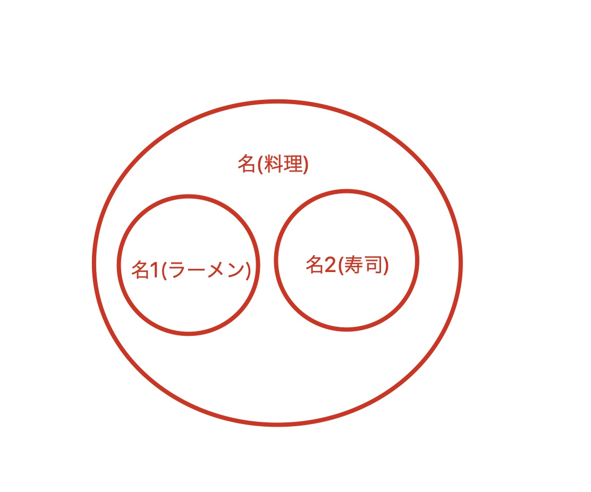

---
author: 蓝心语
title: 学习-日语-语法总结
date: 2021-07-15
tags:
- 学习
category: 
- 日本
- 学习
- 日语
permalink: nihonngo-bunpou-matome
---
- 水滴石穿, 非一日之功.
<!-- more -->

# 前文
#### 含める資料
- TRY! 日本語能力試験 N2
- 新日本語能力試験 N2 文法

#### 参考資料（さんこうしりょう）
- [単語-品詞&活用](./2021-07-15.nihonngo-tanngo-hinnshi&katsuyoukei.md)

#### マーク
- \~\~remove\~\~ -> ~~remove~~

# 本文
## ア
### ア
#### 〜あげく
##### 意味(1)
- (日)色々〜したが、最終的に（悪い結果）になりました
- (中)"最后..."

###### ポイント
- 悪い結果に対してのみ使えます
- 悔しさや煩わしさなどの負の感情を含みます

###### 類語
- 〜あげく
- 〜上（うえ）で
- ...

###### 接続
```
動　タ　形
          ＋　あげく
名　＋　の

```

###### 例文
```
一生懸命に走ったあげく、バスに乗り遅れてしまった。
お父さんがいろいろ考えたあげく、会社を辞めることにした。
彼女とは何度も口喧嘩を繰り返したあげく、別れることになった。
人気のお店に２時間も並んだあげく、売り切れで食べられなかった。
兄に農作業を手伝わされたあげく、仕事が遅いなどと文句を言われた。
モールの中をさんざん探し回ったあげく、結局欲しかったものは見つからなかった。
町でお祭りがあって人混み（ひとごみ）に巻き込まれたあげく、道に迷ってしまった。
長い間待たされたあげく、結局残業が終わらないと言われ彼女にデートをキャンセルされた。
寝坊してしまったので、髪もセットせず、タクシーを使って急いだあげく、結局面接に間に合わなかった。

何回もの手術ものあげく、結局、病気は治りませんでした。
毎日の長時残業のあげく、体を壊し入院することになった。

```

###### 「」の区別
- 相違点

#### 〜あまり（に）
##### 意味(1)
- (日)〜すぎるので、・・・
- (中)"过于...", "太..."

###### ポイント

###### 類語
- あまりの〜　に・で
- ...

###### 接続
```
動　 辞書形・タ形
形動　    ＋　な　    ＋　あまり（に）
名　　    ＋　の

```

###### 例文
```
試験の結果をきにするあまり、夜眠れなくなってしまった。
失敗を恐れるあまり、積極的なプレーができなくなっている。
このゲームは戦略性を追求するあまり、操作が複雑になっている。
何でも完全（かんぜん）にやろうと思うあまり、体を壊す人がいる。
母は一人暮らしの私を心配するあまり、毎日のように電話をかけてくる。
お酒をたくさん飲んだあまり、頭が痛くなってしまった。
急いでいたあまりに、大事な書類を家に忘れて来てしまった。
田中さんは残業しすぎたあまり、体を壊し入院することになった。
センター試験では考えすぎたあまり時間が足りず、最後まで解けなかった。

綺麗なあまり、見惚れてしまった。
子供の帰りが遅いので、心配なあまり何回も電話してしまった。

動揺のあまり手が震える。
高さのあまり足がすくむ。
痛みのあまり気を失ってしまった。
驚きのあまり、何も言葉が出てこなかった。
緊張のあまり、上手にプレゼンテーションができなかった。
プレゼンテーションでは緊張のあまり、頭が真っ白になり、少しの間沈黙が続いた。

```

###### 「」の区別
- 相違点

#### あまりの〜　に・で
##### 意味(1)
- (日)ある程度がかなり高いので・・・
- (中)"过于...", "太..."

###### ポイント

###### 類語
- 〜あまり
- ...

###### 接続
> あまりの　＋　名　＋　に・で

###### 例文
```
あまりの酷さにめまいがした。
あまりの反響に再販が決定した。
あまりの美しさに言葉を失った。
あまりの眠さに目も開けられない。
蚊のあまりのうるささに夜も寝れなかった。
あまりの面白さに、会場は終始笑いが絶えなかった。
出産時、母はあまりの痛みに気絶してしまったらしい。
あまりの忙しさに家のドアを開けたとたん玄関で倒れて寝てしまった。

あまりの眠さで頭痛がする。
あまりの寒さで震えが止まらない。
あまりの恐怖で、声が一言も出なかった。
久しぶりの運転、あまりの緊張でハンドル操作を誤り、事故るところだった。

```

###### 「」の区別
- 相違点

### イ
#### 〜いかんで

#### いくら・どんなに　〜ても
##### 意味(1)
- (日)数量や程度がどのようになっても、影響しないことを表します
- (中)"即使...也...", "无论...也..."

###### ポイント
- すでに起きたことに使います
- ...

###### 類語
- 〜　にしろ・にせよ・としても・にしても・にしたって
- たとえ〜ても
- 〜ても
- 〜たところで
- 〜う　が・と
- ...

###### 接続
```
　　　　　　　　　＋　動　　　テ形
　　　　　　　　　＋　形　　　テ形
いくら・どんなに　　　　　　　　　　＋　も
　　　　　　　　　＋　形動　＋　で
　　　　　　　　　＋　名　　＋　で

```

###### 例文
```
いくら話しても、分かってくれない。
いくら頼まれてもお金は貸しませんよ。
いくらお金を積まれても、その仕事はお受けできません。
いくら勉強しても日本語が上手にならないんですが、どうすればいいでしょうか。
先生、いくら考えてもこの問題の答えがわからないんです。教えていただけませんか。

こんな物、いくら安くても買いません。
見た目がいくら良くても、性格が悪ければ嫌われるでしょう。
いくら生活が苦しくても離れて行かないお嫁さんをもらいなさいと親が教えてくれた。

いくら好きでも、それを伝えなければ始まらない。
いくら貧乏（びんぼう）でもプライドを持った人間でいたい。
いくら宿題が大変でも、自分でやらないと意味がありません。
いくら便利でも、日本でそのソフトを使うと犯罪になってしまいますよ。

いくら先生でも、知らないこともありますよ。
いくらお金持ちでも、死んでしまったらそれまでだ。
いくら有名なタレントでも、悪いことをすると仕事がなくなってしまう。

---

どんなに謝られても、貴方のやったことは許しません。
好きなチームなら、どんなに負けが続いても応援したくなる。

どんなに苦しくても最後まで走り抜くつもりだ。
どんなに顔が可愛くても、性格が悪かったら付き合えないよね。
どんなに曇っていても、雲の上はいつも青い空が広がっている。

どんなに好きでも、それを伝えなければ始まらない。

どんな場合でも、いつも自分らしくふるまうのよ。

```

###### 「」の区別
- 相違点

#### 〜以上（は）
##### 意味(1)
- (日)話者の強い意志や義務感、決意を表します
- (中)"既然...就..."

###### ポイント 

###### 類語
- 〜からには
- 〜上（うえ）は
- ...

###### 接続
```
動　　　辞書形・タ形
形
　　　　　　　　　　　＋　以上（は）
形動　＋　な・テいる
名　　＋　　　テいる

```

###### 例文
```
この会社で働いている以上、会社のルールに従っていただきます。
一度やると決めた以上は、最後まで責任を持ってやらないと。

皆の前で一人でやると宣言した以上は、誰かに手伝ってもらう事はできない。
期日までに間に合わせると約束した以上は、残業してでも終わらせなければならない。
皆さん、本校（ほんこう）の学生になった以上は、我が校の伝統を守り、誇りを持って行動してください。

証拠が無い以上は無罪だと考えるべきだ。

学生である以上、学業を第一に考えるべきだ。
人間である以上、完全に感情を捨てて考えるのは無理だ。

```

###### 「」の区別
- 相違点

#### 〜以前
##### 意味(1)
- (日)「～よりもっと前の基本的な段階だ」という意味を表します
- (中)...之前

###### ポイント
- 状況を批判する時によく使われる
- ...

###### 類語
- ...

###### 接続
```
名（である）　
か・かどうか　　　　＋　以前
肯定形＋否定形

```

###### 例文
```
きちんと挨拶するのはビジネスナー以前の常識だと思いますね。

大学に行くかどうか以前に、卒業できるかどうかも分からない。
文章が正しいかどうか以前に、写真が１枚もないのが問題だ。
男女間の友情が成立するかどうか以前に、同性間での友情すら簡単には築けない。

ワクチン打つ打たない以前の問題で、そもそも順番が巡ってこない。

```

###### 「」の区別
- 相違点

#### 一方だ〜
##### 意味(1)
- (日)変化が1つの方向に進行（しんこう）していることを表します
- (中)"越来越...", "不断的..."

###### ポイント
- ...

###### 類語
- 〜つつある
- 〜ばかり（だ）
- ...

###### 接続
```
動　辞書形
          ＋　一方だ
名　＋　の

```

###### 例文
```
水不足で野菜の値段は上がる一方だ。
業績がいいので、給料は上がる一方だ。
全然勉強していないので、成績は下がる一方だ。
最近日本語を話す機会がないので、忘れる一方だ。
給料は増えないのに、税金は増える一方で、全然よくならない。
最近ずっと社長に怒られて、ストレスが溜まる（たまる）一方だ。
ここは静かな町だったのに、テレビで紹介されて以来、観光客が増える一方だ。

このままでは衰退の一方だ。

```

###### 「」の区別
- 相違点

#### 〜一方（で）
##### 意味(1)
- (日)～だが、同時に別の面で・・・
- (中)"...的同时..."

###### ポイント
- ２つの並列的な状態・性質が同時に存在です

###### 類語
- 〜ながら
- 〜つつ
- 〜と共（とも）に
- ...

###### 接続
> 普通形（形動　~~だ~~　->　な・である　・　名　~~だ~~　->　である）　＋　一方で

###### 例文
```
母は、主婦として家で働く一方で、経営者として会社を運営している。
会議では自分の意見を言う一方で、他の人の意見も聞かなければならない。
オンラインでの売り上げが上がる一方で、店舗での売り上げが落ちている。
会議の資料を作らなければならない一方で、来週のプレゼンの準備もしなければならない。

断られると残念な一方でちょっと嬉しかったりもする。

彼は俳優である一方で、歌手としても活躍している。

```

###### 「」の区別
- 相違点

##### 意味(2)
- (日)１つのことを２つの面から対比します
- (中)"另一方面..."

###### ポイント
- ２つの対立した状態・性質が同時に存在です

###### 類語
- 〜反面・半面
- ...

###### 接続
> 普通形（形動　~~だ~~　->　な・テいる　・　名　~~だ~~　->　テいる）　＋　一方で

###### 例文
```
子どもを育てるときには、厳しく叱る一方で、ほめることも大切です。
科学の発展は便利な生活を齎す（もたらす）一方で深刻な環境汚染を引き起こした。
田舎に住みたい人もいるが、一方で大きな都市に住みたい人もいる。

日本の生活は楽しい一方で、大変なこともある。
彼女は部下（ぶか）への指導（しどう）が厳しい一方で、細かい気配り（きくばり）もできる理想の上司です。

この部屋は日当たりがよいので、冬は暖くて過ごしやすい一方、夏は暑くてエアコン無しでは生活できない。

```

###### 「」の区別
- 相違点

#### 〜（て）以来
##### 意味(1)
- (日)〜してから、今までずっと
- (中)"自...以来"

###### ポイント

###### 類語
- 〜きり
- 〜てからというもの
- 〜（て）このかた
- 〜てから
- ...

###### 接続
```
動　　テ形　＋　て
　　　　　　　　　　＋　以来
名詞

```

###### 例文
```
一人暮らしを始めて以来、ずっと外食が続いている。
先月定年退職して以来、悠々自適な生活を送っている。
こちらに引っ越して以来、散歩を日課にしているんです。
結婚して以来、仕事と家事に追われる日々が続いている。

あの店は開店以来、お客さんが絶えません。
大学に入学以来、生活のために毎日バイトしている。

```

###### 「」の区別
- 相違点

### ウ
#### 〜上（うえ）で[^19]
##### 意味(1)[^20]
- (日)まず～してから～する
- (中)"...后..."

###### ポイント
- 順序（じゅんじょ）が重要です

###### 類語
- 〜あげく
- 〜末（すえ）に
- ...

###### 接続
```
動　　タ形
      　　＋　上で
名　＋　の

```

###### 例文
```
相談した上で、お答えします。
日程を確認した上で、連絡いたします。
私は一人では決めかねますので、社内で検討した上で、お返事します。

契約内容をしっかりご確認の上で、こちらへハンコをお願いします。
入場券の当日販売はありませんので、予め（あらかじめ）ネットで入場券をお買い求め（おかいもとめ）の上、ご入場ください。

```

###### 「」の区別
- 相違点

##### 意味(2)
- (日)～する時、注意点や注意点について話す（アドバイス）
- (中)"...时"

###### ポイント

###### 類語
- 〜際に
- 〜時に
- ...

###### 接続
```
動
          ＋　上で
名　＋　の
```

###### 例文
```
海外旅行をする上で、気をつけることは何ですか。
薬を飲む上で注意することがここに書かれています。
面接を受ける上で大事なことは、まず時間を守ることだよ。
新店舗を開設する上で、周辺のマーケテイング調査は欠かせない。

ノートパソコンは仕事の上で欠かせない道具だ。

```

###### 「」の区別
- 相違点

##### 意味(3)[^63]
- (日)〜という点から考えると 
- (中)"从...来看"

###### ポイント

###### 類語
- 〜 から見ると・から見れば・から見て
- 〜 から言うと・から言えば・から言って
- 〜 からすると・からすれば
- 〜 上（じょう）（は）・上も・上の
- 〜ところを見ると
- 〜　にしたら・にすれば・にしても
- ...

###### 接続
> 名　＋　の　＋　上で（は）・上での・上でも

###### 例文
```
明日から暦の上では新学期が始まる。
統計の上では、車より飛行機のほうが安全だ。
富士山は地図の上では静岡県と山梨県に跨がっている。
地図上では国境線が引かれているが、実際そこには線など何もない。
聞いた話の上では厳しい人らしいが、会ってみると意外に柔和な人だった。
暦の上では立秋（りっしゅう）を過ぎたが、秋の気配（けはい）が全然感じられない。
あの二人は戸籍（こせき）の上では夫婦だが、何年も別居（べっきょ）していて他人（たにん）同然（どうぜん）になっている。

```

###### 「」の区別
- 相違点

#### 〜上（うえ）に
##### 意味(1)
- (日)〜だけでなく、さらに
- (中)"不仅...而且..."

###### ポイント
- プラス（マイナス）の評価を強調します

###### 類語
- 〜どころか
- 〜に加え（て）
- 〜ばかりでなく〜（も）〜
- ...

###### 接続
> 普通形（形動　~~だ~~　->　な・テいる　・　名　~~だ~~　->　の・テいる）　＋　上に

###### 例文
```
海外旅行中に、財布を盗まれた上に、スマホも無くした。
台風の影響で、2時間以上空港で待たされた上、飛行機は欠航になった。
就職に失敗した上にアルバイトも首になるなんて、本当についていない。

この料理は美味しい上に健康にもいい。
この病は治る可能性は低い上に治療費も高額だ。

最近の携帯電話は、多機能な上に、カメラの質も良い。
電気で動く車は静かな上に環境に優しいので、注目されつつある。
このプロジェクトは技術的に実現が困難な上に、費用も莫大にかかる。

鈴木さんは日本語の先生である上に、ピアノの先生でもある。
昨日のアルバイトで寝不足の上、朝ごはんを食べなかったから授業に集中できない。

```

###### 「」の区別
- 相違点

#### 〜上（うえ）は
##### 意味(1)
- (日)〜なのだから、当然・・・
- (中)"既然...就..."

###### ポイント

###### 類語
- 〜からには
- 〜以上は
- ...

###### 接続
> 動　辞書形・タ形　＋　上は

###### 例文
```
富士山に登る上は、十分な準備が要るだろう。
留学すると決心した上は、必ず成果を出して見せる。
こうなった上は、覚悟（かくご）を決めて最後まで頑張るしかない。
目標を決めた上は、それに向かって前向きに行動しなければならない。
この仕事を任された上は、業務を遂行（すいこう）し実績を上げなければならない。

```

###### 「」の区別
- 相違点

#### 〜うちに
##### 意味(1)
- (日)～の状態が変わる前に〜する（前件が続いているあいだにしか、〜する）
- (中)"趁..."

###### ポイント

###### 類語
- 〜間に
- ...

###### 接続
```
動　辞書形・テいる・ナイ形
形
                      　　＋　うちに
形動　　　　　　　　　＋　な
名　　　　　　　　　　＋　の

```

###### 例文
```
母が出かけているうちに、こっそり冷蔵庫のケーキを食べてしまった。
忘れないうちに、大切なことはメモしておきます。
アイスクリームが溶けないうちに食べてください。

どうぞ、温かいうちに召し上がってください。
若いうちに、色々なことにチャレンジしておいたほうがいいよ。
「鉄は熱いうちに打て」という諺は、人は柔軟性のある若いうちに鍛えることが大事だという教えだ。

元気なうちに、趣味の山登りを楽しもうと思っている。
桜が綺麗なうちに、たくさん写真をとってしまいましょう。
両親が元気なうちに、できるだけたくさん旅行したり、食事したりして思い出を作りたいです。

独身のうちに世界を旅行したいです。
今のうちに、やりたいことをやっておかなくちゃ後悔するよ。


```

###### 「」の区別
- 相違点

##### 意味(2)
- (日)～している間に（自然に）〜する
- (中)"...着..."

###### ポイント

###### 類語
- 〜間（は）
- ...

###### 接続
> 動　辞書形・テいる・ナイ形　＋　うち（に）

###### 例文
```
毎日運動するうちに体の調子がよくなってきた。

テレビを見ているうちに、寝てしまいました。
話し合っているうちにいいアイディアが浮かびました。
電車の中で寝ているうちに、降りたい駅を過ぎてしまいました。
その商品を買うか買わないか考えているうちに、他の人が購入してしまいました。

しばらく国に帰らないうちに、新しいビルがたくさんできました。

```

###### 「」の区別
- 相違点

#### 〜うち（は）
##### 意味(1)
- (日)〜の状態が続く期間は、ずっと〜する
- (中)"...期间一直..."

###### ポイント

###### 類語
- 〜間（は）
- ...

###### 接続
```
動　辞書形・テいる・ナイ形
形
                      　　＋　うち（は）
形動　　　　　　　　　＋　な
名　　　　　　　　　　＋　の

```

###### 例文
```
太陽があるうちは暑いから出かけたくない。
お金があるうちは友達がたくさんいましたが、なくなったら、誰もいなくなりました。
工事をしているうちは、この道路は通行できません。
気象庁から大雨警報が発表されているうちは、外出を控えてください。
自分が正しいと思っているうちは他からの意見で成長することはない。
仕事が見つからないうちはここの支援が受けられます。

子供が小さいうちは、家でできる仕事をすることにした。
若いうちは少し無理をしても大丈夫だが、年をとるとそれができなくなる。

体が元気なうちは、働いていたいと考えています。
体が健康なうちは、健康のありがたさには気づかないものだ。

学生のうちはなるべく多くの知識を学ぶべきである。
独身のうちは何も悩みがなかったけど、結婚をすると違うね。

```

###### 「」の区別
- 相違点

#### 〜得る（うる・える）[^38]
##### 意味(1)
- (日)〜可能性があります
- (中)"可能..."

###### ポイント
- 可能性の有無だけを表しますが、能力を表しません（動詞の可能形は可能性の有無を表すと共に能力を表します）
- ありえる: 硬い言い方
- あるうる: 話し言い方

###### 類語
- 〜かねない
- 〜恐れ（おそれ）がある
- 〜かも知れない
- ...

###### 接続
> 動　マス形　＋　得る

###### 例文
```
幽霊（ゆうれい）？そんなのありえないでしょ？
事故はいつでも起こり得るので、気をつけている。
考える得る全ての方法を試してみたが、ダメだった。
事故はいくら注意しても、どんなことでも起こり得る。
短所（たんしょ）は見方を変えると長所（ちょうしょ）となり得る。
地球温暖化が進むと、気候の変化、海面の上昇などの問題が生じ得る。
いつ地震が起こり得るかわからないから、しっかり備えておくことが大切だ。
今か必死（ひっし）になって頑張れば、志望の大学に入ることも十分にあり得る。
このまま海面（かいめん）の上昇（じょうしょう）が続けば、これらの島々が海の中に沈んでしまうこともあり得る。

```

###### 「」の区別
- 相違点

#### 〜（よ）うか〜まいか
##### 意味(1)
- (日)どうしようか迷っていると言いたい時使います
- (中)"要不要..."

###### ポイント

###### 類語
- 〜かどうか
- ...

###### 接続
> 動　意志形　＋　うか　＋　動　＋　まいか

###### 例文
```
少し高い腕時計を買おうか買うまいか迷っている。
少し疲れたので、タクシーに乗ろうか乗るまいか悩んでいる。
本当のことを話そうか話すまいか迷ったが、結局全部話した。
彼は夏休みに国帰ろうか帰るまいかと悩んで（なやむ）いるらしい。
食べたいけど、太りたくないし、食べようか食べまいか悩んでいます。
その新聞記者は、記事を掲載しようかすまいか悩んだあげく、掲載をやめた。
いつもどこかへ遊びに出かけようか出かけるまいかと考えているうちに連休が終わってしまう。

```

###### 「」の区別
- 相違点

#### 〜（よ）うが〜まいが　・　〜（よ）うと〜まいと[^9]
##### 意味(1)
- (日)Ｘの場合でも（Ｙの場合でも）どちらの場合でもＺです
- (中)"不管...还是..."

###### ポイント
- 前者の状況であってもでなくても、後者の結果は変わりません

###### 類語
- 〜　にしろ・にせよ・にしても　〜　にしろ・にせよ・にしても
- 〜といい〜といい
- 〜　であれ・であろうと　〜　であれ・であろうと
- 〜につけ〜につけ
- ...

###### 接続
```
動詞　意向形（いこうけい）　＋　（よ）うが　＋　動詞　辞書形・マス形（サ変: する・す・し。カ変: くる・こ）　＋　まいが　
動詞　意向形（いこうけい）　＋　（よ）うと　＋　動詞　辞書形・マス形（サ変: する・す・し。カ変: くる・こ）　＋　まいと

```

###### 例文
```
雨が降ろうが降るまいが、試合は開催します。
貴方が勉強しようがしまいが、結果は同じです。
台風が来ようが来るまいが、学校に行かなきゃいけない。
貴方がタバコを吸おうが吸うまいが、私には関係ありません。
--
食べ放題では、たくさん食べようが食べまいが料金は同じだ。

周囲（しゅうい）の人が反対しようとしまいと、私の気持ちは変わらない。
ベストを尽くして（つくす）やれば、成功しようとしまいと関係ないのではないか。

```

###### 「」の区別
- 相違点

#### 〜（よ）うではないか
##### 意味(1)
- (日)一緒に～しよう
- (中)"让我们...吧"

###### ポイント
- ...

###### 類語
- ...

###### 接続
> 動　意向形　＋　（よ）うではないか

###### 例文
```
じゃんけんで決着をつけようじゃないか。
落ち着いた議論をしましょうではありませんか。
日本語を身につけるために頑張ろうではないか。
困った時はお互いに助け合っていこうではありませんか。
俺が犯人だと言うなら、証拠を見せてもらおうではないか。
売り上げ目標の達成を祝って、乾杯しようじゃありませんか。
こういう時こそ、自分にできることは何か考えようではないか。
今日は昔の思い出を語りながら、おいしい酒を飲もうではありませんか。

```

###### 「」の区別
- 相違点

### エ
#### 〜得（え）ない[^38][^39]
##### 意味(1)
- (日)〜する可能性がありません
- (中)"不可能..."

###### ポイント
- 「能力的に　できる・できない」の場合では使えません
- 書き言葉

###### 類語
- 〜わけがない
- 〜はずがない
- 〜っこない
- ...

###### 接続
> 動　マス形　＋　得ない

###### 例文
```
太陽が西から昇ることはあり得ない。
結婚しているのに、浮気するなんてあり得ないよ。
あんなひどいことを言っておいて、今さら謝るなんてありえない。
根性（こんじょう）がないと、この目標を達し（たっす）得ないでしょう。
学校一の成績を誇るジョンさんがJLPT N1に合格しなかったなんて、あり得ないよ。

```

###### 「」の区別
- 相違点

##### 意味(2)
- (日)〜する手段や方法がないことを表します
- (中)"无法..."

###### ポイント

###### 類語
- 〜わけにはいかない
- 〜て（ばかり）はいられない
- 〜ようがない
- ...

###### 接続
> 動　マス形　＋　得ない

###### 例文
```
実行し得ない計画を立てても無駄だ。
今の気持ちは言葉で言い表し得ない。
地震はいつ起こるか予想し得ないから、事前に家族との連絡方法や避難場所などを決めておいた方がいいでしょう。

```

###### 「」の区別
- 相違点

### オ
#### 〜う　が・と
##### 意味(1)
- (日)前件の条件がどんなものであれ、関係ない、影響しないと言いたい時に使います
- (中)"即使..."・"不管..."

###### ポイント
- ...

###### 類語
- たとえ〜ても
- 〜　にしろ・にせよ・としても・にしても・にしたって
- いくら・どんなに　〜ても
- 〜ても
- 〜たところで
- ...

###### 接続
```
動　意向形
形　~~い~~ -> かどう
　　　　　　　　　　　　＋　が・と
形動　＋　だろう
名　　＋　だろう

```

###### 例文
```
君が病気になろうが、貧乏であろうが、僕は君を一生愛す。
何をしようが君の勝手だが、他人に迷惑をかけるのだけはやめてくれ。

良かろうが悪かろうが、自分の子だ。
どんなに忙しかろうが、家族との時間は大切にしています。


どんなにお金持ちだろうが、人はいつか死ぬんだよ。
先輩だろうが、上司だろうが、間違っているなら指摘しなければならない。

--
雨が降ろうと雪が降ろうと明日のイベントには必ず行くよ。

使わないものは、いくら安かろうと買う必要はない。

僕の大切な妹をいじめる奴（やつ）は誰だろうと許さない。

```

###### 「」の区別
- 相違点

#### 〜 おかげで・おかげか・おかげだ
##### 意味(1)
- (日)～の助け、恩恵などで、いい結果になったことを表します
- (中)"托...的福", "多亏..."

###### ポイント
- おかげか: 理由がはっきりしないときに使います
- 良い結果になった原因を言う時に使います
- 悪い結果に使うこともできるが、皮肉となります

###### 類語
- ...

###### 接続
> 普通形（形動　~~だ~~　->　な　・　名詞　~~だ~~　->　の）　＋　おかげで・おかげか・おかげだ

###### 例文
```
たばこと酒をやめたおかげで、健康になった。
社員が頑張ってくれたおかげで、売上目標を達成した。
海外保険に入っていたおかげで、入院費を払わずに済んだ。
シートベルトをしていたおかげで、一命を取りとめました。
友達が仕事を紹介してくれたおかげで、無事就職できました。

忙しかったおかげで、彼にふられたことを考える時間がなかった。
先生にご指導いただいたおかげで、卒業論文を完成させることができました。

気候が温暖なおかげで、おいしい果物ができる。

先生のおかげで、日本語が上手になりました。
この薬のおかげで、すっかり元気になりました。
みんなのおかげで、今日まで頑張ってこれました。
友達のおかげで、私は今の彼女と出会うことができました。
スマホのおかげで、私たちの生活はとても便利になりました。
現代に生きる私達は、科学技術のおかげで快速で便利な日常生活を送っている。

仕事が予定より早く終わったのは、先輩が手伝ってくれたおかげです。
日本にいながら世界中の最新情報を知ることができるのはインターネットのおかげだ。

---
君がミスしてくれたおかげで、今日は残業だよ。
君がミスしてくれたおかげで、全部やり直しだよ。
彼が余計（よけい）なことを言ってくれたおかげで、大変な目に遭った。

---
昨日たくさん寝たおかげか、風邪が治った。

```

###### 「」の区別
- 相違点

#### 〜恐れ（おそれ）がある[^43]
##### 意味(1)
- (日)〜に可能性があります
- (中)"有可能..."

###### ポイント
- 話し手の恐怖、心配の気持ちが含まれます
- 客観的で硬い表現です
- 硬い言い方

###### 類語
- 〜得る
- 〜かねない
- 〜かも知れない
- ...

###### 接続
```
動　辞書形・ナイ形
                ＋　恐れがある
名　　　　　＋　の

```

###### 例文
```
このまま勉強しないと、卒業できない恐れがある。
このまま赤字が続けば、この会社は倒産する恐れがある。
不景気なので、大学を卒業しても就職できない恐れがある。
このままだと試合の後半（こうはん）に逆転（ぎゃくてん）される恐れがある。
交渉の場ではっきり態度を示さないと、相手に誤解される恐れがある。

この薬は副作用の恐れがありますので、医者の指示に従って飲んでください。
先ほど大きな地震がありました。津波の恐れがあります。注意してください。

```

###### 「〜かねない・〜恐れがある」の区別[^44]
- 相違点

## カ
### カ
#### 〜甲斐　がある・がない・もなく
##### 意味(1)
- (日)〜価値が　あります・ありません
- (中)"(没)有...的价值", "(没有)白..."

###### ポイント

###### 類語
- ...

###### 接続
```
動　　タ形
　　　　　　＋　甲斐　がある・がない・もなく
名　＋　の

```

###### 例文
```
筋トレ頑張った甲斐があって１週間で２キロ落ちた。
毎日残業した甲斐があって、なんとか期日までに完成しました。
20kgもダイエットに成功したのだから、高いお金を払った甲斐があったと思う。
温泉に入りながら、綺麗な景色が見られたから、遠くから来た甲斐があったね。
２時間も並んだ甲斐があって、日本一美味しいと評判の高いラーメンを食べることができた。

説得の甲斐があって、両親が彼との結婚をやっと許してくれた。

希望を持って楽しく生きなければ、生まれた甲斐がない。

頑張って晩ご飯を作った甲斐もなく、夫は食事をして帰ってきた。
あれこれと救急治療を施してもらいましたが、その甲斐もなく息を引き取りました。
遠くから時間とお金をかけて来た甲斐もなく、店は閉まっていて名物料理が食べられなかった。

```

###### 「」の区別
- 相違点

#### 〜限り
##### 意味(1)
- (日)～の状態が続いている間だけは、同じ状態が続きます
- (中)"只要...", "只要不...就...", "除非..."

###### ポイント

###### 類語
- 〜さえ〜ば
- ...

###### 接続
```
動　辞書形・テいる・ナイ形
形
                　 　　　　＋　限り（は）
形動　　　　　　　　＋　な
名　　　　　　　　　＋　の
「形動・名詞　である」の形もあります

```

###### 例文
```
タバコを吸い続ける限り、病気は治らないよ。
高齢者でも、働ける限りは働きたいと思っているが多いです。
生きている限り、必ず希望は訪れる。
よほどのことがない限り、行けたら行く。
両親が許してくれない限りは、結婚できない。
あの人が謝らない限り、私は彼を許しません。
この問題を解決しない限り、先には進めない。
緊急事態でない限り、休日出勤はありません。
資金の問題を解決しない限り、この工事を続けられない。

定年になっても元気な限りは、働き続けたいと思っている人が増えている。

学生である限り、しっかり勉強しなければいけない。
ここの会社員である限り、上司の命令には逆らえない。
医者である限り、患者を助けるために必死に頑張らなければならない。

```

###### 「」の区別
- 相違点

##### 意味(2)[^36]
- (日)全力で物事を行うことを表します
- (中)"尽..."

###### ポイント
- ...

###### 類語
- ...

###### 接続
```
動　辞書形・可能形
　　　　　　　　　　＋　限り
名詞　　　　＋　の

```

###### 例文
```
思いつく限りの方法をすべて試してみたが、だめだった。
今やるべきこと、思いつく限りのことをノートに書き出した。
やれる限りのことはやった。あとは結果を待つだけだ。
できる限りのことはしたので、たとえ失敗したとしても後悔はない。
もし次チャンスがあるなら、持てる限りの力で挑みたい。

山奥で道に迷い、声の限りに助けを求めた。

```

###### 「」の区別
- 相違点

##### 意味(3)[^37]
- (日)自分が知っている情報の範囲内を表します
- (中)"据...所知"

###### ポイント
- 後項では自分が知っている情報に基づいた判断が述べられますが、その範囲外については何も知らないということも暗示します

###### 類語
- ...

###### 接続
```
動　辞書形・テいる・タ形　＋　限り（で・では・だと）

```

###### 例文
```
予告編を見る限りでは、なかなか面白そうな映画だ。

知っている限りのことを教えます。
私が知っている限りでは、電気製品はこの店が一番安いです。
うちの両親はとても仲がよく、私が覚えている限りは、一度も喧嘩したことがない。

話を聞いた限りだと、相手の方に非があると思う。
調べた限りでは、日本語を勉強するにはこの学校が一番いい。
私が聞いた限りでは、双方（そうほう）はまだ合意（ごうい）に達していない。

```

###### 「」の区別
- 相違点

##### 意味(4)
- (日)数量を限定します
- (中)"只限..."

###### ポイント

###### 類語
- 〜に限り
- 〜だけ
- 〜しか（〜）ない
- 〜のみ
- 〜こそ
- 〜きり
- ...

###### 接続
> 名　＋　限り

###### 例文
```
この場限りの話ですから、どうぞそのつもりで。
やり直しは二回限りで、後は認めない（みとめる）。

```

###### 「」の区別
- 相違点

#### 〜限りだ
##### 意味(1)
- (日)感情を表す語に接続する場合は、その程度を強調することを表します
- (中)"非常..."

###### ポイント
- ...

###### 類語
- 〜のなんのって
- 〜てたまらない
- 〜　てしかたがない・てしょうがない・てしようがない
- 〜てならない
- 〜といったらない
- ...

###### 接続
```
形
　　　　　　　＋　限りだ
形動　＋　な

```

###### 例文
```
信頼していた人に裏切られ、悲しい限りだ。

１点足りなくて不合格になるなんて、残念な限りだ。
楽しみにしていた花火大会が雨で中止になった。残念なかぎりだ。

```

###### 「」の区別
- 相違点

#### 〜　かけだ・かけの・かける[^93]
##### 意味(1)
- (日)途中まで～して
- (中)"...做到一半"

###### ポイント
- 継続動詞と接続すると途中までの状態であることを表します

###### 類語
- ...

###### 接続
> 動　マス形　＋　かけだ・かけの・かける

###### 例文
```
他の人が食べかけたものは食べたくないよ。
小説を書きかけているが、なかなか話が進まない。
食べかけのケーキにラップをして冷蔵庫に入れた。
書きかけのレポートを今日中に仕上げるつもりだ。
テーブルの上に飲みかけのコーヒーがおかれている。
息子はやりかけの宿題をおいて、遊びに出かけてしまった。
え？あのコーヒー捨てちゃったの？まだ飲みかけだったのに・・・。
お疲れ様でした。私はやりかけの仕事がまだあるので、お先に帰ってください。
下痢が治りかけていたのに、何か変な物を食べたのか、またお腹が痛くなってきた。

```

###### 「」の区別
- 相違点

##### 意味(2)
- (日)〜始めます・〜しそうになります
- (中)"开始...", "快要..."

###### ポイント

###### 類語
- ...

###### 接続
> 動　マス形　＋　かけだ・かけの・かける

###### 例文
```
４月に入って、桜が徐々に散りかけている。
昨日買ってきたイチゴが、もう腐りかけている。
まだ病気が治りかけなのに無理をするから、悪くなるんだよ。

雨で床が濡れていたせいで、滑って転びかけた。
地震で家が崩壊し、死にかけたが、なんとか一命を取り留めた。

```

###### 「」の区別
- 相違点

#### 〜難い（がたい）
##### 意味(1)
- (日)～することが難しい（、なかなか〜することができません）
- (中)"难以..."

###### ポイント
- 心情的な理由の場合は一人称の場合のみしか使えません
- 書き言葉

###### 類語
- 〜にくい
- 〜辛い（づらい）
- 〜兼ねる（かねる）
- ...

###### 接続
> 動　マス形　＋　難い

###### 例文
```
どちらの料理も美味しく、甲乙つけがたい。
初めてのビールは何とも言いがたい不思議な味でした。
独りは孤独だが、自由とは何ものにも代えがたいものだ。
彼の考えは理解しがたいが、論理的には正しいと言える。
大勢の人の前で馬鹿にされて、耐えがたい屈辱を味わった。
あの正直（しょうじき）な彼が嘘をつくとは、信じがたい。
お年寄りを騙して（だます）お金をとる犯罪は許しがたい。
彼はいつも怖い顔をしているし、静かだし、近寄りがたいよ。
彼がオリンピックで金メダルをとった瞬間は、今でも忘れがたい。
まさか、彼女があの事故から奇跡的に生き延びた何て信じがたい話だ。
上司の仕事のやり方がたえがたかったため、転職することにしました。
彼の考え方や行動は、当時の私にはなかなか理解しがたいものだった。
明日、留学を終えて国に帰る。これまで仲良くしていた友達とは本当に別れがたい。

```

###### 「」の区別
- 相違点

#### 〜が〜だけに[^100]
##### 意味(1)
- (日)特別な性質から考えると当然という意味を表します
- (中)"从...考虑"

###### ポイント
- プラスの評価でもマイナスの評価でも使うことができます。どちらの意味で使われているかは後件の内容で判断します
- ...

###### 類語
- ...

###### 接続
> 名　＋　が　＋　だけに

###### 例文
```
値段が値段なだけに、性能はあんまり高くない。
仕事の内容が内容だけに、慎重に話を進めた方がいいだろう。
祖母が風邪を引いたというが、歳が歳だけに悪化しないか心配だ
これは国宝級の仏像なのです。物が物だけに、普通の運送業者には頼めません。

このあたりは場所が場所だけに、とても治安が良い・悪いところだ。
相手が相手だけに、緊迫（きんぱく）した試合になるだろう・本気を出したら可哀相だ。

```

###### 「」の区別
- 相違点

#### 〜がち　だ・な・の
##### 意味(1)
- (日)その状態に成ることが多いを表します・その行為がよく発生するのを表します
- (中)"常常...", "容易..."

###### ポイント
- 悪い傾向があることを表し、その状態が以前から何度も発生していることを暗示します
- 名詞につけて、その状態に成ることが多いを表します
- 動詞につけて、その行為がよく発生するのを表します

###### 類語
- ...

###### 接続
```
動　マス形
          ＋　がち　　　だ
          ＋　がち　な・の　＋　〜
名

```

###### 例文
```
急いで出かけると、部屋の電気を消すのを忘れがちだ。
暑いときは冷たいものを食べがちで、よくお腹を壊す。
毎日車で移動していると、運動不足になりがちだ。意識して運動もしたほうがいい。

この時期になると、風邪などえ学校を休みがしな生徒が増える。
この野菜ジュースは現代人に不足しがらな栄養素を補ってく（おぎなう）れる。
謙遜しすぎて目立たずに過小評価されがちの人もいれば、自慢話をしすぎて過小評価されがちの人もいる。

年を取るとやっぱり病気がちになる。


```

###### 「」の区別
- 相違点

#### 〜　（か）と思うと・（か）と思ったら
##### 意味(1)
- (日)前の事象が起こった直後に、後の事象が起こります
- (中)"刚...就..."

###### ポイント
- 話し手の驚きや意外だという気持ちが含まれます
- 客観的な表現で、後件に意志文、命令文、否定文などは使えません

###### 類語
- 〜途端（とたん）(に)
- 〜や否や（やいなや）
- 〜か〜ないかのうちに
- ...

###### 接続
> 動　タ形　＋　（か）と思うと・（か）と思ったら

###### 例文
```
勉強を始めたかと思ったら、寝てしまいました。
空がピカッと光ったかと思うと、大きな雷の音が鳴った。
急に空が暗くなったかと思うと、激しく雨が降り始めた。
息子は勉強を始めたかと思ったら、携帯電話でゲームを始めた。
携帯の警報（けいほう）が鳴ったかと思うと、地震が来ました。
お昼ご飯なくて買いに行こうかと思ったら店長からお弁当もらった。
ジェームスさんは教室に入って来たかと思うと、「あっ」と何かを思い出したようにすぐに教室を出ていった。

```

###### 「」の区別
- 相違点

##### 意味(2)
- (日)前件だと思っていた主観的な文だが、後件では反対の事柄を表します
- (中)"原以为...却..."

###### ポイント
- 不思議、意外、びっくりの気持ちを表します
- 後件に意志文、命令文、否定文などは使えません

###### 類語
- 〜　かというと・かといえば
- 〜かと思えば
- ...

###### 接続
> 動　タ形　＋　（か）と思うと・（か）と思ったら

###### 例文
```
赤ちゃんが寝たかと思うと、泣き出した。
やっと仕事が終わったと思ったら、また新しい仕事を頼まれた。
噂をよく耳にするのでどれだけ美味しいのかと思ったらそうでもなかった。
息子は机に向かって勉強を始めたかと思うと、携帯電話でゲームをやり始めた。
やっと部屋が綺麗に片付いたと思ったら、子供達が学校から帰って来てまた散らかし始めた。

```

###### 「」の区別
- 相違点

#### 〜　かというと・かといえば
##### 意味(1)
- (日)まず前件で前提となる事実を述べ、その事実から必然的に導き出される結果を否定します
- (中)"本以为...实际并非..."

###### ポイント

###### 類語
- 〜　（か）と思うと・（か）と思ったら
- 〜かと思えば
- ...

###### 接続
```
動　・形　　＋　（の）
　　　　　　　　　　　＋　かというと・かといえば
形動・名　＋　（なの）

```

###### 例文
```
絵が上手であれば誰でも漫画家になれるかと言えば、そうとは限らない。
昨日財布を忘れて出かけたが、困ったかといえば、それほどでもなかった。
一流大学を卒業したから一流会社に就職できるかというと、そんなことはない。
１か月も経たずに仕事を辞めた。会社に不満があったかと言うとそういうわけでもないが、何だか自分には合わない気がした。

歌を聞くのが好きだが、歌うのが上手なのかといえば、そうでもない。
長く付き合ったからと言って結婚後幸せになれるかと言うとそうではないし、短いお付き合いで結婚してすぐ別れることになるかというとそういうわけでもない。

```

###### 「」の区別
- 相違点

##### 意味(2)
- (日)その疑問に自ら答え、解説を加えることを表します
- (中)"要说...那是因为...", "说起...", "总的来说..."

###### ポイント

###### 類語
- ...

###### 接続
> 疑問詞　＋　かというと・かといえば

###### 例文
```
彼女はなぜ泣いているのかというと、振られたからそうです。
なぜ彼女が会社を辞めたかというと、課長とのトラブルが原因である。
どうしてこんな所に物を置いたかというと、後で運ぶ時に便利だからだ。
夏休みが嫌いだ、なぜかというと、宿題が多くてあまり遊ぶ時間がないからだ。
彼女は英語がペラペラだ。どうしてかというと、アメリカに留学していたからだ。
小学生の頃は勉強が嫌いだった。いつ好きになったかというと、高校生になった時だ。
彼がなぜベジタリアンかというと、宗教(しゅうきょう)には関係なく、単に健康のためである。

姉はどちらかというと、母の方に似ている。

どっちかといえば子供は苦手。

```

###### 「」の区別
- 相違点

#### 〜かと思いきや
##### 意味(1)
- (日)
- (中)"原以为...却..."

###### ポイント
- 話し手の意外な気持ちが含まれます
- ...

###### 類語
- 〜かと思えば
- ...

###### 接続
> 普通形（形動　~~だ~~　・　名詞　~~だ~~）　＋　かと思いきや

###### 例文
```
仕事が一段落したかと思いきや、そうではなかった。
タクシーでならすぐ着くと思いきや、渋滞に巻き込まれてしまって意外と時間がかかってしまった。

試験は難しいと思いきや、思っていたよりも簡単だった。

留学生活は順調かと思いきや、すぐホームシックになっていたようだ。

この映画はホラーかと思いきや、実はコメディ映画だった。

```

###### 「」の区別
- 相違点

#### 〜かと思えば
##### 意味(1)
- (日)異なる状況や性質を持つものが同時に存在することを表します
- (中)"既...又..."

###### ポイント

###### 類語
- 〜も〜　ば・なら　〜も
- ...

###### 接続
> 動　＋　かと思えば

###### 例文
```
意見が違う人もいるかと思えば、全く同じ人もいる。人それぞれだ。
百歳を越えて生きる人がいるかと思えば、一歳に成ることもなく、この世（よ）を去る（さる）赤ん坊もいる。

```

###### 「」の区別
- 相違点

##### 意味(2)
- (日)前件だと思っていた主観的な文だが、後件では反対の事柄を表します
- (中)"原以为...却..."

###### ポイント
- 不思議、意外、びっくりの気持ちを表します

###### 類語
- 〜かと思いきや
- 〜　（か）と思うと・（か）と思ったら
- ...

###### 接続
```
動　辞書形・タ形　
　　　　　　　　　＋　かと思えば
名

```

###### 例文
```
息子は学校から帰ってきたかと思えば、またすぐ遊びに出かけていった。
9月に入ってやっと涼しくなったかと思えば、また急に暑くなったりして残暑（ざんしょ）が厳しい。

```

###### 「」の区別
- 相違点

#### 〜か〜ないかのうちに
##### 意味(1)
- (日)前のことがまだ終わってないのに、次のことが起こることを表します
- (中)"还没...就..."

###### ポイント
- 二つの事柄の主体は同じでも異なっていてもかまいません

###### 類語
- ...

###### 接続
> 動　辞書形・タ形　＋　か　＋　動　ナイ形　＋　ないかのうちに

###### 例文
```
観客は映画が終わるか終わらないかのうちに、席を立ち始めた。
私が眠りにつくかつかないのうちに彼女は帰ってしまったようだ。
いただきますを言うか言わないかのうちに彼は肉料理に手をつけた。
タクシーが目的地に着くか着かないかのうちに、降りる準備を始めた。
うちの猫は闘病の末、１歳を過ぎるかすぎないかのうちに逝ってしまった。
親子丼は、卵が固まるか固まらないかのうちに火を止めるとおいしくできます。

```

###### 「」の区別
- 相違点

##### 意味(2)
- (日)～が起こったすぐ後に、次のことが起こることを表します
- (中)"刚...就..."

###### ポイント
- 二つの事柄の主体は同じでも異なっていてもかまいません

###### 類語
- 〜　（か）と思うと・（か）と思ったら
- 〜途端（とたん）(に)
- 〜や否や（やいなや）
- ...

###### 接続
> 動　辞書形・タ形　＋　か　＋　動　ナイ形　＋　ないかのうちに

###### 例文
```
布団に入るか入らないかのうちに寝てしまった。
演奏が終わるか終わらないかのうちに拍手をした。
電車に乗るか乗らないかのうちに、ドアが閉まってしまった。
「おやすみ」と言うか言わないかのうちに寝てしまいました。
20分ジョギングするかしないかのうちに、足が痛くなってきた。
チャイムが鳴り終わるか終わらないかのうちに学生は教室を飛び出した。

```

###### 「」の区別
- 相違点

#### 〜か何（なに）か
##### 意味(1)
- (日)前に接続されたものに似ているようなもの、それあるいはそれ以外のものを表します
- (中)"...什么的"

###### ポイント

###### 類語
- 〜といった
- 〜や〜や〜など
- 〜とか
- 〜たり〜たりする
- ...

###### 接続
```
動　普通形
　　　　　　＋　か何（なに）か
名

```

###### 例文
```
パソコンはウィルスに感染（かんせん）したか何かでフリーズして動かなくなった。

仕事の合間、お茶か何かを飲む。
お急ぎでなかったら、お茶か何かいかがですか。
帰りは寒いから上着か何か持っていった方がいいよ 。
来週の日曜日は「母の日」なので、母にカーネーションの花束か何かを贈ろうと思う。

```

###### 「」の区別
- 相違点

#### 〜かねない[^42]
##### 意味(1)
- (日)ある原因から悪い結果になる可能性があります
- (中)"有可能..."

###### ポイント
- 悪い結果を予想する表現です
- 客観的で表現です
- 書き言葉

###### 類語
- 〜得る
- 〜恐れ（おそれ）がある
- 〜かも知れない
- ...

###### 接続
> 動　マス形　＋　かねない

###### 例文
```
こんなに暑いと熱中症になりかねないよ。
寝不足で運転したら、事故を起こしかねないよ。
この状況が続くようであれば、会社は倒産しかねませんよ。
ここまで来ては、ちょっとした間違いが命取りになりかねない。

```

###### 「」の区別
- 相違点

#### 〜兼ねる（かねる）
##### 意味(1)[^92]
- (日)〜するのは難しいです
- (中)"难以..."

###### ポイント
- できない理由は主に心理的なものが原因です

###### 類語
- 〜難い（がたい）
- 〜にくい
- 〜辛い（づらい）
- ...

###### 接続
> 動　マス形　＋　兼ねる

###### 例文
```
確証が無いので判断しかねます。
怪我した子猫を見るに見かねて、動物病院へ連れて行った。
先日も殺人事件があった。先月にも似た手口の殺人事件があったが、２つの関連性は判断しかねる。
医療研究者の適性（てきせい）は学力試験だけでは判断しかねるところがあるため、面接試験で最終的な合否（ごうひ）の判断を行います。

```

###### 「」の区別
- 相違点

##### 意味(2)
- (日)〜できない
- (中)"不能..."

###### ポイント
- 丁寧に断る時、客の希望に応じられないとき、仕事で反対意見を丁寧に言いたいときなどに使います
- 硬い言い方

###### 類語
- 〜わけにはいかない
- 〜て（ばかり）はいられない
- 〜ようがない
- ...

###### 接続
> 動　マス形　＋　兼ねる

###### 例文
```
残念ながら、ご提案には賛成しかねます。
ご要望には応じかねますので、ご了承ください。
こちらとしては、それには賛成いたしかねます。
専門家ではないので適切なアドバイスはしかねます。
私は責任者ではございませんので、その質問にはお答えしかねます。
セール商品のため、購入後はいかなる事情であっても、返品いたしかねます。
仕事の忙しさに耐えかねた彼は半年も経たないうちに会社を辞めてしまった。
上司の提案に納得しかねる部分があったが、我々は受け入れざるを得なかった。

```

###### 「」の区別
- 相違点

#### 〜　かのようだ・かのような・かのように
##### 意味(1)
- (日)実際にはそうではないが〜のように見えたり感じたりすることを表します
- (中)"就像...一样"

###### ポイント

###### 類語
- ...

###### 接続
```
　　　　　　　　　　　　　　　　　　　　　　＋　かのようだ
普通形（形動　~~だ~~　・　名詞　~~だ~~）  ＋　かのような　＋　名
　　　　　　　　　　　　　　　　　　　　　　＋　かのように　＋　動・形
「形動・名　である」の形もあります

```

###### 例文
```
夕方の空は、火が燃えているかのような夕日が一面に広がっていた。
あの少女の彫刻はとてもよく作られていて、まるで生きているかのようだ。
３月なのにまた、寒くなりましたね。まるで真冬に戻ったかのようですね。
彼女は何も知らないくせに、あたかも自分が経歴したかのように喋ってる。
彼はまるで全てを知っているかのように話しているが、全て彼の想像にすぎない。

彼はいつでも自分のほうが偉いかのような態度で接してくるのであまり好きじゃない。

この雰囲気はまるで僕が犯人かのような感かんじだ。
彼はリーダーであるかのようにみんなを指揮（しき）している。
妻は付き合って初めてあげたネックレスを１０年経った今でも、宝物かのように大切にしている。
まだ春なのに、今日の気温はあたかも真夏日（まなつび）であるかのように暑い。

```

###### 「」の区別
- 相違点

#### 〜傍ら（かたわら）
##### 意味(1)
- (日)仕事や研究などの社会的活動をしながら、別のこともしていることを表します
- (中)"边...边..."

###### ポイント
- ２つの活動は異なる時間帯で行われ、かつ「ながら」に比べ長期間続けている活動に対して使われる。また、習慣的な行為に用いられることが多いです
- ...

###### 類語
- 〜ながら
- ...

###### 接続
```
動　辞書形
　　　　　　＋　傍ら（かたわら）
名　＋　の

```

###### 例文
```
田中先生は教師として働くかたわら、新しい教科書の開発にも取り組んでいる。

彼女はモデルのかたわら、歌手でも活躍している。

```

###### 「」の区別
- 相違点

#### 〜がてら

#### 〜が早いか

#### 〜かもしれない
##### 意味(1)
- (日)〜の可能性があります
- (中)"可能..."

###### ポイント
- 話し手が推測したことを言う表現です

###### 類語
- 〜得る
- 〜かねない
- 〜恐れ（おそれ）がある
- ...

###### 接続
> 普通形（形動　~~だ~~　・　名詞　~~だ~~）　＋　かもしれない

###### 例文
```
午後から雨がやむかもしれません。
今日は仕事がたくさんあるので、飲み会に参加できないかもしれない。

新しい先生は顔が怖いし、厳しいかもしれない。

今、その国へ行くのは危険かもしれないよ。

あの子、学生服を着ているけど、見たことないし、この学校の生徒じゃないかもしれない。

```

###### 「」の区別
- 相違点

#### 〜から[^54]
##### 意味(1)
- (日)原因・理由を表します
- (中)"因为..."

###### ポイント

###### 類語
- 〜 せいで・せいか・せいだ
- 〜ので
- 〜ことから
- 〜ため
- 〜　もん・もの
- 〜だって
- ...

###### 接続
```
普通形・丁寧形　＋　から
「形動・名　である」の形もあります

```

###### 例文
```
明日はテストがあるから、遊べません。
コーヒーを飲んだから、今は全然眠くないです。
牛乳がありませんから、コンビニへ買いに行きます。

この本、面白いから、ぜひ読んでみて。
この問題は難しいですから、私にはわかりません。

```

###### 「〜ので・〜から」の区別[^55]
- 相違点
  - 〜ので: 客観的に事実関係や物事の因果関係を中立的な立場で述べます
  - 〜から: 理由（主観的）には自分の意見や気持ちなどが含まれます

#### 〜からいいようなものの
##### 意味(1)
- (日)今回は大問題にはならなかったが、もう少しで大変なことになっていました
- (中)"幸好..."

###### ポイント
- 相手に責任を問うようなニュアンスを含みます

###### 類語
- 〜からよかったものの
- ...

###### 接続
> 文（普通形）　＋　からいいようなものの

###### 例文
```
間に合ったからいいようなものの、もし遅刻していたら大変なことになっていたよ。
保険をかけてあるからいいようなものの、そうでなければ大変なことになっていたよ。
この大事な資料が見つかったからいいようなものの、万が一、紛失したらどうするんだ。
火事にならなかったからいいようなものの、これからタバコの火の始末に注意してください。
事故で大きな怪我はなかったからいいものの、それからしょっちゅう鼻血が出るようになった。
今回は事故が起こらなかったからいいようなものの、これからよく注意しないといけないですね。

```

###### 「」の区別
- 相違点

#### 〜 から言うと・から言えば・から言って
##### 意味(1)
- (日)ある立場から見た判断・評価・見方を表します
- (中)"从...来说"

###### ポイント
- 人を表す名詞（職業や資格）には使えません

###### 類語
- 〜 から見ると・から見れば・から見て
- 〜 からすると・からすれば
- 〜 上（じょう）（は）・上も・上の　
- 〜上（うえ）で
- 〜ところを見ると
- ...

###### 接続
> 名　＋　から言うと・から言えば・から言って

###### 例文
```
自分自身の経験から言うと、 行動することが最も勇気がいる。
私の経験から言うと、目の前の仕事にベストを尽くすことが大事に。
彼女の性格から言うと、約束を破るはずがありません。何か事情があるのでしょう。
スケジュールから言うと遅れていますが、納期（のうき）には十分間に合うので問題ありません。
今の若者に一番伝えたいことは何でしょうか。
- そうですね。教育者の立場から言うと、自分らしさを大切に、本当にやりたいことを見つけてほしいですね。
私の田舎（いなか）は生活の面から言うと、多少（たしょう）不便なこともありますが、自然が多くて住みやすいところです。

彼の性格から言えば、教師に向いているとは到底思えない。
値段から言えば、こっちのパソコンの方がいいけど、性能で言えばあっちの方がいいんだよな。

実力から言って今回もアメリカが優勝するでしょう。
教育家の立場から言って、夏休みの宿題はない方がいい。

```

###### 「」の区別
- 相違点

#### 〜　からする・からいる・からある・からの[^130]
##### 意味(1)
- (日)数が多いことを強調することを表します
- (中)强调数量多(表数量等于或在其以上)"至少..."

###### ポイント
- 「～からする・～からの」: 値段
- 「～からいる・～からの」: 人・費用 
- 「～からある・～からの」: もの・長さ・高さ など
- ...

###### 類語
- ...

###### 接続
> 数詞　＋　助数詞　＋　からする・からいる・からある・からの　＋　名

###### 例文
```
彼は彼女に結婚を申し込むために、100万円からする指輪を購入した。

災害時には、３００人からいる学生を安全に避難させなければならない。

５００ｋｍからある距離を車で移動するのは疲れる。
田舎にいた頃は5キロからある山道を通って学校に通っていた。

玉突き事故で２０人からの人が怪我を負った。
今日の試合に、3万人からの観客が集まっている。
祖父は事業で大成功していて、5億からの資産があるらしい。

```

###### 「」の区別
- 相違点

#### 〜からこそ
##### 意味(1)
- (日)強調を表します
- (中)"正因为..."

###### ポイント
- 理由や原因の強調です
- 主観的な判断に基づくものです
- マイナスの意味を強める使い方はほとんどしません

###### 類語
- 〜ばかりに
- 〜ばこそ
- 〜だけに
- 〜だけあって
- ...

###### 接続
> 普通形　＋　からこそ

###### 例文
```
分かりあってるからこそ言い合える。
目的があるからこそ、達成や失敗がある。
あの時の努力があるからこそ今の結果がある。
息子に生活費を自分で稼がせるのは、彼のためだと思っているからこそだ。
家族の支えがあったからこそ、病気を克服することができた。
逆境（ぎゃっきょう）にあったからこそ、いろいろなことを学び成長できた。

試合に負けて悔しいからこそ、次は絶対に勝ちたいんです。

料理が好きだからこそ、シェフになったんです。
本当にこの仕事が好きだからこそ、30年も続けて来られたと思います。

非常事態だからこそ力を合わせるべきだ。
長く使うものだからそこ、財布はいいものを買いたい。
難しい試験だからこそ、受かった時は特別に嬉しかった。
子供の玩具だからこそ、安全なものを選ばなければならない。
友達だからこそ、相手の悪いところは悪いと伝えなければならない。
いつでもどこでも読める電子書籍が流行っている時代だからこそ、図書館でじっくり本を読む時間は貴重だ。

```

###### 「」の区別
- 相違点

#### 〜からして
##### 意味(1)
- (日)ある一部分の要素や事例から考えます
- (中)"单从...来看"

###### ポイント
- マイナスの評価をすることが多いです
- ある一部分の要素や事例を見て、全体の状況を捉えます（あまり重要でないことをポイントとして取り上げます）

###### 類語
- ...

###### 接続
> 名　＋　からして

###### 例文
```
彼はしゃべり方からして自信がなさそうだ。
彼は服装からしてだらしないから信用されない。
このレストラン、雰囲気からして結構高そうだね。
あの映画はタイトルからして怖そうだから、私は観ようと思いません。
ここはさすがに老舗（しにせ）の温泉旅館ですね。木造の建物からして、長い歴史が感じられる。
このプロジェクトは失敗するかもしれない。プロジェクトリーダーからして危機管理（ききかんり）ができていない。

```

###### 「」の区別
- 相違点

#### 〜 からすると・からすれば
##### 意味(1)
- (日)～の視点・観点・立場から考えると・・・
- (中)"从...来看"

###### ポイント

###### 類語
- 〜 から見ると・から見れば・から見て
- 〜 から言うと・から言えば・から言って
- 〜 上（じょう）（は）・上も・上の　
- 〜上（うえ）で
- 〜ところを見ると
- 〜　にしたら・にすれば・にしても
- ...

###### 接続
> 名　＋　からすると・からすれば

###### 例文
```
今の実力からすると、勝つのはかなり難しい。
山田くんの家、すごく汚いね。
- この状態からすると、半年くらい掃除してないと思うよ。
さっきの態度からすると、あの人は謝るきは全然なさそうだ。
ジョンさんの日本語は上手ですが、ネイティブからするとまだまだ不自然です。
今度のJLPTですが、今の皆さんの実力からすると問題なく合格できるでしょう。
ラーメンを食べる時にに音を出す習慣は外国人からすると、考えられないことだそうです。
お金の持ちのトムさんを羨む人が多いですが、私からすると最低限生活できるお金があれば幸せなので、何とも思いません。

経験者からすれば天と地の差だ。
客からすれば、安ければ安いほど嬉しい。
富裕層は世界全体の人口からすれば、本当に一握りでしかない。
メールの内容からすれば、そのお客さんはまだ商品の使い方を分かっていないようだ。

```

###### 「」の区別
- 相違点

#### 〜からといって
##### 意味(1)
- (日)前項で述べる原因一つだけでは、後項は十分に成り立たないこと、そうは言いきれないことを表します
- (中)"虽说...但..."

###### ポイント

###### 類語
- 〜ながら
- 〜つつ
- 〜　けれども・けれど・けど・が
- 〜のに
- 〜にもかかわらず
- 〜ものの
- 〜とはいえ
- 〜といっても
- 〜にしては
- 〜わりに
- 〜代（か）わりに
- 〜ところが
- ...

###### 接続
> 文（普通形）　＋　からといって

###### 例文
```
失敗したからといってそんなに落ち込むことはないですよ。
海外に住んだからといって、英語がペラペラになるとは限らない。
日本語が話せるからといって、日本語が教えられるとは限らない。
ドイツに留学したことがあるからといって、ドイツ語が流暢に話せるとは限らない。

暑いからといって、冷たいものは飲み過ぎないほうがいい。
学校での成績がよいからといって、社会で認められるとは限らない。
間違えるのが怖いからといって、授業中に何も話さないのはよくないよ。
暑いからといって、毎日クーラーが効きすぎた部屋の中にいると健康によくないよ。

野菜が嫌いだからといって、食べないのはよくないよ。

お金持ちだからといって、幸せだとは限らない。
話題の映画だからといって、おもしろいとは限らない。
日本人だからといって、正しく敬語を使えるとは限らない。
親だからといって、勝手に子供の人生を決めるのはあまりよくない。

```

###### 「」の区別
- 相違点

#### 〜から〜にかけて
##### 意味(1)
- (日)〜という長い間、〜という広い範囲
- (中)"从...到..."

###### ポイント
- 時間や空間の範囲を表します
- １回だけのことには使わなく、状態が続いている内容になります

###### 類語
- 〜から〜にわたって
- 〜から〜まで
- ...

###### 接続
> 名　＋　から　＋　名詞　＋　にかけて

###### 例文
```
肩から指先にかけて痺れている。
日本では、桜は３月から５月にかけて咲きます。
地面が濡れている。夜から朝にかけて雨が降ったようだ。
その問題について１０ページにわたって詳しく書いてあります。
明日は、西日本から中国、近畿（きんき）地方にかけて広く晴れるでしょう
事故のためこの先10キロメートルにわたって渋滞（じゅうたい）しているそうだ。

```

###### 「」の区別
- 相違点

#### 〜からには[^28]
##### 意味(1)
- (日)話し手の決意や判断などを言う時に使われます
- (中)"既然...就..."

###### ポイント
- 後件には意志・義務・推量・命令・断定などの表現が続きます

###### 類語
- 〜以上は
- 〜上（うえ）は
- ...

###### 接続
```
動　辞書形・タ形
形
              　＋　からには
形動　＋　である
名　　＋　である

```

###### 例文
```
この会社で働くからには、きちんと会社のルールに従ってもらわないと。
約束したからには、どんなことがあっても守らなければならない。
仕事を引き受けた　からには・以上は・上は　最後まで責任を持ってやらなければならない。

この鞄は高いからには、品質が良いに違いない。

あの店、毎日たくさんの人が並んでいるね。人気であるからには、おいしいに違いないよ。

リーダーであるからには、みんなの意見を聞くべきです。
日本語の先生であるからには、正しい日本語を話さなければならない。

```

###### 「」の区別
- 相違点

#### 〜 から見ると・から見れば・から見て
##### 意味(1)
- (日)～の視点・観点・立場から考えると・・・
- (中)"从...来看"

###### ポイント
- 人を表す名詞にも使えます
- ...

###### 類語
- 〜 から言うと・から言えば・から言って
- 〜 からすると・からすれば
- 〜 上（じょう）（は）・上も・上の　
- 〜上（うえ）で
- 〜ところを見ると
- 〜　にしたら・にすれば・にしても
- ...

###### 接続
> 名　＋　から見ると・から見れば・から見て

###### 例文
```
色んな角度から見ると、物事の見え方も変わる。
教育家から見ると、夏休みの宿題はない方がいい。
外国人から見ると、日本の文化はどう見えるのだろうか。
親から見ると、子どもにはいくつになっても子どもです。
虫嫌いな私から見ると、ゴキブリを手でつかむなんてありえない。
この玩具は人気があるが、安全性の点から見ると問題があるようだ。
便利さという点から見ると、やはり田舎より都会のほうが暮らしやすい。

喧嘩の原因なんて、第三者から見れば、くだらないことが多い。
専門家から見れば、間違ったダイエットをしている人が多いようだ。
どこの国にも外国人から見れば不思議だと思うような習慣があるだろう。

親世代から見ると、今の若者のライフスタイルには理解できないところも多いだろう。
彼はいつもお金の点から見て物事を考えている。
あの様子から見て、今回のテストはあまりできなかったのだろう。

```

###### 「」の区別
- 相違点

#### 〜からよかったものの

#### 〜代（か）わりに
##### 意味(1)
- (日)～と引き換えに
- (中)"作为交换..."

###### ポイント

###### 類語
- ...

###### 接続
```
動
形
　　　　　　　＋　代わりに
形動　＋　な
名　　＋　の
「形動・名　である」の形もあります

```

###### 例文
```
友達が英語を教えてくれた代わりに、私は中国語を教えてあげる。
引っ越しを手伝ってもらった代わりに、食事を御馳走することにした。

この家は家賃が安いかわりに、駅から遠い。
このピザは大きいかわりに、具が少ないです。

タクシーは楽なかわりに、値段が高いです。
この会社は働く時間が自由なかわりに、仕事の量が多いです。

明日休みであるかわりに、今日は残業しなければなりません。

```

###### 「」の区別
- 相違点

##### 意味(2)
- (日)〜と入れ替わって 
- (中)"代替..."

###### ポイント

###### 類語
- ...

###### 接続
```
動
 　　　　　　＋　代わりに
名　＋　の

```

###### 例文
```
最近はお店で服を買うかわりに、インターネットで買う人が増えてきている。
学校に行くかわりに、参考書を買って自分で勉強したほうが効率が良いこともある。

私は課長の代わりに、明日の展覧会に参加する。
最近は現金のかわりに、電子マネーでお金を払う人が増えてきた。
もしこのプロジェクトが失敗に終わると、私の代わりに部長が責任を取らなければならない。

```

###### 「」の区別
- 相違点

##### 意味(3)
- (日)事実だけど、その事実から予想されることが起こらないときに使います
- (中)"虽然...但..."

###### ポイント

###### 類語
- 〜ながら
- 〜つつ
- 〜　けれども・けれど・けど・が
- 〜のに
- 〜にもかかわらず
- 〜ものの
- 〜とはいえ
- 〜といっても
- 〜からといって
- 〜にしては
- 〜わりに
- ...

###### 接続
```
動
形
　　　　　　　＋　代わりに
形動　＋　な
名　　＋　の
「形動・名　である」の形もあります

```

###### 例文
```
この仕事は安定している代わりに、給料があまり高くない。
インターネットの普及でさまざまな情報が手に入る代わりに、人とコミュニケーションが少なくなった。

```

###### 「」の区別
- 相違点

### キ
#### 〜きっかけ[^27]
##### 意味(1)
- (日)それをするようになったのは〜があったからです
- (中)"以...为契机", "由于..."

###### ポイント
- 新しい事柄が始まるその起点を表します

###### 類語
- ～契機
- ...

###### 接続
```
動　普通形　＋　の　
　　　　　　　　　　＋　がきっかきで・がきっかけになって・をきっかけに（して）・をきっかけとして
名

```

|              | 他動詞（普通形）                                                               | 自動詞（普通形）                                                                   |
|:------------:|:-------------------------------------------------------------------------------|:-----------------------------------------------------------------------------------|
|  普通の表現  | ～　をきっかけに・をきっかけにして・のをきっかけに（して）・のをきっかけにして | 〜　がきっかけで・がきっかけになって・のがきっかけで（して）・のがきっかけになって |
| やや硬い表現 | ～　をきっかけとして・のをきっかけとして                                       | ～　がきっかけとなって・のがきっかけとなって                                       |


###### 例文
```
彼と友人になったのは、入学式で隣に座ったことがきっかけだった。

共通の趣味がきっかけで付き合い始めた。
この会社に入ったのがきっかけで妻と知り合った。
先生のある一言がきっかけで生きる道が変わった。

病気になったのをきっかけにしてタバコを吸わなくなった。

引っ越しをきっかけに、家具を買い替えた。
半年前、たまたま「効果的なコミュニケーション法」という市民セミナーに参加した。それをきっかけに、毎月市民セミナーに参加するようになった。

```

###### 「」の区別
- 相違点

#### 〜気味（ぎみ）
##### 意味(1)
- (日)ちょっと～の感じがすることが表します
- (中)"有点..."

###### ポイント

###### 類語
- ...

###### 接続
```
動　マス形
　　　　　　＋　気味
名

```

###### 例文
```
原稿の締め切りに追われて、ここ数日は焦り気味だ。
最近、仕事が忙しくて疲れ気味だから、週末は家でのんびり過ごすつもりだ。

最近食べすぎのせいか、太り気味だ。
昨日から風邪気味で、だるくて何もする気になりません。

```

###### 「」の区別
- 相違点

#### 〜きり[^13]
##### 意味(1)
- (日)〜してから、そのままずっと
- (中)"...之后"

###### ポイント

###### 類語
- 〜（て）以来
- 〜てからというもの
- 〜（て）このかた
- ...

###### 接続
```
動　タ形　　＋　きり
動　マス形　＋　っきり

```

###### 例文
```
父は三日前にうちを出たきり、帰って来ない。
ご飯は昨日のお昼食べたきり、何も食べてません。
中国語は五年前話したきり、全然使っていないから忘れちゃった。

```

###### 「〜（て）以来・〜きり」の区別
- 相違点
  - 〜（て）以来: 長い時間を経ちます（過去（かこ）から、今までずっと・・・）
  - 〜きり: 短い時間を経ちます

##### 意味(2)
- (日)ずっと〜が続いている状態だ
- (中)"一直持续..."

###### ポイント
- ...

###### 類語
- ...

###### 接続
> 動　マス形　＋　（っ）きり

###### 例文
```
病気の息子を付きっきりで看病した。
佐藤さんは新入社員をつきっきりで指導している。
妻は赤ん坊の世話にかかりっきりなので、掃除や洗濯は私がしています。

```

###### 「」の区別
- 相違点

##### 意味(3)
- (日)〜だけ
- (中)"只有..."

###### ポイント

###### 類語
- 〜に限り
- 〜だけ
- 〜しか（〜）ない
- 〜のみ
- 〜こそ
- 〜限り
- ...

###### 接続
```
動　辞書形・タ形
　　　　　　　　　＋　きり
名　・名っ　
数詞・時間　＋　助数詞　＋　きり // 少ない感じ

```

###### 例文
```
今朝の新聞は見出しを読んだきりで、具体的な内容はまだ読んでいない。

彼と二人っきりでクリスマスを過ごすのが私の夢なの。
人生は一度きりでですから、やりたいことをやりましょう。
女性が一人きりで夜道（よみち）を歩くのは危険（きけん）だ。

```

###### 「」の区別
- 相違点

#### 〜　きる・きれる・きれない
##### 意味(1)
- (日)物事が最後まで完全に行われることを表します
- (中)"...(不)完"

###### ポイント

###### 類語
- 〜抜く（ぬく）
- ...

###### 接続
> 動　マス形　＋　きる・きれる・きれない

###### 例文
```
800ページもあったけど、なんとか１ヶ月で読みきった。
田中さんは足を怪我しながらも、なんとか42.195km走りきった。
初めてのフルマラソンで不安だったけど、なんとかゴールまで走りきった。

この製品はとても人気があるらしく、発売日売りきれてしまったそうだ。

割りきれない数字は四捨五入してください。
数えきれないほどの星が空一面に広がっている。
こんなにたくさんの料理は、二人では食べきれない。
全部は説明しきれないので、わからないことがあったら、こちらの資料を参照ください。

```

###### 「」の区別
- 相違点

##### 意味(2)
- (日)極限の状態になることを表します
- (中)表程度深

###### ポイント
- ...

###### 類語
- ...

###### 接続
> 動　マス形　＋　きる・きれる・きれない

###### 例文
```
連日の残業で疲れきってしまった。
旅行の帰り道はみんな疲れきっていて誰も喋ろうとしなかった。
私はこの仕事に対する熱意を言いきったので、これで内定もらえないなら仕方ない。

スタッフに入会の手続きについて説明してもらったが、納得しきれないところがる。

持っていきたいものが多すぎて、カバンの中に入りきらない。

```

###### 「」の区別
- 相違点

#### 〜極まる・極まりない
##### 意味(1)
- (日)程度が非常に高いことを表します
- (中)"非常..."

###### ポイント
- ...

###### 類語
- 〜の極み
- ...

###### 接続
```
形動　　　　　　　　　　＋　極まる・極まりない
形動　＋　な　＋　こと　＋　極まりない
形　　　　　　＋　こと　＋　極まる・極まりない

```

###### 例文
```
この先生の授業は本当に退屈極まりない。
手を洗わずに料理するなんて、不衛生極まりないよ。
あと一分もあればこの試合に勝ってたかもしれないのに、本当に残念極まりない。

転んで右腕に怪我をしてしまい、不便なこと極まりない。

富士山から見た朝日は美しいこと極まる。
子どもが病気なのに、会社を休めないのは苦しいこと極まりなかった。

```

###### 「」の区別
- 相違点

### ク
#### 〜　くせに・くせして
##### 意味(1)
- (日)〜という立場・身分なのに
- (中)"明明...却..."

###### ポイント
- 非常に強い不満や非難の気持ちを表します

###### 類語
- 〜のに
- ...

###### 接続
```
普通形（形動　~~だ~~　->　な　・　名詞　~~だ~~　->　の）　＋　くせに・くせして

```

###### 例文
```
本当は知っているくせに教えてくれない。
知らないくせに偉そうなことを言っている。
彼は何もしないくせに、いつも口だけは達者なんだよな。
自分では何もできないくせに、人の悪口ばかり言うのは良くないよ。
夫は子育てに全然協力しないくせに、私のやり方に不満があるようだ。
娘は今日から早起きすると言ったくせに、七時になっても起きてこない。
人の話は聞かないくせに、自分の話は聞いて欲しいなんて虫が良すぎる。

道が狭いくせに車通りは多い。
自分が悪いくせに人のせいにするな。
山下さんは貧しいくせに、いつもブランドの物を身につけてお金があるふりをする。

パッケージは普通なくせに、食べてみると美味しい。

先生のくせにこんな簡単な漢字も読めないなんて。

あの人は新入社員のくせして生意気で自己主張が強い。

```

###### 「」の区別
- 相違点

#### 〜　くらい・ぐらい
##### 意味(1)
- (日)ある動作や状態の程度を表します
- (中)表程度

###### ポイント

###### 類語
- 〜ほど
- ...

###### 接続
```
動　辞書形・ナイ形
形
　　　　　　　　　　＋　くらい・ぐらい
形動　　　　＋　な
名

```

###### 例文
```
このプリン、毎日食べたいくらい好き。
彼とは冗談を言い合えるくらい仲が良い。
N１に合格して、涙が出るくらいうれしかった。
今日は歩き疲れた。もう１歩も歩けないくらいだ。
彼にプロポーズされて、涙が出るくらい嬉しかった。

この部屋は恐ろしいくらい汚い。

台風が過ぎ、今朝は不思議なくらい静かなだった。

```

###### 「〜ほど・〜　くらい・ぐらい」の区別
- 相違点
  - ほど: その程度が高い時は「ほど」を使う場合が多いです
  - くらい・ぐらい: その程度が低い時は「くらい・ぐらい」を使う場合が多いです

#### 〜くらいなら
##### 意味(1)
- (日)〜よりも、むしろ〜のほうがいいです
- (中)"与其...不如..."

###### ポイント

###### 類語
- ...

###### 接続
> 動　＋　くらいなら

###### 例文
```
転勤するくらいなら、いっそ会社を辞めます。
あの人に謝るくらいなら、死んだ方がましだ。
お酒をやめるくらいなら、死んだほうがましだ。
途中で諦めるくらいなら、始めからやらないほうがいい。
やらずに後悔するくらいなら、やって後悔するほうがいい。
修理に5万円も払うくらいなら、新しい機種を買おうかなあ。
結婚して自由がなくなるくらいなら、一生独身のほうがましだ。
授業中ずっと寝るくらいなら、家に帰ってちゃんとベットで寝なさい。
使わずに捨てるぐらいなら、オークションで売ってみたらどうですか。
仕事のストレスで病気になるくらいなら、辞めたほうがいいと思うよ。

```

###### 「」の区別
- 相違点

#### 〜くらい〜はない
##### 意味(2)
- (日)物事が最高の程度に達して、それ以上ないことを表します
- (中)"没有比...更..."

###### ポイント
- 話者の主観的な評価や気持ちを表します

###### 類語
- 〜ほど〜はない
- ...

###### 接続
```
動
　　＋　くらい　＋　〜　＋　はない
名

```

###### 例文
```
やりたくないことを無理にやるくらい辛いことはない。
毎日同じ作業を繰り返すくらい詰まらないことはない。
人生において、両親が死ぬくらいつらいことはないだろう。

徹夜くらい健康に悪いことはない。
あの先生くらい厳しい人はいません。
彼くらいかっこいい男の子はこの学校にはいないわ。

```

###### 「」の区別
- 相違点

### ケ
#### 〜気（げ）[^87]
##### 意味(1)
- (日)外から見た表面的様子から、対象の感情、感覚、性格、属性など推測・予想するという意味を表します
- (中)"...的样子"

###### ポイント
- 目上の人には使いません

###### 類語
- 〜そう（だ）
- 〜ようだ
- 〜らしい
- 〜みたい
- ...

###### 接続
```
動　マス形
形　~~い~~　＋　げ　（＋　に　＋　動）・（＋　な　＋　名）
形動
（名詞や動詞に接続することもあるが、使えるものは限定的）
ない　->　なさげ
いい　->　よさげ

```

###### 例文
```
彼は自信ありげに頷いた。
意味ありげな言葉を残して彼は立ち去って行った。
あの人は、試合前は自信ありげだったけど、試合後はかなり落ち込んでいた。

彼女は急に黙って何か言いたげにこっちを見てきた。
彼女は寂しげに、一人で公園のベンチで座っていた。
一人暮らしのために家を出る日、母は少し寂しげだった。
観光地で妙に親しげに話して来る人には、注意したほうがいい。
新宿は一歩裏道に入ると怪しげな店が並んでいるエリアがある。
そりゃあちょっと怪しげに見えますからね、そう思いませんか。

彼は得意げな顔で、皆にテストの結果を見せた。
会議のあと、彼はいかにも不満ありげな表情を浮かべた。
彼女は不安げな声で「救助、いつになったら来てくれるのかな」と言った。
うちの猫は捕まえたトカゲやネズミを得意げに持って来る。もうそれだけはやめて欲しい。

```

###### 「〜気・〜そうだ」の区別
- 類似点
  - 人の気持ちを表す言葉に接続する場合は、置き換えて使うことができます
- 相違点
  - 〜げ: 気配や雰囲気から感じられる。主体の主観的な印象による感じを表現します
  - 〜そうだ: 主体が直接知覚できない感情・感覚・属性を予想する。感情・感覚・属性は、様子や文脈から想定されるものでなければなりません

#### 〜契機（けいき）
##### 意味(1)
- (日)それをするようになったのは〜があったからです
- (中)"以...为契机"

###### ポイント
- 書き言葉

###### 類語
- 〜きっかけ
- ...

###### 接続
```
動　普通形　＋　の　
　　　　　　　　　　＋　が契機で・が契機になって・を契機に（して）・を契機として
名

```

###### 例文
```
副業でお金を稼いだのを契機に、投資を始めた。
子供が生まれたのを契機に、タバコをやめることにした。
ストレスで入院したのを契機に、会社を辞めようと決意した。

今回の業務提携（ぎょうむていけい）を契機に、今後さまざまな分野での交流が期待される。
たった一つの小さな失敗を契機に、これまで積み重ねた無数の小さな成功を忘れてしまうことがある。
結婚を契機に、それまで勤めた会社を辞めました。

テロを契機として、空港の警備が強化されました。

```

###### 「」の区別
- 相違点

#### 〜結果
##### 意味(1)
- (日)〜して、それによりどうなったかを述べます
- (中)"...结果..."

###### ポイント

###### 類語
- ...

###### 接続
```
動　タ形
          ＋　結果
名　＋　の

```

###### 例文
```
無理をした結果、体を壊してしまった。
いろいろと考えた結果、会社を辞めて国へ帰ることにしました。
好きな動物についてのアンケートをした結果、パンダが一番人気だった。
アンケートの結果、今の給料に不満を持っている若者が９割を占めることがわかった。


```

###### 「」の区別
- 相違点

#### 〜　けれども・けれど・けど・が[^21][^22]
##### 意味(1)
- (日)本来予想されることとは食い違うことを表します
- (中)”虽然...但...”

###### ポイント
- 後者の結果が予想と食い違うことがらであることに対する驚き・不満・意外感を表わしません
- 「けれども・けれど・けど」の順で、より話し言葉的になります、「～が」は書き言葉、話し言葉両方で使われます
- 前提となる情報を示します
- 後にくる部分を聞き手に察してもらおうとしているもので、質問や依頼をする場合によく使われます

###### 類語
- 〜ながら
- 〜つつ
- 〜のに
- 〜にもかかわらず
- 〜ものの
- 〜とはいえ
- 〜といっても
- 〜からといって
- 〜にしては
- 〜わりに
- 〜代（か）わりに
- 〜ところが
- ...

###### 接続
> 普通形・丁寧形　＋　けれども・けれど・けど・が

###### 例文
```
毎日日本語を勉強している　けれども・けれど・けど・が　、なかなか漢字が覚えられません。
山田さんはいつも元気です　けれども・けれど・けど・が　、今日は静かです。
小林さんは風邪を引いているけれども、学校に来ているかもしれません。
雨が降ったけれども予定通り運動会をしました。

このパソコンは高かったけれど、すぐ壊れてしまいました。
サッカーは上手じゃないけど、好すきです。

魚は好きだけれども、今日はあまり食べたくないです。

もう夜の12時だけれども、もう少し勉強しよう。
日曜日だけれども、学校に行きますか。

---

日本中を旅行しましたけれども、京都が一番すきです。
レポートのことですけれども、来週の月曜日に提出してください。

すみません、パソコンが動かないのですけれども。
すみません、パソコンが動かないのですけれども、見てもらえますか。

```

###### 「」の区別
- 相違点


### コ
#### 〜こそ[^58][^59]
##### 意味(1)
- (日)強調を表します
- (中)"只有..."

###### ポイント

###### 類語
- 〜に限り
- 〜だけ
- 〜しか（〜）ない
- 〜のみ
- 〜限り
- 〜きり
- 〜こそ
- 〜に過ぎない
- ...

###### 接続
```
動　テ形　
      　　＋　こそ
名

```

###### 例文
```
雪があってこそ、北海道だ。
一生懸命勉強してこそ合格できる。
勉強会は発表してこそ意味がある。
必死に練習してこそ甲子園に出られる。

彼こそが、男の中の男だ。
ライオンこそ、百獣の王だ。
日本では北海道こそ、１番寒い。

```

###### 「」の区別
- 相違点

#### 〜こと
##### 意味(1)
- (日)指示や規則などを書いて伝えます
- (中)"必须..."

###### ポイント
- 注意、指示、規則などを張り紙で伝えるときに使う

###### 類語
- 〜しなさい
- 〜しろ
- 〜してはいけない
- 〜するな
- ...

###### 接続
```
動　辞書形・ナイ形
              　　＋　こと
名　＋　の　　　　

```

###### 例文
```
レポートは来週の火曜日までに提出すること。
試験中は携帯電話の電源を切ること。筆記用具以外は机の上に置かないこと。

図書館では食べ物を食べないこと。
寮のシャワーは夜11時以降（いこう）、使用しないこと。

遠足の当日は朝8時に学校に集合のこと。

```

###### 「」の区別
- 相違点

#### 〜ことか
##### 意味(1)
- (日)非常に〜だと感じます
- (中)"多么...啊"

###### ポイント
- 話し手が感情を込めて言う表現です

###### 類語
- ...

###### 接続
> 普通形（形動　~~だ~~　->　な・である　・　名　~~だ~~　->　である）　＋　ことか・ことだろう

###### 例文
```
なんで連絡しても返事がないのよ。本当にどんなに心配したことか。
この本には何回お世話になったことか。もう１０年以上も使っている。

私たちこうやって再会できたことが、どんなに嬉しいことか。
年を取ると、生きることがどれほど難しいことだろうか分かってくる。
大学を卒業して、もう１０年も経つのか。月日の経つのはなんと早いことだろう。
５回目の受験にして、ようやくJLPT N1に合格したジョンさんは、どんなに嬉しかったことだろう。

両思いがどんなに幸せなことか。
言葉が通じないし、日本では買えたものがこっちでは買えないし、初めて海外に住んで、なんて不便なことかと思った。

```

###### 「」の区別
- 相違点

#### 〜ことから
##### 意味(1)
- (日)原因や理由、根拠を表します
- (中)"因为...", "根据..."

###### ポイント
- 硬い言い方

###### 類語
- 〜 せいで・せいか・せいだ
- 〜ので
- 〜から
- 〜ため
- 〜　もん・もの
- 〜だって
- ...

###### 接続
```
動　普通形
形　普通形
      　　　　　　　    　＋　ことから
形動　＋　な　　・だった
名　　＋　である・だった

```

###### 例文
```
指紋が一致したことから、彼は犯人に特定された。
道路が濡れていることから、雨が降ったということがわかる。
彼は何でも知っていることから、「歩く辞典」と呼ばれている。
これらの内容を参考にしたことから生じたいかなる損害に対しても、一切の責任を負いかねます。

この問題は緊急性が低いことから、今まであまり注目されてこなかった。
今年はとても暖かいことから、桜の開花が例年より早いだろうと予想されています。

彼の絵は独創的なことから、現代ピカソと呼ばれるようになった。
二人は顔がそっくりなことから、双子だとすぐにわかった。

```

###### 「」の区別
- 相違点

#### 〜　（如き）ごとき・ごとく・ごとし
##### 意味(1)
- (日)相手を軽視することを表します
- (中)"像...之类的"

###### ポイント
- ...

###### 類語
- ...

###### 接続
> 名　＋　ごとき　（＋助詞）

###### 例文
```
お前ごときが私に勝てるわけがない。
俺の気持ちがお前ごときに分かるものか。
私ごときがこんな物をいただいてもよろしいのでしょうか。

```

###### 「」の区別
- 相違点

##### 意味(2)
- (日)比喩を表します
- (中)"像...一样"

###### ポイント
- 書き言葉
- ...

###### 類語
- 〜　ような・ように
- ...

###### 接続
```
　　　　　　　　　　　　　　　　＋　如き　＋　名
動　辞書形・タ形　＋　が・かの　＋　如く（連用）
　　　　　　　　　　　　　　　　＋　如し（文末）
　　　　　　＋　如き　＋　名
名　＋　の　＋　如く（連用）
　　　　　　＋　如し（文末）

```

###### 例文
```
新製品は飛ぶがごとく売れている。
すでに述べたがごとく、この調査方法にはいくつかの問題点がある。

--
誰も見ていないかのごとく自由に踊りましょう。
彼は何でも知っているかのごとく、いつも自信を持って話す。

疾風が如き速さで走り去る。
今回のごとき事件は二度と起こしてはいけない。
そのような莫大な金額は、我々のごとき庶民には払えるはずがない。

汗が滝のごとく流れ出す。
至福の時間は夢の如く早く過ぎる。

もう卒業してから10年経つのか。光陰矢の如しだね。

```

###### 「」の区別
- 相違点

#### 〜ことだ
##### 意味(1)
- (日)話し手の個人的な判断や考えから、相手に助言や忠告をする表現です
- (中)"最好..."(委婉的命令)

###### ポイント

###### 類語
- 〜ほうが
- 〜に限る
- 〜に越した（こした）ことはない
- ...

###### 接続
> 動　辞書形・ナイ形　＋　ことだ　

###### 例文
```
病院では静かにすることだ。
強くなりたかったら、自分の長所を伸ばすことだ。
読解力をつけたいのなら、毎日、新聞を読むことだ。
早く病気を治したいなら、薬を飲んでゆっくり休むことだ。
仕事でも何でも自分一人で悩まないで、誰かに相談することですよ。
友達をたくさん作りたかったら、自分から積極的に話しかけることだ。

自分がされたら嫌なことは、人にはしないことです。
試合で勝ちたいなら、どんな状況でも最後まであきらめないことだ。

```

###### 「」の区別
- 相違点

#### 〜ことだから
##### 意味(1)
- (日)習慣的、性格的に何らかの特徴から判断して〜だを表します
- (中)"因为是..."

###### ポイント
- 後件ではその特徴が根拠となり、話者の主観的な判断が述べられます

###### 類語
- ...

###### 接続
> 名　＋　の　＋　ことだから

###### 例文
```
トムさんのことだから、余裕でN1にも合格するでしょう。
時間がルーズな彼のことだから、今日も遅れて来るだろう。
真面目な彼のことだから、宿題を忘れるなんてあり得ないよ。
忙しい彼のことだから、今夜の飲み会もきっと参加できないでしょう。
品質管理に厳しい田中さんのことだから、そんなミスはしないでしょう。
おしゃべり好きな部長のことだから、少なくともあと３０分は話し続けるだろう。
人付き合いがあまりよくない彼のことだから、飲み会に誘っても断られると思うよ。
教えるのが上手な田中先生のことだから、きっとこの難しい文型もわかりやすく説明してくれるだろう。

```

###### 「」の区別
- 相違点

#### 〜こととて
##### 意味(1)
- (日)理由を表します
- (中)"因为..."

###### ポイント
- 書き言葉
- 後件は謝罪や許しを請う内容として用います
- ...

###### 類語
- 〜ので
- 〜だから
- ...

###### 接続
```
動　ナイ形・タ形
形
　　　　　　　＋　こととて
形動　＋　な
名　　＋　の

```

###### 例文
```
慣れないこととて、あまり上手に作れませんでした。
新入社員で慣れぬこととて、失礼があればお許しください。
--
子供のやったこととて、許してやってください。

急なこととて、相談せず決めてしまい、申し訳ありません。

担当者が不在のこととて、質問にはお答えできません。
プレゼンは初めてのこととて、緊張してしまいうまく話せなかった。
新人のこととて、ミスもあるかと思いますが、よろしくお願いいたします。

```

###### 「」の区別
- 相違点

#### 〜こととなると[^120]
##### 意味(1)
- (日)あることが話題、問題になると、普通とは違う態度をとる、人が変わるという場合に使われます
- (中)"说到..."

###### ポイント
- ...

###### 類語
- 〜と言うと
- 〜と言えば
- 〜と言ったら
- 〜　ときたら・と来た日には
- ...

###### 接続
```
動　辞書形
　　　　　　＋　こととなると
名　＋　の

```

###### 例文
```
他人には厳しいことを言っているのに、自分のこととなると甘くなる。
父は誰に何を言われても怒らないが、身内のことになると黙っていられない。
彼女は大人しい性格だが、大好きなアイドルのこととなると話が止まらない。

```

###### 「」の区別
- 相違点

#### 〜ことに
##### 意味(1)
- (日)話し手の後件に対する評価を述べます
- (中)"令人...的是..."

###### ポイント
- 話し手が感じたことを強調します

###### 類語
- ...

###### 接続
```
動　タ形・ナイ形
形　        　　＋　ことに
形動　　　＋　な

```

###### 例文
```
びっくりしたことに、朝起きたら頭と足の位置が反対になっていた。
困ったことに、高速道路を走っているときに車が故障して動かなくなってしまった。
信じられないことに、人が見ている色はそれぞれ違うらしい。

悔しいことに、１点差で試合に負けてしまった。
興味深いことに、昔の玩具が再び（ふたたび）流行しているそうだ。
嬉しいことに、うちの高校が合唱（がっしょう）コンクールで優勝したんですよ。

ラッキーなことに、旅行中は一度も雨が降らなかった。
残念なことに、楽しみにしていたコンサートが雨で中止になってしまった。

```

###### 「」の区別
- 相違点

#### 〜ことは〜が
##### 意味(1)
- (日)確かに～だが、しかし～
- (中)"...是..., 但..."

###### ポイント
- 使う言葉は同じ言葉を使います
- 前件で事実を認めて、後件で話者の意見を言います

###### 類語
- ...

###### 接続
```
動　　普通形　　　　　　　　　動　　普通形
形　　普通形　＋　ことは　＋　形　　普通形　＋　だ・けど
形動　＋　な　　　　　　　　　形動　＋　だ　

```

###### 例文
```
この薬は効くことは効くが、飲むと眠くなってしまう。
日本語は話せることは話せるんですが、日常会話しかできません。
パーティーは行けることは行けるが、たぶん1時間くらい遅刻する。
試合に勝つことは勝ったが、自分でホームランを打てなくて悔しい。

このマンションの家賃が安いことは安いがが、交通の便がよくない。
新しいゲームも面白いことは面白いが、昔のゲームのほうが好きだ。
このスーパーは他より安いことは安いが、野菜も肉も古そうに見える。
このレストランの食事は美味しいことは美味しいが、値段が高すぎる。
日本の電化製品は高いことは高いですが、長く使えるので、実はお得なんです。

彼女のことは好きなことは好きだが、結婚したいほどではない。
都会は便利なことは便利ですが、私は田舎でゆっくり生活する方がいい。
毎日の料理は大変なことは大変だが、健康のためと考えて頑張っています。

```

###### 「」の区別
- 相違点

#### 〜ことはない
##### 意味(1)
- (日)～する必要はありません
- (中)"没必要..."

###### ポイント
- 話し手の相手に対するアドバイスや励まし等の意味で用いられます

###### 類語
- ...

###### 接続
> 動　＋　ことはない

###### 例文
```
そんなに心配することはないよ。
明日は休みだから、早く起きることはない。
時間は十分にありますから、急ぐことはないですよ。
かぜをひいただけだから、病院へ行くことはないよ。
プリンを食べたくらいで、そんなに怒ることはないでしょ。
今回の失敗は貴方のせいではないんだから、謝ることはないよ。
気軽に何でもおっしゃってください。 遠慮することはありません。
病気で仕事を休むのは当たり前だから、皆に謝ることはないですよ。
たくさん頑張ったんだから、できなくてもがっかりすることはないよ。
資料に詳しく書いてあるから、一々（いちいち）説明することはない。
他人の言うことなど気にすることはない。自分のしたいことをしなさい。
バーベキューに必要な道具は、現地でレンタルできるので、わざわざ持って行くことはない。

```

###### 「」の区別
- 相違点

#### 〜こと（も）なく
##### 意味(1)
- (日)何かをしない状態で後ろの動作が続いたり、完了したりすることを表します
- (中)"不..."

###### ポイント
- 硬い言い方

###### 類語
- 〜　ないで・ずに
- ...

###### 接続
> 動　＋　こと（も）なく

###### 例文
```
工場の機械は24時間、止まることなく動き続けている。
プロジェクトの進捗が遅れているので、休日も休むことなく働いている。
どんな時でも落ち込むことなく、強く前向きに生きられるひとになりたい。

夫は私に相談することなく、勝手に保険の契約をした。
他の会社から今の給料より高い金額でオファーが来たので、迷うことなく会社を辞めた。
今回は優勝することができましたが、これで満足することなく、更に努力を続けます。これからも、応援よろしくお願いします。

```

###### 「」の区別
- 相違点

#### 〜っこない
##### 意味(1)
- (日)強い否定を表します
- (中)"不可能..."

###### ポイント
- 話し言い方
- 友達や家族などの親しい間柄の人に対して使われます

###### 類語
- 〜わけがない
- 〜はずがない
- 〜得（え）ない
- ...

###### 接続
> 動　マス形　＋　っこない

###### 例文
```
こんなにたくさん食べられっこないよ。
人生はやり直しできっこないんだから、前を見るしかない。
仮に正しくても、言い方が不適切だったら伝わりっこない。
圧倒的な戦力差がある以上どうやっても勝てっこないだろう。
中国語をたった一ヶ月でマスターなんてできっこありません。
うつ病を経験したことのない人に、その辛さは分かりっこない。
今から2日でこの本の単語を全部覚えろなんて、できっこないよ。
この本は専門用語がいっぱい出ていて、初心者の私には理解できっこない。

```

###### 「」の区別
- 相違点

#### 〜（て）このかた
##### 意味(1)
- (日)〜してから、今までずっと
- (中)"自...以来"

###### ポイント
- ...

###### 類語
- 〜てからというもの
- 〜てから
- ...

###### 接続
```
動　テ形　＋　て
　　　　　　　　　＋　このかた
名

```

###### 例文
```
結婚してこのかた、一度も旅行していない。
生まれてこのかた、海外に行ったことがありません。

１０年このかた、家族に会っていません。

```

###### 「」の区別
- 相違点

## サ
### サ
#### 〜最中（に・だ）
##### 意味(1)
- (日)〜しているときに
- (中)"正在..."

###### ポイント
- 状態動詞や瞬間動詞と一緒に使うことができません

###### 類語
- 〜途中（に・で）
- ...

###### 接続
```
動　テいる
形　　　　　＋　最中（に・だ）
名　＋　の

```

###### 例文
```
映画を見ている最中にうるさくされると腹が立つ。
私は考えている最中に独り言を言う癖があります。
休みの日に、外食をしている最中に、会社から予定外の仕事の連絡が入った。
その事件については現在、調べている最中でして、状況がわかりしだいお知らせいたします。
あの件に関しては、今、部内で検討している最中だ。

原稿の締め切りで忙しい最中に、電話を掛けて来ないでください。

帰宅の最中に会社から呼び出されて気分最悪。
デートの最中に会社の上司から電話がかかってきた。
商談の最中だから、携帯電話をサイレントモードに設定しておいた。

```

###### 「」の区別
- 相違点

#### 〜　際（は）・際に（は）[^12]
##### 意味(1)
- (日)未来の仮定される事柄について説明する際に用いることができます
- (中)"在...之时"

###### ポイント
- これから起こりうる事柄にしか表現することでき来ない言葉です

###### 類語
- 〜時に
- 〜上（うえ）で
- ...

###### 接続
```
動　辞書形・タ形
            　　＋　際に
名　　　　＋　の　

```

###### 例文
```
商品を返品する際は、レシートの提示をお願いします。
客先を挨拶に行く際は、事前に電話で連絡しないといけない。
面接が終わって退室する際は、会釈（えしゃく）をし、静かにドアを閉めましょう。
クレジットカードを紛失した際は、サポートセンターまでご連絡ください。

去年のクリスマスの際に彼と結婚した。
お降りの際にはお足元にご注意ください。
留学の際には、いろいろお世話になりました。
ご乗車の際には、乗務員に乗車券をご提示ください。

```

###### 「〜際に・〜時に」の区別
- 相違点
  - 〜際に: これから起こりうる事柄にしか表現することでき来ない言葉です
  - 〜時に: 過去に起こった事柄にも当てはめることができます

#### 〜さえ〜ば[^52]
##### 意味(1)
- (日)〜が実現できれば、他の問題がありません
- (中)"只要...就..."

###### ポイント

###### 類語
- 〜限り
- ...

###### 接続
```
動　マス形・テ形　＋　さえ　＋　すれば・しなければ

形
形動　＋　で　＋　さえ　＋　あれば・なければ
名　　＋　で

名　＋　さえ　＋　〜ば

```

###### 例文
```
道が込んでさえなければ、今頃、着いていたはずなのに。
薬を飲みさえすれば、病気が治るというものではありません。
ちゃんと確認してさえいれば、事故は起こらなかったはずです。
あの時、話し合ってさえいれば、妻と別れることはなかったのに。
もう５分早く家を出さえすれば渋滞（じゅうたい）に巻き込まれず、会社に間に合ったのに。

貴方さえいてくれれば、他に何も要らない。
貴方がいてさえくれれば、他に何も要らない。
貴方がいてくれさえすれば、他に何も要らない。

交通が便利でさえあれば、そこに引っ越します。

時間さえ合えば、私も参加したいんですが。
給料さえもらえれば、どんな仕事でも構わない。
スマホさえあれば、テレビもパソコンもいりません。
お金さえあれば、だいたいの悩み（なやみ）事は解決します。
カップラーメンはお湯さえあれば食べられるから、とても便利な食べ物だ。

```

###### 「」の区別
- 相違点

#### 〜ざるを得（え）ない
##### 意味(1)
- (日)どうしても〜する必要があります
- (中)"不得不..."

###### ポイント
- そのことはしたくないが、避けられない状況でどうしてもする必要があるということを表します

###### 類語
- 〜ないわけにはいかない
- 〜　なければならない・なければいけない
- 〜（より）ほか（は）ない
- ...

###### 接続
```
動　ナイ形　＋　ざるを得ない

する　->　せざるを得ない

```

###### 例文
```
大雨が降って運動会を中止にせざるを得ない。
取引先から頼まれたら、無理な注文でも受けざるを得ない。
病気のため、留学の時期を延期（えんき）せざるを得なかった。
家事は苦手だが、一人暮らしを始めたら、全部自分でやらざるを得ない。
勇気は認めるが、こんな登山計画は無謀（むぼう）だと言わざるを得ない。
停電が復旧（ふっきゅう）するまで作業（さぎょう）は中断せざるを得なかった。
消費税が上がるというので、来年から商品の値上げをせざるを得ないと思います。
材料費が上がっているので、うちのパンやケーキも値上げせざるを得ないんです。
大学へ進学したいが、家が貧しく学費を払える状況でもないので、諦めざるを得ない。
今日は休みだが、システムトラブルでお客様の業務ができない状況なので、出社せざるを得ない。
エコノミークラスを予約したかったが、どこも空席がないので、ビジネスクラスを予約せざるを得ない。

```

###### 「」の区別
- 相違点

### シ
#### 〜しか（〜）ない
##### 意味(1)
- (日)範囲を限定する
- (中)"只有..."

###### ポイント

###### 類語
- 〜に限り
- 〜だけ
- 〜のみ
- 〜こそ
- 〜限り
- 〜きり
- 〜こそ
- 〜に過ぎない
- ...

###### 接続
```
動詞
名詞			    　＋　しか（〜）ない
数詞 ＋　助数詞

```

###### 例文
```
寂しいけど我慢するしかない。

先輩には感謝しかありません。
彼は手伝いもせずに文句しか言わない。

財布の中には５００円しかない。
お互い忙しくて、１ヶ月で１回しか会えていない。

```

###### 「〜だけ・〜しか〜ない」の区別
- 相違点
  - だけ:
  - しか〜ない:

#### 〜次第
##### 意味(1)
- (日)（今はまだできないが）　〜たら、すぐ〜
- (中)"一...马上就..."

###### ポイント

###### 類語
- ...

###### 接続
```
動　マス形
        　＋　次第
名

```

###### 例文
```
準備ができ次第、出発しましょう。
試合は雨が止み次第、再開する予定だ。
落とし物が見つかり次第、ご連絡いたします。
ご注文の品（しな）が入荷次第、お届けいたしますので、ぜひご検討ください。
山田はただいま外出しておりますが、戻り次第、折り返しお電話するように申し伝えます。
ホームページの内容をお読みの上、ご応募ください。定員になり次第、締め切らせていただきます。
只今（ただいま）、全線で運転を見合わせておりますが、情報が入り次第、お伝え（おつたえる）いたします。

```

###### 「」の区別
- 相違点

##### 意味(2)
- (日)〜のいかんによって状況が変わることを表します
- (中)"取决于..."

###### ポイント

###### 類語
- 〜に応じ（て）
- 〜によって
- 〜をもとにして
- 〜に基づいて
- 〜ようによって（は）
- ...

###### 接続
> 名　＋　次第で

###### 例文
```
この製品は、アイデア次第で色々な使い方できます。
考え次第で人生は楽しくも成るし、辛くも成るものだ。
今期の業績次第で、ボーナスの額（がく）が決まります。
予算次第で旅行の行き先が変わるから、まずは予算を決めよう。
同じ化粧品でも、使い方次第で効果が変わってくることがあります。
この会社は年功序列（ねんこうじょれつ）ではなく、個人の業績次第で昇進（しょうしん）が決まる。

信じるかどうかは、貴方次第です。
その企画が通るかどうかは、アンケート調査の結果次第だ。

```

###### 「」の区別
- 相違点

##### 意味(3)
- (日)〜という事情や経緯から、現在の状況になっています
- (中)"..., 所以就...", "因此..."

###### ポイント
- ...

###### 類語
- ...

###### 接続
> 普通形（形動　~~だ~~　->　な・である　・　名　~~だ~~　->　である）　＋　次第だ

###### 例文
```
このような理由でＡ案をおすすめする次第です。
丁寧なご対応をしていただき、感謝申し上げる次第でございます。
事故で電車が止まり、遅刻した次第です。
たまたま仕事の求人を新聞で見て応募した次第です。
父が病気のため、実家の豆腐屋を引き継いだ次第だ。
満開の桜の花を見て、大学の入学式を思い出した次第です。
歓迎会に出席して欲しいと思いまして、ご都合を確認した次第です。
会社の経営が非常に難しく、鈴木様の助けが必要となり、ご連絡した次第です。
台風の影響で交通機関の運行が乱れた（みだれる）ため、商品のお届けが遅れた次第です。

以上のような次第で、来週の社員旅行は延期にさせていただきます。

```

###### 「」の区別
- 相違点

#### 〜 上（じょう）（は）・上も・上の　
##### 意味(1)
- (日)〜という観点で
- (中)"从...来看"

###### ポイント
- ...

###### 類語
- 〜 から見ると・から見れば・から見て
- 〜 から言うと・から言えば・から言って
- 〜 からすると・からすれば
- 〜上（うえ）で
- 〜ところを見ると
- 〜　にしたら・にすれば・にしても
- ...

###### 接続
> 名　＋　上（は）・上も・上の

###### 例文
```
技術（ぎじゅつ）上、まったく問題ない。
データ上でしか物事を見るのではなく、目の前の実態も観察したほうがいい。
他人の住所を勝手に公表することは、法律上、認められて（みとめる）いない。
サイコロ振って１００回連続１を出すのは理論上可能だが、現実的には不可能だ。

理論上はうまく飛ぶはずでしたが、飛びませんでした。
理論上は作ることができますが、莫大なコストと時間が必要です。
店員のいない自動販売店は、理論上は可能だが、現実的には限界がある。
あの二人は表面上は親しそうに見えるけど、本当はあまり仲が良くないんだ。
彼は名簿（めいぼ）上は会員になっているが、一度も会に出席しているのを見たことがない。

彼らは、法律の上では夫婦です。

```

###### 「」の区別
- 相違点

##### 意味(2)
- (日)〜という方面で
- (中)"在...上"

###### ポイント

###### 類語
- 〜　において・における
- 〜で
- 〜　にかけては・にかけても
- ...

###### 接続
> 名　＋　上（は）・上も・上の

###### 例文
```
職業上お年を召した方とも接する機会が多い。
彼とは仕事上のお付き合いだけで、それ以上でもそれ以下でもありません。
徳川家康（とくがわいえやす）は、歴史上（れきしじょう）とても有名だ。
暦（こよみ）(カレンダー)の上では春ですが、とても寒い日が続いています。

```

###### 「」の区別
- 相違点

### ス
#### 〜末（すえ）に
##### 意味(1)
- (日)色々〜した後で、こういう結果になりました
- (中)"...最后..."

###### ポイント
- 悪い結果にも良い結果にも使えます

###### 類語
- 〜あげく
- ...

###### 接続
```
動　　タ形
          ＋　末（に）
          ＋　末の　＋　〜
名　＋　の

```

###### 例文
```
二年浪人した末に、やっと医学部に合格できた。
色々と考えた末、大学を卒業したら国へ帰ることにした。
彼女とは何度も口喧嘩を繰り返した末、別れることになった。
さんざん検討した末に出した結論ですので、後悔はありません。
人気のお店に２時間も並んだ末、売り切れで食べられなかった。
考えに考えた末に、今の会社を辞め、自分の会社を立ち上げることにした。
家族ともよく話し合った末、今年度限りで引退（いんたい）することに決めました。

白熱した議論の末に、両親は猫を飼うことを許してくれた。
この新しい薬は、何年にも渡る研究の末に作り出されたものだ。
この理論は八年に渡る研究の末に辿り着いた（たどりつく）結果です。

後悔（こうかい）はしない、婚約を破棄（はき）したのは熟慮（じゅくりょ）の末の決断なんだから。

```

###### 「〜あげく・〜すえに」の区別
- 相違点
  - 〜あげく: 悪い結果に対してのみ使えます
  - 〜末に: 悪い結果にも良い結果にも使えます

#### 〜　ずにすむ・ないですむ・なくてすむ
##### 意味(1)
- (日)〜しなければならないと思っていたことが、しなくてもよくなったことを表します
- (中)"不...就可以了", "不用...", "没有..."

###### ポイント

###### 類語
- ...

###### 接続
```
動　ナイ形　＋　ずにすむ・ないですむ・なくてすむ

する　->　せ・し

```

###### 例文
```
今日の仕事は早めに終わったので、残業さずに済んだ。
今年は涼しかったので、エアコンを使わずに済みました。
期末試験、７１点だったので、なんとか補講を受けずに済みました。
二時間も待たされて、担当スタッフに文句を言わずにはいられなかった。
お店でお皿を割ってしまったが、きちんと謝ったので、お金を払わずに済みました。
先輩が、もう使わないからと、私が欲しかった参考書をくれたので、買わずに済みました。
お母さんがお米をいっぱい送おくってくれたので、私が半年くらい買いに行かなくて済むだろう。

金を借りずに済むなら借りはしません。
今日は３０分早く起きたので、慌てなくて済みました。
今回の風邪の症状が軽かったので、病院に行かずに済んだ。
遅刻してしまったが、きちんと理由を説明したら怒られずに済んだ。

今朝乗っていた電車が一時運転見合わせになったけど、早めに家を出たので遅刻せずに済んだ。

```

###### 「」の区別
- 相違点

#### 〜　ずにはいられない・ないではいられない
##### 意味(1)
- (日)自分の意志とは関係なく、自然に動作が引き起こされることを表します
- (中)"不由得...", "不得不..."

###### ポイント

###### 類語
- ...

###### 接続
```
動　ナイ形　＋　ずにはいられない・ないではいられない

する　->　せ・し

```

###### 例文
```
蚊に刺されたところを掻かずにはいられない。
この漫画が面白すぎて、続きを読まないではいられない。
この映画を見ると、誰でも感動せずにはいられないだろう。
たばこをやめたいんですが、見ると、吸わずにはいられないんです。
彼が転んだのを見て、失礼だとは思いながらも笑わずにはいられなかった。
キムさんが事故にあったという話を聞いて、心配せずにはいられなかった。
友達がいじめられているところを見たので、何か言わずにはいられなかった。

あまりに暑くて、ジャケットを脱がずにはいられなかった。

```

###### 「」の区別
- 相違点

### セ
#### 〜 せいで・せいか・せいだ
##### 意味(1)
- (日)〜が原因で・・・（悪いことが起こった）
- (中)"因为...", "由于..."

###### ポイント
- せいか: 理由がはっきりしないときに使います

###### 類語
- 〜ので
- 〜から
- 〜ことから
- 〜ため
- 〜　もん・もの
- 〜だって
- ...

###### 接続
> 普通形（形動　~~だ~~　->　な　・　名詞　~~だ~~　->　の）　＋　せいで・せいか・せいだ

###### 例文
```
昨日、徹夜したせいで、今とても眠い。
年を取ったせいか、涙脆くなってきた。
雨が降ったせいで、楽しみにしていた旅行が中止になった。
今年は2月の気温が低かったせいか、桜の開花が例年より遅い。
お腹が痛いのはきっと賞味期限が切れた牛乳を飲んだせいだ。

夏場の電気代が高いのは、エアコンが古いせいだ。
好き嫌いが多いせいで、外食しても食べられるものが少ない。

脂っこいものが好きなせいで高脂血症を患っている。
私が優柔不断なせいで、チームのみんなにはいつも迷惑をかけている。

人身事故のせいで、山手線の内回りが止まっています。
ストレスのせいか、最近夜ぐっすり眠れない日が多い。
雨のせいで、楽しみにしていたコンサートが中止になった。
貴方のせいで、せっかくのパーティーが台無しになったわ。

```

###### 「」の区別
- 相違点

### ソ
#### 〜そう（だ）[^88]
##### 意味(1)
- (日)伝聞（でんぶん）（自分が直接得た情報ではなく、他者から聞いたことを表します）
- (中)"听说..."

###### ポイント

###### 類語
- 〜とか
- 〜という
- 〜ということだ
- ...

###### 接続
```
普通形　＋　そう（だ）

```

###### 例文
```
さっき、北海道で地震があったそうですよ。
天気予報によると、土曜日は雨が降るそうです。

アボカドをわさび醤油をつけて食べると美味しいそうです。

このお店、持ち帰りは自由だそうだ。

今回の試験の合格率は１５％だったそうだ。

```

###### 「」の区別
- 相違点

##### 意味(2)[^89]
- (日)様態（ようたい）（話者が見たり聞いたりしたものから推測される主観的な判断（可能性）を述べます）
- (中)"看上去像..."

###### ポイント
- 「かわいい」、「きれい」など見てすぐわかることには使えません

###### 類語
- 〜気（げ）
- 〜ようだ
- 〜らしい
- 〜みたい
- ...

###### 接続
```
動　マス形
形　~~い~~　＋　そう（だ）　（＋　に　＋　動）・（＋　な　＋　名）
形動
いい　->　よさそう（だ）
ない　->　なさそう（だ）

```

###### 例文
```
雨が降りそうだ。
エンジンが壊れそうな音がしています。

この料理はおいしそうだ。
あの生徒は頭がよさそうだ。
あの生徒は自信がなさそうだ。
この料理はおいしくなさそうだ。

この問題は複雑そうだ。
この問題は複雑ではなさそうだ。
文法が複雑そうになりました。

```

###### 「」の区別
- 相違点

## タ
### タ
#### 〜　たいばかりに・ほしいばかりに 
##### 意味(1)
- (日)目標や目的を表す語について、理由や原因を表します
- (中)"就是因为..."

###### ポイント
- 後件にはその目標を達成するために苦労して行った事や、手段を選ばずに行った事などが述べられます

###### 類語
- ...

###### 接続
```
動　マス形　＋　たいばかりに
名　＋　が　＋　ほしいばかりに

```

###### 例文
```
彼に愛されたいばかりに束縛してしまっていた。
仕事を早く終わらせたいばかりに、昼休みも取らずに頑張った。
契約を結びたいばかりに、良いことばかり言ってくる業者が多い。
評価されたいばかりに、やりたくもない仕事を引き受けてしまった。
どうしてもコンサートに行きたいばかりに仮病で仕事サボってきた。

```

###### 「」の区別
- 相違点

#### 〜だけ
##### 意味(1)[^11]
- (日)～の範囲は全部て
- (中)"尽量...", "能...就..."

###### ポイント

###### 類語
- ...

###### 接続
```		　
動　　辞書形・可能形
形　　　　　　　　　　＋　だけ
形動　　　　　＋　な

```
###### 例文
```
泣きたいときは、泣きたいだけ泣くとすっきりしますよ。
給料は欲しいだけあげます。
好きなだけ食べられるので、食べ放題によく行く。

明日はアルバイトなので、書けるだけ今日中にレポートを書くつもりだ。
今日はできるだけ早く帰りたいです。

```

###### 「」の区別
- 相違点

##### 意味(2)
- (日)範囲を限定する
- (中)"只有..."

###### ポイント
 
###### 類語
- 〜に限り
- 〜しか（〜）ない
- 〜のみ
- 〜こそ
- 〜限り
- 〜きり
- 〜こそ
- 〜に過ぎない
- ...

###### 接続
```
動詞
形
形動　＋　　　な
				　　　　＋　だけ
名詞
副詞
数詞　＋　助数詞

```

###### 例文
```
参加したい人だけ当日来てください。
この部屋は広いだけじゃなくて、窓もあるから借りることにしました。
これは便利なだけじゃなくて、値段も安いから買いました。
私の休みは日曜日だけです。土曜日は仕事があります。
ちょっとだけお話を聞きたいんですが。
さっき、１時間だけ寝ました。
林さんが本当に事実を書いたかどうかは本人だけが知っていることで、はっきりとは分かりません。

```

###### 「」の区別
- 相違点

##### 意味(3)
- (日)だめかもしれないが、〜してみます
- (中)"想...就...吧"

###### ポイント

###### 類語
- ...

###### 接続
> 動　＋　だけ　＋　動

###### 例文
```
忙しいから、休みなんてもらえないだろうな。
- 今日、課長機嫌（きげん）がいいから、頼むだけ頼んでみたら？
今から行っても間に合わないかも知れないけど、行くだけ行ってみようよ。
このドレス、素敵だよね、似合わないかも知れないけど、着るだけ着てみようかな。

```

###### 「」の区別
- 相違点

#### 〜だけあって・だけのことはある
##### 意味(1)
- (日)前件の内容によって後件の結果が得られたことを表します
- (中)"不愧..."

###### ポイント
- 感心したり、褒めたりする時に使われる傾向にあります
- ...

###### 類語
- 〜ばかりに
- 〜ばこそ
- 〜からこそ
- 〜だけに
- ...

###### 接続
> 普通形（形動　~~だ~~　->　な　・　名詞　~~だ~~）　＋　だけあって・だけのことはある

###### 例文
```
料理教室に通っているだけあって、彼女の作る料理はとても美味しい。
彼は「歩く辞典」と呼ばれるだけあって、何を質問してもすぐに答えてくれる。

このアパートは駅に近いだけあって、やっぱり家賃も高い。

この場所は有名なだけあって、たくさんの観光客が人がいる。
田中さんはワインが好きなだけあって、ワインについてよく知っている。

彼はアナウンサー志望だけあって、話すのが上手だ。
このホテルは５つ星ホテルだけあって、サービスが素晴らしい。

---
彼女は英語の発音かとても綺麗で、アメリカへ留学しただけのことはある。

あの薬を飲んだらすぐに風邪が治った。高いだけのことはある。
彼は体力があって疲れ知らずだ。やっぱり若いだけのことはある。

このホテルはサービスがすばらしい。5つ星ホテルだけのことはある。
彼は走るのがとても速い。さすが（オリンピック選手だった）だけのことはある。

```

###### 「」の区別
- 相違点

#### 〜だけでなく〜（も）〜
##### 意味(1)
- (日)〜の他にもある
- (中)"不仅~, ~也..."

###### ポイント
- 書き言葉
- ...

###### 類語
- 〜のみならず
- 〜に限らず
- 〜ばかりか
- ...

###### 接続
```
普通形（形動　~~だ~~　->　な　・　名詞　~~だ~~）　＋　だけでなく　（〜　＋　〜）

「形動・名　である」の形もあります

```

###### 例文
```
図書館では本が借りられるだけでなく、勉強もできる。
ここのレストランはどれも安いだけでなく、美味しい。
この漫画は面白いだけでなく、日本の歴史についても学ぶことができる。
田中さんは親切なだけでなく、頭もいい。
肉だけでなく、野菜もしっかり食べなさい。
津波のせいで、家だけでなく、家族も失った。

```

###### 「」の区別
- 相違点

#### 〜だけに
##### 意味(1)
- (日)前件の内容によって後件の結果が得られたことを表します
- (中)"正因为..."

###### ポイント
- ...

###### 類語
- 〜ばかりに
- 〜ばこそ
- 〜からこそ
- 〜だけあって
- ...

###### 接続
```
普通形（形動　~~だ~~　->　な　・　名詞　~~だ~~）　＋　だけに

「形動・名　である」の形もあります

```

###### 例文
```
山を登るのに苦労しただけに、頂上でみた風景は最高だった。
発売をずっと待ち望んでいただけに、延期されてしまって残念だ。

駅が近いだけに家賃も高い。
彼女は若いだけに、怪我の治りが早い。
震源が地元に近いだけに、早く被害状況が知りたい。
妹はもともと体が弱いだけに、風邪を引いても心配だ。

今回の試験が大切なだけに、彼女はとても緊張していた。

初めての留学だけに、一人でちゃんと生活できるか不安だ。
彼女がくれたネックレスだけに、肌身離さず身に付けていたい。
この辺は田舎（いなか）だけに、この時間帯は１時間に１本しか電車がありません。
こちらは壊れやすいものだけに、取り扱い（とりあつかい）には十分気をつけてください。

```

###### 「」の区別
- 相違点

##### 意味(2)
- (日)予想とは反する内容を述べます
- (中)"正因为..."

###### ポイント
- 予想と結果の相反・意外な結果
- ...

###### 類語
- ...

###### 接続
```
普通形（形動　~~だ~~　->　な　・　名詞　~~だ~~）　＋　だけに
「形動・名　である」の形もあります

```

###### 例文
```
期待していただけに、失望も大きい。
あと１点で合格できただけに、とても残念です。
不合格と思っていただけに、合格通知が来たときは嬉しかった。
体に自信があるだけに、かえって無理をして体を壊してしまった。
優勝することを期待していただけに、負けた時の失望は大きかった。
今まで何度も失敗しただけに試験に合格した時はとても嬉しかった。
彼女は彼のことを心から信頼（しんらい）していただけに、裏切った（うらぎる）彼を許せないようだ。

いつも冷静なだけに、怒り出すとすごく怖い。
山本さんはこれまで風邪も引かないほど元気だっただけに、かえって病気の発見が遅くなったようです。

```

###### 「」の区別
- 相違点

#### 〜だけましだ
##### 意味(1)
- (日)良いとは言えないが、他の状況よりと比べると良い（あまりいい状況ではないが、もっと悪くならなくてよかった）
- (中)"好在..."

###### ポイント 
- ...

###### 類語
- ...

###### 接続
```
動　　　　普通形
形
              　＋　だけましだ
形動　＋　　　な
名　　＋　である

```

###### 例文
```
今週末すごい暑いらしいですよ。
- 雨降らないだけまだましですよ。
毎日毎日残業で大変だが、残業代が全て出るだけましだ。
車とぶつかって私の自転車が壊れてしまったが、怪我がなかっただけましだ。

このアパートは小さくてあまり綺麗じゃないけど、会社から近いだけましだ。

財布を盗まれたが、パスポートが無事だっただけましだ。
隣の部屋から日中騒音が凄いが、深夜は静かなだけましだ。

ガンの手術で貯金のほとんどが無くなってしまったが、命があるだけましだ。

喧嘩できるだけましだ。こっちは喧嘩する恋人さえいないんだから。


```

###### 「」の区別
- 相違点

#### 〜たことにする
##### 意味(1)
- (日)本当は〜だが、〜ふりをします
- (中)"就当作..."

###### ポイント
- 物事を事実とは反したようにみなす文法です
- 硬い言い方

###### 類語
- ...

###### 接続
```
動　　　タ形　＋　たことにする
形動　＋　だ　＋　（という）ことにする
名　　＋　だ　＋　（という）ことにする

```

###### 例文
```
その話は聞かなかったことにしましょう。
仕事を終わらせたことにしてさっさと帰ってきた。
会社には出張に行ったことにして、旅行を満喫してきた。
友達が書いたレポートを、自分が書いたことにして提出した。

風邪だということにして学校を休む。

```

###### 「」の区別
- 相違点

#### 〜たて
##### 意味(1)
- (日)〜したばかりで新しい・新鮮です
- (中)"刚..."

###### ポイント
- プラスの意味で使われることが多いです

###### 類語
- 〜（た・だ）ところ
- 〜たばかり
- ...

###### 接続
> 動　マス形　＋　たて

###### 例文
```
しぼりたてのミルクは濃厚で美味しい。
やっぱり料理はできたてが美味しいね。
干したての布団はふかふかして気持ちがいい。
このパンは焼きたてなので、柔らかくて美味しい。
そこはペンキを塗りたてなので、注意してください。
先輩には高校に入りたての頃から仲良くしてもらっていた。

```

###### 「」の区別
- 相違点

#### 〜だって
##### 意味(1)
- (日)主観的な原因・理由を表します
- (中)"因为..."

###### ポイント

###### 類語
- 〜 せいで・せいか・せいだ
- 〜ので
- 〜から
- 〜ことから
- 〜ため
- 〜　もん・もの
- ...

###### 接続

###### 例文
```
いつまで寝てるの。早く起きなさい。
- だって眠いんだもん。

昨日、なぜ来なかったんですか。
- だって、風邪で熱があったんですもの。

早く帰りなさい、だって貴方はまだ宿題をやっていないんだから。

```

###### 「」の区別
- 相違点

##### 意味(2)
- (日)伝聞を表します
- (中)"听说..."

###### ポイント
- ...

###### 類語
- 〜そうだ
- 〜とか
- 〜という
- 〜ということだ
- ...

###### 接続
```
動　普通形　＋　（　ん）　＋　だって・って
形　　　　　＋　（　ん）　＋　だって・って
形動　　　　＋　（なん）　＋　だって・って
名　　　　　＋　（なん）　＋　だって・って

```

###### 例文
```
あの店、来月閉店するんだってさ。
あの２人付き合っていたんだって？
駅前に新しいパン屋さんができたんだって。今日帰りに行ってみようよ。

最新の研究によれば、コーヒーは体にいいんだって。

青森は「ねぶた祭り」が有名なんだって。どんな祭りなんだろう。

明日は雨だって。
この可愛いワンピース、990円だったんだって。
リーさんのお父さん、若い頃はモデルだったんだって。

```

###### 「〜んだって・〜って」の区別[^56]
- 相違点
  - 〜だって: 引用・伝聞の意味を表します
  - 〜って: 引用の意味を表します

##### 意味(3)
- (日)逆接の意味を表します
- (中)"即使..."

###### ポイント
- ...

###### 類語
- 〜ても
- ...

###### 接続
```
動　　タ形　
          ＋　たって
形　　ク形

---
形動
    　＋　だって
名　

```

###### 例文[^57]
```
彼は何度呼んだって、返事さえしてくれない。
テストで失敗したって、また次のテストを頑張ればいい。
この茶碗はプラスチックだから、下に落としたって大丈夫。
どんなに悲しんだって、死んだ人は戻らないんだ。前に進むしかないよ。
古本屋（ふるほんや）に本を売りに行ったって、少ないお金しかもらえないだろう。
子どもにお小遣い（おこづかい）をあげたって、すぐに無駄遣い（むだずかい）してしまう。

あくら安くたって、好きじゃないものは買わない。
あなたが私を好きじゃなくたっていい。私はあなたが好きだ。
いくらそれが汚く（きたない）たって、その人にとっては宝物（たからもの）かもしれないよ。

この電話は、海外だって使えるんです。
どんなにお金持ちだって、幸せじゃない人もいる。
このパソコンソフトは簡単だから、子供だって使えます。
新しい携帯電話は、写真が撮れるだけじゃなくて、テレビだって見られるんだよ。

```

###### 「」の区別
- 相違点

#### たとえ〜ても
##### 意味(1)
- (日)前件の状況が成立したとしても 、後件に来る事柄に影響しないことを表します
- (中)"即使...也..."

###### ポイント
- ...

###### 類語
- 〜　にしろ・にせよ・としても・にしても・にしたって
- いくら・どんなに　〜ても
- 〜ても
- 〜たところで
- 〜う　が・と
- ...

###### 接続
```
　　　　　＋　動　　テ形
　　　　　＋　形　　テ形
たとえ　　　　　　　　　　　　　　　　　＋　ても・としても
　　　　　＋　形動　＋　でも
　　　　　＋　名　　＋　でも・であって

```

###### 例文
```
たとえ誰に何を言われても自分の意見は曲げない。
たとえ誰に頼まれても、絶対にその仕事は引き受けません。
たとえ受からないとわかっていても、受けてみるつもりです。
没頭できる趣味があれば、たとえ１人でいても孤独ではない。
たとえ1,000万円をもらえても、そんな仕事はしたくないんだ。
たとえ手術をしたとしても、助かる見込みはなかったでしょう。
たとえ受かる見込みがなくても、チャレンジすることは大切だ。
たとえ５分だけであったとしても、彼と電話ができて嬉しいです。
たとえ親に反対されたとしても構わないし、私の人生は私が決める。
たとえ親友だとしてもお金の貸し借りだけはしないようにしている。
たとえ失敗しても、努力したことは決して無駄にならないと思います。
たとえ両親に賛成されて結婚しても、一生うまくいくという保証はない。
たとえ第一志望の大学に合格したとしても、入ってからも努力し続けないと入った意味がないと思うよ。

たとえ忙しくても、毎日恋人に連絡するようにしている。
たとえ生活が苦しくても、僕たちは幸せに暮らしています。

たとえ顔が綺麗でも、性格が悪い人とは付き合いたくない。
たとえあの祭が有名でも、人が多いので行きたくありません。

たとえ冗談であったとしても、相手の傷つくことを言ってはいけない。

```

###### 「」の区別
- 相違点

#### 〜たところで
##### 意味(1)
- (日)前件に来ることをしても、期待する結果が得られないことを表します
- (中)"即使..."

###### ポイント
- ...

###### 類語
- たとえ〜ても
- 〜　にしろ・にせよ・としても・にしても・にしたって
- いくら・どんなに　〜ても
- 〜ても
- 〜う　が・と
- ...

###### 接続
> 動　タ形　＋　たところで

###### 例文
```
怒ったところで、何も解決しないし、まずは落ち着いて話をきこう。
試験はもう終わったんだし、後悔したところで結果は何も変わらないよ。
テストまであと１０分だし、今さら本やノートを見たところで何も変わらないよ。

```

###### 「」の区別
- 相違点

#### 〜たばかり
##### 意味(1)
- (日)動作が終わってからあまり時間が経っていないことを表します
- (中)"刚..."

###### ポイント
- 話者の感覚で「まだ時間がたっていない」と感じる場合が使います
- ...

###### 類語
- 〜（た・だ）ところ
- 〜たて
- ...

###### 接続
> 動　タ形　＋　たばかり

###### 例文
```
食べたばかりなので、私は結構です。
出張から帰って来たばかりで、とても疲れている。
動物園では、生まれたばかりのトラの赤ちゃんに会えます。
10分前に覚えたばかりの単語を、もう忘れてしまいました。
日本に来たばかりなので、まだ日本語は全然わかりません。
転職したばかりなので、まだ仕事の仕方についてわからないことが多い。
このゲーム機は昨日買ってきたばかりなのに、もう弟に壊されてしまった。

```

###### 「」の区別
- 相違点

#### 〜たびに
##### 意味(1)
- (日)～すると、いつも
- (中)"每当..."

###### ポイント
- 特に毎回の動作の反復を強調します
- ...

###### 類語
- 〜につけ
- ...

###### 接続
```
動
　　　　　　　＋　たびに
名　＋　の

```

###### 例文
```
あの二人は仲が悪くて、会うたびに喧嘩している。
姉は旅行に行くたびに、旅先から絵葉書を送ってくれる。
YouTubeを見るたびに、広告が表示されるのはうんざりだ。
今住んでいるところは幹線道路に近く、大型車が通るたびに揺れる。
このゲームは、やるたびに、違う結末（けつまつ）になるから、面白いです。

引越しのたびに荷物が増える。
旅行のたびに、同僚や先輩、上司へのお土産を考えなければならないのは面倒だ。

```

###### 「」の区別
- 相違点

#### 〜だに[^129]
##### 意味(1)
- (日)「～するだけでも」の意味を表します
- (中)"只要...就..."

###### ポイント
- ...

###### 類語
- ...

###### 接続
```
動　辞書形 ＋　だに

```

###### 例文
```
世界が滅亡するなんて、想像するだに恐ろしい。
生意気な後輩のことはいまだに思い出すだに腹が立つ。
あんな高いところから飛び降りるなんて、想像するだに恐ろしい。

```

###### 「」の区別
- 相違点

##### 意味(2)
- (日)「全く～しない」の意味を表します
- (中)"连...都..."

###### ポイント
- ...

###### 類語
- 〜さえも〜ない
- ...

###### 接続
> 名　＋　だに　〜ない

###### 例文
```
宝くじで、１億円が当たるなんて夢にだに思わなかったよ。
大きな事件が起きても、その大男とは微動だにしなかった。

```

###### 「」の区別
- 相違点

#### たらそれまでだ・ばそれまでだ
##### 意味(1)
- (日)前件が実現すれば絶望的な状況に陥ったり、そこで物事が終了したり、それまでの全てが無駄になることを表します
- (中)"如果...的话"

###### ポイント
- ...

###### 類語
- ...

###### 接続
> 動　たら・バ形　＋　それまでだ

###### 例文
```
どんなに辛くても諦めたらそれまでだ。
たくさん教材を買おうと、使わなかったらそれまでだ。

見た目が良くても、味がまずければそれまでだ。
賞味期限はまだ先でも、色が黒ければそれまでだ。
会社を辞めてしまえばそれまでだから、もう少しだけ続けてみたら？
どんなに一生懸命勉強したって、試験に合格できなければそれまでだ。
たくさんお金を貯めても、死んでしまえばそれまでだ。健康には気をつけよ。

```

###### 「」の区別
- 相違点

#### 〜たら〜たで[^101][^102]
##### 意味(1)
- (日)どちらを選んでも良くないことや嫌なことがあることを表します
- (中)"...也..."

###### ポイント
- 過去形に接続することが多いです
- 話し言い方
- ...

###### 類語
- ...

###### 接続
``` 
　　　タ形　＋　たら　
動　　　　　　　　　　＋　動　　タ形　＋　たで　
　　　バ形
形　　かったら　　　　＋　形　　　　　かったで
形動　なら　　　　　　＋　形動　　　　　＋　で
名　　なら　　　　　　＋　名　　　　　　＋　で

```

###### 例文
```
早く結婚したいなんて言ってるけど、結婚したら結婚したで大変だと思うよ。
お金持ちになるのは簡単じゃないし、お金持ちになったらなったでお金持ちなりの苦労も待っている。
英語も話せないまま海外旅行に行ったが、話せなかったら話せなかったで意外となんとかなるものだ。
課長はいつも「分からない事はすぐ聞きに来い。」って言うんですけど、聞いたら聞いたで今度は「そのぐらい自分で調べろ。」って言うんですよ。もういったいどうすればいいのか、分からないですよ。
スーツケースは、小さければ小さいで不便だし、大きければ大きいで邪魔になる。

駅に近かったら近いで、電車などの騒音が問題になります。
冬になると夏が恋しくなるが、暑かったら暑かったで冬が恋しくなる。
相次ぐ食品の値上げは困ったものだが、安かったら安かったで、安全なのか不安になる。

仕事、暇そうでいいねなんて言われますが、暇なら暇で眠くなるし、つまらないし、ストレスもたまりますよ。

```

###### 「」の区別
- 相違点

##### 意味(2)
- (日)大丈夫を表します
- (中)表不是什么大问题

###### ポイント
- 悩んでいる人や心配している人を励ましたりします
- 自分に言い聞かせる時
- ...

###### 類語
- ...

###### 接続
``` 
　　　タ形　＋　たら　
動　　　　　　　　　　＋　動　　タ形　＋　たで　
　　　バ形
形　　かったら　　　　＋　形　　　　　かったで
形動　なら　　　　　　＋　形動　　　　　＋　で
名　　なら　　　　　　＋　名　　　　　　＋　で

```

###### 例文
```
お金はなければないで、何とかなるものだ
試験に落ちたら落ちたで、また来年受けるだけだ。
失敗したら失敗したで、次は失敗しないように改善するだけだ。

便箋がなかったらないで、コピー用紙でも構わない。

反対なら反対で、きちんとその理由を述べてください。

一人なら一人で、誰にも気を使わずにのんびりできます。

```

###### 「」の区別
- 相違点

#### 〜ったら・ってば[^67]
##### 意味(1)
- (日)相手に自分の言いたいことがわかってもらえずに、話者（わしゃ）がイライラしている様子を表します
- (中)

###### ポイント
- 相手に自分の主張（しゅちょう）を強調（きょうちょう）します
- 「命令形」は男性が使うものですから、女性は使わないようにします。女性は「テ形」を使うようにします

###### 類語
- 〜と言うと
- 〜と言えば
- 〜と言ったら
- ...

###### 接続
```
動　普通形　＋　ったら・ってば
名　　　　　＋　ったら・ってば

```

###### 例文
```
やめろったらやめろよ。
食べろったら食べろよ。
帰ってったら帰ってよ。

分かったってば、うるさいなあ。

うちの弟ったら、私が取っておいたお菓子、全部食べちゃったんだよ。

お母さんってば、いつも勝手に私の部屋に入るのよ。
谷風ってば、お小遣いあげてもほとんど誰かのために使っちゃう。

```

###### 「」の区別
- 相違点

#### 〜だらけ
##### 意味(1)
- (日)汚かったり、不愉快と感じるものがたくさんあることを表します
- (中)"满是..."

###### ポイント

###### 類語
- ～まみれ
- ...

###### 接続
> 名　＋　だらけ

###### 例文
```
10年ぶりに会った友達の髪は白髪だらけだった。
料理中に指を切ってしまい、手が血だらけになった。
こんな間違いだらけの文章はとても読む気にならない。
このしわだらけの手がずっと頑張って働いてきた証拠だ。
自信があったのに、先週のテストは間違えだらけだった。
息子が傷だらけで帰ってきた。友達とケンカしたようだ。
あいつはお金持ちに見えているが、実は借金だらにだそうだ。
自分の国の歴史を調べてみたら、知らないことだらけで驚いた。

```

###### 「」の区別
- 相違点

#### 〜たり〜たりする
##### 意味(1)
- (日)例を複数挙げます
- (中)"...之类的"

###### ポイント

###### 類語
- 〜とか〜とか
- 〜やら〜やら
- ...

###### 接続
> 動　タ形　＋　たり　＋　動　タ形　＋　たり　＋　する

###### 例文
```
休みの日に本を読んだり、音楽を聞いたりします。
今度の夏休みは、花火を見たり、海へ泳ぎにいったりするつもりです。

```

###### 「」の区別
- 相違点

#### 〜たる[^115]
##### 意味(1)
- (日)〜立場を表します
- (中)"作为..."

###### ポイント
- 前には職業や立場を表す名詞が接続されます
- 後件には「～するべき」「～しなければならない」「～してはいけない」などが呼応し、その職業や立場の人はこうするべきだと釘を刺す言い方です

###### 類語
- 〜として
- ...

###### 接続
> 名　＋　たる

###### 例文
```
医者たるもの、患者を第一に考えるべきだ。
教師たるもの、学生の見本となるような行動すべきだ。

```

###### 「」の区別
- 相違点

### チ

### ツ
#### 〜ついでに
##### 意味(1)
- (日)ある機会を利用して別の事をすることを表します
- (中)"顺便..."

###### ポイント
- 前項が主要な動作で、後項の重要性は前項よりも低いです

###### 類語
- 〜がてら
- ...

###### 接続
```
動　辞書形・タ形
　　　　　　　　　＋　ついでに
名　＋　の

```

###### 例文
```
家を出るついでに、ゴミを捨てます。
辞書で単語の意味を調べるついでに、例文も調べておいた。
晩ご飯を作るついでに、明日の朝ご飯もつくってしまおう。
インターネットで本を買うついでに、アニメのDVDまで買ってしまった。
東京に出張に行ったついでに、大学の友達にも会った。
薬局へ行ったついでに、トイレットペーパーも買いました。
出張したついでに、周辺の観光スポットでお土産を買いに行きました。

掃除のついでに家具を並び替えた。
買い物のついでに、本屋に寄りました。
出張のついでに、帰りに家族へお土産を買った。
犬の散歩のついでに、郵便ポストに手紙を出してきた。

コーヒーを淹れるなら、ついでに私のも淹れてくれない？
コンビニに行くなら、ついでにお酒も買ってきてくれない？

```

###### 「」の区別
- 相違点

#### 〜つつ
##### 意味(1)
- (日)同じ人が、２つの動作を同時にすることを表します
- (中)"边...边..."

###### ポイント

###### 類語
- 〜ながら
- 〜一方（で）
- 〜と共（とも）に
- ...

###### 接続
> 動　マス形　＋　つつ

###### 例文
```
彼は大学に通いつつ、病気の母に代わり弟の面倒も見ている。
このホテルでは美しい景色を楽しみつつ、ゆっくり温泉につかることができます。
彼女との写真を眺めつつ、これまで二人で行った場所や過ごした時間を懐かしんだ。
厳しい寒さの中で励まし（はげます）合いつつ、救助（きゅうじょ）を待っていました。
転んで（ころぶ）怪我をした足をかばいつつ走り続け、完走（かんそう）した鈴木選手に、観客から暖かい拍手が送られた。

```

###### 「」の区別
- 相違点

##### 意味(2)
- (日)予想されることとは違い、実際は・・・です
- (中)"虽然...但..."

###### ポイント
- 話す人が後悔している場合に使うことが多いです

###### 類語
- 〜ながら
- 〜　けれども・けれど・けど・が
- 〜のに
- 〜にもかかわらず
- 〜ものの
- 〜とはいえ
- 〜といっても
- 〜からといって
- 〜にしては
- 〜わりに
- 〜代（か）わりに
- 〜ところが
- ...

###### 接続
> 動　マス形　＋　つつ（も）

###### 例文
```
彼は仕事に文句を言いつつも、怠けたことがない。
ずっと部屋掃除しなきゃいけないと思いつつ未だにで。
明日がレポートの締切だと知りつつも、遊んでしまった。
健康に良くないとは知りつつ、タバコがやめられない。きてない。
彼女に話しかけようと思いつつも、いつも話しかけられないでいる。
飲むと激しくなる性格いい加減直そうと思いつつも、毎回ぶっ飛ぶ。
口では「頑張る」と言いつつも、心の中では落ちてもいいと思っていた。
週末は、今日こそ勉強しなきゃと思いつつも、いつもだらだらしてしまう。

```

###### 「」の区別
- 相違点

#### 〜つ〜つ
##### 意味(1)
- (日)反対の意味を持つ動詞を並べて両方の動作が交互に行われていることを表します
- (中)

###### ポイント
- ...

###### 類語
- ...

###### 接続
> 動　マス形　＋　つ　＋　動　マス形　＋　つ

###### 例文
```
葉が水面を浮きつ沈みつ漂っている。
夢と現実を行きつ戻りつし、結局１２時間寝続けた。
私と妻はお互い持ちつ持たれつの関係で、20年連れ添ってきた。
さっきから、お客さんらしき人が店の前を行きつ戻りつしている。
今日のマラソン大会では、ライバル同士が追いつ追われつ大接戦だった。

```

###### 「」の区別
- 相違点

#### 〜つつある
##### 意味(1)
- (日)動作や作用がある方向に変化していることを表します
- (中)"不断的..."

###### ポイント
- 書き言葉

###### 類語
- 一方だ〜
- 〜ばかり（だ）
- ...

###### 接続
> 動　マス形　＋　つつある

###### 例文
```
季節が変わりつつある。
冬も終わり、暖かくなりつつある。
事故の原因は明らかになりつつある。
大型の台風が近畿地方に近づきつつある。
スマホの普及によって、公衆電話が消えつつあります。
経済の発展につれて、国民の生活も改善されつつある。
人生100年時代が到来し、人の働き方が徐々に変わりつつある。
様々なサービスが自動化されている中、単純な仕事は次第になくなりつつある。

```

###### 「〜一方だ・〜つつある」の区別
- 相違点
  - 一方だ: 変化のスピードが速い
  - つつある: 変化のスピードがもっと穏やか（おだやか）

#### 〜つもり[^61][^62]
##### 意味(1)
- (日)意志を表します
- (中)"打算..."

###### ポイント
- 「その場」の決定・決心の表現にはあまり使われません
- 話し手自身の意志を表すとともに、他の人の意志も表します

###### 類語
- ...

###### 接続
> 動　辞書形・ナイ形　＋　つもりだ

###### 例文
```
３０歳になるまでに結婚するつもりです。
大学に行っても、日本語の勉強は続けるつもりです。

リーさんはあした仕事を　休むつもりです。          　△
　　　　　　　　　　　　休むつもりのようです。　　　　○
                    休むらしいです。　　　　　　　○
                    休むつもりだと言っています。　○

週末のイベントには参加しないつもりです。
友達にお金を貸したことは妻に話さないつもりだ。

---
夫：午後、友達と出かけるつもりだ。
＜それから３時間経って＞
妻：あら、出かけなかったの？
夫：うん、出かけるつもりだったけど、雨が降り出したので、取りやめたんだ。
中３女子誘拐容疑で逮捕。 名古屋のコンビニ店員「結婚するつもりだった。」。
昨夜は早く寝るつもりだったが、面白いテレビを見てしまって寝るのが遅くなった。

```

###### 「」の区別
- 相違点

##### 意味(2)[^60]
- (日)～だと思っていたが、実際は・・・
- (中)"以为..."

###### ポイント

###### 類語
- ...

###### 接続
```
動　タ形・テいる
形　
            　　＋　つもり・つもりだった
形動　＋　な
名　　＋　の

```

###### 例文
```
名前を書いたつもりだったが、書いていなかったようだ。
冗談を言ったつもりだったのに、彼女を怒らせてしまった。
彼は事実を書いたつもりだ。しかし、疑わしいところもある。
鞄（かばん）に財布を入れたつもりだったが、入っていなかった。
全部チェックしたつもりだったのに間違いがたくさんありました。
彼女にプロポーズしたつもりだったが、彼女には伝わらなかったようだ。
彼女はプロポーズを断ったつもりだが、相手には通じていないようだ。
前の日に完全に覚えたつもりだったのに、試験では思い出せなかった。
会議中にちょっと囁いた（ささやく）つもりが、皆に聞こえてしまって、恥ずかしかったよ。
痩せているつもりだったが、体重が100kgもあった。
Ａ： Ｂさん、お願いしますよ。
Ｂ： この間、はっきりとできないと言ったでしょう？
Ａ： えっ、そうですか？
Ｂ： 私はできないと言ったつもりですよ。
Ａ： ・・・・

いつまで若いつもりで徹夜（てつや）してると体を壊すよ。
若いつもりだが、足が痛くて歩けない。

彼のことを好きじゃないつもりだったが、いつの間にか好きになっていた。

仮眠のつもりだったのに、朝まで寝てしまった。
彼女は自分では美人のつもりだけど、あまり持てない。
その孤児（こじ）が自分の子のつもりで育ててやろうとする。
彼と恋人のつもりだったが、彼は私のことを友達だと思っているようだ。
練習の時は試合のつもりで気合を入れて、試合の時は練習のつもりでリラックスしていこう。

---
検査は慎重にしたつもりだったのに、不良品が混じっていた。
前の日に完全に覚えたつもりだったけど、試験では思い出せなかった。

```

###### 「」の区別
- 相違点

#### 〜つもりで
##### 意味(1)
- (日)強い意志や決意を持ちながら何かをすることを表します
- (中)"就当是..."

###### ポイント

###### 類語
- ...

###### 接続
> 動　タ形　＋　つもりで

###### 例文
```
学生時代に戻ったつもりで、日本語を勉強する。
旅行に行ってきたつもりで、そのお金を貯めていた。
死んだつもりで一生懸命頑張れば希望が見えてくるだろう。
子供になったつもりで考えてみると、意外と良い案が思い浮かぶこともある。

```

###### 「」の区別
- 相違点

#### 〜辛い（づらい）
##### 意味(1)
- (日)〜するのは難しいです
- (中)"难以..."

###### ポイント

###### 類語
- 〜難い（がたい）
- 〜にくい
- 〜兼ねる（かねる）
- ...

###### 接続
> 動　マス形　＋　づらい

###### 例文
```
この本は文字が小さくて、読みづらい。
こんなに生きづらい世界でも、楽しみがあれば頑張れる。
新しく買った靴は、デザインはかっこいいけど、歩きづらい。
最近のスマホって、いろんな機能がついていて、僕には使いづらいなぁ。
さっき始まったセールの影響で、ウェブサイトにアクセスしづらくなってる。

```

###### 「〜にくい・〜づらい」の区別[^91]
- 相違点
  - 〜にくい: 精神的、肉体的に負担に思うというニュアンスが含まれます
  - 〜づらい: 話者が意図的に行った行為に対して難しいと感じる場合のみ使えます。物の性質や自然現象には使えません

### テ
#### 〜　であれ・であろうと　〜　であれ・であろうと
##### 意味(1)
- (日)例を挙げます（どちらの場合でも・・・です）
- (中)"无论...还是..."

###### ポイント
- 前件がどうであろうと後件の条件や状況には影響しない、変わらないことを表します

###### 類語
- 〜　にしろ・にせよ・にしても　〜　にしろ・にせよ・にしても
- 〜といい〜といい
- 〜（よ）うが〜まいが　・　〜（よ）うと〜まいと
- 〜につけ〜につけ
- ...

###### 接続
> 名詞　＋　であれ・であろうと　＋　名詞　＋　であれ・であろうと

###### 例文
```
大人であれ子供であれ、人に迷惑をかけてはいけない。
オクラであれ納豆であれ、ネバネバしたものはとにかく嫌いだ。
正社員であろうと、アルバイトであろうと、仕事に対する責任は変わらない。
貧乏（びんぼう）であれ、お金持ちで、じぶんの夢を失って（うしなう）はいけない。

```

###### 「」の区別
- 相違点

#### 〜　てからでないと・てからでなければ
##### 意味(1)
- (日)前項の条件が達成されないと物事の実現が不可能であること、あるいは何か良くない事態が生じることを表します
- (中)"不...就不能..."

###### ポイント

###### 類語
- 〜ないことには
- ...

###### 接続
> 動　テ形　＋　てからでないと・てからでなければ

###### 例文
```
手を洗ってからでないと、ご飯は食べさせません。
手続きしてからでないと、図書館の本は借りられない。
この洋服は着てみてからでないと、似合うかどうか分からない。
日本では２０歳になってからでないと、お酒を飲んではいけない。
現物を見てからでないと、買うかどうか決めることはできません。
この資料を完成させてからでないと、今日は帰ることができません。
子供を寝かせてからでないと、自分の時間を過ごすことができない。
部長のサインをもらってからでないと、この機密ファイルを送ることは不可能だ。
このダイエット薬は、飲み始めて１ヶ月以上経ってからでないと効果は出ません。

この魚は調理してからでなければ食べられない。
信頼関係が築けてからでなければできないことがある。
運転免許を取ってからでなければ車を運転してはいけない。
契約書の内容をきちんと確認してからでなければ、サインすることはできません。

```

###### 「」の区別
- 相違点

#### 〜てからというもの[^125]
##### 意味(1)
- (日)ある動作がきっかけとなり、その後何らかの大きな変化が生じたことを表します
- (中)"自...之后"

###### ポイント
- 書き言葉
- ...

###### 類語
- 〜（て）以来
- 〜てから
- 〜（て）このかた
- ...

###### 接続
> 動　テ形　＋　てからというもの

###### 例文
```
タバコとお酒をやめてからというもの、体調がいい。
良いライバルができてからというもの、練習にも熱が入る。
先生に会ってからというもの、私の人生は大きく変わった。

```

###### 「〜（て）以来・〜てからというもの」の区別
- 相違点
  - 〜（て）以来: 客観的に事実を述べます
  - 〜てからというもの: 感情を込めて変化を伝えます

#### 〜　てしかたがない・てしょうがない・てしようがない
##### 意味(1)
- (日)とても～である・我慢できないほど～だ
- (中)"非常...", "...不得了"

###### ポイント
- 程度が高いことを表します
- 話し言い方

###### 類語
- 〜のなんのって
- 〜てたまらない
- 〜てならない
- 〜といったらない
- 〜限りだ
- ...

###### 接続
```
動　　テ形
形　　テ形　＋　てしかたがない・てしょうがない・てしようがない
形動　＋で

```

###### 例文
```
大学受験の結果が気になってしかたがない。

第一志望の大学に合格できたので、嬉してしかたがありません。
海外で一人暮らしを始めたばかりなので、寂しくてしかたがありません。
ゲーム終了１分前に逆転されてしまい、負けてしまった。本当に悔しくてしかたがない。

会社の飲み会が嫌でしかたがない。
最近はやることがないので、毎日が暇でしかたがない。
USBをジーンズのポケットに入れたまま洗濯してしまい、残念でしかたがない。

---
毎日夜12時まで働いて、疲れてしょうがない。
ダイエット中なのに、ケーキが食べたくてしょうがない。
隣の部屋から聞こえてくる音が気になってしょうがない。
彼女が元カレとどうやって別れたのか知りたくてしょうがない。

最近、仕事が忙しくてしょうがない。
笑顔がめちゃくちゃ可愛らしくてしょうがない。
昨日、一点差で試合に負けてしまい、悔しくてしょうがなかった。

生きることが苦痛で苦痛でしょうがない。
試合の最後に逆転されて、残念でしょうがない。

---

眠くてしようがない時は、コーヒーを飲んで、また勉強を頑張る。

```

###### 「」の区別
- 相違点

#### 〜てたまらない
##### 意味(1)
- (日)とても～である・我慢できないほど～だ
- (中)"非常...", "...得不得了"

###### ポイント
- 感情・感覚を表す語につき、それらが我慢できない程度であることを表します

###### 類語
- 〜のなんのって
- 〜　てしかたがない・てしょうがない・てしようがない
- 〜てならない
- 〜といったらない
- 〜限りだ
- ...

###### 接続
```
動　　テ形
形　　テ形　＋　てたまらない
形動　＋で

```

###### 例文
```
もう、お腹が空いてたまらないよ。

試合に負けたのが、悔しくてたまらない。
さっき薬を飲んだせいで、眠くてたまらないよ。
さっき蚊にさされたところが、痒くてたまらない。
節約しようと思っていたが、暑くてたまらないのでエアコンを入れた。
皆の前で、英語の発音の間違いを指摘されて、恥ずかしくてたまらなかった。

旅行に行けなくなりました。残念でたまらない。
さっき、弟から母が入院したという連絡を受けて、心配でたまらない。
最近、仕事のミスが多いし、上司から毎日怒られるし、もう嫌でたまらない。
明日は就職の面接がある。ちゃんと質問に答えられるかどうか不安でたまらない。
どうして、日本人の会社員はみんな定時になっても帰らないんだろう。不思議でたまらない。

```

###### 「」の区別
- 相違点

#### 〜てでも
##### 意味(1)
- (日)ある目的を達成するために極端な強硬手段をとることを表します
- (中)"就算...也要..."

###### ポイント
- 何としてでも、どんな手段を使って実現したいという強い気持ちが含まれる

###### 類語
- ...

###### 接続
> 動　テ形　＋　でも

###### 例文
```
何としてでも約束を守らなければならない。
家を売ってでも子供の手術の費用を用意したい。
周りの人に反対されてでも、自分の主張を貫いていこう。
彼は素敵な人で、駆け落ちしてでも結婚したいと思えるくらいだ。
お客さんを騙してでも業績をあげようとしている営業マンがいる。
納期が明日までなので、何としてでも今日中に終わらせる必要がある。

```

###### 「」の区別
- 相違点

#### 〜ではあるまいし[^116][^117]
##### 意味(1)
- (日)原因や理由を表します
- (中)"又不是..."

###### ポイント
- ある立場、状況なら理解できるが、そうではないのだからという場合に使われます
- 後件では相手に対する忠告やアドバイス、命令、批判、話者の判断を述べます
- 話し言い方
- ...

###### 類語
- ...

###### 接続
> 名　＋　ではあるまいし

###### 例文
```
子供じゃあるまいし、身の回りの事は自分でやりなさい。
神様ではあるまいし、先のことなんてわかるわけがない。
新人でもあるまいし、なぜそんな簡単なこともできないのか。

```

###### 「」の区別
- 相違点

#### 〜てならない
##### 意味(1)
- (日)とても～である・我慢できないほど～だ
- (中)"非常...", "...不得了"

###### ポイント

###### 類語
- 〜のなんのって
- 〜てたまらない
- 〜　てしかたがない・てしょうがない・てしようがない
- 〜といったらない
- 〜限りだ
- ...

###### 接続
```
動　　テ形
形　　テ形　＋　ならない
形動　＋で

```

###### 例文
```
試験の結果が気になってならない。
自由に外で遊べるところもない子供が可哀相に思えてならない。
大学の時もっと勉強しておけばよかったと悔やんで（くやむ）ならない。
気のせいかもしれないが、最近上司に無視されているような気がしてならない。

眠くてならない。今日は早はやく帰かえろう。
大役を担うことが本当に嬉しくてなりません。
生まれ育った故郷を離れるのが悲しくてならない。
決勝戦は１点差で負けた。本当に悔しくてならない。
台風で休みとかいってる学生たちが羨ましくてならない。
隣の部屋の人が毎日ケンカしていて、うるさくてならない。
どうしてこんなことになってしまったのか悔しくてならない。

彼、まだ若いのに癌だなんて、残念でなりません。
急な仕事で、十年ぶりの同窓会（どうそうかい）に行けなくなり、残念でならない。
自分は悪いことをしてないのに、謝らなければいけないなんて、不思議でなりません。

```

###### 「」の区別
- 相違点

#### 〜て（ばかり）はいられない
##### 意味(1)
- (日)〜の状態を続けることはできません
- (中)"不能(总)..."

###### ポイント

###### 類語
- 〜得（え）ない
- 〜わけにはいかない
- 〜ようがない
- ...

###### 接続
> 動　テ形　＋　て（ばかり）はいられない

###### 例文
```
いつまでも嫌いなことから逃げてはいられない。
事の真相を知った以上、もう黙ってはいられない。
今日は大事な会議があるから、休んではいられない。
来週は大事な期末試験なので、のんびりしてはいられない。
もう１時間も待ってるのにまだ来ない。もうこれ以上待ってはられないよ。

もうすぐ試験だから遊んでばかりはいられない。勉強に集中しなきゃ。
体の調子が悪いからと言って、このまま会社を安んでばかりはいられない。
今日の試合に勝ったからと言って喜んでばかりはいられない。来週は決勝戦だ。
いつも人に頼んでばかりはいられないと思って、今度は自分でやることにした。
どんなに辛くても、泣いてばかりもいられない。もっと強く生きていかなければならない。

```

###### 「」の区別
- 相違点

#### 〜てはじめて
##### 意味(1)
- (日)以前はしたことがなく、初めて経験してわかったこと・気づいたことを表します
- (中)"在...之后"

###### ポイント

###### 類語
- ...

###### 接続
> 動　テ形　＋　てはじめて

###### 例文
```
先輩に指摘されてはじめて、間違いに気がついた。
新聞を読んで初めて、被害の大きさを知りました。
分かれてはじめて相手の良さに気づく場合もある。
子供を産んではじめてお母さんの大変さが分かった。
病気になってはじめて、健康のありがたさが分かりました。
就職活動をしてみてはじめて、仕事を見つけるのが大変だということが分かった。
今まで好きっていう感情がよく分からなかったけど、彼に出会えてはじめて分かったような気がする。
学校の英語の成績はよく、自信もあったが、海外に来てはじめて自分の英語はまだまだだということを理解した。

教育は先生と生徒の信頼があって初めて成立します。
ビジネスの世界では、お互いの信頼関係があってはじめて商談や取引が成り立つのだ。

```

###### 「」の区別
- 相違点

#### 〜てみせる[^123]
##### 意味(1)
- (日)他の人に理解してもらうためにお手本を示すことを表します
- (中)"给...看"

###### ポイント
- ...

###### 類語
- ...

###### 接続
> 動　テ形　＋　てみせる

###### 例文
```
やり方が分からないので、一度やってみせてくれませんか？
口で説明するよりもやってみせたほうが分かりやすいだろう。
この実験は危険ですので、まずは私が皆さんにやってみせましょう。

```

###### 「」の区別
- 相違点

##### 意味(2)
- (日)絶対にあることを達成するという話し手の決意や覚悟を表します
- (中)"一定要...不可"

###### ポイント
- ...

###### 類語
- ...

###### 接続
> 動　テ形　＋　てみせる

###### 例文
```
来月の試験、必ず合格してみせる。
ほんとに辛いけど、絶対に頂上まで登ってみせる。
一度も勝ったことがない相手だけど、今日こそは勝ってみせる。

```

###### 「」の区別
- 相違点

#### 〜てやまない

### ト
#### 〜といい〜といい[^8]
##### 意味(1)
- (日)目立つ点を挙げます
- (中)"不论...还是..."

###### ポイント
- 話者の主観的な評価や気持ちを表します

###### 類語
- 〜　にしろ・にせよ・にしても　〜　にしろ・にせよ・にしても
- 〜　であれ・であろうと　〜　であれ・であろうと
- 〜（よ）うが〜まいが　・　〜（よ）うと〜まいと
- 〜につけ〜につけ
- ...

###### 接続
> 名詞　＋　といい　＋　名詞　＋　といい

###### 例文
```
私の彼女は外見といい、中身といい、文句のつけようがない。
性能といい、デザインといい、この機種（きしゅ）は素晴らしい。
政治家といい、官僚（かんりょう）といい、最近汚職（おしょく）が多くてがっかりだ。

```

###### 「」の区別
- 相違点

#### 〜という
##### 意味(1)
- (日)相手が知らない物や人、場所などの名前を言う時に使います
- (中)"叫..."

###### ポイント
- 話し言い方

###### 類語
- ...

###### 接続
```
文（普通形）
        　　＋　という
名

```

###### 例文
```
来週この小説の冒頭部分を暗唱するという試験がある。
今朝近くで女性が背後から襲われるという事件があったらしい。

この歌、何という人が歌ってるの？
村上春樹という小説家を知っていますか？
佐藤さんという人から電話が来ていましたよ。

```

###### 「」の区別
- 相違点

##### 意味(2)
- (日)伝聞や言い伝えを表します
- (中)"听说..."

###### ポイント
- 硬い言い方

###### 類語
- 〜だって
- 〜そうだ
- 〜とか
- 〜ということだ
- ...

###### 接続
> 文（普通形）　＋　という（だ）

###### 例文
```
人の印象は最初に会った時に決まるという。
日本人が風邪でも会社へ来るのは多くの外国人にとって不思議であるという。

レポートの提出が遅れた場合、卒業が認めないという。

ビールは400年ぐらい前に日本に伝わったという。
この絵はあの有名な画家によって描かれたものだという。
世間を騒がせた事件の犯人がようやく見つかったという。
民間の会社によるロケットの打ち上げが成功したという。
新聞によると、先日起きた事件の犯人が捕まったということだ。
今のようなスタイルの結婚式は明治時代から行われてきたという。

```

###### 「」の区別
- 相違点

##### 意味(3)
- (日)ある範囲内における境界線や目算を表します
- (中)"多达..."

###### ポイント
- 話者の主観的な判断、評価が表れます

###### 類語
- 〜も
- ...

###### 接続
> 数詞 ＋　助数詞　＋　という

###### 例文
```
今度の火事で2千戸という家屋が全焼した。
一月に8万円という金ではとても生活できない。
展覧会には10万人という人が訪れた（おとずれる）らしい。

```

###### 「」の区別
- 相違点

##### 意味(4)
- (日)全ての～
- (中)"所有的..."

###### ポイント
- 同じ名詞を２度繰り返して使います

###### 類語
- ...

###### 接続
> 名　＋　という　＋　名

###### 例文
```
地吹雪で道という道が通行止めになっている。
津波によって家という家が全て流されてしまった。
桜の季節には道という道に観光客が溢れ、地元の人間にとっては迷惑な話だ。
今回の森林火災（かさい）で、この辺の木という木は、一本残らず燃えてしまった。

```

###### 「」の区別
- 相違点

##### 意味(5)
- (日)ある状況より推測される、あるいは得られる結論を述べる用法です
- (中)"就是说..."

###### ポイント
- 結論を支える根拠は十分に信頼性があり、覆ることはほぼありません

###### 類語
- 〜わけだ
- 〜ということだ
- ...

###### 接続
> 文（普通形）　＋　ということだ・ってことだ

###### 例文
```
あの２人の答案は全て同じだった。つまりどちらかがカンニングをしたということだ。

彼の姿は今日も見えない。つまりまたサボったってことだ。

```

###### 「」の区別
- 相違点

#### 〜というか(といおうか)〜というか(といおうか)
##### 意味(1)
- (日)自分が感じている印象や判断を述べ、それを説明したり評価したりします
- (中)"是...还是..."・"又...又..."

###### ポイント
- 直接的に言うのを避けるようなときに使います
- ...

###### 類語
- ...

###### 接続
> 普通形（形動　~~だ~~　・　名詞　~~だ~~）　＋　というか(といおうか)　＋　普通形（形動　~~だ~~　・　名詞　~~だ~~）　＋　というか(といおうか)

###### 例文
```
彼女は大人しいというか、落ち着いているというか、あまり喋らない人です。

私は合格したが、親友は不合格だった。嬉しいというか、残念というか、複雑な気持ちだ。
プロポーズをされた時の気持ちは、照れ臭い（てれくさい）というか、嬉しいというか、なんとも説明しにくい。

こんな天気の日に山に登るとは、馬鹿というか無茶というか、とにかく信じられない。

研究室は職場というか、自分の部屋というか、一日中ここで過ごしています。

入社して2年も経つのに社長の名前さえ言えないとは、上司として情けないといおうか何といおうか、全く言葉もないよ。

```

###### 「」の区別
- 相違点

#### 〜ということだ
##### 意味(1)
- (日)結論を述べることを表します
- (中)"也就是说..."

###### ポイント
- ある状況より推測される、あるいは得られる結論を述べる用法です（結論を支える根拠は十分に信頼性があり、覆ることはほぼありません）

###### 類語
- 〜わけだ
- 〜という
- ...

###### 接続
> 文（普通形）　＋　ということだ

###### 例文
```
彼の姿は今日も見えない。つまりまたサボったってことだ。
部長は忙しく、私たちの方でどうにか対処してほしいとのことだ。
こんな時間になっても橋本君は姿を現さない。今日も遅刻ということだね。
開店は１０時の予定だから、あと１時間待たなければいけないということだね。
ここは「立入禁止」ということは、つまり、「入ってはいけない」ということだ。
この２人の答案は全て同じだった。つまりどちらかがカンニングをしたということだ。
父はまだ海外出張から帰ってきていない。つまり今日の私の卒業式には参加できないということだ。

```

###### 「」の区別
- 相違点

##### 意味(2)
- (日)伝聞を表します
- (中)"听说"

###### ポイント

###### 類語
- 〜そうだ
- 〜とか
- 〜という
- ...

###### 接続
> 文（普通形）　＋　ということだ

###### 例文
```
田中さんは通勤途中で交通事故に巻き込まれたということだ。
新聞によると、先日起きた事件の犯人が捕まったということだ。
入院している先生は快方（かいほう）に向かっているというこどだ。
友達の話は、鈴木さんはなんと宝くじで1,000万円当たったということだ。

```

###### 「」の区別
- 相違点

#### 〜と言うと
##### 意味(1)
- (日)～と聞いて、すぐに連想できる物や事柄です
- (中)"说起..."

###### ポイント
- ...

###### 類語
- 〜と言えば
- 〜と言ったら
- 〜ったら・ってば
- 〜　ときたら・と来た日には
- 〜こととなると
- ...

###### 接続
> 名　＋　と言うと

###### 例文
```
日本料理というと、寿司が一番有名だ。

```

###### 「」の区別
- 相違点

#### 〜というものではない・というものでもない
##### 意味(1)
- (日)全部が〜とは言えません（部分的（ぶぶんてき）に否定（ひてい）します）
- (中)"并非..."

###### ポイント
- 話者の主観的な意見や考え方を述べます
- 「というものだ」 -> 「ってもんだ」
- 話し言い方

###### 類語
- 〜わけではない
- 〜とは限らない
- ...

###### 接続
```
普通形　＋　というものではない・というものでもない

「形動・名　である」の形もあります

```

###### 例文
```
努力すれば誰でも成功できるというものではない。
勉強は今日やれば明日やらなくていいというものではない。
外国語はただ文法を覚えれば話せるというものではない。その使い方をちゃんと理解するのが重要である。
辞めれば済むってものじゃないよ。きちんと責任をとってほしい。
何でもお金で解決（かいけつ）できるというものでもない。

教科書に書いていることが絶対的に正しいというものでもない。
多数派（たすうは）の意見がいつも正しいというものでもない。
友達は多ければいいというものじゃない。信頼できる友人が一人でもいれば十分だ。
物を売る時は、値段が安ければいいというものではなく、商品の質を第一に考えるべきだ。

お金があれば、幸せだというものでもない。

あんな下品な作品は、芸術というものではない。

```

###### 「」の区別
- 相違点

#### 〜というより
##### 意味(1)
- (日)〜という言い方よりも、むしろ〜
- (中)"与其说...还不如说..."

###### ポイント
- 二つの判断や見方を比較し、後件の方が比較的妥当であることを表します

###### 類語
- ...

###### 接続
> 普通形（形動　~~だ~~　・　名詞　~~だ~~）　＋　というより

###### 例文
```
声が聞こえないのはマイクが壊れているというより、パソコンの設定の方の問題だと思う。
家から出たくないというよりむしろ布団から出たくない。
仕事ができないというより、仕事をしたくないと言ったほうが適当だと思う。
学校に行きたいというより、ただ勉強が好きだけだ。
今回の予選敗退の原因は運が悪かったというより、実力不足だと言ったほうがいい。

たくさん失敗して悔しいというよりも色々な人に迷惑をかけて申し訳ない気持ちだった。

この街は賑やかというより、人通りが多くてうるさい。

今はラーメンというよりもうどんが食べたい気分だ。
毎日コツコツ繰り返し練習するのは、周り道というよりはむしろ王道だ。
今年で妻と結婚して30年になった。今は夫婦というより友達同士のような関係だ。

```

###### 「」の区別
- 相違点

#### 〜と言えば[^66]
##### 意味(1)[^64]
- (日)～と聞いて、すぐに連想できる物や事柄
- (中)"说起..."

###### ポイント
- 話題の提供や、話の切り替え時に使用されることが多いです

###### 類語
- 〜と言うと
- 〜と言ったら
- 〜ったら・ってば
- 〜　ときたら・と来た日には
- 〜こととなると
- ...

###### 接続
> 名　＋　と言えば

###### 例文
```
日本の伝統的なスポーツといえば、相撲だ。
若者に人気のスポーツといえば、サッカーだ。
日本の伝統的な夏の行事といえば、花火大会です。
北海道のお土産といえば、「白い恋人」が有名だ。

```

###### 「」の区別
- 相違点

##### 意味(2)
- (日)〜であることは認める、でも〜
- (中)"说...也..., 但..."

###### ポイント

###### 類語
- ...

###### 接続
> 普通形　＋　と言えば　＋　普通形　＋　が・けど

###### 例文
```
田中君って納豆って食べられるんだっけ？
- 食べられると言えば食べられるけど、好きではないね。

今日は寒いと言えば寒いけど、コートを着るほどじゃないね。

彼女は静かと言えば静かだが、家ではよく話す。

この街も都会といえば都会だけど、やっぱり東京の便利さには負ける。

```

###### 「」の区別
- 相違点

#### 〜といった
##### 意味(1)
- (日)ある同じカテゴリー内の代表的ないくつかを挙げます
- (中)"...之类的"

###### ポイント
- 後件にはそれらをまとめる語がきます


###### 類語
- 〜とか〜とか
- 〜や〜や〜など
- 〜か何（なに）か
- ...

###### 接続
> （名詞　＋　や　＋）　名　＋　といった

###### 例文
```
ラーメンや寿司といった日本食が好きです。
学歴や経歴などといった要素で人を見ないようになりたい。
農業、漁業、林業といった過酷な仕事を今の若者はやりたがらない。
ハワイやグアムといった国が日本人の新婚旅行先として人気があります。
ストレス解消には、よく聴く音楽や鳥の鳴き声、風の音等といった自然の音を聴いてみるのも一つの方法だ。

```

###### 「」の区別
- 相違点

#### 〜といったところだ
##### 意味(1)
- (日)数量を表す語に接続して、ある範囲内における境界線や目算を表します
- (中)"最多不过..."・"大概"

###### ポイント
- 話者の主観的な判断、評価が前面に表れます
- 話し言葉で「ってところだ」という言い方もあります
- ...

###### 類語
- ...

###### 接続
> 数詞 ＋　助数詞　＋　というところだ・といったところだ

###### 例文
```
明日の気温は１２度から２０度といったところです。
今年の冬のボーナスはせいぜい給料一ヶ月分といったところだろう。
彼女はいつも待ち合わせ時間ちょうどにくる。待っても2、3分といったところだ。
今のアルバイトでは、時給は少し上がったが、1時間1000円といったところだ。もっと時給がいいところに変えようかな。

```

###### 「」の区別
- 相違点

##### 意味(2)
- (日)物事を分かりやすく相手に伝えるために例を挙げたり、別の言葉に言い換えたりする時に使います
- (中)"最多..."

###### ポイント
- ...

###### 類語
- ...

###### 接続
```
動　辞書形　
　　　　　　＋　というところだ・といったところだ
名

```

###### 例文
```
僕はおにぎり、卵焼きが作れるといったところです。

僕は作れるのはおにぎり、卵焼きといったところです。
この会社でどんなに頑張っても、部長といったところだ。

```

###### 「」の区別
- 相違点

#### 〜と言ったら[^65]
##### 意味(1)
- (日)～と聞いて、すぐに連想できる物や事柄
- (中)"说起..."

###### ポイント
- ...

###### 類語
- 〜と言うと
- 〜と言えば
- 〜ったら・ってば
- 〜　ときたら・と来た日には
- 〜こととなると
- ...

###### 接続
> 名　＋　と言ったら

###### 例文
```
夏といったらかき氷でしょう。
日本の春といったら、やっぱり桜だよね。
日本の夏といったら、やっぱり花火大会だよね。
日本のスポーツといったら、相撲や剣道が思い浮かぶ。

```

###### 「」の区別
- 相違点

##### 意味(2)
- (日)驚きや、感動した気持ちの程度を話題にするときに使います
- (中)"说起...那真的是..."

###### ポイント

###### 類語
- ...

###### 接続
> 名　＋　と言ったら

###### 例文
```
日本の朝の電車といったら、人が多すぎて動けないほどだ。
桜の美しさと言ったら、とても言葉では表現できないほどです。
私の国の交通渋滞といったら、日本とは比べものにならないほどです。
富士山の頂上から見た日の出の美しさといったら、今でも忘れられません。
日本のコンビニといったら、トイレもあるし、ATMもあるし、本当に便利だ。

```

###### 「」の区別
- 相違点

#### 〜といったらない
##### 意味(1)
- (日)とても～である・我慢できないほど～だ
- (中)"非常...", "...不得了"

###### ポイント

###### 類語
- 〜のなんのって
- 〜てたまらない
- 〜　てしかたがない・てしょうがない・てしようがない
- 〜てならない
- 〜限りだ
- ...

###### 接続
```
動
形
      ＋　といったらない
形動
名

```

###### 例文
```
頭に來るといったらない。

暑い日に運動した後のビールのおいしさといったらない。
成人の日に着物を着た彼女の美しさといったらなかった。
彼の料理はおいしいといったらない。毎日食べられて幸せ。
昨日は全然寝られなかったから、今日は眠いといったらないよ。
新入社員として初めて社長にプレゼンをするなんて、緊張感が凄いといったらない。
この料理には唐辛子（とうがらし）がたくさん入れられていて、辛いといったらない。
言葉がわからなくて言いたいことが言えない時の悔しいことといったらなかったです。

丸一日することがない時の退屈なことといったらない。

日本の紅葉のの美しさといったらない。
散っていく桜の美しいことといったらない。
この地域ちいきの暑さといったらないよ。暑くて倒れそうだ。
初めて子どもが自分の足で歩いた時の感激といったらなかった。
この前のテストの難しさといったらないよ。全然わからなかった。
試験前のつらさといったらないよ。ストレスで何回も泣きそうになったよ。
あの店の料理のおいしさといったらないよ。もちろん値段も高いんだけど。

```

###### 「」の区別
- 相違点

#### 〜といっても
##### 意味(1)
- (日)〜考えられるものと実際が違うことを表現します
- (中)"虽说..."

###### ポイント

###### 類語
- 〜ながら
- 〜つつ
- 〜　けれども・けれど・けど・が
- 〜のに
- 〜にもかかわらず
- 〜ものの
- 〜からといって
- 〜とはいえ
- 〜にしては
- 〜わりに
- 〜代（か）わりに
- 〜ところが
- ...

###### 接続
> 普通形　＋　といっても

###### 例文
```
中国語が話せるといっても、挨拶ぐらいだ。
海外で生活したことがあるといっても、実は１か月だけなんです。

頭が痛いといっても、病院へ行くほどじゃない。
忙しいといっても、電話する時間もないほどではない。

祖母は元気だといっても、昔に比べて耳が遠くなった。

社長だといっても、社員３人の小さな会社です。

```

###### 「」の区別
- 相違点

#### 〜といわず
##### 意味(1)
- (日)前件を否定して、前件よりも高い程度や多い数量を求めることを表します
- (中)"不要说..."

###### ポイント
- 後件では欲求、願望、勧誘、提案などが来ます
- ...

###### 類語
- ...

###### 接続
> 名　＋　といわず

###### 例文
```
明日といわず、今すぐ一緒に行こうよ。
お腹が空いているなら、１杯と言わず、ご飯何杯でも食べてください。

```

###### 「」の区別
- 相違点

#### 〜といわず〜といわず
##### 意味(1)
- (日)例を挙げます（どちらの場合でも・・・です）
- (中)"不论...还是..."

###### ポイント
- マイナス評価に使われることが多い

###### 類語
- 〜といい〜といい
- 〜　にしろ・にせよ・にしても　〜　にしろ・にせよ・にしても
- 〜　であれ・であろうと　〜　であれ・であろうと
- 〜（よ）うが〜まいが　・　〜（よ）うと〜まいと
- 〜につけ〜につけ
- ...

###### 接続
> 名　＋　といわず　＋　名　＋　といわず

###### 例文
```
晴れといわず雨といわずジョギングをしている。
山といわず野といわず、一面雪に覆われている。
男といわず、女といわず、人は誰でも平等であるべきだ。
リビングと言わず、タンスと言わず、部屋全体が荒らされている。
息子は毎日外で遊び回るので、手といわず、足といわず全身傷だらけだ。

```

###### 「」の区別
- 相違点

#### 〜とおり（に）
##### 意味(1)
- (日)〜のままに
- (中)"按照..."

###### ポイント

###### 類語
- 〜ように
- ...

###### 接続
```
動　辞書形・タ形　
　　　　　　　　　　　＋　とおり（に）
名　＋　の
名　＋　どおり（に）

```

###### 例文
```
私が発音するとおりに後について言ってください。
先生の言うとおりに勉強したら、本当にJLPT N1に合格できました。

課長は自分が思ったとおりにならないと、すぐ機嫌が悪くなる。
わがままな事を言うな！人生とは、自分が思い描いた通りに進まないものだ。

この地図ちずのとおりに行いけば、すぐに着つきますよ。
説明書のとおりに作ろうとしたが、できなかった。途中で間違えたようだ。
指示どおり、すみやかに行動してください。
私の教えどおりにやれば、誰でも美味しい料理が作れるのよ。

```

###### 「」の区別
- 相違点

##### 意味(2)
- (日)〜と同じに
- (中)"正如...那样"

###### ポイント

###### 類語
- ...

###### 接続
```
動　　　辞書形・タ形　
　　　　　　　　　　　＋　とおり（に）
名　＋　の
名　＋　どおり（に）

```

###### 例文
```
そちらのおっしゃる通りです。
思ったとおり、田中さんは朝寝坊して遅刻した。

天気予報のとおり、午後から雨が降り始めた。
お祭りは予定どおりに午後三時から始まった。

```

###### 「」の区別
- 相違点

#### 〜とか
##### 意味(1)
- (日)例を複数挙げます
- (中)"...之类的"

###### ポイント
- 話し言い方

###### 類語
- 〜といった
- 〜や〜や〜など
- 〜か何（なに）か
- ...

###### 接続
```
普通形（形動　~~だ~~　->　な　・　名詞　~~だ~~）　＋　とか　＋　普通形（形動　~~だ~~　->　な　・　名詞　~~だ~~）　＋　とか
文（普通形）　＋　とか（で）

```

###### 例文
```
学校が卒業した、進学するとか、就職するとか、今決めていません。
あの二人はもう別れるとか、やっぱり別れないとか言い続けて３年になる。
忙しいとか時間がないとか言い訳ばかりじゃなくて、もう少し協力したらどう？
田中さんが悪いとか、鈴木さんがやったとか、そんなことは正直どうでもいい。
カキとか納豆とかが苦手だ。

彼風邪引いたとかで今日は欠席するらしい。
台風が近付いているとかで、飛行機が欠航（けっこう）になった。
新しい体験をしたいとかで一念発起し、彼女は仕事を辞め海外に行った。

```

###### 「」の区別
- 相違点

##### 意味(2)
- (日)伝聞や言い伝えを表します
- (中)"听说...", "叫...什么的"

###### ポイント
- 話者の伝聞の内容に対する確証が低めなところが特徴です。前件についてそもそも知らないか、元々知らなかったニュアンスを含んでいます
- 話し言い方
- ...

###### 類語
- 〜だって
- 〜そうだ
- 〜という
- 〜ということだ
- ...

###### 接続
```
文（普通形）　＋　とか・とかいう＋名・（とかいう　こと・話　だ）
名　＋　とか・とかいう＋名

```

###### 例文
```
さっき、私の国で地震があったとか。家族が心配です。
トムさんのお父さんはIT企業の社長だとか。羨ましいね。
さっき聞いたんだけど、黒田さんは来年、会社を辞めるとか。
聞くところによると、彼は国に帰って日本語教師をしてるとか。

中村さんとかいう人から電話が入ってきた。

ニュースによると今年の冬は例年より寒いとかいうことだ。
コロナウイルスは体内で変異するとかいう話だ。
田中さんは結婚したら仕事を辞めるとかいう話だ。

```

###### 「」の区別
- 相違点

#### 〜　ときたら・と来た日には[^119]
##### 意味(1)
- (日)ある人物や物事を主題として強調して取り上げ、それについて話し手の非難や不満を表します
- (中)"说到..."

###### ポイント
- 主題として取り上げるので助詞の「は」に置き換えることができます
- 〜と来た日には: 古い表現
- 後件を省略して、文末で使われることも多いです。省略された部分には、非難の気持ちが含まれています
- ...

###### 類語
- 〜と言うと
- 〜と言えば
- 〜と言ったら
- 〜こととなると
- ...

###### 接続
> 名　＋　ときたら・と来た日には

###### 例文
```
最近の若者ときたら、きちんと挨拶ができない人も多い。
私の旦那ときたら、休みの日なのに家でゴロゴロしているのよ。
我々が若かった頃は汗水流して朝から晩まで働いていたにも関わらず、最近の若者ときたら。

あいつと来た日には、約束の時間に待ち合わせ場所に来たことがない。
うちの息子と来た日には、毎日遊んでばかりで全く勉強をしようとしない。

```

###### 「」の区別
- 相違点

#### 〜ところ[^47][^48][^49]
##### 意味(1)
- (日)ある動作が始まる直前を表します
- (中)"正打算...", "正要..."

###### ポイント
- ...

###### 類語
- 〜ところに
- ...

###### 接続
> 動　辞書形　＋　ところ

###### 例文
```
今から、電車に乗るところです。
これから飛行機に乗るところなので、着いたら連絡します。

```

###### 「」の区別
- 相違点

##### 意味(2)
- (日)ある動作が今、まさに行われている最中であることを表します
- (中)"正在..."

###### ポイント
- ...

###### 類語
- 〜ところを
- 〜最中（に・だ）
- 〜途中（に・で）
- ...

###### 接続
> 動　テいる　＋　ところ

###### 例文
```
今ご飯を食べているところです。
これから飛行機に乗っているところなので、着いたら連絡します。

```

###### 「」の区別
- 相違点

##### 意味(3)
- (日)ある動作が終わった直後を表します
- (中)"刚刚..."

###### ポイント
- ...

###### 類語
- 〜（た・だ）ところ
- 〜たて
- 〜たばかり
- ...

###### 接続
> 動　タ形　＋　ところ

###### 例文
```
ちょうど食べ終わったところだから動きたくない。
今、電車を降りたところなので、あと１０分ぐらいで着きます。
近くの交番にきいたところ、昨日失くした定期券が届いていた。
化粧品売場で新製品の問い合わせをしたところ、試用品をもらった。

```

###### 「」の区別
- 相違点

#### 〜どころか
##### 意味(1)
- (日)反対のことをいう表現です
- (中)"别说..."

###### ポイント
- 予想や期待と、事実が異なるということを強調します
- ...

###### 類語
- ...

###### 接続
> 普通形（形動　~~だ~~　・　名詞　~~だ~~）　＋　どころか

###### 例文
```
足が痛くて、歩くどころか立つのも無理だ。
薬を飲んだのに、熱が下がるどころか、上がる一方だ。
手伝いをするどころか、かえって足を引っ張ってしまった。
もう３月だというのに、暖かくなるどころかまだ雪が残ったままだ。
毎日勉強をしているのに、成績は良くなるどころか、悪くなる一方だ。
タクシーで行ったら、早く着くどころか、普段より時間がかかってしまった。
彼女を助けてあげたのに、感謝されるどころか、恨まれて（うらむ））しまった。
部下にアドバイスをしたつもりでも、感謝されるどころか、うるさがられることがある。

彼女と付き合ってみたら、おとなしいどころか僕よりよく喋る女性だった。
敬語を使いすぎるのは礼儀正しいどころか、かえって相手に対して失礼になることもある。

急に誘って迷惑じゃなかった？
- 暇だったから迷惑どころか、ありがたいぐらいだよ。

久しぶりに会った友人は、顔どころか性別まで変わっていた。
一生分どころか、来世分の運まで使い切ってしまったくらいだ。
１０年日本に住んでいるのに、漢字どころかひらがなも書けない。

```

###### 「」の区別
- 相違点

##### 意味(2)
- (日)〜はもちろん、〜も
- (中)"不仅...而且..."

###### ポイント
- ...

###### 類語
- 〜に加え（て）
- 〜上（うえ）に
- 〜ばかりでなく〜（も）〜
- ...

###### 接続
> 普通形（形動　~~だ~~　・　名詞　~~だ~~）　＋　どころか

###### 例文
```
彼女と付き合うどころか話をしたこともありません。

時間がなくて、観光どころか食事もできませんでした。
私が高校生の頃は、スマホどころかインターネットもありませんでした。

```

###### 「」の区別
- 相違点

#### 〜ところだった[^82]
##### 意味(1)
- (日)もう少しで～になる可能性があった（実際にはなっていないが、そうなりそうであったことを言う時に使います）
- (中)"差点..."

###### ポイント
- ...

###### 類語
- ...

###### 接続
> 動　辞書形・ナイ形　＋　ところだった・ところでした

###### 例文
```
道に迷って帰って来れなくなるところだった。
あと２分、遅かったら終電を逃すところだった。
教えてくれなかったらまた忘れるところだった。
目覚まし設定し忘れて、あやうく寝過ごすところだった。
床が濡れていることに気づかず、もう少しで倒れるところだった。
家に鞄を忘れて外に出るところだったけど、親に言われて気がついた。
仕事で失敗して、会社をクビになるところだったが、先輩が助けてくれた。
電車が遅れて、もう少しで飛行機に乗り遅れるところだったが、なんとか間に合った。
もうちょっとで作業が全部終わるところだったのに、予定していなかった来客のせいで予定が狂ってしまった。
気がつくのが遅かったら、大惨事になるところでした。
イタズラしすぎたせいで、もう少しで彼を怒らせるところでした。
車を運転してると、突然猫が飛び出してきて、もう少しでひいてしまうところでした。

二度寝をしてしまい、テストに間に合わないところだった。

```

###### 「」の区別
- 相違点

#### 〜　どころではない・どころではなく
##### 意味(1)
- (日)何か理由があり、それをしている場合ではありません
- (中)"不是...的时候", "没有空..."

###### ポイント
- ...

###### 類語
- ...

###### 接続
```
動
  　＋　どころではない・どころではなく
名

```

###### 例文
```
宿題がたくさんあり、テレビを見るどころではない。
せっかく家族で海に行ったのに、強風で泳ぐどころではなかった。
寝坊したので、今朝は新聞を読んでいるどころではなく、慌てて家を出てきました。

病気になったので、旅行どころではない。
体調が悪くて、仕事どころではありません。
年末だが何かと忙しくて大掃除どころではない。
この仕事は給料が低すぎて、結婚どころではないよ。
留学を始めたころは、日本語を勉強するのに一生懸命でバイトどころではありませんでした。
子供が生まれる前は料理教室に通ったり、映画を見に行ったりしていた。今はそれどころではなく、育児と家事に追われる日々だ。

```

###### 「」の区別
- 相違点

##### 意味(2)
- (日)実際（じっさい）は〜よりひどい・予想とは大違いです
- (中)"不止..."

###### ポイント
- ...

###### 類語
- ...

###### 接続
```
動
  　＋　どころではない・どころじゃない
名

```

###### 例文
```
美しすぎて息を呑むどころではない。

一石二鳥どころではない。一石三鳥だ。
寄せられた批判コメントは１００件どころではない。
咳（せき）が出るので、風邪がなと思っていたが、ただの風邪どころではなく、肺炎（はいえん）だった。

休み日なので、ちょっと道が込むだろうと思っていたが、ちょっとどころではない。

```

###### 「」の区別
- 相違点

#### 〜　ところに・ところへ
##### 意味(1)
- (日)ある状態の継続中に、物事を進展させたり、事態が一変するような出来事が発生したことを表します
- (中)"正当...的时候"

###### ポイント
- ...

###### 類語
- 〜ところを
- ...

###### 接続
```
動　（意向形＋とした）・タ形・ている・ていた　＋　ところに・ところへ

```

###### 例文
```
出掛けようとしているところに、電話がかかってきました。
スマホをなくして困っているところに、スマホが鳴って見つかりました。
困っていたところに彼女が救いの手を差し伸べてくれた。
私もちょうど電話をかけようとしていたところに、その友人から電話が来た。

これから寝ようとしたところへ、友達が訪ねてきた。
部屋を掃除しているところへ、友達がやってきました。
貧乏で困っているところへ、母が病気になってしまった。
自宅で仕事をしているところへ、子供が邪魔しに来ました。
ちょうど彼女の噂をしているところへ、本人がやって来た。

```

###### 「」の区別
- 相違点

#### 〜ところを[^111][^47][^48][^49]
##### 意味(1)
- (日)相手に対するお願いや謝罪、挨拶などをする前置きとして用います
- (中)"...之中"・"正...的时候"

###### ポイント
- ～ところ(を): 相手の状況を配慮して、話の前置きに用います
- ～ところを: 通常のやり方や流れに反することを表します
- 相手に何らかの迷惑をかける場合に用いるへりくだった表現です
- 硬い言い方
- ...

###### 類語
- 〜ところ
- ...

###### 接続
```
形
　　　　　　　＋　ところ（を）
名　＋　の

```

###### 例文
```
お忙しいところご丁寧にお答えくださり、どうもありがとうございました。
お休みのところ大変申し訳ございませんが、急ぎですのでこの書類に目を通していただけませんか。

本日は、こちらから行くべきところをわざわざお越しいただき、誠に恐縮です。
あと１ポイントで勝敗が決まるところを、突然の雨で試合が中断してしまった。

```

###### 「」の区別
- 相違点

#### 〜ところを見ると
##### 意味(1)
- (日)状況や様子から推測される物事を表します
- (中)"从...来看"

###### ポイント
- 推測は話者の主観によるものです
- ...

###### 類語
- 〜 から見ると・から見れば・から見て
- 〜 から言うと・から言えば・から言って
- 〜 からすると・からすれば
- 〜上（うえ）で
- 〜 上（じょう）（は）・上も・上の
- 〜　にしたら・にすれば・にしても
- ...

###### 接続
> 動　普通形　＋　ところを見ると

###### 例文
```

叱られて何も言わないところを見ると、やっぱり反省しているんだろう。

電灯が消えているところを見ると、彼女はもう寝たようだ。
大量に売れ残っているところを見ると、人気がないらしい。
丁寧な話し方をしているところを見ると、彼らは友達ではないらしい。
店の前に長い行列ができているところを見ると、大変人気のラーメン屋のようだ。
彼が自信満々に言っているところを見ると、なにか証拠でも掴んで（つかむ）いるようだ。

慌てたところを見ると、彼は事実を知っているにちがいない。
急に逃げ出したところを見ると、何かやましいことがあるのだろう。

```

###### 「」の区別
- 相違点

#### 〜としか言いようがない
##### 意味(1)
- (日)話し手の結論を表します
- (中)"只能说是..."

###### ポイント
- ...

###### 類語
- ...

###### 接続
```
文（普通形）　＋　としか言いようがない

形動
　　　（＋　だ）　＋　としか言いようがない
名　

```

###### 例文
```
今回の結果は彼の自業自得としか言いようがない。
この病気が治ったことは奇跡としか言いようがない。
大きな交通事故で軽い怪我で済んだのは幸運としか言いようがない。
古代エジプトの人達がピラミッドを造ったとは、不思議としか言いようがない。

```

###### 「」の区別
- 相違点

#### 〜　とすると・としたら・とすれば[^73]
##### 意味(1)
- (日)〜と仮定したら〜
- (中)"如果...的话"

###### ポイント
- 〜とすると: 客観的な表現で、後件は当然だろうと思う結論がよくきます
- 〜としたら: 後件は判断や推量、疑問を表す表現などがきます
- 〜とすれば: 後件は主観的・論理的な判断や評価がよくきます
- ...

###### 類語
- 〜　ようでは・ようじゃ
- ...

###### 接続
> 普通形　＋　とすると・としたら・とすれば

###### 例文
```
彼が迎えに来ないとすると、タクシーを呼んだ方がいいだろう。
私立の大学は400万以上かかるとすると、国公立を目指すしかない。
仮に一日8時間睡眠をとるとすると、人生の三分の一はベッドですごすということになる。
このまま出生率（しゅっせいりつ）が上がらないとすると、50年後の人口は9,000万人以下（いか）になる。

---
旅行するとしたら、夏休みがいいですね。
車で行くとしたら、何時間かかるんでしょうか。
来れるとしたら、何時ぐらいになりそうですか。
もし、100万円もらえるとしたら、何に使いますか。
もし俳優になっていなかったとしたら、今頃医者になっていただろう。
締め切りまでにレポートを提出しないとしたら、その科目の単位が取れなくなってしまう。
約束の日までに製品が完成（かんせい）しないとしたら、我が社の信用がなくなってしまう。
大勢の人の前で自己紹介をしなければならないとしたら、誰だって少しは緊張するでしょう。

仕事が面倒くさいとしたら、それは転職するべきです。

その情報が確かだとしたら、大変なことだ。
勝負に不利だとしたら、何か作戦を考えなくてはいけない。

今日が最後の日だとしたら、何をしますか。
もし今日が休みだとしたら、ずっと寝ていたいです。

---
そこまで歩いていくとすれば、40分くらいかかるだろう。
時給1,000円で一日5時間、週に2日働くとすれば、一週間で一万円稼げる。
東京の良さを挙げるとすれば、便利で仕事がたくさんあるところだと思います。

```

###### 「」の区別
- 相違点

#### 〜途端（とたん）(に)
##### 意味(1)
- (日)前件の動作後すぐに後件が発生したことを表します
- (中)"刚...就..."・"一...就..."

###### ポイント
- 後件に意志表現はとれない
- ...

###### 類語
- 〜かと思うと
- 〜や否や（やいなや）
- 〜か〜ないかのうちに
- ...

###### 接続
> 動　タ形　＋　とたん（に）

###### 例文
```
家出たとたん雨強まってきた。
立ち上がったとたん、めまいがして床に倒れた。
その箱を持ち上げたとたん、腰に痛みを感じた。
CD-ROMを入れたとたん、フリーズしてしまった。
ロミオとジュリエットは出会ったとたん、恋に落ちた。
疲れていたので、横になったとたん、眠ってしまった。
改札口を出たとたんに、傘を電車の中に忘れたことに気付いた。
火災報知器のベルが鳴ったとたんい、皆慌てて外に飛び出した。
荷物を持ち上げたとたん、あまりの重さに腰を抜かしてしまった。
人気俳優が舞台に登場したとたんに、会場にいた人々が大きく叫んだ。
今年は全然雪降らなくて冬っぽくないねーと、昨日話したとたんに今日はこれだ。
3日ぶりに会った幼い（おさない）娘は、私の顔を見たとたん、わあーと泣き出した。

```

###### 「〜とか思うと・〜とたんに」の区別
- 相違点
  - 〜とか思うと: 急に次の変化が現れる（あらわれる）
  - 〜とたんに: 突然の事態の発生(予想していなかったことが急に起きること）

#### 〜途中（に・で）

#### 〜と共（とも）に
##### 意味(1)
- (日)一方が変化すると、他方も変化することを表します
- (中)"随着..."

###### ポイント
- ...

###### 類語
- 〜　に伴って（ともなって）・に伴い・に伴う
- 〜につれて
- 〜に従って（したがって）
- ...

###### 接続
```
動
  　＋　とともに
名

```

###### 例文
```
春になるとともに、桜が咲き始めた。
年を取るとともに、白髪が増えてきた。
秋が深まるとともに近郊の山々が色づいてきた。
春が近づくとともに、少しずつ暖かくなってきた。
日本での生活が長くなるとともに、日本語の能力も上達してきた。
駅前の開発が進むとともに、その土地のマンションの値段は上がってくる。

時間とともに、昔のことを忘れていく。
時代の移り変わりとともに、日本語はその表記も意味も少しずつ変化してきた。
インターネットの普及とともに、いつでもどこでも色々な情報が手にはいるようになった。


```

###### 「」の区別
- 相違点

##### 意味(2)[^45]
- (日)～と一緒に
- (中)"和...一起"

###### ポイント
- 人や機関の名詞と一緒に使います
- ...

###### 類語
- ...

###### 接続
> 名　＋　とともに

###### 例文
```
母と共に温泉旅行へ行く。
子供を育てるのは初めてだ。子供ととともに成長したい。
この商品は「自然とともに暮らそう」をテーマに作られた。
遠距離恋愛になってしまったので、彼女とともに過ごす時間が少なくなってしまった。

```

###### 「」の区別
- 相違点

##### 意味(3)
- (日)〜と同時に〜
- (中)"既...又..."

###### ポイント
- 同時に二つのことが起こることや、同時に二つの状態になること
- ...

###### 類語
- 〜ながら
- 〜つつ
- 〜一方（で）
- ...

###### 接続
```
動
形　＋　とともに
名
「名詞　である」の形もあります

```

###### 例文
```
日本語の勉強は文法を覚えるとともに、日本人と話すことも大切だ。

娘が結婚するのは、嬉しいとともに寂しくもある。
高校を卒業する時、嬉しさとともに寂しさも感じる。

彼は日本語の教師であるとともに、ドイツ語の教師でもある。

```

###### 「」の区別
- 相違点

#### 〜とはいえ
##### 意味(1)
- (日)前件で事実を事情を認めながら、それに反する話し手の意見や判断などを述べます
- (中)"虽然...但..."

###### ポイント
- ...

###### 類語
- 〜ながら
- 〜つつ
- 〜　けれども・けれど・けど・が
- 〜のに
- 〜にもかかわらず
- 〜ものの
- 〜といっても
- 〜からといって
- 〜にしては
- 〜わりに
- 〜代（か）わりに
- 〜ところが
- ...

###### 接続
> 普通形　＋　とはいえ

###### 例文
```
栄養があるとはいえ、食べ過ぎると体に悪い。
英語が話せるとはいえ、日常会話できるくらいだ。
結婚には年の差は関係ないとは言えども、実際、世代間のギャップはあるだろう。
結婚に年齢差は関係ないとはいえ、やはり年の差結婚をした人を見ると色々考えてしまう。
知らなかったとはいえ、先ほどは大変失礼しました。
あの常用漢字1945字を全部勉強したんですか。
- いえいえ、勉強したとはいえ、全部覚えているわけではないですから。
もう秋になったとはいえ、まだ30度近くもあるなら冷房をつけた方がいい。

駅から近いとはいえ、家賃10万円以上もするマンションに住みたくない。

体がまだ元気だとはいえ、もう年だから、やっぱり気を付けた方がいいよ。
日本は安全だとはいえ、危ないところもあるので、夜は女性一人で歩かないほうがいい。

夫婦とはいえ、最低限のプライベートは必要だと思う。
もう過去のこととはいえ、そう簡単には許すことはできない。
いくら友達だとはいえ、最低限（さいていげん）の礼儀は守ったほうがいいと思う。

契約書には半年後から有給休暇が取れるとある。とはいえ、実際に取得している人はあまりいない。

```

###### 「」の区別
- 相違点

#### 〜とは限らない[^31]
##### 意味(1)
- (日)必ず～になるとは言えません。例外もあります
- (中)"未必..."

###### ポイント
- 話し言い方
- ...

###### 類語
- 〜わけではない
- 〜というものではない
- ...

###### 接続
```
普通形　＋　わけではない・わけでもない

「形動・名　である」の形もあります

```

###### 例文
```
プロだからといって、ミスをしないとは限らない。
毎日練習したからといって上手になるとは限らない。
先生だからといって、何でも知っているとは限らない。
学生時代、成績が良かった人が社会人になっても必ずしも仕事ができるとは限らない。

いつも笑顔だからといって、必ずしも良い人だとは限らない。

権力やお金があったとしても、必ずしも幸せだとは限らない。

値段の高いものが、必ずしもいいものだとは限らない。


```

###### 「」の区別
- 相違点

#### 〜ともなく・ともなしに[^124]
##### 意味(1)
- (日)特に目的や意図がなく、無意識に動作をしていることを表します
- (中)"漫不经心地..."

###### ポイント
- ...

###### 類語
- ...

###### 接続
> 動　辞書形　＋　ともなく・ともなしに

###### 例文
```
彼はどこを見るともなく、遠くの方を眺めています。
あの女性は喫茶店の窓から見るともなく外を眺めていた。
ラジオを聞くともなく聞いていたら、突然友達の名前が呼ばれて驚いた。

```

###### 「」の区別
- 相違点

##### 意味(2)
- (日)疑問詞について、動作や場所、時間等が特定できないことを表します
- (中)"不知..."

###### ポイント
- ...

###### 類語
- ...

###### 接続
> 疑問詞　(＋　助詞)　＋　ともなく・ともなしに

###### 例文
```
何となく今日は仕事に行きたくないです。
窓開けてるとどこからともなく良い匂いしてきた。
コンサートが終わると、誰からともなく拍手が起こった。
山田くんは会計をする時になると、どこへともなく行ってしまう。

```

###### 「」の区別
- 相違点

## ナ
### ナ
#### 〜ないことには
##### 意味(1)
- (日)後件の条件が成立するには、前件の条件が成立しなければならないということを表します
- (中)"如果不..."

###### ポイント

###### 類語
- 〜　てからでないと・てからでなければ
- ...

###### 接続
```
動　　ナイ形
形　　ナイ形
　　　　　　　＋　ないことには
形動　＋　で
名　　＋　で

```

###### 例文
```
しっかり説明がないことには手が付けられない。
彼が来ないことには、会議を始めることができない。
彼がやったという証拠がないことには何とも言えない。
一口食べてみないことには、美味しいかどうかわかりません。
この仕事を終わらせないことには、今日は帰ることはできない。
親の気持ちは、親にならないことには理解できないと思います。
皆忙しいので、仕事のわからないことは自分から聞かないことには教えてもらえません。

いくら便利でも使い方が簡単でないことには売れない。
安全でないことには、この商品を売ることはできない。
100歳まで生きるといったって、元気でないことには何もできない。

学生でないことには、料金の割引はありません。

```

###### 「」の区別
- 相違点

#### 〜　ないことはない・ないこともない
##### 意味(1)
- (日)絶対～ないとは言えません（無理をすれば～できません）
- (中)"不是不..."

###### ポイント

###### 類語
- 〜　ないではない・ないでもない
- 〜　なくはない・なくもない
- ...

###### 接続
```
動　　ナイ形
形　　ナイ形　＋　ないことはない・ないこともない
形動　＋　で

```

###### 例文
```
駅までタクシーで行けば、終電に間に合わないことはない。
美術館まで歩いていけないことはないけど、ちょっと大変だよ。
その服も似合ってないことはないけど、さっき試着した方が似合ってるんじゃないかな。
行けないことはないんだけど、ちょっと疲れてるから、家でゆっくりしようかなと思ってたんだ。
花火大会に行きたくないことはないが、暑いし人が多いしで、あまり行こうとは思わない
朝早いので眠くないこともないですが、遊びに行くので平気です。
この服、サイズがちょっと大きいけど、着られないこともないよ。
明日の忘年会に行けないこともないが、仕事が遅れているので欠席にします。
私も決勝戦で逆転負けたことがありますから、貴方の悔しさが分からないこともありません。

この料理はおいしくないことはないが、もう少し濃い味の方が好きです。
あの店のラーメンおいしくないことはなかったけど、もう一度食べたいとは思わないな。

そばが好きでないことはないが、うどんの方が食べたいです。
娘はもう20歳だし、家事もできる。でもやっぱり一人暮らしは心配でないことはない。

```

###### 「」の区別
- 相違点

#### 〜　ないではない・ないでもない
##### 意味(1)
- (日)全く〜ないわけではない 
- (中)"并非不..."

###### ポイント

###### 類語
- 〜　ないことはない・ないこともない
- 〜　なくはない・なくもない
- ...

###### 接続
```
動　　ナイ形
形　　ナイ形　＋　ないではない・ないでもない
形動　＋　で

```

###### 例文
```
新しく発売されたスマホは少し高いが、買えないでもない。
日本の納豆は食べれないでもないが、あまり好きじゃない。
彼女の言い方は多少問題がある気がしないでもないけど、言っていることは正しいと思う。

この方法は正しくないではないが、一番簡単な方法ではない。

```

###### 「」の区別
- 相違点

##### 意味(2)
- (日)場合によっては〜します
- (中)"也不是不..."

###### ポイント

###### 類語
- ...

###### 接続
```
動　　ナイ形
形　　ナイ形　＋　ないではない・ないでもない
形動　＋　で

```

###### 例文
```
きちんと誠意を見せてくれるなら、許してやらないものでもないんだけどね。
殺人はしてはいけないことだが、犯人の境遇を考えると多少同情しないでもない。
彼がこの三カ月間どれだけ頑張ってきたのかを知っているので、プロジェクトが成功した時のあの喜びが分からないでもない。

```

###### 「」の区別
- 相違点

#### 〜ないものか[^104]
##### 意味(1)
- (日)ある物事が実現することを強く望む話者の気持ちを表します
- (中)"不能...吗"

###### ポイント
- 特にその物事の実現が困難である状況下で用いられやすい文法です
- 「なんとかして」「なんとか」と一緒に使うことが多いです
- ...

###### 類語
- ...

###### 接続
> 動　ナイ形　＋　ないものか・ないものだろうか

###### 例文
```
もう少し分かりやすく話せないものか。

文句ばかりではなく、もっと建設的な意見は出せないものだろうか。

事態を打開する良い解決方法がないものだろうか。
子どもに野菜を食べてもらう良い方法がないものだろうか。
子供のころ、鳥みたいに空を飛べないものかと思っていた。
今よりお給料が高くて残業がない仕事がないものかと考えている。
花粉症（かふんしょう）の季節がやってきた。この目の痒み（かゆみ）と止まらない鼻水を何とかできないものか。

```

###### 「」の区別
- 相違点

#### 〜ないわけにはいかない
##### 意味(1)
- (日)しなければならないという義務的な行動を表します
- (中)"不得不..."

###### ポイント
- 心理的・社会的・人言関係の事情などを説明するときに使います

###### 類語
- 〜　なければならない・なければいけない
- 〜ざるを得（え）ない
- 〜（より）ほか（は）ない
- ...

###### 接続
> 動　ナイ形　＋　ないわけにはいかない

###### 例文
```
大切なプレゼンテーションがあるから、風邪を引いていても行かないわけにはいかない。
お世話になった上司の送別会なので、どんな理由があっても、参加しないわけにはいかないだろう。

```

###### 「」の区別
- 相違点

#### 〜ながら
##### 意味(1)
- (日)同じ人が、２つの動作を同時にすることを表します
- (中)"边...边..."

###### ポイント
- 原則、瞬間動詞が使えません

###### 類語
- 〜つつ
- 〜一方（で）
- 〜と共（とも）に
- 〜傍ら（かたわら）
- ...

###### 接続
> 動　マス形　＋　ながら

###### 例文
```
音楽を聞きながら部屋を掃除します。
新聞を読みながら朝ごはんを食べます。
電話しながら車を運転してはいけません。

```

###### 「」の区別
- 相違点

##### 意味(2)
- (日)予想されることとは違い、実際は・・・です
- (中)”虽然...但...”

###### ポイント
- マイナスの状態を認め、前置きとして言う言い方
- 少し硬い言い方
- ...

###### 類語
- 〜つつ
- 〜　けれども・けれど・けど・が
- 〜のに
- 〜にもかかわらず
- 〜ものの
- 〜とはいえ
- 〜といっても
- 〜からといって
- 〜にしては
- 〜わりに
- 〜代（か）わりに
- 〜ところが
- ...

###### 接続
```
動　マス形・ナイ形
形
　　　　　　　　　　　＋　ながら（も）
形動                      　　　
名

「形動・名詞　であり」の形もあります

```

###### 例文
```
タバコは体に悪いと分かっていながら、つい吸ってしまう。
彼とは同じ寮に住んでいながら、ほとんど話をしたことがなかった。

留学生達は、難しい言葉はわからないながら、日本人のボランティアと楽しそうにおしゃべりしている。

貧しいながらも、幸せだ。
眠いながらもかろうじて起きてます。
この美術館は小さいながら多くの素晴らしい作品を展示している。

残念ながら、その日は予定があるので行けません。
残念ながら、今夜の飲み会には参加できそうにない。
厳正な選考の結果、残念ながら、今回は採用を見送らせていただきます。

子供ながらしっかりしている。
遅ればせながら、誕生日おめでとう。
子供でありながら、知識は大人よりある。
兄は大人でありながら、仕事もせずに毎日ぶらぶらしている。

```

###### 「」の区別
- 相違点

#### 〜ながら（に）
##### 意味(1)
- (日)そのまま状態が変化せずに続く様子を表します
- (中)表保持某种状态

###### ポイント
- ...

###### 類語
- ...

###### 接続
```
動　マス形　
　　　　　　＋　ながら（に）
　　　　　　＋　ながらの　＋　名
名
``` 

###### 例文
```
王子は生まれながらに孤独であった。

彼の決断力にはいつもながら脱帽です。
キムさんはいつもながら３０分以上も遅刻して来た。
涙ながらに「本当にありがとうございます」と何度も言われた。

彼は生まれながらにして芸術の才能があった。
この醤油工場では、今でも昔ながらの製法で作っています。

```

###### 「」の区別
- 相違点

#### 〜　なければならない・なければいけない
##### 意味(1)
- (日)〜する義務があります
- (中)"必须..."

###### ポイント
- なければならない: 社会常識的なことに使うことが多いです
- なければいけない: 個人的なことに使うことが多いです

###### 類語
- 〜ないわけにはいかない
- 〜ざるを得（え）ない
- 〜（より）ほか（は）ない
- ...

###### 接続
> 動　ナイ形　＋　なければならない・なければいけない

###### 例文
```
仕事がまだ終わらないので、残業しなければなりません。
飛行機に乗る時はパスポートを見せなければなりません。
明日は学校でイベントがありますから、８時までに学校に行かなければなりません。

温泉に入る時は、服を全部脱がなければいけない。
留学するためには、両親に相談しなければいけません。
仕事でミスをしたら、すぐに謝らなければいけませんよ。
車を駐車する時は、エンジンをちゃんと止めなければいけません。

```

###### 「」の区別
- 相違点

#### 〜　なくはない・なくもない
##### 意味(1)
- (日)
- (中)

###### ポイント

###### 類語
- 〜　ないことはない・ないこともない
- 〜　ないではない・ないでもない
- ...

###### 接続
```
動　　　　ナイ形
形　　　　ナイ形
　　　　　　　　　＋　なくはない・なくもない
形動　＋　で
名　　＋　が・は

```

###### 例文
```
お酒は飲まなくもないが、そんなに頻繁には飲まない。
息子は野菜を食べなくはないが、あまり好きではない。
貴方の気持ちは分からなくはないが、ただその行為には賛成できない。
仕事に不満はないけど、給料は安いし、時には転職を考えなくもない。

自信がなくはないが、ただちょっと緊張している。
食欲がなくはないが、もう少し後で私は食事をしたいです。
結婚するつもりはなくもないが、仕事が安定してからのほうがいいだろう。

```

###### 「」の区別
- 相違点

#### 〜なしに

#### 〜　ならともかく・ならまだしも
##### 意味(1)
- (日)前件は許容できるけど後件は理解することも受け入れることもできないことを表します
- (中)"要是...的话还可以, 但..."

###### ポイント

###### 類語
- ～　ならいざしらず・はいざしらず
- ...

###### 接続
```
動　　普通形
形　　普通形
　　　　　　　＋　ならともかく・ならまだしも
形動
名

```

###### 例文
```
新入社員だから教えてくれるならともかく、全て自分で学べというのには無理がある。

背が高いだけならまだしも、イケメンなんて不公平すぎる。
安いならともかくこんな高くて使いにくいものは誰が買うの？

便利ならまだしも、ここまで不便なんてコンビニとは言えないよ。

現状維持ならともかく、後退するのは言語道断だ。
子供のイタズラならともかく、大人のしたことだったら許されない。
数分ならまだしも、一時間は待てません。
一度ならまだしも、何回も注意されて恥ずかしくないのか。
50年前ならまだしも、今そんなことを信じてる人はいません。
友達ならまだしも、知り合ったばかりの人にはお金は貸せない。
新入社員ならまだしも、１０年働いているのにそんなミスをするなんて。
アニメならまだしも、こんな完璧な女性なんて現実に存在するわけないじゃん。

```

###### 「」の区別
- 相違点

#### 〜ならいざしらず[^103]
##### 意味(1)
- (日)物事や行為に対する評価を表します(前件は許容できるが、後件は理解することも受け入れることもできないことを表します)
- (中)"如果...的话另当别论, 但是...的话..."

###### ポイント
- 「なら」の部分は「は」になってもいいです
- 書き言葉
- ...

###### 類語
- 〜ならまだしも
- ...

###### 接続
```
普通形（形動　~~だ~~　・　名詞　~~だ~~）　＋　ならいざしらず

```

###### 例文
```
登山という行為はパーティを組むならいざしらず、単独で行うケースは少ない。

お金がないならいざしらず、たくさん持ってるのに物を盗むなんて信じられない。

便利ならいざしらず、駅から遠いのに家賃が10万円なんて信じられないなあ。

外国はいざ知らず、それは我が国では法律で禁止されている。
病気ならいざ知らず、元気なのに料理も作ってくれないのは悲しい。
初めてとか２回目ならいざ知らず、経験者が失敗するのは許されない。
デートならいざ知らず、スーパーへ行くのにそんな化粧をする必要はない。
小さい子供ならいざしらず、１８歳にもなって泣いて許してもらおうなんておかしい。

```

###### 「」の区別
- 相違点

#### 〜なら〜で
##### 意味(1)
- (日)「その状況になるなら何らかの行動をするべきだ」という話者の判断を表します
- (中)"如果...就..."

###### ポイント
- 後件にはアドバイス、命令、何らかの判断が来ます。不満が現れることが多いです
- ...

###### 類語
- ...

###### 接続
```
普通形（形動　~~だ~~　・　名詞　~~だ~~）　＋　なら　＋　普通形（形動　~~だ~~　・　名詞　~~だ~~）　＋　で

```

###### 例文
```
一人なら一人で、誰にも気を使わずにのんびりできます。
来るなら来るで先に連絡してよ。部屋が全然片付いてないよ。
N１に合格できなかったらできなかったで、また次がんばればいいよ。
結婚する気がないならないで相手に早めにちゃんと話したほうが良い。

暑くて死にそう。やっぱり私は冬の方が好きだわ。
- 冬になったらなったで「寒くて死にそう」っていうんだろ？

パクチーが嫌いなら嫌いで言ってくれればパクチー抜きで作ったのに。。。

```

###### 「」の区別
- 相違点

#### 〜ならまだしも
##### 意味(1)
- (日)前件は許容できるけど後件は理解することも受け入れることもできないことを表します
- (中)表前者还能接受, 后者接受不了

###### ポイント
- 話者の不平不満が強く表れます

###### 類語
- 〜ならいざしらず
- ...

###### 接続
> 普通形（形動　~~だ~~　・　名詞　~~だ~~）　＋　ならまだしも

###### 例文
```
僕を殴るのはまだしも、僕の彼女を殴ったあいつを許せない。
長く付き合っているならまだしも、付き合って１ヶ月で結婚なんて信じられないよ。

このバッグ、１万円ならまだしも、５万円はさすがに高すぎる。
一度や二度ならまだしも、君は何度も同じ間違えをしすぎだぞ。
子供のイタズラならともかく、大人のしたことだったら許されない。
新入社員ならまだしも、１０年働いているのにそんなミスをするなんて。
筆記試験だけならまだしも、口頭試験もあるので受かる自信がありません。

```

###### 「」の区別
- 相違点

### ニ
#### 〜　にあたって・にあたり
##### 意味(1)
- (日)～する前に～をしておきます
- (中)"在...之前"

###### ポイント
- 硬い言い方

###### 類語
- 〜　に先立って（さきだって）・に先立ち・に先立つ
- 〜に先駆けて
- 〜に際して（は）
- 〜前に
- ...

###### 接続
```
動
    ＋　にあたって・にあたり
    ＋　にあたって　＋　の　＋　名
名

```

###### 例文
```
我社は創業50周年を迎えるにあたって、新しいロゴマークを制作した。
試験を始めるにあたり、まずは注意事項を読んでおいてください。
新年を迎えるにあたり、理事長から皆様への年始のご挨拶があります。
会社の面接を受けるにあたり、受ける会社の情報だけでなく、ライバル会社について調べておくことも大切だ。

高速道路の建設にあたって、地元住民の理解と協力が得られるよう話し合いをした。
卒業にあたり、皆さんに贈りたい言葉があります。
結婚するにあたり、二人の将来のプランをしっかり話し合った。
卒業研究の発表にあたり、資料の準備はもちろん、発表の練習をしておくことも必要だ。
先輩は面接にあたっての注意事項を教えてくれた。

```

###### 「」の区別
- 相違点

#### にあって
##### 意味(1)
- (日)「その状況下で」という意味を表します
- (中)"在..."

###### ポイント
- 特別な状況、良くない状況などについて述べることが多い文型です
- 硬い言い方
- ...

###### 類語
- 〜　において・における
- ...

###### 接続
> 名　＋　にあって

###### 例文
```
決断の場面にあっては、トップは常に孤独である。
少子高齢化にあって、現代の若者たちの負担は大きい。
父は大企業の役員だが、家庭にあっては、普通の父親だ。
長い人生にあって、立ち止まって休憩する時間も必要だ。
緊急事態宣言下にあって、飲食店でのお酒の提供が規制された。
就職が難しい時代にあって、若い人たちの仕事への考え方が変わった。

```

###### 「」の区別
- 相違点

#### 〜　において・における
##### 意味(1)
- (日)場所や時間帯・時代、範囲（方面、領域）を表します
- (中)"在..."

###### ポイント
- 硬い言い方

###### 類語
- 〜で
- 〜　にかけては・にかけても
- 〜 上（じょう）（は）・上も・上の
- 〜にあって
- ...

###### 接続
```
　　　＋　において
名詞　
　　　＋　における　＋　名詞

```

###### 例文
```
文学界において彼の右に出る者はいない。
卒業式は体育館において行われる予定です。　　2020年のオリンピックは東京で行われる。
実戦において重要なのは、技術面よりも精神面だ。
30年前においては、民間人の宇宙旅行などは考えられないことだった。
人生において一番大切なことは、後悔しないように自分がしたいことをすることだと思う。

中学校における英語教育は未だに問題だらけだ。
少子高齢化は日本における重大な問題として存在します。
現代社会における経済格差の問題はますます深刻化している。

```

###### 「」の区別
- 相違点

#### 〜に応じ（て）
##### 意味(1)
- (日)前の事柄が変われば、それに合わせて後の事柄も変わります
- (中)"根据..."

###### ポイント
- 臨機応変に対応します

###### 類語
- 〜によって
- 〜に基づいて
- 〜をもとにして
- 〜　を踏まえて（ふまえて）・を踏まえた
- 〜ようによって（は）
- ...

###### 接続
```
　　　 ＋　に応じ（て）
名詞  
      ＋　に応じた　＋　名詞

```

###### 例文
```
給料は能力や経験に応じ、決めさせていただきます。

症状に応じて、薬を変える必要があります。
生物は環境に応じてその体を変化させてきた。
日本の会社は今でも、年齢に応じて給料が高くなります。
収入に応じて、払わなければいけない税金は異なります。
会社は社員の要望に応じて社員食堂のメニューを増やした。
従業員には仕事の量と質に応じて、賃金（ちんぎん）を払う。
うちの会社は年に2回評価を行って、その評価に応じて昇進が決まる。
当ピアノ教室のレッスン時間は、お客様のご都合に応じて変更可能です。

```

###### 「」の区別
- 相違点

#### 〜　に関わらず（かかわらず）・に関わりなく（かかわりなく）
##### 意味(1)
- (日)前件の事柄がどうであれ、それに関係なく後ろの事柄が成立することを表します
- (中)"无论...", "不管..."

###### ポイント

###### 類語
- 〜を問わず
- 〜につけ
- ...

###### 接続
```
普通形（形動　~~だ~~　・　名詞　~~だ~~）　＋　（か）　＋　（どうか）　＋　にかかわらず・にかかわりなく

```

###### 例文
```
何時に寝たかに関わらず、私はいつも５時に目覚める。
雨が降る降らないに関わらず、サッカーの試合（しあい）は行われる。
参加する（か）しない（か）に関わりなく、早く返事をしたほうがいい。
飲み放題（ほうだい）は飲む飲まないに関わりなく、全員お金を払う。

交通が便利かどうかに関わらず、静かな所に住みたいです。
便宜（べんぎ）に関わらず自分の親の世話をするのは義務（ぎむ）である。
子供のお絵描きというのは上手か下手かに関わらず、描きたいものを自由に描かせれば、それでいいんです。

経験の有無（うむ）に関わらず、やる気のある人を募集している。
書式は、固定速度の設定か可変速度の設定かに関わらず、以下のとおりです。
年齢、性別に関わらず、誰でも個性と能力を発揮できる社会であってほうしい。
自分よりも優れた（すぐれる）部分（ぶぶん）がある人は、性別や年齢に関わらず尊敬（そんけい）できる。

滞在（たいざい）時間がどのくらいかに関わらず、一律（いちりつ）3,000円で入場できます。

```

###### 「」の区別
- 相違点

#### 〜に関わる
##### 意味(1)
- (日)影響が及ぶ対象や範囲、関係する対象や範囲を表します
- (中)"关乎..."

###### ポイント
- ...

###### 類語
- ...

###### 接続
> 名　＋　に関わる

###### 例文
```
鬱は命に関わる重病である。
母体が不安定だと、胎児の成長にも関わってくる。
近年の夏の暑さは生死に関わる問題になっている。
毎日に食生活は健康にかかわるので改善してください。
大学はその後の将来に関わるので、しっかり選んでほしい。
これはお客様のプライバシーに関わる情報が外部に流出した。
自分の将来に関わることだから、大学で何を学ぶかはよく考えなさい。

```

###### 「」の区別
- 相違点

##### 意味(2)
- (日)〜に関係がある
- (中)"与...相关"

###### ポイント
- ...

###### 類語
- 〜に関して（は・も）・に関する・に関しまして（は）
- ...

###### 接続
> 名　＋　に関わる

###### 例文
```
仕事を通して、多くの人と関わることができました。
日本語をもっと勉強して、日本語にかかわる仕事をしたい。

```

###### 「」の区別
- 相違点

#### 〜に限って
##### 意味(1)[^80][^81]
- (日)いつもとは違ます
- (中)

###### ポイント

###### 類語
- ...

###### 接続
> 名　＋　に限って

###### 例文
```
その日に限って天気予報を見なかった。
いつもは厳しい先生が、今日に限って優しいいです。
いつも晴れているのに、今日に限って雨が降っています。
普段酒などあまり飲まない彼が、今日に限ってかなり飲んだ。
いつもまっすぐ家に帰ってくる夫が、今日に限って遅い。何かあったのだろうか。

```

###### 「」の区別
- 相違点

##### 意味(2)[^77][^78][^79][^81]
- (日)ちょうどその時、悪いことが起こります
- (中)

###### ポイント

###### 類語
- ...

###### 接続
> 名　＋　に限って

###### 例文
```
学校を休んだ時に限って大事なテストがある。
急いでいる時に限って、よく信号に引っかかる。
急いでいる時に限って、タクシーが捕まらない。
答えが分からない時に限って先生に質問される。
大事な約束がある日に限って、寝坊してしまった。
寝坊して授業に遅れた時に限って、出席を取られたりする。

```

###### 「」の区別
- 相違点

##### 意味(3)[^77][^79][^81]
- (日)他人を擁護（ようご）します　（悪いことが起きたけと信じます）
- (中)

###### ポイント

###### 類語
- ...

###### 接続
> 名　＋　に限って　〜　ない

###### 例文
```
彼に限って、浮気をするはずがない。
うちの子に限って、そんな事をするはずがありません。
彼に限って、約束を忘れるはずがないと思うんだけど。
うちの子に限って、万引きなんて、するわけがないですよ。
あの有名企業に限って、倒産するなんて信じられないのですが。
sonyの製品に限って、そんなに早く壊れることはないと思いますが。
彼に限ってそんな間違いはしないと思います。何かの勘違いではないでしょうか。

```

###### 「」の区別
- 相違点

##### 意味(4)[^77][^78]
- (日)皮肉（ひにく）・裏腹（うらはら）　な状況です
- (中)

###### ポイント

###### 類語
- ...

###### 接続
> 名　＋　に限って

###### 例文
```
お金持ちに限って、ケチな人が多い。
自信があると言う人に限って、よく失敗する。
声が大きい人に限って、自分の発言に自信がない。
詐欺師（さぎし）に限って、いい人そうに見える。
親切そうに話しかけてくる人に限って、悪いことを考えているものだ。
酔っ払って（よっぱらい）いる人に限って、自分は酔っていないと言う。

```

###### 「」の区別
- 相違点

#### 〜に限り（かぎり）
##### 意味(1)
- (日)範囲を限定します
- (中)"只有...", "仅限于..."

###### ポイント
- 少し硬い言い方

###### 類語
- 〜だけ
- 〜しか（〜）ない
- 〜のみ
- 〜こそ
- 〜限り
- 〜きり
- 〜こそ
- 〜に過ぎない
- ...

###### 接続
> 名詞　＋　に限り

###### 例文
```
毎週火曜日に限って、映画は半額になります。
急用の場合に限り、電話での問い合わせを受け付けます。
予約券を持っている人に限って、入場できることになっている。
10,000円以上ご購入の方の中から先着（せんちゃく）50名様に限り、今なら10%割引します。

```

###### 「」の区別
- 相違点

#### 〜に限る
##### 意味(1)
- (日)～が一番だ
- (中)"最好..."

###### ポイント
- 話し手が主観的に一番良いと思うことを言う時に使われます

###### 類語
- 〜ことだ
- 〜ほうが
- 〜に越した（こした）ことはない
- ...

###### 接続
```
動　辞書形・ナイ形＋ない
            　　　　　　＋　に限る
名

```

###### 例文
```
怪しいメールは無視するに限る。
妻と喧嘩したら、こちらから謝るに限る。
風邪を引いたら、薬を飲んでゆっくり休むに限ります。
嫌なことがあった日は、お風呂に入って早く寝るに限る。
せっかくテレビを買い換えるのなら、画面が綺麗なのに限る。

噂話が好きな人とは関わらないに限る。
相手をがっかりさせないように、守れない約束はしないに限る。

夏の仕事終わりはやっぱり冷えたビールに限るよね。
関西で日本の歴史に触れたいなら、奈良か京都に限るよね。
仕事で疲れた時は、お風呂上がりの冷えたビールに限ると父がよく言っていた。

```

###### 「」の区別
- 相違点

#### 〜に限らず
##### 意味(1)
- (日)〜だけでなく、他にも
- (中)"不仅~, ~也..."

###### ポイント

###### 類語
- 〜のみならず
- 〜だけでなく〜（も）〜
- 〜ばかりか
- ...

###### 接続
> 名　＋　に限らず

###### 例文
```
寿司は、アジアに限らず世界で人気だ。
最近は若者に限らず、高齢者もスマホを利用している。

```

###### 「」の区別
- 相違点

#### 〜　にかけては・にかけても
##### 意味(1)
- (日)ある分野における技術や知識が他の者よりも優れていることを表します
- (中)"在..."

###### ポイント
- 自分の能力を誇ったり、誰かを誉めるときに使われます

###### 類語
- 〜　において・における
- 〜で
- 〜 上（じょう）（は）・上も・上の
- ...

###### 接続
> 名詞　＋　にかけては・にかけても

###### 例文
```
日本語を教えることにかけては彼女の右に出る人はいない。
彼女は職場ではあまり目立たないが、仕事の速さにかけでは定評がある。
性能はともかくとして、デザインにかけては、このカメラが一番だと思う。
パソコンにかけては、誰にも負けない・自信がある・優（すぐ）れている・１番だ。

彼は数学家が、音楽にかけても優れた才能に恵まれている。

```

###### 「」の区別
- 相違点

#### 〜にかこつけて[^108][^109][^110]
##### 意味(1)
- (日)あることを表向きの理由として、実際は表向きの理由とは関係のない別の行為をすることを表します
- (中)"以...为借口"

###### ポイント
- 前件の理由はただ口実にしているだけで嘘ではありません
- 主に他者を批判する場面で使います
- ...

###### 類語
- ...

###### 接続
> 名　＋　にかこつけて

###### 例文
```
上司はアドバイスにかこつけて、若い頃の自慢話を語った。
病気にかこつけて授業を欠席し、家でずっとゲームしていた。
出張にかこつけて、出張先にいる友人とご飯を食べにいきました。
政府はオリンピックにかこつけた詐欺に注意するよう国民に呼びかけた。

```

###### 「」の区別
- 相違点

#### 〜にかまけて
##### 意味(1)
- (日)あることだけに気を取られて、それ以外の事がおろそかになっていることを表します
- (中)"忙于..."

###### ポイント
- 後項では本来しなければならないことができなかった等の悪い結果がきます

###### 類語
- 〜に気をとられて
- 〜に夢中で
- 〜に忙しすぎて
- ...

###### 接続
> 名　＋　にかまけて

###### 例文
```
仕事にかまけて趣味に費やす時間もない。
部活にかまけて勉強を疎かにしてはいけない。
仕事にかまけて、子供の面倒を見る時間もない。
目先の利益にかまける政治では国は崩壊するだろう。
最近、僕の妻はスマホのゲームにかまけて、家事を全然しない。
忙しさにかまけて、彼女のLINEのメッセージに返信するのを忘れてしまった。

```

###### 「」の区別
- 相違点

#### 〜に関して（は・も）・に関する・に関しまして（は）[^71]
##### 意味(1)
- (日)ある事柄と話題が関連していることを表します
- (中)"有关...", "关于..."

###### ポイント
- 硬い言い方

###### 類語
- 〜に就き
- 〜について
- 〜をめぐって
- ...

###### 接続
```
名　＋　に関して（は・も）
名　＋　に関して　＋　名
名　＋　に関する　＋　名
名　＋　に関しまして（は）

```

###### 例文
```
本件に関して、君の意見を聞きたいんだが。
事故の原因に関して、現在調査が進められている。
このことに関して私は物心ついた時からずっと考えてきた
講義の内容に関して分からないことがあれば、聞いてください。
犯人の行方に関してですが、現在調査中でして、もう少し特定には時間がかかりそうです。

詳しい使い方に関してはこちらの説明書をお読みください。
同性愛に関しては世界的に見ても徐々に理解が進んできている。
この問題に関しては、もう少し皆でよく考えてみてくだいさい。
車に関しては無関心な私でも、この車が高いことぐらいはわかる。
新しいことに挑戦することに関してはあまり抵抗もないし、苦痛も感じない。
苦手な食べ物に関しては「体に良いから」と自分に言い聞かせて食べるようにしている。

こちらに関しても現在検討中です。

今晩、日本の歴史に関する特集があるから、見ておいた方がいいよ。
このサイトではアメリカから生の留学に関する情報を発信しています。
日本語の中級文法に関する本を探しているんですが、何かお勧めはありますか。

詳しい日時に関しましては、再度連絡いたします。
お問い合わせに関しましては下記までご連絡下さい。

```

###### 「」の区別
- 相違点

#### 〜に決まっている
##### 意味(1)
- (日)話し手の自信に満ちた強めの判断・断定を表します
- (中)"肯定...", "一定..."

###### ポイント
- 強い主観でもって自分の主張を強く前に表します
- 話し言い方

###### 類語
- 〜に相違（そうい）ない
- 〜に違いない
- ...

###### 接続
> 普通形（形動　~~だ~~　・　名詞　~~だ~~）　＋　に決まっている

###### 例文
```
そんな無理ばかりしてたら、体を壊すに決まっている。
家族より仕事を選んだら、後悔するに決まっています。
無理に痩せようとすると、身体に負担がかかるに決まっている。
アマチュアがプロの選手と対決しったて、負けるに決まっている。
あんなに一生懸命勉強したんだから、合格できるに決まっているよ。
必修科目の単位が足りないから、卒業できないに決まっている。
昨夜、遅くまでガームをしていたのだから、昼間は眠たいに決まっている。

宿題はもちろん少ないほうがいいに決まっている。
結婚するなら優しい人のほうがいいに決まっている。
ほとんど同じ性能の物なら、安いほうがいいに決まっている。
彼女が一生懸命作ってくれたんだから、美味しいに決まっている。
コンビニで買うより、スーパーで買ったほうが安いに決まってる。

明日までにこの仕事を終わらせるなんて無理に決まっている。
こんな量の宿題を一日で終えたいなんて、無理に決まっている。

そんな話、でたらめに決まってるよ。
宝くじに当たったなど、うそに決まっている。
サービス業に休みなんかない。土日も仕事に決まっている。
いきなり長期で会社を休むなんて、ダメに決まっているよ。
毎日たった１０分やるだけで、月2０万円稼げるなんて嘘に決まってるよ。

```

###### 「」の区別
- 相違点

#### 〜にくい
##### 意味(1)
- (日)〜するのは難しいです
- (中)"难以..."

###### ポイント

###### 類語
- 〜難い（がたい）
- 〜辛い（づらい）
- 〜兼ねる（かねる）
- ...

###### 接続
> 動　マス形　＋　にくい

###### 例文
```
字は汚いので、読みにくいです。
先生の説明はいつも分かりにくい。
今日は曇りなので、洗濯物が乾きにくいです。
上司は無口で、顔が怖いので話しかけにくいです。
このペンは安いですが、壊れにくいので気に入っています。
後ろの席に座ってしまったので、ホワイトボードの字が見えにくいです。

```

###### 「〜がたい・〜にくい」の区別
- 相違点
  - 〜がたい: しようと思ってもできないことに使います。物理的なことを言う場合が使えません
  - 〜にくい: しようと思えばできるが、するのが難しいときに使います

##### 意味(2)
- (日)なかなか〜しない（性質）
- (中)"不容易..."

###### ポイント

###### 類語
- ...

###### 接続
>  動　マス形　＋　にくい

###### 例文
```
燃えにくい建材で家を作る。
この靴は疲れにくくて、おすすめです。
このカバンは安いですが、丈夫で壊れにくいです。
ちょっとここでは話しにくいので、場所を変えませんか。
このペンは安いですが、壊れにくいので気に入っています。

```

###### 「」の区別
- 相違点

#### 〜に比べ（て）
##### 意味(1)
- (日)～と比較して
- (中)"与...相比"

###### ポイント
- 客観的な比較です
- 話し言い方

###### 類語
- 〜より
- ...

###### 接続
```
動　＋　の　
          ＋　に比べ（て）
名

```

###### 例文
```
英語に比べ、日本語の文法は複雑だ。

走るのに比べて、泳ぐほうが得意です。
船で行くのに比べて、飛行機で行くほうが早い。
ワープロを使うと、手で書くのに比べて字も綺麗だし、速い。

昨日に比べて、今日は少し寒いね。
去年に比べて、売り上げがおよそ３０%も増えた。
２年前に来たころに比べて、だいぶ街が発展しました。
田舎は都会に比べて不便ですが、静かで暮らしやすいと思います。

```

###### 「」の区別
- 相違点

#### 〜に加え（て）
##### 意味(1)
- (日)〜だけでなく、さらに
- (中)"而且...", "加上..."

###### ポイント
- 硬い言い方

###### 類語
- 〜どころか
- 〜上（うえ）に
- 〜ばかりでなく〜（も）〜
- ...

###### 接続
> 名　＋　に加え（て）

###### 例文
```
日本の夏は暑さに加えて、湿度も高く蒸し暑い。
言葉遣いに加えて、立ち居振る舞いにも品の良さが現れている。
この新型の車は高性能に加え、省エネといういいところもある。
今学期から初級クラスに加えて、中級クラスでも教えるようになった。
彼は専門的な知識に加えて、経験も豊富な方なので、とても頼りになります。
毎日新しい言葉に加えて、新しい文法も覚えなければならないので、大変だ。
このシステムを使うには初期費用500円に加えて、月利用料として毎月1,000円がかかります。
この学校では日本語の指導に加えて、文化体験や地域の人との交流活動も積極的に行っている。
スマホはカメラの機能に加えて、電子マネーとしてお金を払うこともできるので非常に便利である。
来年度は、今あるシステムのバージョンアップに作業に加えて、新しいシステムの開発もスタートするので、忙しい１年になりそうです。

不景気に加えてトラブルも続出したため、倒産の危機に追い込まれた。
子供が生まれたら、養育費に加えて、教育費も用意しなければならない。
目標を達成するには自分で行動する事に加え、他人のサポートも必要です。
夏の記録的な高温に加えて、雨が少なかったため、今年の米の収穫量（しゅうかくりょう）は大幅（おおはば）に減った。

```

###### 「」の区別
- 相違点

#### 〜に越した（こした）ことはない
##### 意味(1)
- (日)考えられる全ての方法の中でその方法が比較的良いことを表します
- (中)"最好..."

###### ポイント
- 社会通念上一般常識的なこと、当然なことに用います

###### 類語
- 〜ほうが
- 〜ことだ
- 〜に限る
- ...

###### 接続
```
普通形（形動　~~だ~~　・　名詞　~~だ~~）　＋　に越したことはない

「形動・名　である」の形もあります

```

###### 例文
```
どんな病気でも早く発見するに越したことはない。
何をされるか分からないので、用心するに越したことはない。
疲れている時には、ゆっくり休むに越したことはありません。
約束の時間より少し早めに着くようにするに越したことはない。
旅行の時は保険に入っておくが、使わないに越したことはない。
たとえわずかでも、宿題は早めに終わらせるに越したことはない。
タバコは身体にいいことが一つもないし、吸わないに越したことはない。
お金持ちになりたいというわけではないが、お金はあるに越したことはない。
家まで近いからよく通ってるけど、この道は夜一人で歩かないに越したことはない。
留学するなら、海外保険はあるに越したことはないよ。万一大きな怪我でもしたらどうするの？

税金は安ければ安いに越したことはない。
会社までは家から近いに越したことはない。
毎月もらえる給料は多いに越したことはない。
お客様とのトラブルは無いに越したことはない。
品質が同じなら価格が安いに越したことはない。
当然、安いに越したことはないが、簡単に壊れるのであれば困る。
いつ故障するか分からないのだから、定期的にバックアップを取るなどの備えは多いに越したことはない。

パソコンは高性能であるのに越したことはない。
色々あったけど、健康であるに越したことはない。

一緒に働く部下は優秀であるに越したことはない。
話し合いで解決できれば、それに越したことはないだろう。
結婚相手はと聞かれれば、当然金持ちであるに越したことはない。
大事な人にプレゼントをあげるなら、高価な物に越したことはない。
自分の好きな事をして生きていけるのならそれに越したことはない。
申請書の提出締め切りは明日の午後四時だが、早めに出せばそれに越したことはない。

```

###### 「」の区別
- 相違点

#### 〜に応えて（こたえて）
##### 意味(1)
- (日)相手が自分にしてほしいことができるよう、努力します
- (中)"按照...", "应..."

###### ポイント

###### 類語
- 〜に従って
- 〜に沿って
- ...

###### 接続
```
名　＋　に応えて
名　＋　に応えた　＋　名

```

###### 例文
```
彼は両親の期待に応え、医学部に入学しました。
こちらの要望に応えていただきありがとうございました。
顧客の声に応えて、入会手続きはウェブでもできるようになりました。
結果は最下位となり、皆さんのご声援に応えられず申し訳ございませんでした。
学生の要望に応えて、図書館の閉館（へいかん）時間を1時間延長（えんちょう）して22時までします。

```

###### 「」の区別
- 相違点

#### 〜に際して（は）
##### 意味(1)
- (日)～する前に～をしておきます
- (中)"在...之前"

###### ポイント
- これから起こることに対して使います
- 硬い言い方

###### 類語
- 〜　に先立って（さきだって）・に先立ち・に先立つ
- 〜に先駆けて
- 〜　にあたって・にあたり
- 〜前に
- ...

###### 接続
```
動　
　　＋　に際して（は）
　　＋　に際しての　＋　名
名

```

###### 例文
```
オリンピックを開催するに際して、政府はボランティアとして運営に協力してくれる人を募集した。

入居に際しての注意事項を説明します。
入国に際して、税関で荷物の検査を受けた。
試験に際して、携帯電話の電源を切ってください。
図書館のご利用に際しては、以下の点にご注意ください。
新しいシステムの導入に際して説明会を開こうと思います。
退職に際して、お世話になったクライアントに挨拶に行きました。
クレジットカードのお申し込みに際して、こちらの書類にご記入ください。
当サイトのご利用するに際しては、下記（かき）の利用条件をご覧いただきご同意（どうい）の上、ご利用ください。

先生から卒業に際してのお別れの言葉をいただきました。
就職に際して、先輩にはいろいろとお世話になりました。

```

###### 「〜にあたって・〜に際して」の区別[^90]
- 相違点

#### 〜　に先立って（さきだって）・に先立ち・に先立つ
##### 意味(1)
- (日)～する前に～をしておきます
- (中)"在...之前"

###### ポイント
- しておかなければならないことをまずしておくことを表します
- 硬い言い方

###### 類語
- 〜に先駆けて
- 〜に際して（は）
- 〜　にあたって・にあたり
- 〜前に
- ...

###### 接続
```
動
　　＋　に先立って・に先立ち
名

名　＋　に先立つ　＋　名

```

###### 例文
```
ビザを申請するに先立って必要な書類を用意しました。
試験を始めるに先立って、いくつかの注意事項をご説明いたします。
携帯電話を契約するに先立って、いろいろなプランの説明を受けました。
この装置（そうち）を使用するに先立っては、取扱説明書（とりあつかいせつめいしょ）をよく読んでください。

年末に先立って部屋の掃除をしている。

---
引っ越しに先立ち、纏められる荷物はまとめておきます。
本製品のご使用に先立ち、必ず取扱説明書をお読みください。
オリンピックの開催に先立ち、応援グッズやチケットなどの販売が開始された。
サービス開始に先立ちまして、会員の皆様に3ヶ月間の無料トライアルを提供いたします。
医者は治療開始に先立ち、患者やその家族に薬の有効性や危険性を十分に説明し、同意を得なければならない。
まもなく開会いたしますので、お席についてお待ちください。開会に先立ちまして、いくつか注意事項を申し上げます。

```

###### 「」の区別
- 相違点

#### 〜に従って（したがって）[^46]
##### 意味(1)
- (日)一方が変化すると、他方も変化することを表します
- (中)"随着..."

###### ポイント
- 書き言葉
- ...

###### 類語
- 〜　に伴って（ともなって）・に伴い・に伴う
- 〜と共（とも）に
- 〜につれて
- ...

###### 接続
```
動　
　　＋　に従って・に従い
名

```

###### 例文
```
日が暮れるに従って、だんだん寒くなってきた。
山は高く登るにしたがって、気温が低くなります。
時間が経つにしたがって、自然と嫌なことも忘れますよ。
一人席を立つのにしたがって、周りの人も立ちあがった。
年を取るにしたがって、体が思うように動かなくなってきた。
科学技術が進歩するに従って、私達の生活はますます便利になってきた。
医学が進歩（しんぽ）するに従って平均寿命（へいきんじゅみょう）が延びた。

スマホの普及にしたがって、私たち生活は便利になった。
インターネットの普及に従って、情報共有化も進んでいる。

```

###### 「」の区別
- 相違点

##### 意味(2)
- (日)人の指示や規則などを遵守します
- (中) "按照..."

###### ポイント

###### 類語
- 〜に沿って
- 〜に応えて
- ...

###### 接続
```
名　＋　に従って・に従い

```

###### 例文
```
放送の指示にしたがって避難してください。
きちんとルールに従って、行動してください。
社長の命令に従って、その商品は生産中止となった。
ゴミは各自治体のルールに従ってきちんと捨てること。
火災発生時は、係員の指示に従って冷静に行動してください。
取扱（とりあつかい）証明書に従って、機械を操作してください。
作業の手順（てじゅん）はマニュアルに従って行わなければならない。
スタッフの案内に従い、入場していただきますようお願いいたします。
インストールは手順に従ってやったつもりだけど、どうもうまくいかない。
好奇心にしたがって、余計なことを気にせず、時間も忘れるほどに没頭できることを探して追求する。没頭すればするほどその情熱は強く燃え上がるんだ。

```

###### 「〜に伴って・〜と共に・〜つれて・〜に従って」の区別
- 相違点
  - と共に・に従って・につれて・に従って: ゆっくり変化します
  - と共に・に従って: 瞬間の変化

```
        と共に
        に伴って
年をとる　        性格も優しくなってきた。
        につれて
        に従って
---
        と共に
地震の発生    　　市内は停電になった。
        に従って

```

#### 〜　にしたって・にしたところで
##### 意味(1)
- (日)逆接表現です
- (中)"即使...也..."

###### ポイント
- ...

###### 類語
- ...

###### 接続
```
普通形（形動　~~だ~~・名詞　~~だ~~）　＋　にしたって・にしたところで

「形動・名　である」の形もあります

```

###### 例文
```
これから毎日勉強するにしたところで、3ヶ月じゃ合格できないだろう。

どれだけ美味しいにしたって、食べ過ぎると飽きる。

一つの言葉にしたって、聞く側によって意味は変わる。

```

###### 「」の区別
- 相違点

#### 〜　にしたら・にすれば・にしても
##### 意味(1)
- (日)その人の立場から見た考え方を推測するのを表します
- (中)"从...来看"

###### ポイント

###### 類語
- 〜 から見ると・から見れば・から見て
- 〜 から言うと・から言えば・から言って
- 〜 からすると・からすれば
- 〜上（うえ）で
- 〜ところを見ると
- 〜 上（じょう）（は）・上も・上の
- ...

###### 接続
> 名　＋　にしたら・にすれば・にしても

###### 例文
```
こちらのミスは相手にしたら嬉しいことだ。
彼にしたら些細なことでも、私にとっては違う。
会社側にしたら、お客さんに満足してもらうことが何よりだ。
突然父の病気を告げられて、彼女にしたらきっとショックだっただろう。
親の過剰（かじょう）な期待は、子供にしたらストレスになるかもしれない。
学校まで大人なら歩いて１０分だけど、子供にしたら３０分くらいかかっても可怪しくない。
私は友達として一緒に遊びに行ったつもりだったけど、あの時のお出かけは彼にしたらデートだったらしい。

ホラーは苦手だけど、慣れてる君にすれば怖いものはないね。
日本人にすれば簡単な漢字でも、外国人にしてみたらとても難しいことかもしれない。
部長にすれば、部下のことを思って厳しく叱っているつもりだろうが、正直もう少し優しくしてほしいものだ。

来月、もっと広いマンションに引っ越すことにした。子供達にしても、自分の部屋ができて喜ぶだろう。

```

###### 「」の区別
- 相違点

#### 〜にして
##### 意味(1)
- (日)ある段階に達したときを表します
- (中)"到了...的阶段, 才..."

###### ポイント
- 後件には物事の実現、成立、発見、理解などが述べられます
- ...

###### 類語
- ...

###### 接続
> 名　＋　にして

###### 例文
```
３５歳にしてようやく子宝に恵まれた。
この歳にして初めて人生とは何かが分かった。
子どもの時から読み続けていた漫画が、20年目にしてついに最終話を迎えた。

```

###### 「」の区別
- 相違点

##### 意味(2)
- (日)程度に関して驚きやすごいという気持ちを表します
- (中)表强调程度和惊讶

###### ポイント
- ...

###### 類語
- ...

###### 接続
> 名　＋　にして

###### 例文
```
その薬を飲んですぐ寝たら、一夜にして風邪が治りました。
学校で大きな問題が発生し、緊急にして教員全員が集められた。
津波によって、一瞬にして家や家族など大切なものを失うことになった。
子どもの笑顔を見ると、仕事のストレスが一瞬にして吹き飛んでしまう。
妹は交通事故に遭ったが、幸いにして軽いケガだったので入院ぜずにすんだ。

```

###### 「」の区別
- 相違点

#### 〜にしては[^25]
##### 意味(1)
- (日)〜ということから期待される結果・予想される結果とは違います
- (中)"虽然...但..."

###### ポイント
- 他の人を批判したり評価したりするときに使われる。自分自身のことには使われません

###### 類語
- 〜ながら
- 〜つつ
- 〜　けれども・けれど・けど・が
- 〜のに
- 〜にもかかわらず
- 〜ものの
- 〜とはいえ
- 〜といっても
- 〜からといって
- 〜わりに
- 〜代（か）わりに
- 〜ところが
- ...

###### 接続
```
動　普通形　
        　＋　にしては
名        

```

###### 例文
```
初めてにしてはよくできたほうだと思う。
勉強しなかったにしては点数がよかった。
彼はN1に合格したにしては、日本語が上手じゃない。
初めてオムライスを作ったにしては、上手にできたね。
彼は２０年もアメリカに住んでいたにしては、英語があまり上手じゃない。

10月にしては、まだまだ暑いね。
ここは都心にしては静かで緑も多いところです。
そのお弁当は300円にしては量も多いし味もいい。

```

###### 「」の区別
- 相違点

#### 〜　にしろ・にせよ・にしても　〜　にしろ・にせよ・にしても[^7]
##### 意味(1)
- (日)Ｘの場合でも（Ｙの場合でも）どちらの場合でもＺです
- (中)"无论是...还是...都..."

###### ポイント
- 「～にしろ」「～にせよ」「～にしても」は置き換え可能だが、「（柔い）～にしても ＜　〜にしろ　＜　〜にせよ（硬い）」の順で硬い表現にないます


###### 類語
- 〜といい〜といい
- 〜　であれ・であろうと　〜　であれ・であろうと
- 〜（よ）うが〜まいが　・　〜（よ）うと〜まいと
- 〜につけ〜につけ
- ...

###### 接続
```
普通形（形動　~~だ~~　・　名詞　~~だ~~）　＋　にしろ・にせよ・にしても　＋　普通形（形動　~~だ~~　・　名詞　~~だ~~）　＋　にしろ・にせよ・にしても

「形動・名　である」の形もあります

```

###### 例文
```
仕事を続けるにしろ辞めるにしろ、早く決めたほうがいい。
賛成するにせよ反対するにせよ、どちらに手を挙げてください。
本物にしろ偽物にしろ、実物を見てから買うかどうか決めよう。
レストランで食事するにしても、タクシーで移動するにしても、日本は英語が通じないことが多い。

金額（きんがく）が安いにしろ高いにしろ、自分が気に入ったものを買うべきです。
背が低いにせよ、イケメンじゃないにせよ、彼は優しくて面白いので女性から人気がある。

好きにしろ、嫌いにしろ、全部食べてください。

N2は文法にしろ読解にしろ、とても難しい。
家族にしても友達にしても、人からお金を借りたくない。
賛成にしろ反対にしろ、一旦決まったら、そのに従うしかない。
リハーサルにしろ本番にしろ、同じような気持ちで挑めれば一番良い。

お金持ちであるにしろ、貧乏であるにしろ、教育の機会は平等であるべきだ。

```

###### 「」の区別
- 相違点

#### 〜　にしろ・にせよ・としても・にしても・にしたって[^10]
##### 意味(1)
- (日)仮定または確定の事柄を示し、あとにそれに逆らう事柄を判断的に述べる意を表します
- (中)"即使...也...", "无论..."

###### ポイント
- 〜にしても: どちら場合もできます
- 〜にしたって: 話し言い方
- 〜にしろ: 硬い言い方
- 〜にせよ: もっと硬い言い方
- ...

###### 類語
- たとえ〜ても
- いくら・どんなに　〜ても
- 〜ても
- ...

###### 接続
```
普通形（形動　~~だ~~　・　名詞　~~だ~~）　＋　にしろ・にせよ・にしても・にしたって　
普通形　＋　としても

「形動・名　である」の形もあります

```

###### 例文
```
失敗するにしろやるだけのことはやる。
いくらケガが良くなったにしろ、まだ体を動か（うごく）しちゃだめ。
仕事が忙しいにしろ、食事ぐらいは食べないとダメです。
綺麗であるにしろ、私は好きではないです。
相手が年下（としした）にしろ、最低限（さいていげん）の礼儀（れいぎ）は必要だ。

どんな仕事をするにせよ、大変なことはあるものだ。
仕事が忙しいにせよ、メールで連絡するぐらいはできるでしょう。
小さい金額であるにせよ、お金を借りたら返すべきだ。
初めてだったにせよ、昨日のデートはひどかった。

飲み会に参加するとしても、残業があるから少し遅れてしまいます。
行動しないと何も変わらないが、行動したとしても目標がなければ何も意味を成さない。
友達の結婚披露宴に出席するかどうか、いずれにしても早めに返事をしなければいけない。
あの病院は人気だから予約したとしても、2時間は待つでしょう。
上司の話は、たとえ興味がなかったとしても、聞かなければなりません。
たとえお金がなくて苦しいとしても、悪いことはしない。
犯罪を犯したら未成年だとしても、厳重に処罰すべきだ。
全てが真実だとしても、この目で確かめない限りは信じられない。
冗談だとしても、言っていいことと悪いことは区別する必要がある。

忙しいにしても連絡ぐらいしてほしい。
直接的ではないにしても、いろいろな人の世話になりながら生活している。
いくら１００円にしても、高いと思う。
どんなに強そうに見える人にしても、心に弱いところがあるはずだ。

進学しようとしたって学力がないとできない。
家を買うにしたって、東京都内の物件（ぶっけん）は高すぎて手が出ない。
どれだけ美味しいにしたって、食べ過ぎると飽きる。
彼にどんなに好きにしたって、彼と結婚するのはできません。
一つの言葉にしたって、聞く側によって意味は変わる。

```

###### 「」の区別
- 相違点

#### 〜に過ぎない
##### 意味(1)
- (日)ただ〜だけだ
- (中)"只不过...而已", "只有..."

###### ポイント
- 程度が低いことを表します
- ...

###### 類語
- 〜に限り
- 〜だけ
- 〜しか（〜）ない
- 〜こそ
- 〜限り
- 〜きり
- 〜のみ
- 〜こそ
- ...

###### 接続
> 普通形（形動　~~だ~~　->　である　・　名　~~だ~~　(->　である)）　＋　に過ぎない

###### 例文
```
毎日のお菓子を辞めたに過ぎないが、1か月に5kgも痩せた。
今の時代、結婚することは人生の選択肢の1つであるに過ぎない。
フランス語ができると言っても、基本的な日常会話が話せるに過ぎません。
実際は誰にでもできるようなことをしたに過ぎません。特別なことはしていません。
目標（もくひょう）がないのにいくら頑張っても、時間を無駄にしているに過ぎません。

彼は日本国内でのみ有名に過ぎない。
彼は元気そうにしているが、ただのから元気に過ぎない。

肉体は魂の入れ物に過ぎない。
これはあくまで私一個人の意見に過ぎません。
報道されていることは氷山の一角に過ぎない。
決定を正当化するための方便に過ぎない茶番劇。
自信無くするのは失敗した時の保身に過ぎない。
結局、仕事は生活するための手段に過ぎません。
さっき言った話は冗談に過ぎないから、気にしないでください。
私はこの会社の一社員に過ぎませんから、決定権はありません。
スマホは一つの道具に過ぎない。その道具をどう使うかが大切だ。
宇宙は多くの謎に包まれている。これまでの研究で分かったことは、ほんの一部に過ぎない。
愛と憎しみは全く同じものである。ただ、前者は積極的であり、後者は消極的であるに過ぎない。

日本の会社における女性管理職の比率は、ほんの10%に過ぎない。

```

###### 「」の区別
- 相違点

#### 〜　に先駆けて・に先駆け

#### 〜に相違（そうい）ない
##### 意味(1)
- (日)話し手の自信に満ちた強めの判断・断定を表します
- (中)"肯定...", "一定..."

###### ポイント
- 硬い言い方
- ...

###### 類語
- 〜に決まっている
- 〜に違いない
- ...

###### 接続
```
普通形（形動　~~だ~~　・　名詞　~~だ~~）　＋　に相違ない

「形動・名　である」の形もあります

```

###### 例文
```
この会社は離職率が高いし、何か問題があるに相違ない。
これを知ったら、彼はきっと烈火のごとく怒り出すに相違ない。
毎日勉強してきたのだから、今度こそN1に合格するに相違ない。
この会社はまだ新しいし、若い人が多いから、頑張れば早く出世できるに相違ない。

この状況でオリンピックを開催するのは難しいに相違ない。
この日本語学校は色々な国の学生がいるし、絶対楽しいに相違ない。

冷蔵庫に入れていたケーキを食べたのは、絶対弟に相違ない。
多くの人が同じ証言をしているので、あの話は真実に相違ない。
服装はいつもとだいぶ違うが、やっぱりあれは田中さんに相違ない。

```

###### 「」の区別
- 相違点

#### 〜に即して（そくして）

#### 〜に沿って（そって）
##### 意味(1)
- (日)〜から離れないで平行して、存在・ままは移動したりします
- (中)"沿着..."

###### ポイント
- ...

###### 類語
- ...

###### 接続
```
　　＋　に沿って　
名　＋　に沿う　　＋　名
　　＋　に沿った　＋　名

```

###### 例文
```
黄色の線に沿って並んでください。
川に沿って桜が綺麗に咲いている。
通りに沿って、旅館や茶店がいくつも並んでいる。
この川に沿ってまっすぐ歩けば、図書館に着きます。

```

###### 「」の区別
- 相違点

##### 意味(2)
- (日)状況や方針に応じること、あるいはマニュアル、説明書などの操作手順に従います
- (中)"按照..."

###### ポイント
- ...

###### 類語
- 〜に従って
- 〜に応えて
- ...

###### 接続
```
　　＋　に沿って　
名　
　　＋　に沿う・に沿った　＋　名


```

###### 例文
```
お客様のご意向に沿った最適な提案をいたします。
マニュアルに沿って作業しなければ大事故を招く恐れがある。
この法則に沿って睡眠をとることで勉強効率を上げることができる
会社の方針（ほうしん）に沿って各部署（かくぶしょ）が年間の計画を立てます。
明日の文法の試験は、このテキストに沿った問題を出します。しっかり復習してきてください。
配送方法は郵送を考えておりますが、郵送以外のご希望がありましたら出来るだけご希望に沿うようにしております。

```

###### 「」の区別
- 相違点

#### 〜に堪えない（たえない）
##### 意味(1)
- (日)ある感情を抑えることができないことを表します
- (中)表无法抑制某种感情・"不胜..."

###### ポイント
- 感謝、感激、喜び、～の念、などの特定の語につきます
- 硬い言い方
- 常に否定形なので「感謝にたえない」を「感謝しない」という意味に捉えてしまう学習者がいる。「普通の感謝では足りない、感謝のやり方がわからないぐらい感謝している」という風に考えます
- ...

###### 類語
- ...

###### 接続
```
動　名詞化
　　　　　　＋　に堪えない
名　

```

###### 例文
```
皆様のご心労をお察しすると、同情に堪えません。
誠に失礼なことを申し上げまして、後悔に堪えません。
お忙しいところを多くの方にお集まりいただき、感激に堪えません。

```

###### 「」の区別
- 相違点

##### 意味(2)
- (日)状況がひどいため見続けたり、聞き続けたりすることができないことを表します
- (中)表难以忍受・"不忍..."・"不堪..."

###### ポイント
- ...

###### 類語
- ...

###### 接続
> 動　辞書形　＋　に堪えない

###### 例文
```
部屋が見るに堪えないくらい散らかっている状態だ。
この間の野球の試合は90－0で、見るに耐えなかった。
友達が授業中に聞くに堪えないような卑猥な冗談を言ってきた。
お酒を飲み過ぎて、酔っている同僚の姿は見るに堪えないものだった。
同僚と飲みに行くと、いつも上司や先輩の悪口ばかりで聞くに堪えない。

```

###### 「」の区別
- 相違点

#### 〜に対して[^68][^69]
##### 意味(1)
- (日)〜を相手として
- (中)"对(于)..."

###### ポイント
- ...

###### 類語
- ...

###### 接続
```
名　＋　に対して

```

###### 例文
```
先輩に対する感謝は言葉にできないほどだ。
皆さまのご支援に対し、深く感謝申し上げます。
お客様に対しては敬語を使うようにしています。
思春期になると、親に対して反抗したくなるものだ。
仲間に対しては、本音でぶつかることが大切である。
貴方は日本に対してどんなイメージを持っていますか。
田中さんは誰に対しても同じ態度で接することができる。
博士の最新の研究報告に対して、参加者から質問が相次いだ。
社会人になると自分の発言に対して責任を持たなくてはいけない。
私の先生は男の子に対しては厳しいが、女の子に対しては優しい。
目上の人に対しては敬語を使い、丁寧に話すべきとされています。

```

###### 「」の区別
- 相違点

##### 意味(2)
- (日)～とは対比的に
- (中)"与...相反", "而..."

###### ポイント

###### 類語
- 〜に反（はん）して
- 〜にひきかえ
- ...

###### 接続
```
動　　　　　　＋　の　＋　に対して
形　　　　　　＋　の　＋　に対して
形動　＋　な　＋　の　＋　に対して
名　　　　　　　　　　＋　に対して

「形動・名　である」の形もあります

```

###### 例文
```
日本海側はよく雪が降るのに対し、太平洋側の降雪量はそれほどでもない。
駅の北側は商業施設が密集し人々が行き交うのに対し、南側は住宅街があり物静かな印象を受ける。

兄は成績が良いのに対して、弟はそうでもない。
お母さんはよく冗談を言う面白い人なのに対して、お父さんは真面目で面白味のない人だ。

姉は静かなのに対して、妹はうるさい。

ゲームばかりしている兄に対して、弟はいつも勉強している。
なんでも指示する課長に対して、部長はほとんど部下に任せることが多い。

A社は新卒を３０名近く採用した。それに対して、B社は今年は新卒の採用を見送った。

```

###### 「」の区別
- 相違点

##### 意味(3)
- (日)比例を表します
- (中)"每..."

###### ポイント
- ...

###### 類語
- 〜に就き
- 〜について
- ...

###### 接続
```
　　　　　　　　　＋　に対して
数詞 ＋　助数詞　
　　　　　　　　　＋　に対する　＋　名

```

###### 例文
```
社員1人に対して50万円の補助金が与えられる。
水100ｃｃに対して砂糖、塩それぞれ５ｇ入れます。
漢字の多くは、一つの漢字に対して複数の読み方がある。

社員1人に対する補助金は50万円である。

```

###### 「」の区別
- 相違点

#### ～に違い（ちがい）ない
##### 意味(1)
- (日)何らかの根拠に基づく、話し手の強めの判断・断定を表します
- (中)"肯定...", "一定..."

###### ポイント
- 硬い言い方
- ...

###### 類語
- 〜に相違ない
- 〜に決まっている
- ...

###### 接続
```
普通形（形動　~~だ~~　・　名詞　~~だ~~）　＋　に違いない

「形動・名　である」の形もあります

```

###### 例文
```
あの女性は薬指に指輪をしているから、結婚しているに違いない。
水の汚染をこのままにしておくと、地球環境はますます悪くなるに違いない。
最近、ケータイのパスワードを変えたから、女の人と連絡しているに違いない。
この辺りにはコンビニもスーパーもないので、住民は不便に感じているに違いない。
シャツに口紅がついているから、女の人とデートしたに違いない。
残業の日じゃないのに帰りが遅いから、どこかで遊んできたに違いない。
いくら探しても携帯電話が見つからない。どこかに落としたに違いない。
昨日のシステムトラブルについて、課長が知らないということは誰も報告しなかったに違いない。

彼女は一人暮らしで、寂しいに違いない。
いつもたくさんの人が並んでいるから、あのレストランの料理は美味しいに違いない。
彼は５回目でようやくJLPT N1に合格できたので、誰よりも嬉しかったに違いない。

田中さんは料理が上手に違いないと思っていたが、実はお母さんが作っているということがわかった。

今晩の天気を見て、明日の天気は雨に違いないと思った。
この人はスーツを着ているから、会社員に違いありません。
この女性は日本語の雑誌を読んでいるので、日本人に違いありません。
彼女はブランドのバッグを持っていますから、お金持ちに違いありません。

```

###### 「」の区別
- 相違点

#### 〜について（は・も）・につきまして（は）[^72]
##### 意味(1)
- (日)動作・作用の対象となるものを表します
- (中)"关于..."

###### ポイント
- 話し言い方
- ...

###### 類語
- 〜に就き
- 〜に関して
- 〜をめぐって
- ...

###### 接続
```
　　＋　について（は・も）
名　＋　について　＋　の
　　＋　につきまして（は）

```

###### 例文
```
この件についてどうお考えでしょうか。
この問題について何か質問がありますか。
地域の伝統行事について色々調べている。
日本の文化についてどんなことを知っていますか。
新しく発売するパソコンの機能について説明します。
その事件について、知っていることを全部話してください。
転職するか、今の会社を続けるかについて先輩に相談した。
今日は日本経済の将来について佐藤教授に話していただきます。
先生、今後の勉強の仕方について相談したいことがあるんですが。
お医者さんに、今飲んでいる薬について説明をしてもらいました。
あと２年で大学を卒業するし、将来についてもっと真剣に考えよう。
文化祭で私たちのクラスが何をするかについて、アイデアがある人はいませんか？

その件については、お答えいたしかねます。

映画についても興味があります。

変更管理についてのお知らせ。
ニュースでは、飛行機事故についての詳しい説明はまだありません。
ウェブサイトには、その会社についての説明せつめいが書いてあります。

詳しい内容につきましては添付画像をご確認ください。
お客様からのご意見・ご要望につきましては真摯に受け止め、よりよいサービスの提供に向けて努力してまいります。

```

###### 「〜に関して・〜について」の区別
- 相違点
  - 〜に関して: 改まった場面で使われます
  - 〜について: 日常生活で使うことが多いです

##### 意味(2)
- (日)単位あたりでの数量などを表します
- (中) "每..."

###### ポイント

###### 類語
- 〜に就き
- 〜に対して
- ...

###### 接続
> 数詞 ＋　助数詞　＋　について

###### 例文
```
車一台について5千円の使用料を頂戴（ちょうだい）します。
乗客一人について3つまでの手荷物を持ち込むことができます。

```

###### 「」の区別
- 相違点

#### 〜に就き（つき）[^1]
##### 意味(1)
- (日)物事の関連性（動作や状態などの対象を表します）
- (中)"关于...", "就..."

###### ポイント
- 「〜について」と同じ意味を持ちますが、それよりも改まった表現です

###### 類語
- 〜に関して
- 〜について
- 〜をめぐって
- ...

###### 接続
> 名詞　＋　に就き

###### 例文
```
その件に就きご相談したい。
この問題につき、熱い議論が交わされた。

```

##### 意味(2)[^2]
- (日)理由や原因を表します
- (中)原因或理由: "因..."

###### ポイント
- 「〜ため」と同じ意味を持ちます
- 硬い言い方で、書き言葉
- ...

###### 類語
- 〜ため
- ...

###### 接続
> 名詞　＋　に就き

###### 例文
```
工事中に就き、駐車ご遠慮お願います。
只今水道工事中に就き、一週間休ませていただきます。
エレベーターが、故障（こしょう）に就き、階段をご利用ください。
新規（しんき）オープンに就き、アルバイト募集（ぼしゅう）をします。

```

###### 「〜に就き・〜ため・〜ので・〜から」の区別（くべつ）[^3]
- 相違点
	- 〜に就き: はお知らせなどで使います
	- 〜　ため・ので・から: 話す時・文を書く時、などで使います

##### 意味(3)
- (日)単位あたりでの数量などを表します
- (中) "每..."

###### ポイント
- 「〜について・〜対して」と同じ意味を持ちます
- ...

###### 類語
- 〜について
- 〜対して
- ...

###### 接続
> 数詞 ＋　助数詞[^4][^5]　＋　に就き

###### 例文
```
一回に就き千円の料金。
ご利用金額（きんがく）500円に就き10ポイント進呈（しんてい）いたします。
アルバイト料は、昼は1時間に就き800円ですが、深夜（しんや）は1,000円です。

```

###### 「」の区別
- 相違点

#### 〜につけ
##### 意味(1)
- (日)〜の時、いつも・・・
- (中)"每当...就..."

###### ポイント
- 自然に起こる気持ちや状況が入ります

###### 類語
- 〜たびに
- ...

###### 接続
> 動　＋　につけて

###### 例文
```
あの音楽を聴く（きく）につけて、学生時代が思い出される。
この写真を見るにつけて、昔、家族で旅行したことを思い出す。
彼女の小説を読むにつけて、人間が生きる意味は何かと考えさせられる。

```

###### 「」の区別
- 相違点

##### 意味(2)
- (日)〜に関係なく
- (中)"无论...", "不管..."

###### ポイント 

###### 類語
- 〜を問わず
- 〜に関わらず
- ...

###### 接続
> 疑問詞　＋　につけ

###### 例文
```
彼は、どんなことにでも文句を言う。
何事（なにこと）につけ、我慢が肝心（かんじん）だ。
外見が美しい人は何かにつけ得をしているように思う。

```

###### 「」の区別
- 相違点

#### 〜につけ〜につけ
##### 意味(1)
- (日)Ｘの場合でも（Ｙの場合でも）どちらの場合でもＺです
- (中)"不论...还是..."

###### ポイント
- 前者の状況であってもでなくても、後者の結果は変わりません
- ...

###### 類語
- 〜　にしろ・にせよ・にしても　〜　にしろ・にせよ・にしても
- 〜といい〜といい
- 〜　であれ・であろうと　〜　であれ・であろうと
- 〜（よ）うが〜まいが　・　〜（よ）うと〜まいと
- ...

###### 接続
```
動　　　　　　　＋　動　
形　＋　につけ　＋　形　＋　につけ
名　　　　　　　＋　名

```

###### 例文
```
学生時代に流行った（はやる）曲を聴くにつけ、映画を観みるにつけ、その当時の懐かしい思い出がよみがえります。

嬉しいにつけ、悲しいにつけ、涙が出します。

合格につけ、不合格につけ、報告をしてください。
雨につけ、雪につけ、あの人は毎日30分のジョギングを続ける。

```

###### 「」の区別
- 相違点

#### 〜につれて
##### 意味(1)
- (日)一方が変化すると、他方も変化することを表します
- (中)"随着..."

###### ポイント

###### 類語
- 〜　に伴って（ともなって）・に伴い・に伴う
- 〜と共（とも）に
- 〜に従って（したがって）
- ...

###### 接続
> 動　＋　につれて

###### 例文
```
日が経つにつれて、涼しくなってきた。
年をとるにつれて、顔や身体は変化します。
単語を覚えても、時間が経つにつれて忘れてしまう。
町の発展につれて、前になかった新しい問題が生まれてきた。
収入が高くなるにつれて、払わなければならない税金も増えます。
字を書く機会が少なくなるにつれて、漢字の書き間違いが多くなってきた。

```

###### 「」の区別
- 相違点

#### にて

#### 〜　に伴って（ともなって）・に伴い・に伴う
##### 意味(1)
- (日)一方が変化すると、他方も変化することを表します
- (中)"随着..."

###### ポイント

###### 類語
- 〜と共（とも）に
- 〜につれて
- 〜に従って（したがって）
- ...

###### 接続
```
動
  　＋　に伴って
  　＋　に伴い
  　＋　に伴う　＋　名
名

```

###### 例文
```
年をとるにともなって、白髪が多くなります。
パソコンが普及（ふきゅう）するに伴って、手書きをする人が減りました。
人々の考え方も時代に伴って変化していくべきだ。
時代の変化にともなって、人々の考え方も変わってきた。
地震の発生に伴って、新幹線の緊急停止装置が作動（さどう）した。
サイトのリニューアルにともない、明日から明後日にかけてアクセスできなくなります。

本社移転工事に伴い、近隣の皆様にはご迷惑をおかけします。
弊社東京支店の移転にともない、住所・電話番号等が変更になります。

この薬の服用に伴う副作用で、頭痛が起きる場合があります。
経済けいざい発展に伴う環境破壊（はかい）が問題になっている。

```

###### 「」の区別
- 相違点

#### 〜に反（はん）して
##### 意味(1)
- (日)予想したことや期待したことと反対の結果や状態になった
- (中)"与...相反", "违反..."

###### ポイント

###### 類語
- 〜にひきかえ
- 〜に対して
- ...

###### 接続
```
　　＋　に反して・に反し
名　
　　＋　に反した・に反する　＋　名

```

###### 例文
```
今回のJLPT N3の試験は予想に反して、難しくなかった。
人の直感に反しているが、その正しさは数式が証明している。
サッカー解説者の予想に反して、弱いチームに負けてしまいました。
両親の期待に反して、彼は大学へ行かずアルバイトとして働いている。
今回の経済政策は国民の期待に反して、まったく効果（こうか）がなかった。
インターネット広告を使って宣伝したり、ビラ配りをしたりしたが、当日は期待に反して人が少なかった。

それは法律に反する行為なので、してはいけません。

---
彼の行動はスポーツ精神に反する。
親の意に反して、二人は国際結婚した。
法律に反して、違法な薬物を輸入しました。
留学生は日本の法律に反して、長時間アルバイトをすると退学となり、国へ帰らなければいけません。

離脱を望んだ国民の意思に反し、実現するか不透明だ。
優しい人ほど自分の意志に反し、他人のためにと色々考えてしまう。

ルールに反する行為は失格（しっかく）となります。
彼女はいつも自分の気持ちに反することばかり言っている。
上司の命令だからといって自分の良心に反する仕事をするわけには行かない。

```

###### 「」の区別
- 相違点

#### 〜にひきかえ

#### 〜にほかならない
##### 意味(1)
- (日)～だ。それ以外ではない
- (中)"正是...", "不外乎是...", "无非是...", "完全是..."

###### ポイント
- 話者の独断的な判断を表したり、強調するときに使います
- 硬い言い方
- ...

###### 類語
- 〜でなくてなんだろう
- ...

###### 接続
> 名　＋　にほかならない

###### 例文
```
服装や髪型はその人の内面の表れにほかならない。
緊急時に一番大切なことは、まず落ち着くことにほかならない。
予定より早く完成できたのは、みんなの協力があったからにほかならない。
今回の商談がうまくいったのは、上司のサポートがあったからにほかならない。
僕がここまでやってこられたのも、家族や友人、恋人の支えがあったからにほかなりません。

彼らが日本へ行くのは、お金を稼ぎたいからにほかならない。
会社で働くということは、人と関わり合うということにほかならない。

試験に落ちたのは、単に勉強不足にほかならない。
彼が芸能人になれたのも、俳優だった父のコネにほかならない。
親が子供に厳しくするのは、子供の将来のことを心配するからにほかならない。
こんな結果になってしまったのは感情的に物事を進めてきたからにほかならない。

就労ビザなしで外国で働くのは、犯罪にほかならない。
自分からやると言ったのに、途中でやめてしまうのは無責任にほかならない。

彼の日本語が上達しないのは、単に努力が足りないからにほかならない。
未経験の彼を採用したのは、ポテンシャルを感じたからにほかなりません。
彼は優勝できたのは、強い根性と血の滲む（にじむ）努力の結果にほかならない。

```

###### 「」の区別
- 相違点

#### 〜に〜ない[^105][^106]
##### 意味(1)
- (日)したいけど何らかの理由でできないことを表します
- (中)"想...也不能..."

###### ポイント
- 心理的な理由の場合に使います
- 話者の「本当はしたいけどできない」という気持ちを表すのが特徴です
- 前件と後件の動詞は同じ動詞を用います
- ...

###### 類語
- 〜たくても〜ない
- 〜（よ）うにも〜ない
- ...

###### 接続
```
動　辞書形　＋　に　　＋　動　可能形のナイ形　＋　ない

```

###### 例文
```
赤ちゃんが夜通し泣いて、私は寝るに寝れなかった。
上司や先輩が皆残業すると言うから、私も帰るに帰れない。
今職場は深刻な人手不足に陥っていて、休日ですら休むに休めない状況だ。
彼らは喧嘩でヒートアップしてしまい、お互いに引くに引けない状況になってしまっている。

```

###### 「〜に〜ない・〜（よ）うにも〜ない」の区別
- 相違点
  - 「〜に〜ない」: 心理的理由でできないときに使います
  - 「〜（よ）うにも〜ない」: 物理的理由でできないときに使います

#### 〜にも関わらず（かかわらず）[^23]
##### 意味(1)
- (日)予想と違ったことに対することとは食い違うことを表します
- (中)"虽然...但..."

###### ポイント
- 後者の結果が予想と食い違うことがらであることに対する驚き・不満・非難などの気持ちを表します
- ...

###### 類語
- 〜ながら
- 〜つつ
- 〜　けれども・けれど・けど・が
- 〜のに
- 〜ものの
- 〜とはいえ
- 〜といっても
- 〜からといって
- 〜にしては
- 〜わりに
- 〜代（か）わりに
- 〜ところが
- ...

###### 接続
```
普通形（形動　~~だ~~　・　名詞　~~だ~~）　＋　にもかかわらず

「形動・名　である」の形もあります

```

###### 例文
```
日本に住んでいるにも関わらず、全く日本が話せない。
あまり勉強しなかったにも関わらず、テストの成績はよかった。
彼は全く英語が話せないにも関わらず、海外で生活したいと言っている。
大型の台風が近くにきているにも関わらず、会社は休みにならなかった。
一生懸命勉強したにも関わらず、行きたかった大学の試験に落ちてしまった。

この化粧品は値段が高いにも関わらず、3カ月で45万本も売れたそうだ。

彼は日本語が上手であるにも関わらず、日本人と話す時はいつも英語を使う。

彼の努力にも関わらず、業績はよくならなかった。
彼は外国人であるにも関わらず、僕よりも日本に詳しい。
お店の前には開店前にも関わらず、すごい行列ができていた。

```

###### 「」の区別
- 相違点

#### 〜に基づいて（もとづいて）
##### 意味(1)
- (日)〜を基準にして
- (中)"根据...", "基于..."

###### ポイント

###### 類語
- 〜に応じ（て）
- 〜によって
- 〜をもとにして
- 〜　を踏まえて（ふまえて）・を踏まえた
- 〜ようによって（は）
- ...

###### 接続
> 名　＋　に基づいて

###### 例文
```
成果に基づいて、適切な給与を支給している。
アンケート結果に基づいて、新商品の方向性を決めるつもりだ。
成績と授業出席率に基づいて、卒業が可能かどうか決まります。
彼が犯してしまった行為は法律に基づいて正しく処分されるだろう。
工場は受注状況や機械の能力に基づいて毎日の生産計画を立てます。
顧客からのクレームは本社からの指示に基づいて対応してください。

試験結果に基づいて、クラス分けをする。
リーダーは事実に基づいて、客観的な判断をすることが求められます。

```

###### 「」の区別
- 相違点

#### 〜にもほどがある
##### 意味(1)
- (日)相手の行為や発言が度を超えていると相手を非難する場合によく使われます
- (中)"实在太..."・"...也应该有个度"

###### ポイント
- 良くない状況によく使います
- ...

###### 類語
- ...

###### 接続
> 普通形（形動　~~だ~~　・　名詞　~~だ~~）　＋　にもほどがある

###### 例文
```
最近の若者はこの程度のことで落ち込んで会社に来なくなるんて、情けないにもほどがある。

誤字が多いにもほどがある。読めたもんじゃない。
そんなものに命を懸けるなんてバカバカしいにもほどがある。

身勝手にもほどがある
途中で仕事を投げ出すなんて、無責任にもほどがある。
両親が苦労して送ってくれたお金を遊びに使うなんて、親不孝にも程がある。

```

###### 「」の区別
- 相違点

#### 〜によって
##### 意味(1)
- (日)前の事柄が変われば、それに合わせて後の事柄も変わります
- (中)"根据..."

###### ポイント
- ...
 
###### 類語
- 〜に応じ（て）
- 〜に基づいて
- 〜をもとにして
- 〜　を踏まえて（ふまえて）・を踏まえた
- 〜ようによって（は）
- ...

###### 接続
> 名詞　＋　によって

###### 例文
```
荷物の配達料は重さや大きさによって異なる。
この会社では仕事の成果によって、給料が変わる。
こちらのレストランでは曜日によってメニューが違います。

```

###### 「」の区別
- 相違点

#### 〜にわたって
##### 意味(1)
- (日)〜という長い間、〜という広い範囲
- (中)"长达...", "持续..."

###### ポイント
- 時間や空間の範囲を表します
- ...

###### 類語
- 〜から〜まで
- 〜から〜にかけて
- 〜　を通じて（つうじて）・を通して（とおして）
- ...

###### 接続
```
　　＋　にわたって
名　＋　にかたる　＋　名
　　＋　から　　　＋　名　＋　にわたって

```

###### 例文
```
交渉は３時間にわたった。
日本全域にわたって台風の影響が出ています。
来週の学会で5年間にわたる調査の結果を発表します。
事故による影響で、渋滞は5キロにわたって続いている。
本日から約2週間にわたって、オリンピックが行われる。
長年にわたる研究が実り（みのり）、ついに新製品が完成した。
５日間にわたって東京ビッグサイトの国際展示場で展示会が行われました。
天気予報によると明日は関東地方から東北地方にわたって、大雨が降るそうです。
このドラマでは、結婚、子ども、労働環境、老後の孤独など、多岐にわたるテーマが取り上げられています。

```

###### 「」の区別
- 相違点

### ヌ
#### 〜　抜きで（は）・抜きに（は）・抜きの・を抜きにして（は）・は抜きにして
##### 意味(1)
- (日)そのものを省略したり、取り除くことを表します
- (中)省去...

###### ポイント
- 後項にはその状態で何かを行うことが述べられます
- ...

###### 類語
- ～なしで
- ...

###### 接続
```
　　＋　抜きで・は抜きにして
名　＋　抜きに・を抜きにして
　　＋　抜きの　　　　　　　　＋　名

```

###### 例文
```
冗談抜きで真面目に話し合いましょう。
すみません、ワサビ抜きでお願いできますか。
今日は時間がなかったので、朝食抜きで学校へ来た。

堅い話は抜きにして、今日は楽しく飲みましょう。
詳しい説明は抜きにして、決論から言うことにします。
堅苦しい（かたくるしい）挨拶は抜きにして、さっそく本題に入りましょう。

彼女はお世辞抜きに素晴らしい人だ。
理屈（りくつ）抜きに人を好きなるということもある。

時間がないので、昼食を抜きにして会議を続けることにした。

子供用にわさび抜きのマグロの寿司を注文した。

```

###### 「」の区別
- 相違点

##### 意味(2)
- (日)そのことを考えに入れないと、後の事柄の実現が難しいを表します
- (中)如果没有...就(不)...

###### ポイント
- ...

###### 類語
- ...

###### 接続
> 名　＋　抜きでは・は抜きには・を抜きにしては　＋　〜ない

###### 例文
```
社長抜きでは、この件を決めることはできない。
彼抜きでは、このプロジェクトは成功しなかっただろう。

この論文は先生の指導抜きには完成できない。
努力抜きにしては、日本で生活はできませんね。

この町の発展は観光事業を抜きにしては語れない。

```

###### 「」の区別
- 相違点

#### 〜抜く（ぬく）
##### 意味(1)
- (日)最後までしっかり〜する
- (中)"坚持..."

###### ポイント
- 動作の完遂にあたって何らかの困難があり、それを克服したニュアンスを持ちます
- ...

###### 類語
- 〜　きる・きれる・きれない
- ...

###### 接続
> 動　マス形　＋　抜く

###### 例文
```
ストレス社会を生き抜くためには、強い心が必要だ。
彼は10年間雨の日も風の日もジョギングをやり抜いた。
今までの人生で何か一つのことをやり抜いた経験がない。
彼は途中で足を負傷しながらも、42.195kmを走り抜いた。
試験中お腹が痛くなったが、なんとか最後まで耐え抜いた。
厳しい予選に勝ち抜いて、ようやく決勝戦にたどり着いた。
この昆虫は数万年の間進化を重ね生き抜いてきた、生きる化石である。
一度やると決めたからには、どんな困難があっても最後までやり抜く覚悟（かくご）です。

```

###### 「」の区別
- 相違点

##### 意味(2)
- (日)すごく〜する
- (中)"非常..."

###### ポイント
- ...

###### 類語
- ...

###### 接続
> 動　マス形　＋　抜く

###### 例文
```
考え抜いた結果、日本へ留学することに決めた。
妻とは長い付き合いなので、私のことなら何でも知り抜いている。
これは私が考え抜いた結果です。もうこれ以外には考えられません。

```

###### 「」の区別
- 相違点

### ネ

### ノ
#### 〜の至り
##### 意味(1)
- (日)程度が極めて高く、最高の状態に達していることを表します
- (中)"非常..."

###### ポイント
- 硬い言い方
- ...

###### 類語
- 〜の極み
- ...

###### 接続
> 名　＋　の至り

###### 例文
```
褒めていただき恐縮の至りです。
皆様のご声援に感激の至りでございます。
昔は若気の至りで、悪さばかりしたものだ。
お客様の名前を間違えてしまい、汗顔の至りだ。
憧れのアーティストからサインをもらえるなんで、感激の至りだ。

```

###### 「」の区別
- 相違点

#### 〜の極み（きわみ）[^112]
##### 意味(1)
- (日)程度が極限であることを表します
- (中)"非常..."

###### ポイント
- 古い言い方で慣用的に使われることが多いです
- ...

###### 類語
- 〜の至り
- 〜極まる・極まりない
- ...

###### 接続
> 名　＋　の極み

###### 例文
```
交通事故で多くの人が亡くなり、痛恨の極みだ。
毎日愛する家族と平凡に過ごせることが幸せの極みです。
尊敬するコーチが初めて私を誉めてくれて、感激の極みです。
彼女は表彰式で贅沢の極みを尽くした衣装で登場してきました。
なんとか納期に間に合わせるために、一部の社員は不眠不休で働き疲労の極みに達していた。

```

###### 「」の区別
- 相違点

#### 〜ので[^53]
##### 意味(1)
- (日)原因・理由を表します
- (中)"因为...", "由于..."

###### ポイント
- 「ので」は「から」よりも少しフォーマルです
- ...

###### 類語
- 〜 せいで・せいか・せいだ
- 〜から
- 〜ことから
- 〜ため
- 〜　もん・もの
- 〜だって
- 〜こととて
- ...

###### 接続
> 普通形（形動　~~だ~~　->　な　・　名詞　~~だ~~）　＋　ので

###### 例文
```
電車が遅れているので、到着が遅れそうです。
先生、黒板の字が見えないので、もう少し大きく書いてください。

頭が痛いので、帰ってもいいですか。
暑いので、エアコンをつけてもいいですか。
この映画、面白かったので、２回も見てしまった。

このケータイは操作が簡単なので、人気があります。

明日は休みなので、今晩会社の人と飲みに行きます。

```

###### 「」の区別
- 相違点

#### 〜のに
##### 意味(1)[^21]
- (日)予想される事柄とは違った結果になったことを表します
- (中)"虽然...但..."

###### ポイント
- 後者の結果が予想と食い違うことがらであることに対する驚き・不満・意外感を表します
- ...

###### 類語
- 〜ながら
- 〜つつ
- 〜　けれども・けれど・けど・が
- 〜にもかかわらず
- 〜ものの
- 〜とはいえ
- 〜といっても
- 〜からといって
- 〜にしては
- 〜わりに
- 〜代（か）わりに
- 〜ところが
- 〜　くせに・くせして
- 〜ものを
- ...

###### 接続
```
動　普通形
形
            ＋　のに
形動　＋　な
名　　＋　な

```

###### 例文
```
薬を飲んだのに、全然良くなりません。
一生懸命勉強したのに試験に落ちました。

このメロンは大きいのに、安いです。
このステーキは高いのに、美味しくないです。

静かなのにうるさく感じる。

今日は日曜日なのに、仕事がたまっているので出勤しなければなりません。

```

###### 「」の区別
- 相違点

#### 〜のみ
##### 意味(1)
- (日)範囲を限定します
- (中)"只有..."

###### ポイント
- ...

###### 類語
- 〜に限り
- 〜だけ
- 〜しか（〜）ない
- 〜こそ
- 〜限り
- 〜きり
- 〜こそ
- 〜に過ぎない
- ...

###### 接続
```
動詞
    　＋　のみ
名詞

```

###### 例文
```
するべきことはすべてした。後はただ結果を待つのみだ。

申し込みは郵送（ゆうそう）のみの受付となります。

```

###### 「」の区別
- 相違点

#### 〜のみならず
##### 意味(1)
- (日)〜だけでなく、それ以外にも
- (中)"不仅~, ~也..."

###### ポイント
- 書き言葉
- ...

###### 類語
- 〜に限らず
- 〜だけでなく〜（も）〜
- 〜ばかりか
- ...

###### 接続
```
普通形（形動　~~だ~~　・　名詞　~~だ~~）　＋　のみならず
「形動・名　である」の形もあります

```

###### 例文
```
彼は事故を起こしたのみならず、報告をしなかった。
今朝は寝坊したのみならず、乗る電車も間違えてしまった。

このスマホはデザインが素晴らしいのみならず、操作も簡単だ。
ただ気温が低いのみならず、風も強いので、寒く感じられる。

彼は友人の一人であるのみならず、ともに会社を経営する仲間でもあった。
家中のみならず車の中も探したが、鍵は見つからなかった。

```

###### 「」の区別
- 相違点

#### 〜　のもとで・のもとでに・の名のもとに[^14][^15]
##### 意味(1)
- (日)〜を条件として・〜の状況（じょうきょう）で
- (中)"在...下"

###### ポイント
- 書き言葉
- ...

###### 類語
- ...

###### 接続
```
　　＋　のもとで　// ～の影響を受けてあることをする
名
　　＋　のもとに　// ～の状況であることをする

```

###### 例文
```
最近は明るい太陽のもとで、元気に遊ぶ子供が少なくなった。
これらの高級果物は徹底した品質管理のもとで育てられます。
入学試験は3人の試験監督の厳しい監視のもとで実施されます。
この本は先生の監修やご指導のもとで・のもとに書き上げました。
教育の名のもとで、子供がやりたがらない勉強を無理にさせる親が多くいる。
私の家は両親が共働きだったので、小さいころは祖父母のもとで暮らしていました。

人は皆、法のもとに平等である。
合意のもとに、書類にサインをする。
戦時中の状況を実体験をもとに語っていただいた。
この短編小説は実際に起きた事件をもとに書かれている。

```

###### 「」の区別
- 相違点

##### 意味(2)
- (日)〜を表面上の理由にして〜の行為が行われています
- (中)"以...为名(打着...旗号)"

###### ポイント

###### 類語
- ...

###### 接続
> 名　＋　の名のもとに

###### 例文
```
自由と正義の名のもとに戦争が繰り返されている。
一部の学校では、教育の名のもとに体罰（たいばつ）が行われているそうだ。
教育の名のもとで、子供がやりたがらない勉強を無理にさせる親が多くいる。
人間は開発という名のもとに、森を壊し、生き物たちの生きる場所を奪ってきた。

```

###### 「」の区別
- 相違点

#### 〜のなんのって
##### 意味(1)
- (日)とても～である
- (中)"非常...", "...不得了"

###### ポイント
- 話者の予想外の気持ちや驚きの気持ちを表します
- 話し言い方
- ...

###### 類語
- 〜てたまらない
- 〜　てしかたがない・てしょうがない・てしようがない
- 〜てならない
- 〜といったらない
- 〜限りだ
- ...

###### 接続
> 普通形　＋　のなんのって

###### 例文
```
驚いたのなんのって、久々に実家に帰ったら駅前ががらっと変わっていました。
あんなにたくさん料理を食べたのにすごく安かった。びっくりしたのなんのって。
空港でパスポートが見つからなくて、焦ったのなんのって、まあ結局見つかったけど。
彼女（かのじょ）は飲むのなんのって。１人でビールを１０杯（じゅっぱい）も飲んだよ。

2歳の娘の喜ぶ姿が可愛いのなんのって。
今週は仕事が忙しいのなんのって、休む時間もない。
このカレーは辛いのなんのって、全然食べられなかった。
あのお化け屋敷は怖いのなんのって、鳥肌が止まらなかったよ。
隣の部屋の人がうるさいのなんのって、朝まで寝られなかった。
景色の美しいのなんのって、今でも目を閉じるとあの景色が思い出されます。
昨日の試験が難しかったのなんのって。僕は合格できるなんか全然思わないよ。
会社の今年の収益が悪いのなんのって。私たちのボーナスは支給されないかもしれない。
窓がきちんと閉まらないから、風が入ってきて寒いのなんのって、全然寝られなかった。

山田さんはきれいなのなんのって、まるで人形のようだったよ。

```

###### 「」の区別
- 相違点

#### 〜のをいいことに
##### 意味(1)
- (日)「～という状況を都合よく利用して、よくないことをする」という意味を表します
- (中)表利用...的情况为己所用, 做不好的事情

###### ポイント
- 話者の批判的な気持ちが含まれます
- ...

###### 類語
- ...

###### 接続
```
普通形（形動　~~だ~~　->　な　・　名詞　~~だ~~　->　な）　＋　のをいいことに
「形動・名　である」の形もあります

```

###### 例文
```
彼は私が黙っているのをいいことに、文句ばかり言う。
私が家にいないのをいいことに、一日中ゲームをしている。

先生が優しいのをいいことに、学生たちは授業中にふざけた。

相手の無知なのをいいことに、お金を騙し、取るなんて、ひどい人だ。

彼はお金持ちであるのをいいことに、毎日違う女の人とデートする。

要望にはできるだけ応えるようにしているが、最近それをいいことに、無茶苦茶な依頼をする人が増えた。

```

###### 「」の区別
- 相違点

## ハ
### ハ
#### 〜はおろか[^96]
##### 意味(1)
- (日)話者の驚きや不満の気持ちを表しまる
- (中)"别说..., 就连...(都不...)"

###### ポイント
- 後件に命令や依頼や意志などの表現は使えません
  - 私はエアコンはおろか、扇風機も買いたい。（意志）
  - 授業中に食事をすることはおろか、スマホを使わないでください。（命令）
- 後件には程度が上であることを強調する言葉（も・さえ・までなど）がよく使われます
- ...

###### 類語
- ...

###### 接続
```
動　普通形　＋　の・こと
　　　　　　　　　　　　　＋　はおろか
名

```

###### 例文
```
足を怪我してしまい、走ることはおろか、歩くことさえ難しい。
ビザを持っていなければ滞在することはおろか、入国することもできません。
明日の会議はとても重要なので欠席することはおろか、遅刻も許されません。

２０年生きてきたが、海外はおろか、自分の住む県から出たことすらない。
２時間も会議をしているのに、来年度の予算はおろか、来週発表の内容まで決まらない。

```

###### 「」の区別
- 相違点

#### 〜ばかりか
##### 意味(1)
- (日)前項で述べたものに加え、後項を述べます
- (中)"不仅...而且..."

###### ポイント
- いい意味でも悪い意味でも使います
- 硬い言い方
- ...

###### 類語
- 〜のみならず
- 〜に限らず
- 〜だけでなく〜（も）〜
- ...

###### 接続
```
動　普通形
形　普通形
　　　　　　＋　ばかりか
形動
名

```

###### 例文
```
嘘ばかりついていると、信頼を失うばかりか、友達をなくすことになるよ。
薬を飲んでいるのに、咳が止まらないばかりか、ひどくなる一方だ。
先輩は東京を案内してくれたばかりか、夕食までご馳走してくれた。
彼は約束の時間に遅れたばかりか、デートもつまらなかったので、二度と会わないことにした。

ホテルの部屋は狭いばかりか、シャワーさえなかった。
彼は無断欠席が多いばかりか、出勤しても真面目に働かずスマホばかり触っている。

彼はスポーツが上手なばかりか、成績も優秀である。

鬼滅の刃という漫画は国内ばかりか、世界中でとても人気がある。
10年も日本に住んでいるのに、漢字ばかりかひらがなさえ書けない。

```

###### 「」の区別
- 相違点

#### 〜ばかりに
##### 意味(1)
- (日)～だけが原因で悪い結果になったです
- (中)"正因为..."

###### ポイント
- 反省（はんせい）したり後悔(こうかい)したりしている時によく使います
- ...

###### 類語
- 〜ばこそ
- 〜からこそ
- 〜だけに
- 〜だけあって
- ...

###### 接続
```
普通形（形動　~~だ~~　->　な　・　名詞　~~だ~~）　＋　ばかりに

「形動・名　である」の形もあります

```

###### 例文
```
仕事ができるばかりに、残業を任されてしまいます。
その言葉を信じたばかりにひどい目にあった。
本当のことを言ったばかりに、彼を怒らせてしまった。
ちょっと油断をしたばかりに、転んで怪我をしてしまった。
受験票を忘れたばかりに、テストを受けることができなかった。
フランス語ができると言ったばかりに、通訳の仕事を頼まれてしまった。
経験はあるものの、資格がないばかりに、採用してもらえませんでした。
大学を卒業していないばかりに、海外で働きたくてもビザがとれない。

Facebookの「いいね」が欲しいばかりに、嘘の投稿までした彼女はみんなから嫌われてしまった。

親が過保護なばかりに、物心ついたときから自由ではなかった。

女性であるばかりに、家事をしなければならないというのはおかしい。

```

###### 「」の区別
- 相違点

#### 〜ばかり（だ）
##### 意味(1)
- (日)ますます～していく
- (中)"越来越..."

###### ポイント
- 物事が悪い方向に変化が進んで行くことを表します
- ...

###### 類語
- 一方だ〜
- 〜つつある
- ...

###### 接続
> 動　＋　ばかり（だ）

###### 例文
```
不景気でますます生活は苦しくなるばかりだ。
水不足による影響で、野菜の値段は上がるばかりだ。
就職してから運動する機会が減り、体重は増えるばかりだ。
薬を飲んでゆっくり休んでいるのに、症状は悪くなるばかりだ。

```

###### 「〜一方だ・〜ばかりだ」の区別
- 相違点
  - 一方だ: 良いことにも悪いことにも使用できる
  - ばかりだ: 悪い方向に変化する場合にのみ使用可能です

##### 意味(2)
- (日)事前の準備が完了していつでも次の行動に移れる状態であることを表します
- (中)"只等..."

###### ポイント
- ...

###### 類語
- ...

###### 接続
> 動　＋　ばかりだ

###### 例文
```
もう今は、ただ祈るばかりです。
必要なものをバックに詰め、あとは出かけるばかりだ。
夜ご飯の準備は全部終わって、あとは食べるばかりだ。
年賀状を書き上げて、あとは出すばかりという時になって住所を間違っていることに気がついた。

```

###### 「」の区別
- 相違点

#### 〜ばかりでなく〜（も）〜
##### 意味(1)
- (日)～だけでなく、さらに
- (中)"不光...还..."

###### ポイント
- 驚きや感嘆の気持ちや感情を表します
- 少し硬い言い方
- ...

###### 類語
- 〜どころか
- 〜に加え（て）
- 〜上（うえ）に
- ...

###### 接続
```
普通形（形動　~~だ~~　->　な　・　名詞　~~だ~~）　＋　ばかりでなく

「形動・名　である」の形もあります

```

###### 例文
```
昨日、鈴木さんにご馳走してもらったばかりでなく、お土産までいただきました。
部下の教育は叱るばかりでなく褒めることも重要です。
進むばかりでなく、偶には後ろを振り返ることも大切だ。

その季節にとれる野菜は安いばかりでなく、栄養も多い。

田中さんは綺麗なばかりでなく、頭もいい。

この件については前向きな意見ばかりでなく、否定的な意見もあった。
台風が来ている。雨ばかりでなく、風邪も強くなってきた。

```

###### 「」の区別
- 相違点

#### 〜ばこそ
##### 意味(1)
- (日)前件の内容によって後件の結果が得られたことを表します
- (中)"正因为..."

###### ポイント
- 理由や原因を強調します
- ...

###### 類語
- 〜ばかりに
- 〜からこそ
- 〜だけに
- 〜だけあって
- ...

###### 接続
```
動　バ形
形　バ形
                  　＋　ばこそ
形動　＋　であれ・なら
名　　＋　であれ

```

###### 例文
```
苦があればこそ楽もある。
愛していればこそ、嘘をつくこともあるだろう。
貴方の将来を思っていれば、厳しい話をするのです。
彼の働きがあればこそ、計画が順調に進んでいるのだ。
こうして楽しい毎日を送れるのは貴方がいればこそです。
愛していればこそ、別れるという選択をする人もいるのだ。
ワインを愛せばこそどう作られているのか気になるものだ。
海外に出ればこそ、自分の国のことがよく見えてくるものだ。
夜中に一人で歩いて帰れるのも、この街が安全であればこそだ。
自分の努力を認めてくれる人がいればこそ、やる気も出てくるというものだ。
今回のプロジェクトが成功したのは御社のご協力があればこそだと深く感謝しております。

忙しければこそ、時間の使い方が上手になってくるものだ。
頭が良ければこそ、他の人には理解できない悩みがあるんです。

健康であればこそ、楽しい時間を過ごせる。

大人であればこそ、子どものような素直な気持ちを大切にしたい。
親しい仲であればこそ、お礼や気遣いを忘れないようにしています。

```

###### 「」の区別
- 相違点

#### 〜はさておき[^40]
##### 意味(1)
- (日)〜のことは今は置いておいて
- (中)"...暂且不论"

###### ポイント
- ...

###### 類語
- 〜　はともかく（として）・はとにかく（として）
- 〜は別として
- ...

###### 接続
```
名　
            　＋　はさておき
疑問詞　＋　か　

```

###### 例文
```
冗談はさておき、そろそろ本題に入ろう。
何はさておき、君に今の気持ちを伝えたい。
お金の問題はさておき、今は病気を治すことに専念すべきだ。

月末に本当にリリースされるかどうかはさておき楽しみですね。
ジムに通うかどうかはさておき、運動習慣はつけたいと思っている。
実行するかはさておき、綿密な計画を立てておくことは悪いことではない。
誰がミスしたのかはさておき、今度ミスが起きないようにはどうしたら良いかを考えることが大事だ。

```

###### 「〜はともかく・〜はさておき」の区別[^41]
- 相違点

#### 〜はずがない[^33]
##### 意味(1)
- (日)〜はありえません
- (中)"不可能..."

###### ポイント
- 話し手の主観的な判断を述べます
- 強い否定
- ...

###### 類語
- 〜わけがない
- 〜得（え）ない
- 〜っこない
- ...

###### 接続
```
普通形（形動　~~だ~~　->　な　・　名詞　~~だ~~->　の）　＋　はずがない

```

###### 例文
```
夏に雪が降るはずがない。
自分を幸せにできない人が他人を幸せにできるはずがない。

N１が簡単なはずがないでしょ。
部長は毎日よく遅くまで残業しているから、暇なはずがない。

コンビニが休みのはずがない。

```

###### 「」の区別
- 相違点

#### 〜はずだ
##### 意味(1)
- (日)状況や常識、経験等から推測した主観的な判断を述べます
- (中)"应该..."

###### ポイント
- ...

###### 類語
- 〜べきだ
- 〜ことだ
- ...

###### 接続
```
普通形（形動　~~だ~~　->　な　・　名詞　~~だ~~->　の）　＋　はずだ

```

###### 例文
```
今日は日曜日だから、銀行は閉まっているはずだ。
火のない所に煙は立たぬと言うし、きっと理由があるはずだ。
太郎くんは１７歳ですから、お酒を飲まないはずです。
冷静ならもっと早く気付けたはずだ。
アイスを買ったはずだけど冷蔵庫の中に見当たらない。
その単語は先週勉強したはずですが、忘れてしまいました。
天気予報によると、今日は5度だそうだ。寒いはずだ。
この料理には砂糖をたくさん入れたほうがおいしいはずです。
10年日本に住んでいるのだから、日本語が上手なはずだ。
キッチンの電気はこのスイッチのはずです。
あの店の定休日は月曜日だ。今日は月曜日だから、休みのはずだ。
このドアの鍵は、これのはずです。試して（ためす）みてください。

```

###### 「」の区別
- 相違点

#### 〜　はともかく（として）・はとにかく（として）
##### 意味(1)
- (日)〜のことは考えないで
- (中)"...暂且不论"

###### ポイント
- 話したいのは後件です
- ...

###### 類語
- 〜はさておき
- 〜は別として
- ...

###### 接続
```
名　
            　＋　はともかく（として）
疑問詞　＋　か　

```

###### 例文
```
天気が不安定で、日中はともかく夜は寒くなりそう。
この家は値段はともかく、周りの環境も便利さも理想的だ。
値段はともかく、今晩泊まれるホテルが見つかってよかった。
妻の寝相が悪いのはともかく、いびきがうるさいので困っている。
結婚相手を探すのなら、顔はともかく、話が合うか合わないかじゃない。
この魚、見た目はともかく、味は最高ですから、是非食べてみてくだい。
結婚式の費用はともかく、まずはいつ式をあげるか、誰を呼ぶか考えようよ。
試合の結果はともかくとして、最後まで全力で戦う（たたかう）ことができたので満足だ。
健康のために、忙しい時はともかく、普段はできるだけ食事をゆっくりとったほうがいいですよ。

昨日見たUFO特集は本当かどうかはともかく、大変興味深い番組だった。

```

###### 「」の区別
- 相違点

#### 〜は別（べつ）として
##### 意味(1)
- (日)〜は含めないで
- (中)"除了..."

###### ポイント
- ...

###### 類語
- ...

###### 接続
> 名　＋　は別として

###### 例文
```
大雨や大雪の日は別として、私は毎日ランニングをしている。
このレストランは店の見た目は別として、料理は安くて美味しい。

```

###### 「」の区別
- 相違点

##### 意味(2)
- (日)〜は考えないで
- (中)"...暂且不论"

###### ポイント
- ...

###### 類語
- 〜　はともかく（として）・はとにかく（として）
- 〜はさておき
- ...

###### 接続
```
動　　＋　かどうか
形　　＋　かどうか
　　　　　　　　　　＋　は別として
形動　＋　かどうか　
名　

```

###### 例文
```
できるかどうかは別として、チャレンジしてみることが大切だ。
合格できるかどうかは別として、JLPTの試験がどんなものなのか受けてみたい。
付き合えるかどうかは別として、好きならきちんと気持ちを伝えた方がいいと思うよ。

美味しいかどうかは別として一度食べてみたいと思う。

得意かどうかは別として、サッカーが大好きだ。

結果は別として、頑張ったという過程が大切だ。

```

###### 「」の区別
- 相違点

#### 〜ば〜ほど[^97]
##### 意味(1)
- (日)前件の程度が強まると、それに影響して後件の程度もさらに強まることを表します
- (中)"越...越..."

###### ポイント
- 「〜ば」は省略されることできます
- ...

###### 類語
- ...

###### 接続
```
動　バ形　　　　　　　　　　　動
形　バ形　　　　　　　　　　　形
　　　　　　　　　＋　ば　＋　　　　　　　　　　＋　ほど　＋　〜
形動　＋　であれ　　　　　　　形動　＋　である
名　　＋　であれ　　　　　　　名　　＋　である

```

###### 例文
```
能力が増せば増すほど責任も増すものだ。
日本語は話せば話すほど、早く上達します。
山頂に近づけば近づくほど空気が薄くなる。
この問題は考えれば考えるほどわからなくなる。

駅に近ければ近いほど、家賃は高くなります。
旅行に行く時は、荷物は軽ければ軽いほどいい。

仕事は、大変であれば大変であるほど、やる気がでます。
家で何もせず、ゴロゴロしているのが好きなので、休日は暇なら暇なほどいい。

```

###### 「」の区別
- 相違点


#### 〜はもちろん[^17]
##### 意味(1)
- (日)前件で代表的な事柄を例に挙げます
- (中)"...自不必说"

###### ポイント
- 話し言い方
- ...

###### 類語
- 〜はもとより
- ...

###### 接続
> 名　＋　はもちろん

###### 例文
```
あの居酒屋は料理はもちろんお酒も安いです。
このアニメは、日本ではもちろん海外でも人気がある。
第一印象を良くするには、清潔さはもちろん、笑顔も重要だ。
日本語学校では、日本語はもちろん、日本の文化や習慣についても教えている。
最近は、平日はもちろん勉強していますが、土日（どにち）も勉強しています。
海外で仕事をするには、語学力はもちろん、その国の文化や習慣や理解することも大切だ。

```

###### 「」の区別
- 相違点

#### 〜はもとより[^16]
##### 意味(1)
- (日)自明の事柄や代表的な例を挙げます（代表的な物事を挙げます）
- (中)"...自不必说"

###### ポイント
- 硬い言い方
- ...

###### 類語
- 〜はもちろん
- ...

###### 接続
> 名　＋　はもとより

###### 例文
```
ラーメンは日本人はもとより、外国人にも人気がある日本料理だ。
日本の会社で働くには日本語はもとより、日本の文化や習慣なども理解しておく必要がある。
志望大学に合格できたのは先生はもとより、日本語の勉強を手伝ってくれたクラスメートのおかげだと思っています。

```

###### 「」の区別
- 相違点

#### 〜半面・反面[^70]
##### 意味(1)
- (日)一つの面では〜であるが、別の面から見ると
- (中)"另一方面..."

###### ポイント
- 必ず同一主語分でなければいけません
- ...

###### 類語
- 〜一方で
- ...

###### 接続
```
動　　普通形
形　　普通形
          　＋　半面・反面
形動　＋　な　
名

「形動・名　である」の形もあります

```

###### 例文
```
水族館デートは癒される反面、意外と歩くので足が疲れる。
ファーストフードは手軽に食べられる反面、栄養が偏りやすい。
彼女は明るく見せている反面、休みの日は家で静かに過ごしているらしい。

駅に近い反面、騒音問題に悩まされている。
旅行は楽しい反面、お金がかかるし、とても疲れます。
先生は話が長い反面、たまに役立つことも教えてくれる。
子供の成長は嬉しい反面、親から離れていく寂しさもあります。
彼女は明るく気が強い反面、涙もろくて寂しがりやの面もある。
この部屋は南向むきで明るく冬はとても暖かい反面、夏はとても暑い。
夫が料理を作ってくれるのは嬉しい反面、後片付けさせらるので困ります。
昇級して給料が増えて嬉しい反面、責任も増えるのでプレッシャーも感じています。

子供にとって携帯は便利な反面、良くない影響を与える可能性もある。
インターネットは便利である反面、情報漏洩やウイルスといった危険も潜んでいる。
田舎暮らしは不便な反面、自然が多く車が少ないので、快適に過ごせるというよさもあります。

田中先生はとても厳しい先生である半面、いろいろな相談に乗ってくれる親のような存在でもあります。

彼は仕事が早いが、その反面ミスも多い。
科学技術の進より歩に私たちの生活は豊かになったが、その反面で、地球温暖化や砂漠化などの環境汚染が起こり、大きな問題となっている。
現代の人々は、インターネットやスマホなどを通じてコミュニケーションを取ることが多い。その反面、人を直接会って話す機会が少なくなっている。

```

###### 「」の区別
- 相違点

### ヒ

### フ
#### 〜ぶる[^76]
##### 意味(1)
- (日)本来そうではないのに、そのような素質や性質を持っていることを他人に見せつけるように振る舞うことを表します
- (中)"假装..."

###### ポイント
- 行動・態度などがわざとらしい様子を表します
- マイナスの意味で使われます
- ...

###### 類語
- ...

###### 接続
```
形　　~~い~~
形動　　　　　　＋　ぶる・ぶって
名

```

###### 例文
```
もったいぶってないで、早く話してよ！
昔僕は好きな女の子の前で悪ぶっていった、本当は好きだって言う勇気がなかっただけなんだ。

冷静ぶっているが、焦っていることくらい目を見れば分かる。
姉はみんなの前では上品ぶってるけど、家では全然上品じゃないよ。

良い人ぶっている人ほど自己中心的な人が多い。
世論を代弁して正義の味方ぶっているが、あれはただの自己満だ。
女の子が好きな男の子の前で可愛い子ぶるのは本能のようなものだ。
人を轢いておきながら、車のせいにして、なに被害者ぶっているんだ。
彼は金持ちぶっているが、毎日遅くまで必死にアルバイトをしてお金を貯めている。
彼女は高そうな服を来たり、高そうな鞄を持ってお金持ちぶっているけど、実はあれ全部偽物だよ。
```

###### 「」の区別
- 相違点

### ヘ
#### 〜べきだ[^98]
##### 意味(1)
- (日)（社会通念上・道徳・常識的に）～するのが当然です・〜したほうがいい 
- (中)"应该..."

###### ポイント
- 相手の行為について言う場合は、勧めや忠告の意味を持つことが多いです
- 硬い言い方
- ...

###### 類語
- 〜はずだ
- 〜ことだ
- ...

###### 接続
```
動　＋　べきだ

する　->　すべきだ

```

###### 例文
```
お金を借りたら、必ず返すべきだ。
合格したいなら、きっと勉強すべきだ。
遅刻する場合は、早めに連絡すべきだ。
学生は学生らしくもっと勉強すべきだよ。
乗り物の中ではお年寄りに席をゆずるべきだと思う。
目上の人と話すときは、きちんと敬語を使うべきだ。
マナーは守るべきだ、人に迷惑をかけてはいけないから。
いつ来るか分からないからこそ、災害には常に備えるべきだ。

```

###### 「〜はずだ・〜べきだ」の区別
- 相違点
  - 〜はずだ: 
  - 〜べきだ: 

##### 意味(2)
- (日)過去のことを振り返って、後悔・反省・不満などの感情を表します
- (中)"应该..."

###### ポイント
- 話者の主張を言う時に使います
- ...

###### 類語
- ...

###### 接続
```
動　＋　べきだった

する　->　すべきだった

```

###### 例文
```
N3に不合格だった。もっと勉強するべきだった。
お客様からクレームがあったら、すぐに報告するべきだったよ。
高校生の頃、もう少し勉強するべきだったと、大人になってから気が付きました。

```

###### 「」の区別
- 相違点

#### 〜べきではない
##### 意味(1)
- (日)
- (中)"不应该..."

###### ポイント

###### 類語
- 〜ものではない
- ...

###### 接続
```
動　＋　べきではない

する　->　すべきではない

```

###### 例文
```
理由もなく人を疑うべきではない。
希望を捨てるべきではありません。
見た目で人を判断するべきではありません。
人の迷惑になることをすべきではありません。
たとえ、冗談でも嘘はつくべきではないと思う。
どんなに怒っても、悪い言葉を言うべきではない。
いくら腹（はら）が立ってもあんな態度（たいど）をとるべきではありません。

```

###### 「」の区別
- 相違点

#### 〜べく
##### 意味(1)
- (日)目的を表します
- (中)"为了..."

###### ポイント
- 硬い言い方
- ...

###### 類語
- 〜ために
- 〜んがため
- ...

###### 接続
```
動　＋　べく
「する」 => 「すべく」

```

###### 例文
```
子供の野菜嫌いを克服すべく、色々な調理法を試しているところだ。
先生や家族の期待に応えるべく、毎日一生懸命、日本語を勉強してきました。
社会の変化に対応すべく、生涯（しょうがい）を通じて勉強することが大切です。
人手不足という問題を解決すべく、私たちはフリーランスの人たちを雇うことにしました。

```

###### 「」の区別
- 相違点

#### 〜べくして
##### 意味(1)
- (日)「状況からわかるように、当然の結果として〜になった」という予想された事態が発生したことの必然性を表します
- (中)...的出现是必然的

###### ポイント
- ...

###### 類語
- ...

###### 接続
```
動　＋　べくして　＋　動
「する」 => 「すべく」

```

###### 例文
```
勝者は勝つべくして勝ち、敗者は負けるべくして負ける。
今回は練習不足がたたり、負けるべくして負けたのだと思う。
あの子は何も勉強せずに、遊びばかりしているんから、大学試験に落ちるべくして落ちた。
従業員の幸福と顧客の満足を追求したこのスーパーは、成功するべくして成功したと言えよう。

```

###### 「」の区別
- 相違点

### ホ
#### 〜っぽい
##### 意味(1)
- (日)〜
- (中)"看上去...", "感觉...", "容易..."

###### ポイント
- 動詞: 〜しやすい・よく〜する
- 名詞・形容詞: ～のように感じる・～のように見える
- ...

###### 類語
- ...

###### 接続
```
動　マス形
形　~~い~~　＋　っぽい
名

```

###### 例文
```
年を取ると、忘れっぽくなくのが普通だ。
彼は怒りっぽいから、みんなから嫌われている。
息子は飽きっぽい性格でどんなことをしても長続きできない。

とても高価な腕時計なのに、安っぽく見える。
この安っぽいアパートが月10万円だなんて、信じられない。
明日のテストは難しっぽいから、今日はちゃんと勉強しなきゃ。
水を入れ過ぎたのか、ご飯が水っぽい。
油っぽい料理を食べすぎてお腹を壊してしまった。
仕事をする時は、その子供っぽい話し方はやめたほうがいいよ。
まだまだ仕事が終わらないので、飲み会に参加するのは無理っぽいです。

```

###### 「」の区別
- 相違点
#### 〜ほうがましだ
##### 意味(1)
- (日)２つの対立する選択肢にはっきりとした優劣をつけ、そのうち比較的まだ良いと思われるものを選ぶときに使います
- (中)"还是...好些"

###### ポイント
- ...

###### 類語
- ...

###### 接続
```
動　辞書形・タ形・ナイ形
形
                  　　＋　ほうがましだ
形動　＋　な　
名　　＋　の

```

###### 例文
```
こんな天気の中を出かけるよりは、家にいるほうがましだ。
あの人と結婚するくらいなら、ずっと独身でいるほうがましだわ。
同じ時間拘束されるなら、授業よりもアルバイトするほうがましだ。
何もしないで後悔するくらいなら、行動して後悔したほうがましだ。
心から謝るつもりがないのなら　謝らないほうがましだ。
途中で諦めて放置するくらいなら、最初からやらないほうがまし。

忘年会がだるすぎる。一人のほうがまし。
テストかレポートかだと、断然(だんぜん)レポートの方がましだ。

どっちもどっちだが,まだこのほうがましだ。

```

###### 「」の区別
- 相違点

#### 〜（より）ほか（は）ない
##### 意味(1)
- (日)それ以外に方法がありません
- (中)"只能..."

###### ポイント
- 諦めの気持ちがあるときに使います
- 硬い言い方
- ...

###### 類語
- 〜ないわけにはいかない
- 〜　なければならない・なければいけない
- 〜ざるを得（え）ない
- ...

###### 接続
```
動　＋　（より）ほか（は）ない

```

###### 例文
```
運命は変えられないから、静かに受け入れるというほかない。
こんな経営状況が続くようであれば、店を閉めるほかないですよ。
終電に乗り遅れたし、バスも無いし、タクシーで帰るほかないですね。
彼に何度電話しても通じなかったから、家に行って見るよりほかない。
二つの会社の面接に時間が重なってしまうので、中の一つを諦めるほかない。

```

###### 「」の区別
- 相違点

#### 〜ほど
##### 意味(1)
- (日)動作や状態の程度を表します
- (中)"...得"

###### ポイント
- ...

###### 類語
- 〜くらい
- ...

###### 接続
```
動　辞書形・ナイ形
形
　　　　　　　　　　＋　ほど
　　　　　　　　　　＋　ほどだ
　　　　　　　　　　＋　ほどの　＋　名
形動
名

```

###### 例文[^99]
```
死ぬほど疲れた。
値段を見て、目が飛び出るほど驚いた。
試験に受かった時は、涙が出るほど嬉しかった。
昨日はお腹いっぱいで、動けなくなるほど食べました。
セールのせいで、歩けないほど人が多い。
送別会で持ち帰れないほどのプレゼントを頂きました。
猫の手も借りたいほど忙しい。

彼の気持ちが痛いほどわかる。

蚊ほどのとても小さい虫がいた。
言いたいことは山ほどあります。
あの人ほど日本語が上手に話せたらいいのになぁ。

---
オークションでは、びっくりするほどの値段がつけられた。
募金を呼びかけたところ、信じられないほどのお金が集まった。

```

###### 「」の区別
- 相違点

#### 〜ほど〜はない

## マ
### マ
#### 〜まい[^84][^85]
##### 意味(1)
- (日)～しないつもりだ
- (中)"不会..."

###### ポイント
- 強い意志を表します
- ...

###### 類語
- ...

###### 接続
> 動　＋　まい

###### 例文
```
二日酔いで頭が痛い。お酒は二度と飲むまい。
信用していた親友が僕の秘密をもらした。絶対に許すまい。
どんなに悲しいことがあっても、人前では泣くまいと決めている。
タバコ辞めるぞもう吸うまいと思いながらいつも手離せないでいる。
料金は高いし、サービスは最悪だし、もう二度とあんな店に行くまい。

```

###### 「」の区別
- 相違点

##### 意味(2)[^86]
- (日)ならないだろうと否定の推量を表します
- (中)"不会...吧"

###### ポイント
- 少し古い言い方
- ...

###### 類語
- ～だろう
- ～でしょう
- ...

###### 接続
```
動　　
形　　~~い~~　-> く　＋　ある
                          　＋　まい
形動　＋　ではある
名　　＋　ではある

する　->　するまい・すまい
くる　->　くるまい・こまい・きまい

```

###### 例文
```
私の気持ちなんて誰にもわかるまい。
この時間だと、さすがに終電には間に合うまい。
私がノーベル賞をもらえるなんて、夢なのではあるまいか。
親世代の教育に対する考え方はもう古いのではあるまいか。
熱が徐々に下がり始めたので、心配しすぎる必要はあるまい。
平日の10時にデパートで遊んでいるので、学生ではあるまい。
1時間も待ったのだから、これ以上待っても彼は来る（こ）まい。
この調子なら、今年の売り上げ目標を達成できるのではあるまいか
結婚したら名前を変えなければならないのは、変なのではあるまいか。

```

###### 「」の区別
- 相違点

#### 〜まくる[^122]
##### 意味(1)
- (日)休みなくずっとその動作を続ける、その状態が続く様子を表します
- (中)"一直...不停"

###### ポイント
- よりその動作、状態を激しく強調する場合、「～て～て～まくる」という言い方をします
- ...

###### 類語
- ...

###### 接続
> 動　マス形　＋　まくる

###### 例文
```
仕事でミスしまくって自信がなくなった。
小学生のときは、朝から晩まで遊びまくった。
一週間も雨が降りまくって、街が水没寸前になった。
ピアノが上達するためには毎日弾いて弾いて弾きまくるしか方法がない。
カラオケで歌いまくっていたら、喉が枯れて声が出なくなってしまった。

明日は休みなので、今日は朝まで飲んで飲んで飲みまくるつもりだ。

```

###### 「」の区別
- 相違点

#### 〜まし[^83]

#### 〜まで（のことだ）[^121]
##### 意味(1)
- (日)他に方法がないから、最後の手段として別の方法をするという話し手の覚悟や決意を表します
- (中)"大不了...就是了"

###### ポイント
- 大丈夫と言いながらも大丈夫ではないかもしれないと思っている場合もあるため、負の感情が含まれることがあります
- ...

###### 類語
- ...

###### 接続
> 動　辞書形　＋　まで（のことだ）

###### 例文
```
もし今回不合格だとしても、また次頑張るまでだ。
お金を返してくれないなら、警察に連絡するまでだ。
ビザが更新できないのであれば、国へ帰るまでのことです。
もし彼女との結婚を反対されたら、両親と縁を切るまでだ。
歳を取っても結婚できなかったら、老人ホームに入るまでのことだ。
この値段まで安くしてくれないなら、今回の契約をキャンセルするまでのことだ。

```

###### 「」の区別
- 相違点

##### 意味(2)
- (日)あることをしたのには複雑な事情などはなく、ただそれだけの理由で他に意味はないという意味を表します
- (中)"只不过...罢了"

###### ポイント
- 他の意図や目的、悪意などはありません
- ...

###### 類語
- ...

###### 接続
> 動　タ形　＋　まで（のことだ）

###### 例文
```
どうしてそんなひどいこと言うの？
- 本当のことを言ったまでだよ。
私は自分の良心に従ったまでのことです。
困っているように見えたから、助けたまでのことです。お礼などいりません。

```

###### 「」の区別
- 相違点

#### 〜前に
##### 意味(1)
- (日)～する前に～をしておきます
- (中)"在...之前"

###### ポイント
- 話し言い方

###### 類語
- 〜　に先立って（さきだって）・に先立ち・に先立つ
- 〜に先駆けて
- 〜に際して（は）
- 〜　にあたって・にあたり
- ...

###### 接続
```
動
        　＋　前に
名　＋　の

```

###### 例文
```
寝る前に歯を磨く。
友達が来る前に、部屋を掃除します。
ご飯を食べる前に、薬を飲んでください。
死ぬ前に、やっておきたいことは何ですか。

出発前に荷物の確認をする。
食事の前に、手を洗いなさい。
数日前に降った雪がまだ残っている。
旅行の前に、しっかりと計画を立てておきます。

```

###### 「」の区別
- 相違点

#### 〜まま
##### 意味(1)
- (日)同じ状態が変わらずに続くことを表します（元の状態が保たれていることや、前件の動作や状態を維持しながら後件の動作を行うことを表します）
- (中)"就那样..."

###### ポイント
- ...

###### 類語
- ...

###### 接続
```
動　タ形・ナイ形
形
　　　　　　　　　＋　まま
形動　＋　な
名　　＋　名

```

###### 例文
```
昨日は電気をつけたまま寝てしまった。
どうぞ靴を履いたままお上りください。
友達に本を借りたまま、まだ返していません。
息子は朝、家を出たまま、まだ帰ってこない。
映画を見て、感じたままの感想を教えてください。
その飛行機は乗客を乗せたまま、墜落してしまった。
鍵をかけないまま出かけてしまった。

この靴は買ってから一度も履いていないので、新しいままだ。
電子レンジで温めてから、だいぶ時間が経つのに、まだ温かいままだ。

この街は昔と変わらず不便なままだ。
私の妻は１０年前も今も綺麗なままだ。
いつまでも母には綺麗なままでいてほしい。

これは生のままでも食べられますか。
この街は昔のまま、何も変わってないなあ。
久しぶりにあった友達は学生時代のままでした。
着替えるのが面倒だったので、パジャマのままコンビニへ行った。
曖昧な知識のままテストを受けたら、やっぱりほとんど間違えていた。

```

###### 「」の区別
- 相違点

##### 意味(2)
- (日)自然の成り行きに身を任せることを表します
- (中)"任凭..."

###### ポイント
- 自分が思うように好きなことをすることを表します
- 接続できる動詞は「気の向くまま」「足の向くまま」「思うまま」など限られています
- ...

###### 類語
- ...

###### 接続
```
動
　　　　　　　＋　まま（に）
名　＋　の

```

###### 例文
```
足の向くまま散策に出かける。
時間と金に囚われず気の向くままゆっくりと旅したい。
風の吹くまま気の向くままに色んなところに行きたい。
我が子には自分が思うままに夢へ向かって真っすぐ進んでほしい。

悲しい時は泣いて、嬉しい時は笑って、心のままに生きる。

```

###### 「」の区別
- 相違点

##### 意味(3)
- (日)他人の意向や自然の成り行きに従って物事を行うことを表します
- (中)"听凭..."

###### ポイント
- 自分の意志は少しも含まれていません
- 多くは良くないことに用います
- ...

###### 類語
- ...

###### 接続
> 動　受身形　＋　まま

###### 例文
```
娘に言われるままに何でも買ってこないで。
友達に誘われるままにスポーツジムに入会した。
命令されるがままに動く会社の操り人形にはなりたくない。
店員に進められるまま、大きいソファーを買ってしまった。
どう発音するか分からなくて、言われるがままに必死で先生の真似をした。
情報は提供されるままではダメで、同時にそれに惑わされないようにしなければいけない。

```

###### 「」の区別
- 相違点

### ミ

### ム

### メ
#### 〜めく
##### 意味(1)
- (日)そのように感じられる、そのような状態になるという意味を表します
- (中)"像...样子"

###### ポイント
- ...

###### 類語
- ...

###### 接続
> 名　＋　めく

###### 例文
```
上司の口調はいつも説教めいているので、腹が立つ。
夏も終わりに近づき、徐々に秋めいて涼しくなってきた。

彼女はどんな話も冗談めいた言い方で話すので、本心が分からない。

```

###### 「」の区別
- 相違点

### モ
#### 〜も構わず（かまわず）
##### 意味(1)
- (日)デメリットやリスク、危険性などの通常気にするようなことを気にせずに何らかの動作を行うことを表します
- (中)"不顾..."

###### ポイント
- ...

###### 類語
- 〜をよそに
- 〜をものともせず（に）
- 〜を　押して・押し切って
- 〜　を・も　顧みず（かえりみず）
- ...

###### 接続
```
動　（辞書　＋　の・こと）・テ形
形　　＋　の
　　　　　　　　　　　　　　　　　　＋　もかまわず
形動　＋　（な　＋　の）・である
名　

```

###### 例文
```
子供達は服が汚れるのもかまわず、泥遊びを続けていた。
雨が降っていたが、キムさんは濡れるのもかまわず走って帰ってしまった。

父は体調が悪いのもかまわず、タバコを吸っている。
息子はテストが近いのもかまわず、ゲームをしてばかりいる。
隣の部屋の人は夜遅いのもかまわず、洗濯したり、掃除機をかけたりする。迷惑だ。

あの高校生は危険なのもかまわず、線路に落ちた人を助けたそうだ。

ところかまわず。
人目もかまわず。
なりふりかまわず。
夜も構わず作業を続ける。
お互い駆け寄って人目も構わず抱き合った。
彼は値段もかまわず、好きな料理をどんどん注文した。
若い男性が電車の中で人目もかまわず、大声で電話をしている。
膝の痛みもかまわず、痛み止めを注射しながらフルマラソンした。
病院であるのもかまわず、あの女性は携帯電話で大きな声で話している。
他人の迷惑も考えず、場所も構わず感情を爆発させる人は子供っぽいと思う。

```

###### 「」の区別
- 相違点

#### 〜も当然だ
##### 意味(1)
- (日)前項が理由・原因となって後項が生じたことは自然な結果(当然の結果であること)を表します
- (中)"...也是理所当然的"

###### ポイント
- ...

###### 類語
- ...

###### 接続
```
動　（普通形＋の）・テ形
形　　＋　　　の
              　　　　　＋　も当然だ
形動　＋　　なの
名

```

###### 例文
```
あんなに失礼な態度を取られたら怒るのも当然だ。
初めて大勢の人の前でプレゼンをするので、緊張するのも当然だ。
惰性で仕事していたら、給料が増えないのも当然だ。
大事な書類をなくしたから、上司に叱られるのも当然だ。
1週間も水をあげなかったから、花が枯れてしまうのも当然だ。
2か月も掃除をしなかったのだから、部屋がほこりだらけになるのも当然だ。
女性に気を使えないのなら、フラれても当然だ。
他人は所詮他人だし、分かり合えなくても当然だと思う。

親が自分子供の将来を心配のも当然だ。

```

###### 「」の区別
- 相違点

#### 〜ものがある
##### 意味(1)
- (日)～という感じや特徴があります
- (中)"实在..."

###### ポイント
- ...

###### 類語
- ...

###### 接続
```
動　　辞書形・ナイ形
形　　　    　　　　　＋　ものがある
形動　＋　な

```

###### 例文
```
彼のスピーチには、人の心を引きつけるものがあります。
ここ10年の故郷（ふるさと）の発展には、目を見張るものがある。
その話には、納得できないものがあります。
服部さんの声は独特（どくとく）で、一度聞いたら忘れないものがある。

今回の地震による被害はひどいものがある。
その実験の効果にはすばらしいものがあります。
家に帰っても誰もいないのは、寂しいものがある。
長年住んできた家を取り壊すのは、寂しいものがあります。
１ヶ月でこの営業ノルマを達成するのは厳しいものがある。
社員にリストラを伝えるのは、社長としてもつらいものがあります。
働き方改革として、リモートワークも取り入れたいが、なかなか難しいものがある。

その男の証言には、どこか不自然なものがあった。
この村から古い伝統が失われていくのは残念なものがある。
子供達だけで遠いところへ遊びに行くのは危険なものがある。

```

###### 「」の区別
- 相違点

#### 〜ものだ
##### 意味(1)[^18]
- (日)物事の本来の性質や傾向などを表します
- (中)"自然会...", "当然会..."

###### ポイント
- ...

###### 類語
- ...

###### 接続
```
動　辞書形・ナイ形
形　　　　　　　　　＋　ものだ
形動　＋　な

```

###### 例文
```
嘘は必ずばれるものだ。
人は誰でも間違いをするものだ。
地震の時は誰でも慌てるものです。
人は疲れたら、眠くなるものです。
人間は年を取ると記憶力が衰えるものだ。

夏は暑いものだ。
初めての事はなんでも怖いものだ。

誰でも、残業はいやなものです。
子供は何よりも大切なものだ。

```

###### 「」の区別
- 相違点

##### 意味(2)[^18]
- (日)社会的常識としてそうすべきです
- (中)"应该..."

###### ポイント
- ...

###### 類語
- 〜べきだ
- 〜はずだ
- ...

###### 接続
```
動　辞書形・ナイ形　＋　ものだ・もんだ

```

###### 例文
```
歳をとる、目が悪くなるものだ。
若い人はお年寄りに席を譲るものだ。
話するときは、相手の目を見て話すものだ。

人の悪口を言わないもんです。
知らない人を簡単に信じるもんじゃないよ。

```

###### 「」の区別
- 相違点

##### 意味(3)
- (日)感心したり、驚いたりしたことを気持ちを込めていう言い方です
- (中)"真...啊", "竟然..."

###### ポイント
- ...

###### 類語
- ...

###### 接続
```
動
形　　　　　　＋　ものだ
形動　＋　な

```

###### 例文
```
よく親にそんな文句が言えるものだな。

月日が経つのは速いものだ。
新型コロナウイルスの流行が、一日も早く収束（しゅうそく）してほうしいものだ。

子供は元気なものだ。

```

###### 「」の区別
- 相違点

##### 意味(4)
- (日)過去の状態やよく起こったことを思い出して言う時の表現
- (中)"常常...", "总是..."

###### ポイント
- ...

###### 類語
- ...

###### 接続
> 動　タ形　＋　ものだ

###### 例文
```
子供の頃は、よく川へ遊びに行ったものだ。
小学生の時、よく学校をサボって母に叱られたものだ。

```

###### 「」の区別
- 相違点

#### 〜ものだから「^94」
##### 意味(1)
- (日)理由、原因を表します
- (中)"因为..."

###### ポイント
- ...

###### 類語
- 〜もので
- ...

###### 接続
```
動　　普通形
形　　普通形
        　　＋　ものだから
形動　＋　な
名　　＋　な

```

###### 例文
```
焦るものだから、ミスが増えます。
あの人ずっとこっちを見てくるもんだから怖かった。
日本語を話す機会がないものだから、全然日本語が上達しないんです。
夜蚊に起こされたものだから寝不足で頭痛がひどい。
念願の大学に受かったものだから、合格の知らせが届いた日は嬉しくて眠れなかった。
ずっと座ってるもんだからお尻が痛い。
窓開けてるもんだから、話し声が聞こえてきてうるさい。

娘があまりに可愛いもんだからつい抱きしめたくなる。
一人暮らしが長いもんだから料理も自然と上達する。

給料が不安定なものだから、贅沢はできません。
英語が苦手なもんで、外国人と話すのが怖いんです。
その店のケーキはどれもきれいなものだから、つい買いすぎてしまいます。

一人暮らしなものですから、気楽に生活しています。

会社に入ったばかりなものだから、知らなかったんです。

```

###### 「」の区別
- 相違点

#### 〜ものではない
##### 意味(1)
- (日)そうするべきではないという忠告やアドバイスを表します
- (中)"不应该..."

###### ポイント
- ...

###### 類語
- 〜べきではない
- ...

###### 接続
> 動　＋　ものではない

###### 例文
```
人の言葉を信じるものではない。
食べ物をいつも残すものではない。
子供がタバコを吸うものじゃない。
電車の中で騒ぐものではありません。
消費者を騙すようなことをするものではない。
常識ある大人なら、陰で人の悪口を言うものではない。
皆と食事しているときに、電話ばかり触るものではありません。
男のくせに、彼女に振られたくらいで、そんなに落ち込むものではない。
風邪をひいている時には、無理をするものではありませんよ。寝ていたほうがいいですよ。
良い人間関係を維持するためには、人が嫌がるようなことを言ったりしたりするものではない。

```

###### 「」の区別
- 相違点

#### 〜　ものなら
##### 意味(1)[^74]
- (日)実現する可能性が非常に低い物事が実現することを強く願う話者の願望や期待を表します
- (中)"如果能...的话"

###### ポイント
- ...

###### 類語
- ...

###### 接続
> 動　辞書形・可能形　＋　ものなら・もんなら

###### 例文
```
この病気が治るものなら、いくらでも払うつもりだ。
いつかできるものなら、夫婦で世界一周してみたいね。
買えるものなら自分の家がほしいけど、東京は高すぎる。
アイドルになる夢が叶うものなら、どんなことだってするつもりだ。
帰れるものなら、帰りたいよ。でも、まだまだ仕事が残ってるんだ。
僕の人生は本当に最悪。やり直せるもんなら、今すぐやり直したい。
まさか私の息子が末期の癌だなんて。代われるものなら、代わってやりたい。
辞められるものなら、今すぐこの会社を辞めたいけど、生活を考えると無理だ。
できるものなら、顔が良くて、背が高くて、優しくてお金持ちの人と結婚したい。
子供の頃は、何の悩みもなく毎日楽しかった。戻れるものなら、あの頃に戻りたい。
今日、皆の前で大恥（おおはじ）をかいた。その場から消えられるものなら、すぐにも消えてしまいたいと思った。

やれるもんなら、やってみな。
全部食べられるものなら、食べてみせてよ。
そんなに生意気なことを言って。やれるものなら一人でやりなさい。
会社を作る？作れるものなら作ってみなよ。ビジネスはそんなに簡単なものじゃないよ。

寝れるもんなら一生寝ていたい。

```

###### 「」の区別
- 相違点

##### 意味(2)[^75]
- (日)万一〜のようなことをしたら、大変なことが起こるということを表します
- (中)"如果要...的话"

###### ポイント
- 大変な事態は、悪いことだけでなく、いいことにも使えます
- ...

###### 類語
- ...

###### 接続
> 動　意向形　＋　ものなら・もんなら

###### 例文
```
また遅刻をしようものなら、首（くび）になっちゃうよ。
この話を彼に聞かれようものなら、大変なことになります。
このことが彼女にバレようものなら何をされるか分からない。
そんなことを口に出そうものなら、ひどく叱られるでしょう。
少しでも間違えようものなら、取り返しのつかないことになります。
レストランで食中毒が発生しようものなら、店の信用はガタ落ちです。
手術中に、わずかでもミスしようものなら、患者の命は危なくなります。
このチームから誰か一人でも欠けようものなら、途端にうまくいかなくなる。
このプロジェクトを失敗しようものなら、私はこの会社を辞職せざるを得ないだろう。
私の妻は嫉妬(しっと)深(ぶか)いから、他の女の人と食事をしようものなら、殺されます。

この研究が成功しようものなら、大勢の人を救うことができるに違いない。

```

###### 「」の区別
- 相違点

#### 〜ものの[^24]
##### 意味(1)
- (日)事実だけど、その事実から予想されることが起こらないときに使います
- (中)"虽然...但..."

###### ポイント
- 事実や客観的な話をします
- 既に発生したこと対して用います
- 後件は通常起こらない、起こりそうにないことを述べます
- 硬い言い方
- ...

###### 類語
- 〜ながら
- 〜つつ
- 〜　けれども・けれど・けど・が
- 〜のに
- 〜にもかかわらず
- 〜とはいえ
- 〜といっても
- 〜からといって
- 〜にしては
- 〜わりに
- 〜代（か）わりに
- 〜ところが
- ...

###### 接続
```
普通形（形動　~~だ~~　-> な）　＋　ものの

「形動・名　である」の形もあります

```

###### 例文
```
暖かくなってきたとはいうものの、まだまだ冬です。
長年日本語を学んでいるものの、話す力がなかなか身につかない。
景気が多少回復したとはいうものの、まだ庶民には実感できない。
タバコが体に悪いと分かってはいるものの、なかなかやめられない。
頭から落ちたものの頭部は骨折しなかった。
良い材料をもらったものの、料理の道具がない。
頑張って走ったものの、電車が発車してしまった。
その本は一度読んだものの、内容をあまり覚えていない。
なんとか締め切りまでに企画書を提出したものの、通る自信がない。
大学を卒業したものの、就職できず苦労している人もたくさんいる。
キッチンのある部屋に引っ越したものの、まだ一度も料理をしていない。
歩いて帰ると言ったものの、雨が降ってきたので結局タクシーで帰った。

仕事は忙しいものの、楽しく働いています。
あの時計は見た目は古いものの、実は高価なものです。

彼は言葉遣いは丁寧なものの、態度が良くないので、印象が悪い。
この村（むら）での生活は交通が不便なものの、買い物がとても便利です。

あの時、彼はまだ5才の子供だったものの、言ってることはまるで大人だった。

```

###### 「」の区別
- 相違点

#### 〜ものを
##### 意味(1)
- (日)既に発生したことに対して「あの時こうしていれば良かったのに」という仮説や可能性について述べます
- (中)"要是...就好了"

###### ポイント
- 不満、後悔、残念などのニュアンスを持ち、その事柄の結果に対して不満を感じているときによく用います
- 硬い言い方
- ...

###### 類語
- 〜のに
- ...

###### 接続
```
普通形（形動　~~だ~~　->　な　・　名詞　~~だ~~　->　な）　＋　ものを

```

###### 例文
```
５分早く出れば遅刻しないものを、どうしてできないんですか。
早く相談してくれれば簡単に解決したものを、彼が黙っていたので問題が複雑になってしまった。

薬を飲んで寝ておけばいいものを、無理して症状が悪化してしまった。
分からなかったら聞けばいいものを、一人でするからそんな失敗をしてしまうんですよ。

内緒にしておけばお互いハッピーなものを、どうして喋っちゃったんだよ。

```

###### 「」の区別
- 相違点

#### 〜も〜　ば・なら　〜も
##### 意味(1)
- (日)前に述のべたことの上に後（こう）のことを加えることを表します
- (中)"既...又..."

###### ポイント
- ...

###### 類語
- ...

###### 接続
```
　　＋　動　　バ形
　　＋　形　　バ形　　　
名　　　　　　　　　　　　＋　も
　　＋　形動　＋　なら
　　＋　名　　＋　なら

```

###### 例文
```
彼は日本語もできれば英語もできる。
人生は楽しいこともあれば、苦しいこともある。
どこかへ旅行に行きたいけど、時間もなければ、お金もない。

昨日の試験は問題も難しければ量も多くて苦労した。
スイカは色々な種類がある。赤いのもあれば黄色いのもある。
人生は楽しいこともあれば、悲しい（かなしい）こともある。

あのメーカーの製品は値段も手ごろなら、アフターケアもいい。
このアパートは交通も不便なら、日当たりも悪いので早く引っ越ししたい。
このパッグは値段も手頃（てごろ）なら、デザインも可愛くてすぐ買ってしまった。

あの家の父親は、定職に就かずよくお酒を飲んで暴れる（あばれる）。息子は、学校をサボって喧嘩ばかりしている。まったく、父も父なら子も子だ。

```

###### 「」の区別
- 相違点

#### 〜もの
##### 意味(1)
- (日)主観的な原因・理由を表します
- (中)"因为..."

###### ポイント
- 女性や子供の方が比較的よく使う表現です
- ...

###### 類語
- 〜 せいで・せいか・せいだ
- 〜ので
- 〜から
- 〜ことから
- 〜ため
- 〜だって
- ...

###### 接続
```
普通形　＋　もん・もの

```

###### 例文
```
どうして、来なかったの？
- だって、知らなかったんだもん。

ちょっと、お菓子の食べすぎよ。
- だって、美味しいんだもん。
一緒に行ってくれない？一人でいくのは怖いもの。

人間だもん。間違えることもあるよ。

```

###### 「」の区別
- 相違点

#### 〜　ものか
##### 意味(1)
- (日)強い否定を表します
- (中)"不会再..."

###### ポイント
- 話し言い方
- ...

###### 類語
- ...

###### 接続
```
動
形　　　　　　＋　ものか・もんか
形動　＋　な

```

###### 例文
```
あの人にもう仕事を二度と頼むものか。
大切な思い出、そう易々と忘れるものか。
あの時の私の気持ちがお前にわかるもんか。
店員の態度は悪いし、料理は美味しくないし、こんな店二度と来るものか。

私は字が綺麗ですって。綺麗なもんですか。貴方のほうがずっと綺麗です。

```

###### 「」の区別
- 相違点

## ヤ
### ヤ
#### 〜や否や（やいなや）[^51]
##### 意味(1)
- (日)前件の動作後すぐに後件の動作が発生することを表します
- (中) "一...就..."

###### ポイント
- 過去のことにしか使えません
- 後件に意志性のある表現、命令文、否定文は使えません
- 書き言葉
- ...

###### 類語
- 〜かと思うと
- 〜途端（とたん）(に)
- 〜か〜ないかのうちに
- ...

###### 接続
> 動　＋　やいなや

###### 例文
```
帰宅するや否や、倒れ込んだ。
薬を飲むや否や、腹痛が治った。
椅子に座るや否やスマホを取り出した。
彼は会うや否や、彼女にプロポーズした。
雷の光が見えるや否や、大きな音がなった。
空が暗くなるや否や、大粒の雨が降り出した。
タバコを吸うや否や、火災報知器が鳴り響いた。
二人は再会するや否や、お互いに抱きしめ合った。
電車が駅に止まり、ドアが開くや否や、彼は飛び出していった。
主演俳優が逮捕されるや否や、その映画の上演は中止に決まった。
番組が終了するや否や、放送局に多くの苦情の電話がかかってきた。
政権（せいけん）が倒れるや否や、政治家のスキャンダルが明らかになっていった。

```

###### 「〜とたんに・〜や否や」の区別[^50]
- 相違点

#### 〜矢先（やさき）に
##### 意味(1)
- (日)前項と後項が同時発生していることを表します
- (中)"正要(打算)...的时候"

###### ポイント
- 後項には話者の予想しなかった意外な出来事を述べます
- ...

###### 類語
- 〜時
- ...

###### 接続
```
動　タ形
　　　　　　　　　　　　　　　　＋　矢先に
動　意向形　＋　とする・とした　

```

###### 例文
```
彼との結婚を決めた矢先に、彼が交通事故を起こして入院してしまった。
仕事を済ませ、家に帰ろうと思った矢先に上司から急ぎの仕事を頼まれた。
就職が決まり、これから親孝行をしようと思った矢先に、母が病気で倒れてしまった。
踏切事故の対策を強化しようと話し合いが始まった矢先に、また事故が起こってしまった。
昇進が決まり、これからキャリアを積んでいこうと思っていた矢先に、事故で長期の入院をしなければならなくなった。

出かけようとする矢先に友達がやって来た。

得意先に電話しようとした矢先に先方（先方）から電話が掛かってきた。

```

###### 「時・矢先に」の区別
- 相違点
  - 「～とき」よりもより緊迫感がある表現です

#### 〜や〜や〜など
##### 意味(1)
- (日)例を複数挙げます
- (中)"...之类的"

###### ポイント
- 話し言い方
- ...

###### 類語
- 〜といった
- 〜とか〜とか
- 〜か何（なに）か
- ...

###### 接続
> 名　＋　や　＋　名　＋　や　＋　名　＋　など

###### 例文
```
の上に本やノートがあります。
コーヒーやジュースなどを買いました。
学校では、ウサギやカメなどの生き物が飼育されています。

```

###### 「」の区別
- 相違点

#### 〜やら〜やら
##### 意味(1)
- (日)２つの代表的なものを例として挙げます
- (中)"...啦...啦", "又是...又是..."

###### ポイント
- ネガティブのことによく使われます
- 色々ある例から代表例を２つ挙げます
- ...

###### 類語
- 〜とか〜とか
- 〜たり〜たりする
- ...

###### 接続
```
動　　　　　　　　　動　　
形　　＋　やら　＋　形　＋　やら
名　　　　　　　　　名

```

###### 例文
```
昨日は雨が降るやら強い風が吹くやらで、どこへも行かなかった。
今日は財布を落とすやらレポートを忘れるやら、散々な一日だった。

大事に育てた娘が結婚することになって嬉しいやら寂しいやら複雑な気持ちだ。
昨日、お酒を飲み過ぎたせいで、頭が痛いやら吐き気がするやらで大変だったよ。

部屋は本やら服やらで散らかっている。
財布の中にカードやらレシートやらが入っている。

彼に突然プロポーズされて、びっくりするやら嬉しいやらでとても複雑な気持ちだ。

```

###### 「」の区別
- 相違点

### ユ

### ヨ
#### 〜ようがない
##### 意味(1)
- (日)したいとは思っているけど、その手段（方法）がないためにできないと表します
- (中)"不能..."

###### ポイント
- 不可能であることを強調します
- ...

###### 類語
- 〜得（え）ない
- 〜わけにはいかない
- 〜て（ばかり）はいられない
- ...

###### 接続
> 動　マス形　＋　ようがない

###### 例文
```
この病はどんな治療法をもってしても治しようがない。
「なぜ」と聞かれても、言葉では説明のしようがない。
携帯電話もお金も盗まれてしまって、連絡のしようがない。
意見を求められたが、会議の内容が全然わからないので、答えようがない。
故障した機械を直してくれと頼まれたが、部品がなくては修理しようがない。
現場に防犯カメラが設置されていなかったため、事件の経緯を確かめようがないそうだ。

```

###### 「」の区別
- 相違点

#### 〜ようで
##### 意味(1)
- (日)見た感じの印象と実際とは異なることを表します
- (中)"看起来好像..., 但..."

###### ポイント
- ...

###### 類語
- ...

###### 接続
```
動　　普通形
形
　　　　　　　＋　ようで
形動　＋　な
名　　＋　の

```

###### 例文
```
敬語の使い方は分かっているようで実は間違って使っていることが意外と多い。

海外は遠いようでいて、実は飛行機に乗れば数時間で行ける場所だ。

この料理は一見（いっけん）簡単なようで、実際作ってみると案外難しい。
彼女は大雑把（おおざっぱ）なようで、実は繊細（せんさい）な心を待ち主（ぬし）だ。

毎日同じことの繰り返しのようで、実はそうではない。
自分が間違っていると思ったらすぐ謝れるのは、当たり前のようでいてなかなか出来ない事だ。

```

###### 「」の区別
- 相違点

#### 〜　ようでは
##### 意味(1)
- (日)〜の状態を続けていると、〜（いい結果にならない）
- (中)"如果...的话"

###### ポイント
- アドバイス的な表現は使えません
- ...

###### 類語
- 〜　とすると・としたら・とすれば
- ...

###### 接続
```
動　辞書形・ている・ナイ形　
形
                      　＋　ようでは・ようじゃ
形動　＋　な
名　　＋　の
「形動・名　である」の形もあります

```

###### 例文
```
過去（かこ）の失敗を引きずるようでは、前に進めないで。
本を読むだけで満足するようでは、時間を無駄にするだけです。
ちょっとした挫折（ざせつ）で諦めるようでは目標を達成できない。
試合直前（ちょくぜん）になってチームのメンバー構成を大きく変えるようでは、不安が生じるだろう。

デタラメを記事にしてるようでは怖すぎる。
リスクばかりを恐れているようでは何もできない。
文句ばかり言っているようでは、幸せになる日は遠いだろう。
ご飯も食べずに働いているようでは、体を壊してしまいますよ。
まだ時間があるからといって遊んでいるようでは競争には勝てない。
周囲の目をそんなに気にしているようでは、自分らしく生きられない。

困難に対して立ち向かわないようでは駄目だ。
自分の管理もできないようでは、人の上に立つこともできない。
文化の違いを受け入れられないようでは、日本で生活できません。
過去の失敗を反省しないようでは、また同じ失敗を繰り返すことになる。
何度説明しても分からないようでは、やっぱり君はこの仕事に向いていないんだろう。

虫が怖いようでは、田舎に住めないよ。
報告書にこんなにミスが多いようでは、安心して仕事を任せられない。

野菜が嫌いなようでは、ダイエットは無理ですよ。
寄付（きふ）の手続きがこんなに面倒なようでは、寄付をする人が少なくなってしまう。

美味しくても体に毒であるようでは、この国で販売することは許されない。

```

###### 「」の区別
- 相違点

#### 〜ようになっている
##### 意味(1)
- (日)構造・システム・制度などを表します
- (中)"就...", "可以..."

###### ポイント
- ...

###### 類語
- ...

###### 接続
```
動　辞書形・ナイ形　＋　ようになっている
動　可能形　＋　ようになっている

```

###### 例文
```
ダウンロード版のデータをソフトに移せるようになっている。

自動ドアは近づくと開くようになっている。
このドアは緊急時しか開かないようになっている。
このボタンを押すと、ジュースが出るようになっている。
この部屋は、ドアを閉めると鍵がかかるようになっている。
パスワードを入力しないと、ログインできないようになっている。
携帯電話は、しばらく使わないと画面が消えるようになっている。
ATMはパスワードを押さないと、お金を下ろせないようになっている。
駅の自動改札は切符を入れるか、ICカードをかざさないと開かないようになっている。
時速４０キロまでは一つ、６０キロまでは二つ、６０キロ以上は三つのランプがつくようになっている。

当店ではクレジットカードが使えるようになっています。

```

###### 「」の区別
- 相違点

#### 〜　ようなら（ば）・ようだったら
##### 意味(1)
- (日)仮定条件を表します
- (中)"如果..."

###### ポイント
- ...

###### 類語
- ...

###### 接続
```
動　辞書形・ナイ形
形　　　　　　　　　＋　ようなら（ば）・ようだったら
形動　＋　な

```

###### 例文
```
明日もまた仕事を休むようなら、会社を辞めてもらいます
商品に欠陥があるようなら、すぐにお取り替えさせていただきます。

今度また約束を守らないようなら、絶対に許さない。

一発殴っても分からないようなら、分かるまで殴ってやる。
もし集合時間に間に合わないようなら、必ず担当の先生に連絡してください。

具合が悪いようなら、少し寝たほうがいいですよ。
一晩寝て、まだ頭が痛いようなら、また病院に来てください。
さっきの説明が分からないようなら、先生に聞いても構わない。

```

###### 「」の区別
- 相違点

#### 〜ようになる
##### 意味(1)
- (日)状況や能力の変化を表します
- (中)"变得..."

###### ポイント
- ...

###### 類語
- ...

###### 接続
```
動　＋　ようになる
動　可能形　＋　ようになる
動　ナイ形　＋　なくなる

```

###### 例文
```
日本語で書かれた小説が読めるようになりました。
息子は怪我が完治して、走れるようになりました。
近所のコンビニの店員さんが顔を覚えてくれて、毎回一言二言喋るようになった。
日本に来た時は全然、映画の日本語が聞き取れませんでしたが、今では少し聞き取れるようになりました。

運転できるようになるのが今年の目標。
1年練習して、ギターが上手に弾けるようになりました。
ここから先は、ログインしないと閲覧できないようになっている。
10年後は誰でも、宇宙へ旅行できるようになるかもしれませんね。

二人は喧嘩してから、話さなくなりました。
大学を卒業してから、大学時代の友達と会わなくなりました。
国へ帰ってから一度も日本語を勉強していないので、日本語が話せなくなりました。

```

###### 「」の区別
- 相違点

#### 〜（よ）うにも〜ない[^107]
##### 意味(1)
- (日)しようけど何らかの理由でできないことを表します
- (中)"想...也不能..."

###### ポイント
- 前件と後件の動詞は同じ動詞を使います
- ...

###### 類語
- 〜たくても〜ない
- 〜に〜ない
- ...

###### 接続
> 動　意向形　＋　にも　＋　動　可能形のナイ形　＋　ない

###### 例文
```
お金がなくて、旅行に行こうにも行けない。
これは限定品なので、手に入れようにも入らない。
身長が低いので、棚に物を置こうにも手すら届かない。
彼が電話に出ないので、「ごめん」と言おうにも言えない。
日本に来たときは、日本語が話せないので、道を聞こうにも聞けなかった。
事故で電車が止まってしまった。会社に行こうにも行けなくて困っている。

```

###### 「〜に〜ない・〜（よ）うにも〜ない」の区別
- 相違点
  - 「〜に〜ない」: 心理的理由でできないときに使います
  - 「〜（よ）うにも〜ない」: 物理的理由でできないときに使います

#### 〜ようによって（は）
##### 意味(1)
- (日)方法や状況によっては結果も変わることを表します
- (中)"根据..."・"取决于..."

###### ポイント
- ...

###### 類語
- 〜に応じ（て）
- 〜に基づいて
- 〜によって
- ...

###### 接続
> 動　マス形　＋　ようにようて（は）

###### 例文
```
見ようでは善にも悪にもなる。
便利なアイテムでも使いようによっては凶器にもなり得る。
圧倒的な戦力差があるものの、やりようによっては勝てるだろう。
不運だと思われることも、考えようによっては前向きに捉えられる。
語学の勉強はやりようによっては、面白くもなるし、つまらなくもなる。

```

###### 「」の区別
- 相違点

## ラ
### ラ

### リ

### ル

### レ

### ロ

## ワ
### ワ
#### 〜　わけがない・わけはない[^32]
##### 意味(1)
- (日)〜はありえません
- (中)"不可能..."

###### ポイント
- 話し手の主観的な判断を述べます
- 強い否定
- ...

###### 類語
- 〜はずがない
- 〜得（え）ない
- 〜っこない
- ...

###### 接続
```
普通形（形動　~~だ~~　->　な　・　名詞　~~だ~~　->　の）　＋　わけ　が・は　ない

「形動・名　である」の形もあります

```

###### 例文
```
一日で漢字を200個も覚えられるわけはないでしょう。

この冷蔵庫は先週買ったばかりだから、壊れるわけがないよ。
この仕事は今日中に全部ですか、私一人でできるわけがない。
この問題は大学生にとっても難しいので、小学生に解けるわけがない。
いつも礼儀正しく振舞う彼女のことだから、何も言わずに帰ってしまうわけがない。

あの店は何年も人気があるんだから、おいしくないわけがない。

いつも忙しそうに仕事をしている彼女が暇なわけがない。

コンビニが休みのわけがない。365日開いているんだから。

```

###### 「」の区別
- 相違点

#### 〜わけだ[^29]
##### 意味(1)
- (日)だから、～なことです
- (中)"怪不得..."

###### ポイント
- 何か理由があって、そうなるのは当然です
- ...

###### 類語
- ...

###### 接続
```
動　普通形
形
　　　　　　　＋　わけだ
形動　＋　な　　　　　　　　　　　
名　　＋　の

「形動・名　である」の形もあります

```

###### 例文
```
- なるほど、だから気も合うし話も合うわけだ。
彼とは趣味が同じだった。
今日デートなんだって。だから、あんなに急いで帰ったわけだ。

窓が開いたままになっている。寒いわけだ。

10年日本に住んでいるんだって。
- どうりで日本語が上手なわけだ。

```

###### 「」の区別
- 相違点

##### 意味(2)[^30]
- (日)～ということです
- (中)"也就是..."

###### ポイント
- 事実や状況から、そのような結論になることを話します
- ...

###### 類語
- 〜という
- 〜ということだ
- ...

###### 接続
```
動
形
           　＋　わけだ
形動　＋　な　　　　　　　　　　　
名　　＋　の

```

###### 例文
```
このバッグは5,000円の3割引きだから、3,500円で買えるわけだ。
この問題集は100ページなので、1日5ページやれば、20日間で終わるわけだ。
この大学の合格率は40％なので、10人受けたら、4人しか合格しないわけだ。

あの店は若いひと向けの服を中心い扱って（あつかう）いるので、20〜30代のお客様が多いわけです。

中国とは時差が1時間あるから、日本が1時なら、中国は0時のわけだ。

```

###### 「」の区別
- 相違点

#### 〜　わけではない・わけでもない
##### 意味(1)
- (日)全部が〜とは言えません（部分的（ぶぶんてき）に否定（ひてい）します）
- (中)"并不是...", "并非..."

###### ポイント
- ...

###### 類語
- 〜というものではない
- 〜とは限らない
- ...

###### 接続
```
普通形（形動　~~だ~~　->　な　・　名詞　~~だ~~　->　の）　＋　わけではない・わけでもない

「形動・名　である」の形もあります

```

###### 例文
```
有名な大学を出たから仕事ができるというわけではない。
辛い物が苦手と言っても、まったく食べられないというわけではない。
イギリスに長い間住んでいるからと言って、英語が話せるというわけではない。
眠くないわけではないが寝られない。
特に行きたいわけではないけど、招待されたら出席するしかない。
退院しても、病気が完全に治ったわけではありませんから、無理をしないでください。
別に行きたくないわけでもないが、ちょっと時間が合わない。

このレストランはいつも込んでいるが、値段が安いわけではない。
仲がいいからといって、その人のケータイを見てもいいわけではないでしょう。

日本人だからといって、敬語が 上手だという・上手な わけではない。
金持ちがいつも幸せなわけではありません。
Ｎ１合格者が会話が上手なわけではありません。

いつも笑顔だからといって、必ずしも良い人というわけではない。

```

###### 「」の区別
- 相違点

#### 〜わりに（は）
##### 意味(1)
- (日)基準と実際が不釣り合いな様子を客観的に述べます
- (中)"虽然...但..."

###### ポイント
- 話し言い方
- ...

###### 類語
- 〜ながら
- 〜つつ
- 〜　けれども・けれど・けど・が
- 〜のに
- 〜にもかかわらず
- 〜ものの
- 〜とはいえ
- 〜といっても
- 〜からといって
- 〜にしては
- 〜代（か）わりに
- ...

###### 接続
```
動　　普通形
形　　普通形
          　＋　わりに（は）
形動　普通形
名　　＋　の

```

###### 例文
```
お金がないと言っているわりには、いい家に住んでいるね。
新製品の宣伝に多くの費用をかけているわりには、効果が現れていない。
努力したわりには結果はいまいちだった。
この料理は冷蔵庫にある食べ物で作ったわりには、美味しくできた。

このりんご、安かったわりに甘くて美味しいね。

このアルバイトは仕事がきつくて大変なわりに、給料が低いです。

あの人は年齢のわりに、若く見える。

```

###### 「〜にしては・わりに」の区別
- 相違点
  - 〜にしては: 一般的（いっぱんてき）な基準（きじゅん）から、乖離（かいり）しています（具体的な内容（数字など）＋にしては　・　抽象的（ちゅうしょうてき）な名詞＋にしては）
  - 〜わりに: 

#### 〜わけにはいかない
##### 意味(1)
- (日)～したい気持ちはあるが理由があって～できません
- (中)"不能..."

###### ポイント
- 強い義務感や正義感を表します
- 一般常識や規則、経験などに基づいた主観的判断により物事を行わなければならないことを表します
- ...

###### 類語
- 〜得（え）ない
- 〜て（ばかり）はいられない
- 〜ようがない
- ...

###### 接続
> 動　＋　わけにはいかない

###### 例文
```
今日はJLPTの試験の日だから、熱があっても休むわけにはいかない。
学生時代に大変お世話になった先輩の頼みだから、断るわけにはいかない。
ちょっと熱があるけど、今日は大事な会議があるから休むわけにはいかない。
たとえ１分でも遅刻は遅刻ですから、試験を受けさせるわけにはいきません。
長年付き合ってきた友達が困っているのを、見放す（みなはす）わけにはいかない。

```

###### 「」の区別
- 相違点

### ヲ
#### 〜を　押して・押し切って
##### 意味(1)
- (日)何らかの困難を克服しようしていることを表します
- (中)"不顾..."

###### ポイント
- ...

###### 類語
- 〜も構わず（かまわず）
- 〜をよそに
- 〜をものともせず（に）
- 〜　を・も　顧みず（かえりみず）
- ...

###### 接続
> 名　＋　を　押して・押し切って

###### 例文
```
総理は病気を押して記者会見に現れた。
彼女は周囲の反対を押して会社員を辞め、自分の店を始めた。
山で迷った人を探すため、町の人は危険を押して捜索を続けた。

両親の反対を押し切って、二人は結婚した。
障害を押し切って目的のことをしてください。
住民の反対を押し切って、マンション建設が始められた。

```

###### 「」の区別
- 相違点

#### 〜　を・も　顧みず（かえりみず）
##### 意味(1)
- (日)危険なことに立ち向かっていくこと、危険性を意に介さないことを表します
- (中)"不顾..."

###### ポイント
- ...

###### 類語
- 〜も構わず（かまわず）
- 〜をよそに
- 〜をものともせず（に）
- 〜を　押して・押し切って
- ...

###### 接続
> 名　＋　を・も　顧みず

###### 例文
```
危険を顧みず救助へ向かう。
政府は国民の権利を顧みず勝手にふるまっている。
男は海で溺れている子を救うために、危険を顧みずに勢いよく飛び込んだ。

彼は相手の気持ちも顧みず、思ったことは何でも口にする人だ。

```

###### 「」の区別
- 相違点

#### 〜を限りに・限りで[^114]
##### 意味(1)
- (日)時間を表す名詞に接続して、期限を表します
- (中)"以...为止"

###### ポイント
- その期限を過ぎたら何かを止めるような決意を表したりや、何かが終わって残念がるような場合に使います
- ...

###### 類語
- 〜をもって
- ...

###### 接続
> 名　＋　を限りに・限りで

###### 例文
```
この試合を限りに引退します。
二人はその日を限りに、二度と会わなかった。
この試合を限りに引退する日本人選手に会おうと、大勢のファンが駆けつけた。

２年間通ったこの日本語学校とも、今日限りでお別れです。

```

###### 「」の区別
- 相違点

#### 〜を込めて（こめて）
##### 意味(1)
- (日)愛情や感謝や力などの感情を物に注ぎ入れ託すことを表します
- (中)"怀着..."

###### ポイント
- ...

###### 類語
- ...

###### 接続
> 名　＋　を込めて

###### 例文
```
感謝の意を込めて、記念品をお贈りします。
彼女は心を込めて親子の感情を小説に書いた。
当店の製品は全て職人が心を込めて手作業で作っています。
千羽鶴（せんばづる）は願いや祈りを込めて作る特別な折り紙です。
ちょっと照れ臭かったですが、感謝の気持ちを込めて、母に手紙を書きました。
早く病気が治るようにお願いを込めて入院している友達のために皆で千羽鶴を折った。
今日は７月７日ですから、短冊に願いを込めて、欲しいものやなりたいものなど皆さんの願いを書きましょう。
日本人は親しみの気持ちを込めて「本屋さん」や「お寿司屋さん」のようにお店に「さん」を付けて言うことがある。

恨みを込めて作った藁人形。
母は怒っているようだ。怒りをこめて話している。

力を込めて精一杯バットを降ったら、ホームランになった。

```

###### 「」の区別
- 相違点

#### 〜　を中心に（して）・を中心として・を中心にした
##### 意味(1)
- (日)行為の中心的存在、影響が最も大きい範囲、または回転運動の中心を表します
- (中)"以...为中心"

###### ポイント
- ...

###### 類語
- 〜をはじめ
- ...

###### 接続
```
　　＋　を中心に（して）・を中心として
名　
　　＋　を中心とする・を中心にとした　＋　名

```

###### 例文
```
弊社は関東地方を中心に事業を展開しております。
この作家の作品は、若い女性を中心に読まれている。
今回の会議は来年度の予算を中心に話し合いたいと思います。

野菜を中心とした食事に変えたほうがいいよ。

```

###### 「」の区別
- 相違点

#### 〜　を通じて（つうじて）・を通して（とおして）
##### 意味(1)
- (日)時間名詞に接続して、その間の期間を表します
- (中)表整个期间

###### ポイント
- ...

###### 類語
- 〜にわたって
- ...

###### 接続
> 名　＋　〜　を通じて・を通して

###### 例文
```
一生を通じて学び続けることが大事だ。
生涯を通じて結婚しない人が増えているそうだ。
この地域は一年を通じで暖かくて、とても過ごしやすい。
この寺には様々な植物が植えられていて、四季を通じて景色が楽しめます。

```

###### 「」の区別
- 相違点

##### 意味(2)
- (日)〜を手段・媒介として
- (中)"通过..."

###### ポイント
- 直接目的としていた結果について述べる場合には使いません
  - アルバイトを通してお金をもらった
- ...

###### 類語
- ...

###### 接続
> 名　＋　〜　を通じて・を通して

###### 例文
```
友人の死をニュースを通して知りました。
現地の支援団体を通じて被災地に寄付をした。
日本語の勉強を通じて、日本人の考え方が理解できました。
このレポートは実態調査を通じて得た情報を纏めたものだ。
世界一周の旅を通して、色々な国の文化や習慣を学びました。
今はインターネットを通して、世界中の人と交流することができる。
日本での生活を通して学んだ事は、日本はとても時間に厳しいという事だ。
今回のプロジェクトを通して、仕事の進め方やマネジメントの仕方など多くのことを学んだ。

```

###### 「」の区別
- 相違点

#### 〜を〜　として・にして
##### 意味(1)
- (日)AをBにする、AがBだ
- (中)"以...为...", "把...当做..."

###### ポイント
- ...

###### 類語
- ...

###### 接続
```
                ＋　として・にして・に
名　＋　を　＋　名 ＋　とする・にした　＋名
                ＋　にする・にした　＋名

```

###### 例文[^26]
```
兄弟がいないので人形を話し相手にしていた。
大学に入学することを目標として頑張っています。
私はこの時計を就職祝いとして両親にもらいました。
社員旅行は、社員の交流を目的として年に一度行われます。
来月の講演は中村先生を講師としてお招き（まねき）します。
毎週水曜日に高齢者を対象としてスマホの使い方教室が開催されています。

来月、中村先生を講師とする講演があります。
少子高齢化をテーマとした作文を書くのが宿題です。
私たちは結婚を前提としたお付き合いをしています。
「緑の会」は環境保護活動を目的とする市民の組織です。
我が社では社員の交流を目的とする社員旅行が年に一度実施されます。
最近、会社奉仕（ほうし）を目的とする団体（だんたい）が多くなった。

結婚を前提に彼女に交際を申し込んだ。
我が会社ではエンジニアを中心、安全な車づくりの研究が行われている。

```

###### 「」の区別
- 相違点

#### 〜を問わず（とわず）[^6]
##### 意味(1)
- (日)〜を問題にしないで
- (中)"无论...", "不管..."

###### ポイント
- 年齢（ねんれい）・性別（せいべつ）・経験（けいけん）・季節（きせつ）・曜日（ようび）・学歴 （がくれき）、また、対（つい）になる語（男女（だんじょ）・大小（だいしょう）・昼夜（ちゅうや）・内外（ないがい）・有無（うむ）・晴雨（せいう）・老若男女（ろうにゃくなんにょ）・古今東西（ここんとうざい））にもよく使われます
- ...

###### 類語
- 〜に関わらず
- 〜につけ
- ...

###### 接続
> 名詞　＋　に問わず

###### 例文
```
この道は曜日や時間帯を問わずいつも込んでいる。
田中さんは昼夜を問わず研究に没頭（ぼっとう）している。
経験の有無（うむ）を問わず、やる気のある社員を募集します。
明日のスポーツ大会は天候を問わず、行います。雨が降った場合は体育館（たいいくかん）でやります。

```

###### 「」の区別
- 相違点

#### 〜 (を・は) 抜きにして（は）・抜きに（は）・抜きで（は）・抜き[^34]
##### 意味(1)
- (日)Ｘがない状態でＹである
- (中)"省去...", "没有..."

###### ポイント
- ...

###### 類語
- 〜ことなく
- ...

###### 接続
> 名　＋　は・を　＋　抜きにして・抜きで・抜きに・抜き+の＋名

###### 例文
```
あいつはお世辞抜きで本当にすごいと思う。
「女子会」とは男性抜きの宴会のことをいいます。
今日は時間がなかったので、朝食ぬきで学校へ来た。
冗談は抜きにして、そろそろ本題に入りましょうか。
税（ぜい）抜きで1,000円ということは、税込み（ぜいこみ）だと1,100円ですね。
明日は胃の検査（けんさ）をしますから、朝食（ちょうしょく）抜きで来たください。

```

###### 「」の区別
- 相違点

##### 意味(2)[^35]
- (日)Ｘがない状態ではＹできない
- (中)"没有..."

###### ポイント
- ...

###### 類語
- ...

###### 接続
> 名　＋　（を） ＋　抜きにして（は）・抜きで（は）・抜きに（は）　＋　動　可能ナイ形

###### 例文
```
コーヒーを砂糖抜きでは飲めません。
日本料理は寿司を抜きにしては語れ（かたる）ません。
あの選手の素晴成長は、コーチや家族の支え抜きにしてはありえません。
女性の労働環境の改善を抜きにして、少子化問題を解決することはできない。
吉田さんを抜きにしては歓迎会を始められません。だって、吉田さんの歓迎会なのだから。

```

###### 「」の区別
- 相違点

#### 〜を除いて（のぞいて）（は）
##### 意味(1)
- (日)ある範囲から一部の要素を除外することを表します
- (中)"除...之外"

###### ポイント
- ...

###### 類語
- ...

###### 接続
> 名　＋　除いて（は）

###### 例文
```
一部の列車を除き、車内での飲食は原則禁止です。
休業日を除き、頂いたメールへの返信は即日行なっております。
当店では今月末まで、一部商品を除き５０％ＯＦＦでお買い求めいただけます。

彼は仕事を除いて、ほかの事は何もできない。
土日祝日を除いて、9:00から23:00まで営業しています。
今回の試験はいちばん難しいものを除いてすべての問題に答えた。
商品の品質に問題がある場合を除いて、返品はお受けできません。
このレストランは、料理も美味しいし、雰囲気もいいし、値段がちょっと高いことを除いては文句はない。

月曜日を除けば、予定は空いています。
その問題を除けば、だいたい解決しました。
睡眠時間を除けば、平日、自宅で過ごす時間はほんのわずかです。
この仕事は楽だし、給料もいいし、通勤時間が長いことを除けば文句ない。

```

###### 「」の区別
- 相違点

#### 〜をはじめ
##### 意味(1)
- (日)最も代表的かつ重要なものを１つ挙げ、後件にそれと同類のものを列挙します
- (中)"以...为首", "以...为代表"

###### ポイント
- 後ろの文には「みんな・いろいろ・たくさん」などの複数を表す語が使われることが多いです
- 「〜」は、複数の中で特に強調して言いたいもの(人・こと)
- 硬い言い方
- ...

###### 類語
- 〜　を中心に（して）・を中心として・を中心にした
- ...

###### 接続
```
　　＋　をはじめ・をはじめとして
名　
　　＋　をはじめとする　＋　名

```

###### 例文
```
結婚式には、ご両親をはじめ、親族や親しい友人達が参加した。
明日の会議には社長をはじめ、役員の方々も出席される予定です。
京都には清水寺をはじめとする多くの観光地（かんこうち）があります。
在籍中、田中先生をはじめ、たくさんの先生方、スタッフの方々にお世話になりました。
弊社社長をはじめ、我々社員一同はこれからもよりよいサービスをご提供できるよう頑張ります。
当店では食品をはじめ、衣類（いるい）や日用品など様々（さまざま）なものを取り扱っております。

北陸地方を始めとして幅広い地域で大雪となっている。
日本は中国を始めとして色んな国から観光客が来る時代になった。
地球を始めとした太陽系の惑星は太陽を中心に公転しているが、太陽はさらに天の川銀河を中心に公転している。

```

###### 「」の区別
- 相違点

#### 〜　を踏まえて（ふまえて）・を踏まえた[^95]
##### 意味(1)
- (日)現状や実情、反省、結果、状況などといった名詞をとり、それらを根拠や前提、判断材料として何か物事を行うことを述べます
- (中)"根据...", "在...基础上"

###### ポイント
- 硬い言い方
- ...

###### 類語
- 〜に応じ（て）
- 〜によって
- 〜をもとにして
- 〜に基づいて（もとづいて）
- ...

###### 接続
```
　　＋　を踏まえて
名
　　＋　を踏まえた　＋　名

```

###### 例文
```
先行研究を踏まえて、卒論のテーマを決める。
アンケートの結果を踏まえて、商品のデザインを見直します。
被害の実態を踏まえて、救援対策を講じ（こうじ）なければならない。
市場規模、動向などを踏まえ、様々な角度から検討し総合的に判断する。
教師は学生からの授業評価の結果を踏まえて、改善に取り組む必要がある。
今回の事実を踏まえて、今後、当社はどうあるべきなのか見つめ直す必要がある

---
今回の試験の結果を踏まえて、次回の試験のために勉強をしなければいけない。

```

###### 「」の区別
- 相違点

#### 〜をめぐって
##### 意味(1)
- (日)ある事柄について、二人以上の人が議論したり、争ったりする
- (中)"关于...", "就..."

###### ポイント
- ある事柄に対して多くの人が関心を持ち、それが人々の話題の中心に位置することを強調する表現です
- ...

###### 類語
- 〜に就き
- 〜に関して
- 〜について
- ...

###### 接続
```
名　＋　をめぐって・をめぐり
名　＋　をめぐる・をめぐって　＋　名

```

###### 例文
```
その問題をめぐっては様々な意見が出ている。
空港の建設をめぐって、住民との対立が続いています。
原発の賛否をめぐって、様々な意見が飛び交っている。
両社は合併条件をめぐって、引き続き交渉を行っている。
２０世紀は石油をめぐって争う世紀だったと言われています。
多くの男性が一人の女性をめぐって殺し合う事件が発生した。
今日、次のオリンピック開催地をめぐる会議が行なわれている。
与党と野党の責任者は、憲法改正や社会保障などをめぐって議論した。
一人の女性をめぐって１２人の男たちが殺し合う恐ろしい映画を観た。
あの事件をめぐって、様々（さまざま）な捜査（そうさ）がされている。

兄弟の間で親の遺産をめぐる争いが続いてる。
彼の処分をめぐり、話し合いが進められている。
世界一の称号をめぐり、今年も世界の強豪たちが一堂に集結した。

日本では女性の差別待遇をめぐる長い裁判の歴史があります。
部長の退職をめぐるうわさは、またたく間に会社中に広がった。
グレタさんの存在もあり、今世界中で環境問題をめぐる論争が過熱している。

```

###### 「」の区別
- 相違点

#### 〜をもって・をもちまして[^113]
##### 意味(1)
- (日)時間を表す語に接続し、終了を表します
- (中)"于...结束"

###### ポイント
- 告知、通知、会議、式などの正式な場における挨拶などに用います
- 「をもちまして」は「をもって」よりも硬い表現です
- 硬い言い方
- ...

###### 類語
- 〜を限りに
- ...

###### 接続
> 名　＋　をもって・をもちまして

###### 例文
```
これをもちまして、会議を終わります。
只今の時間をもちまして受付を終了させて頂きます。
解約手続きが完了しました。来月末をもってそちらの電話はご利用できなくなります。

```

###### 「」の区別
- 相違点

##### 意味(2)
- (日)根拠、手段、方法を表します
- (中)"根据..."

###### ポイント
- 硬い言い方
- ...

###### 類語
- 〜で
- ...

###### 接続
```
名　＋　をもって・をもちまして
名　＋　をもってすれば（順接仮定）
名　＋　をもってしても（逆接仮定）

```

###### 例文
```
毒をもって毒を制す。
何をもって、そんな発言ができるのでしょうか。
面接の結果は１週間以内に書面をもってお知らせいたします。
企業は人、社会に何をもって貢献するのか考えなければならない。
喧嘩では直接的な暴力をもって相手を屈服させることが手っ取り早い。

君の実力をもってすれば合格も難しいことじゃないだろう。
忍耐と反省とをもってすれば、君は困難を突き破ることができる。

悩みや苦しみはどんな技術をもってしても消すことはできない。
最新の医療技術をもってしても、まだこの病気は治せないようだ。
あいつのやったことは死をもってしても償えるものではない、永遠に消えない罪だ。

```

###### 「」の区別
- 相違点

#### 〜をもとにして
##### 意味(1)
- (日)～を素材・基礎・土台にヒントを得て
- (中)"基于...", "根据..."

###### ポイント
- ...

###### 類語
- 〜に基づいて
- 〜　を踏まえて（ふまえて）・を踏まえた
- ...

###### 接続
> 名　＋　をもとにして

###### 例文
```
このドラマは実話をもとにして、作られたそうだ。
アンケート結果をもとにして、レポートを書きます。
数多くの古い文献をもとに、大学の卒業論文を書き上げた。
警察は被害者の情報をもとにした似顔絵を作り、目撃情報を集めている。
過去５年間のテストデータをもとにして、次のテストに出そうな問題を分析します。

試験の結果をもとにして、合格か不合格か判断します。

```

###### 「」の区別
- 相違点

#### 〜をものともせず（に）[^126]
##### 意味(1)
- (日)危険や困難に負けないで、勇敢に立ち向かう様子を表します
- (中)"不顾..."

###### ポイント
- 主に他の人のことを客観的に述べる表現のため、話し手自身のことは使うことができません
- 人以外にも使うことができます
- ...

###### 類語
- 〜も構わず（かまわず）
- 〜をよそに
- 〜を　押して・押し切って
- 〜　を・も　顧みず（かえりみず）
- ...

###### 接続
> 名　＋　をものともせず（に）

###### 例文
```
その消防士は危険をものともせず火の中に飛び込んだ。
その鉄道は、大雪をものともせず、定時運行を行っている。
地震で発生した大津波は、堤防をものともせず町全体を飲み込んだ。
彼女は父親の反対をものともせずに、結婚し彼を支えていく決意をした。

```

###### 「」の区別
- 相違点

#### 〜をよそに[^127]
##### 意味(1)
- (日)他人の心配、期待、批判、評価や周囲の状況を無視したり、全く気にしないことを表します
- (中)"不顾..."

###### ポイント
- 相手を非難するときに使うことが多いです
- 書き言葉
- ...

###### 類語
- 〜も構わず（かまわず）
- 〜をものともせず（に）
- 〜を　押して・押し切って
- 〜　を・も　顧みず（かえりみず）
- ...

###### 接続
> 名　＋　をよそに

###### 例文
```
-- 無視
二人は周囲の反対をよそに、結婚してしまった。
教師が注意するのをよそに、学生達は遅刻を繰り返している。
彼女は周囲の反対をよそに、危険な地域でのボランティア活動を続けた。

-- 無関
家族の不安な気持ちをよそに本人は自信満々だ。
不景気をよそにこの会社はどんどん売り上げを伸ばしている。

```

###### 「」の区別
- 相違点

## ン
### ン
#### 〜んがため
##### 意味(1)
- (日)目的を実現させたいという強い意志を表します
- (中)"为了..."

###### ポイント
- 硬い言い方
- ...

###### 類語
- 〜ために
- 〜ように
- 〜べく
- ...

###### 接続
```
　　　　　　＋　んがめ（に）
動　ナイ形
　　　　　　＋　んがめの　＋　名

する　->　せんがめ

```

###### 例文
```
目標を達成せんがために日々努力してきた。
夢を実現させんがために、会社を辞めることにした。
溺れている男の子を助けんがために、男は急いでプールに飛び込んだ。
多くの留学生は学費と生活費を得んがために、深夜までアルバイトしている。

自分の身を守らんがための反撃は正当防衛として罪を問われない。

```

###### 「」の区別
- 相違点

#### 〜んばかり
##### 意味(1)
- (日)動作の程度を表します
- (中)"眼看就要..."・"几乎要... "

###### ポイント
- 前件はあくまで程度を表すだけにとどまり、実際に行動が伴っているわけではありません
- ...

###### 類語
- ...

###### 接続
```
　　　　　　＋　んばかりに〜
動　ナイ形　＋　んばかりの　＋　名
　　　　　　＋　んばかりだ

する　->　せんばかり

```

###### 例文
```
行きたかった大学に合格した息子は、飛び上がらんばかりに喜んでいた。
たくさんの花をつけた山百合（やまゆり）が、風に吹かれて折れんばかりに揺れている。

スピーチが終わると、割れんばかりの拍手が沸き起こった。
東京の街を歩いていると、あふれんばかりの広告が目に入ってくる。

彼女は我慢の限界に達して、もう泣かんばかりだ。
部長の態度は、今回の失敗は僕の責任だと言わんばかりだ。
その絵はあまりにもリアルで、今にも動き出さんばかりだ。

```

###### 「」の区別
- 相違点

---

[^1]: [〜に就き（につき）](https://nihongonosensei.net/?p=11635)
[^2]: [〜に就き（につき）](https://japanese-teacher.tanosuke.com/2019/03/16/nitsuki/)
[^3]: [「〜に就き・〜ため・〜ので・〜から」の区別](https://www.youtube.com/watch?v=JiEyuEHriQo)
[^4]: [助数詞](http://www.coelang.tufs.ac.jp/mt/ja/gmod/contents/explanation/017.html)
[^5]: [大辞林-助数詞](http://daijirin.dual-d.net/extra/jyosusi.html)
[^6]: [〜を問わず](https://nihongokyoshi-net.com/2019/02/14/jlptn2-grammar-towazu/)
[^7]: [〜　にしろ・にせよ・にしても　〜　にしろ・にせよ・にしても](https://japanese-teacher.tanosuke.com/2020/10/16/nishiro-nishiro/)
[^8]: [〜といい〜といい](https://nihongonosensei.net/?p=19874)
[^9]: [〜（よ）うが〜まいが　・　〜（よ）うと〜まいと](https://yasuwangblog.com/ugamaiga/)
[^10]: [〜　にしろ・にせよ・としても・にしても](https://chiyo-sampo.net/grammar-jlptn2-toshitemo-nishitemo-nishiro-niseyo/)
[^11]: [〜だけ](http://www.edewakaru.com/archives/20204716.html)
[^12]: [〜際に](https://mayonez.jp/topic/1025776)
[^13]: [〜きり](https://nihon5-bunka.net/japanese-grammar-intermediate-kiri/)
[^14]: [～のもとで・〜のもとに](https://japanese-teacher.tanosuke.com/2019/01/05/nomotode/)
[^15]: [～のもとで・〜のもとに](https://nihongonosensei.net/?p=18701)
[^16]: [～はもとより](https://nihon5-bunka.net/japanese-grammar-intermediate-motoyori/)
[^17]: [～はもちろん](https://nihongokyoshi-net.com/2019/05/23/jlptn3-grammar-mochiron/)
[^18]: [～ものだ](https://nihongokyoshi-net.com/2018/09/11/jlptn2-grammar-monoda/)
[^19]: [～上で](https://gac2020.xsrv.jp/n2-1jp/)
[^20]: [～た上で](https://nihon5-bunka.net/japanese-grammar-intermediate-uede/)
[^21]: [～けれども・〜のに](http://www.coelang.tufs.ac.jp/mt/ja/gmod/contents/explanation/082.html)
[^22]: [～けれどもの意味と使い方](https://tap-biz.jp/lifestyle/word-meaning/1050667)
[^23]: [～にもかかわらず](https://nihongokyoshi-net.com/2019/05/17/jlptn2-grammar-nimokakawarazu/)
[^24]: [～ものの](https://nihongonosensei.net/?p=6769)
[^25]: [～にしては](https://nihon5-bunka.net/japanese-grammar-intermediate-nishitewa/)
[^26]: [～を〜　として・とした](https://nihongonosato.com/jlpt/n2-grammar/n2-wo-toshite/)
[^27]: [～きっかき](https://nihongonosensei.net/?p=3828)
[^28]: [～からには](https://japanese-bank.com/n3/jlpt-n3-karaniha/)
[^29]: [～わけだ](https://ameblo.jp/rim013rimiz/entry-12649944247.html)
[^30]: [～わけだ](https://japanese-teacher.tanosuke.com/2019/09/24/wakeda/)
[^31]: [～とは限らない](https://nihongonosensei.net/?p=8506)
[^32]: [～わけがない](https://nihongokyoshi-net.com/2018/04/16/jlptn2-grammar-wakeganai/)
[^33]: [～はずがない](https://nihongokyoshi-net.com/2019/01/16/jlptn3-grammar-hazuganai/)
[^34]: [～抜き](https://nihongonosato.com/jlpt/n2-grammar/n2-nukinishite/)
[^35]: [～抜きにして](https://chiyo-sampo.net/grammar-jlptn2-wo-nukinishiteha/)
[^36]: [～限り](https://nihongonosensei.net/?p=17767)
[^37]: [～限り](https://nihongonosensei.net/?p=17758)
[^38]: [～得る](https://nihon5-bunka.net/japanese-grammar-intermediate-uru/)
[^39]: [～得る・得ない](https://nihongokyoshi-net.com/2019/05/23/jlptn2-grammar-uru/)
[^40]: [～はさておき](https://nihongonosensei.net/?p=18366)
[^41]: [「～はさておき・〜はともかく」の区別](https://nihongochan.hateblo.jp/entry/2020/03/31/215445)
[^42]: [〜かねない](https://nihongokyoshi-net.com/2018/04/05/jlptn2-grammar-kanenai/)
[^43]: [〜恐れがある](https://www.mlcjapanese.co.jp/n2_04_03.html)
[^44]: [「〜かねない・〜恐れがある」の区別](https://edujapa.com/mikke/level/3/osore_kanenai/)
[^45]: [〜とともに](https://nihongokyoshi-net.com/2019/02/20/jlptn3-grammar-totomoni/)
[^46]: [〜従って](https://nihongonosensei.net/?p=18595)
[^47]: [〜ところ](https://nihongokyoshi-net.com/2020/01/03/jlptn4-grammar-tokoroda/)
[^48]: [〜ところ　に・を・で・が(一)](https://www.jpf.go.jp/j/project/japanese/teach/tsushin/grammar/201106.html)
[^49]: [〜ところ　に・を・で・が(二)](https://www.jpf.go.jp/j/project/japanese/teach/tsushin/grammar/201109.html)
[^50]: [「〜とたんに・〜や否や」の区別](https://www.jpf.go.jp/j/project/japanese/teach/tsushin/grammar/200906.html)
[^51]: [〜や否や](https://nihongokyoshi-net.com/2019/04/22/jlptn1-grammar-yainaya/)
[^52]: [〜さえ〜ば](https://nihongokyoshi-net.com/2018/04/06/jlptn3-grammar-sae-ba/)
[^53]: [〜ので](https://chiyo-sampo.net/grammar-jlptn4-grammar-node/)
[^54]: [〜から](https://www.tomojuku.com/blog/karanode/kara/)
[^55]: [「〜ので・〜から」の区別](https://nihon5-bunka.net/difference-kara-node/)
[^56]: [「〜んだって・〜って」の区別](https://www.nihongo-appliedlinguistics.net/wp/archives/7330)
[^57]: [〜　たって・だって](https://j-nihongo.com/tatte/)
[^58]: [〜こそ](https://ameblo.jp/dreamer71079/entry-12212438711.html)
[^59]: [〜こそ](https://www.sigure.tw/learn-japanese/grammar/n3/21.php)
[^60]: [〜つもり](https://japanese-teacher.tanosuke.com/2019/09/05/tsumori/)
[^61]: [〜つもり(一)](https://www.jpf.go.jp/j/project/japanese/teach/tsushin/grammar/201212.html)
[^62]: [〜つもり(二)](https://www.jpf.go.jp/j/project/japanese/teach/tsushin/grammar/201303.html)
[^63]: [〜のうえで](https://nihongonosensei.net/?p=19611)
[^64]: [〜と言えば](https://nihongokyoshi-net.com/2018/04/27/jlptn3-grammar-toieba/)
[^65]: [〜と言ったら](https://nihongokyoshi-net.com/2019/05/30/jlptn2-grammar-toittara/)
[^66]: [〜と言えば](https://chiyo-sampo.net/grammar-jlptn2-toieba/)
[^67]: [〜　ったら・ってば](http://www.edewakaru.com/archives/10617026.html)
[^68]: [〜に対して](https://nihongonosensei.net/?p=18803)
[^69]: [〜に対して](https://www.sigure.tw/learn-japanese/grammar/n3/83.php)
[^70]: [〜　半面・反面](https://nihongonosato.com/jlpt/n2-grammar/n2-hammen/)
[^71]: [〜に関して](https://nihongonosensei.net/?p=18807)
[^72]: [〜について](http://nihongonosensei.net/?p=18805)
[^73]: [〜　とすると・としたら・とすれば](https://chiyo-sampo.net/grammar-jlptn2-toshitara-tosureba-tosuruto-tonartara-tonreba-tonaruto/)
[^74]: [〜　ものなら・もんなら](https://nihon5-bunka.net/japanese-grammar-intermediate-mononara/)
[^75]: [〜（よ）う　ものなら・もんなら](https://chiyo-sampo.net/grammar-jlptn2-you-mononara/)
[^76]: [〜ぶる](https://nihongokyoshi-net.com/2019/06/14/jlptn2-grammar-buru/)
[^77]: [〜に限って](https://www.youtube.com/watch?v=OvJJmT3457U&t=282s)
[^78]: [〜に限って](https://www.youtube.com/watch?v=e8eglpZ8FUw)
[^79]: [〜に限って](https://www.youtube.com/watch?v=JvcWbbVYH28)
[^80]: [〜に限って](https://www.youtube.com/watch?v=3ODxJxqovqw)
[^81]: [〜に限って](https://www.youtube.com/watch?v=VCvsaCzt3UI)
[^82]: [〜ところだった](https://nihongonosensei.net/?p=12821)
[^83]: [〜まし](https://www.hello-school.net/haroajapa009016.htm)
[^84]: [〜まい](https://www.kokugobunpou.com/%E5%8A%A9%E5%8B%95%E8%A9%9E/%E3%81%BE%E3%81%84)
[^85]: [〜まい](https://japanese-teacher.tanosuke.com/2018/10/25/mai/)
[^86]: [〜まい（推量）](https://chiyo-sampo.net/grammar-jlptn2-mai-dehaarumaika/)
[^87]: [〜げ](https://nihongonosensei.net/?p=19843)
[^88]: [〜そうだ](https://nihongonosensei.net/?p=21822)
[^89]: [〜そうだ（様態）](https://www.sigure.tw/learn-japanese/grammar/n4/22.php)
[^90]: [「〜にあたって・〜に際して」の区別](https://eigobu.jp/magazine/saishite)
[^91]: [「〜にくい・〜づらい」の区別](https://nihon5-bunka.net/difference-nikui-durai/)
[^92]: [〜兼ねる](https://nihongonosensei.net/?p=3484)
[^93]: [〜　かける・かけだ](https://chiyo-sampo.net/grammar-jlptn3-kakeru-kakeda/)
[^94]: [〜ものだから](https://blognihongo.com/n2/grammar_monodakara/)
[^95]: [〜を踏まえて](https://eigobu.jp/magazine/fumaete)
[^96]: [〜はおろか](https://blognihongo.com/n1/grammar_haoroka/)
[^97]: [〜ば〜ほど](https://nihongokyoshi-net.com/2018/06/07/jlptn3-grammar-hodo/)
[^98]: [〜べきだ](https://tanosuke.com/bekida-bakidehanai/)
[^99]: [〜ほど](https://chiyo-sampo.net/grammar-jlptn3-kurai-gurai-hododa/)
[^100]: [〜が〜だけに](https://blognihongo.com/n1/grammar_ga_dakeni/)
[^101]: [〜たら〜たで](https://www.youtube.com/watch?v=RBwvZyOSNH4)
[^102]: [〜たら〜たで](https://www.youtube.com/watch?v=YjXZnVIWIbM)
[^103]: [〜ならいざしらず](https://nihongonosensei.net/?p=21524)
[^104]: [〜ないものか](https://nihongonosensei.net/?p=21531)
[^105]: [〜に〜ない](https://nihongonosensei.net/?p=13373)
[^106]: [〜に〜ない](https://www.youtube.com/watch?v=5i8tp2-dTwc)
[^107]: [〜（よ）うにも〜ない](https://tanosuke.com/younimo-nai)
[^108]: [〜にかこつけて](https://nihongonosensei.net/?p=7987)
[^109]: [〜にかこつけて](https://blognihongo.com/n1/grammar_nikakotsukete/)
[^110]: [〜にかこつけて](https://www.youtube.com/watch?v=blljz3Jwryk)
[^111]: [〜ところを](https://www.mlcjapanese.co.jp/n1_04_20.html)
[^112]: [〜の極み](https://blognihongo.com/n1/grammar_nokiwami/)
[^113]: [〜をもって](https://nihongonosensei.net/?p=20563)
[^114]: [〜を限りに・限りで](https://nihongonosensei.net/?p=3833)
[^115]: [〜たる](https://nihongonosensei.net/?p=8008)
[^116]: [〜ではあるまいし](https://blognihongo.com/n1/grammar_dehaarumaishi/)
[^117]: [〜ではあるまいし](https://nihongonosensei.net/?p=9945)
[^118]: [〜ものを](https://nihongonosensei.net/?p=6772)
[^119]: [〜ときたら](https://blognihongo.com/n1/grammar_tokitara_hinan/)
[^120]: [〜こととなると](https://blognihongo.com/n2/grammar_kototonaruto/)
[^121]: [〜まで（のことだ）](https://blognihongo.com/n1/grammar_madeda_madenokotoda/)
[^122]: [〜まくる](https://blognihongo.com/n0/grammar_makuru/)
[^123]: [〜てみせる](https://blognihongo.com/n2/grammar_temiseru/)
[^124]: [〜ともなく](https://blognihongo.com/n1/grammar_tomonaku/)
[^125]: [〜てからというもの](https://blognihongo.com/n1/grammar_tekaratoiumono/)
[^126]: [〜をものともせず（に）](https://blognihongo.com/n1/grammar_womonotomosezuni/)
[^127]: [〜をよそに](https://blognihongo.com/n1/grammar_woyosoni/)
[^128]: [〜めく](https://blognihongo.com/n1/grammar_meku/)
[^129]: [〜だに](https://blognihongo.com/n1/grammar_dani/)
[^130]: [〜　からする・からいる・からある・からの](https://blognihongo.com/n1/grammar_karaaru_karasuru_karano/)


## 備考
1. [〜に就き（につき）](https://nihongonosensei.net/?p=11635)
2. [〜に就き（につき）](https://japanese-teacher.tanosuke.com/2019/03/16/nitsuki/)
3. [「〜に就き・〜ため・〜ので・〜から」の区別](https://www.youtube.com/watch?v=JiEyuEHriQo)
4. [助数詞](http://www.coelang.tufs.ac.jp/mt/ja/gmod/contents/explanation/017.html)
5. [大辞林-助数詞](http://daijirin.dual-d.net/extra/jyosusi.html)
6. [〜を問わず](https://nihongokyoshi-net.com/2019/02/14/jlptn2-grammar-towazu/)
7. [〜　にしろ・にせよ・にしても　〜　にしろ・にせよ・にしても](https://japanese-teacher.tanosuke.com/2020/10/16/nishiro-nishiro/)
8. [〜といい〜といい](https://nihongonosensei.net/?p=19874)
9. [〜（よ）うが〜まいが　・　〜（よ）うと〜まいと](https://yasuwangblog.com/ugamaiga/)
10. [〜　にしろ・にせよ・としても・にしても](https://chiyo-sampo.net/grammar-jlptn2-toshitemo-nishitemo-nishiro-niseyo/)
11. [〜だけ](http://www.edewakaru.com/archives/20204716.html)
12. [〜際に](https://mayonez.jp/topic/1025776)
13. [〜きり](https://nihon5-bunka.net/japanese-grammar-intermediate-kiri/)
14. [～のもとで・〜のもとに](https://japanese-teacher.tanosuke.com/2019/01/05/nomotode/)
15. [～のもとで・〜のもとに](https://nihongonosensei.net/?p=18701)
16. [～はもとより](https://nihon5-bunka.net/japanese-grammar-intermediate-motoyori/)
17. [～はもちろん](https://nihongokyoshi-net.com/2019/05/23/jlptn3-grammar-mochiron/)
18. [～ものだ](https://nihongokyoshi-net.com/2018/09/11/jlptn2-grammar-monoda/)
19. [～上で](https://gac2020.xsrv.jp/n2-1jp/)
20. [～た上で](https://nihon5-bunka.net/japanese-grammar-intermediate-uede/)
21. [～けれども・〜のに](http://www.coelang.tufs.ac.jp/mt/ja/gmod/contents/explanation/082.html)
22. [～けれどもの意味と使い方](https://tap-biz.jp/lifestyle/word-meaning/1050667)
23. [～にもかかわらず](https://nihongokyoshi-net.com/2019/05/17/jlptn2-grammar-nimokakawarazu/)
24. [～ものの](https://nihongonosensei.net/?p=6769)
25. [～にしては](https://nihon5-bunka.net/japanese-grammar-intermediate-nishitewa/)
26. [～を〜　として・とした](https://nihongonosato.com/jlpt/n2-grammar/n2-wo-toshite/)
27. [～きっかき](https://nihongonosensei.net/?p=3828)
28. [～からには](https://japanese-bank.com/n3/jlpt-n3-karaniha/)
29. [～わけだ](https://ameblo.jp/rim013rimiz/entry-12649944247.html)
30. [～わけだ](https://japanese-teacher.tanosuke.com/2019/09/24/wakeda/)
31. [～とは限らない](https://nihongonosensei.net/?p=8506)
32. [～わけがない](https://nihongokyoshi-net.com/2018/04/16/jlptn2-grammar-wakeganai/)
33. [～はずがない](https://nihongokyoshi-net.com/2019/01/16/jlptn3-grammar-hazuganai/)
34. [～抜き](https://nihongonosato.com/jlpt/n2-grammar/n2-nukinishite/)
35. [～抜きにして](https://chiyo-sampo.net/grammar-jlptn2-wo-nukinishiteha/)
36. [～限り](https://nihongonosensei.net/?p=17767)
37. [～限り](https://nihongonosensei.net/?p=17758)
38. [～得る](https://nihon5-bunka.net/japanese-grammar-intermediate-uru/)
39. [～得る・得ない](https://nihongokyoshi-net.com/2019/05/23/jlptn2-grammar-uru/)
40. [～はさておき](https://nihongonosensei.net/?p=18366)
41. [「～はさておき・〜はともかく」の区別](https://nihongochan.hateblo.jp/entry/2020/03/31/215445)
42. [〜かねない](https://nihongokyoshi-net.com/2018/04/05/jlptn2-grammar-kanenai/)
43. [〜恐れがある](https://www.mlcjapanese.co.jp/n2_04_03.html)
44. [「〜かねない・〜恐れがある」の区別](https://edujapa.com/mikke/level/3/osore_kanenai/)
45. [〜とともに](https://nihongokyoshi-net.com/2019/02/20/jlptn3-grammar-totomoni/)
46. [〜従って](https://nihongonosensei.net/?p=18595)
47. [〜ところ](https://nihongokyoshi-net.com/2020/01/03/jlptn4-grammar-tokoroda/)
48. [〜ところ　に・を・で・が(一)](https://www.jpf.go.jp/j/project/japanese/teach/tsushin/grammar/201106.html)
49. [〜ところ　に・を・で・が(二)](https://www.jpf.go.jp/j/project/japanese/teach/tsushin/grammar/201109.html)
50. [「〜とたんに・〜や否や」の区別](https://www.jpf.go.jp/j/project/japanese/teach/tsushin/grammar/200906.html)
51. [〜や否や](https://nihongokyoshi-net.com/2019/04/22/jlptn1-grammar-yainaya/)
52. [〜さえ〜ば](https://nihongokyoshi-net.com/2018/04/06/jlptn3-grammar-sae-ba/)
53. [〜ので](https://chiyo-sampo.net/grammar-jlptn4-grammar-node/)
54. [〜から](https://www.tomojuku.com/blog/karanode/kara/)
55. [「〜ので・〜から」の区別](https://nihon5-bunka.net/difference-kara-node/)
56. [「〜んだって・〜って」の区別](https://www.nihongo-appliedlinguistics.net/wp/archives/7330)
57. [〜　たって・だって](https://j-nihongo.com/tatte/)
58. [〜こそ](https://ameblo.jp/dreamer71079/entry-12212438711.html)
59. [〜こそ](https://www.sigure.tw/learn-japanese/grammar/n3/21.php)
60. [〜つもり](https://japanese-teacher.tanosuke.com/2019/09/05/tsumori/)
61. [〜つもり(一)](https://www.jpf.go.jp/j/project/japanese/teach/tsushin/grammar/201212.html)
62. [〜つもり(二)](https://www.jpf.go.jp/j/project/japanese/teach/tsushin/grammar/201303.html)
63. [〜のうえで](https://nihongonosensei.net/?p=19611)
64. [〜と言えば](https://nihongokyoshi-net.com/2018/04/27/jlptn3-grammar-toieba/)
65. [〜と言ったら](https://nihongokyoshi-net.com/2019/05/30/jlptn2-grammar-toittara/)
66. [〜と言えば](https://chiyo-sampo.net/grammar-jlptn2-toieba/)
67. [〜　ったら・ってば](http://www.edewakaru.com/archives/10617026.html)
68. [〜に対して](https://nihongonosensei.net/?p=18803)
69. [〜に対して](https://www.sigure.tw/learn-japanese/grammar/n3/83.php)
70. [〜　半面・反面](https://nihongonosato.com/jlpt/n2-grammar/n2-hammen/)
71. [〜に関して](https://nihongonosensei.net/?p=18807)
72. [〜について](http://nihongonosensei.net/?p=18805)
73. [〜　とすると・としたら・とすれば](https://chiyo-sampo.net/grammar-jlptn2-toshitara-tosureba-tosuruto-tonartara-tonreba-tonaruto/)
74. [〜　ものなら・もんなら](https://nihon5-bunka.net/japanese-grammar-intermediate-mononara/)
75. [〜（よ）う　ものなら・もんなら](https://chiyo-sampo.net/grammar-jlptn2-you-mononara/)
76. [〜ぶる](https://nihongokyoshi-net.com/2019/06/14/jlptn2-grammar-buru/)
77. [〜に限って](https://www.youtube.com/watch?v=OvJJmT3457U&t=282s)
78. [〜に限って](https://www.youtube.com/watch?v=e8eglpZ8FUw)
79. [〜に限って](https://www.youtube.com/watch?v=JvcWbbVYH28)
80. [〜に限って](https://www.youtube.com/watch?v=3ODxJxqovqw)
81. [〜に限って](https://www.youtube.com/watch?v=VCvsaCzt3UI)
82. [〜ところだった](https://nihongonosensei.net/?p=12821)
83. [〜まし](https://www.hello-school.net/haroajapa009016.htm)
84. [〜まい](https://www.kokugobunpou.com/%E5%8A%A9%E5%8B%95%E8%A9%9E/%E3%81%BE%E3%81%84)
85. [〜まい](https://japanese-teacher.tanosuke.com/2018/10/25/mai/)
86. [〜まい（推量）](https://chiyo-sampo.net/grammar-jlptn2-mai-dehaarumaika/)
87. [〜げ](https://nihongonosensei.net/?p=19843)
88. [〜そうだ](https://nihongonosensei.net/?p=21822)
89. [〜そうだ（様態）](https://www.sigure.tw/learn-japanese/grammar/n4/22.php)
90. [「〜にあたって・〜に際して」の区別](https://eigobu.jp/magazine/saishite)
91. [「〜にくい・〜づらい」の区別](https://nihon5-bunka.net/difference-nikui-durai/)
92. [〜兼ねる](https://nihongonosensei.net/?p=3484)
93. [〜　かける・かけだ](https://chiyo-sampo.net/grammar-jlptn3-kakeru-kakeda/)
94. [〜ものだから](https://blognihongo.com/n2/grammar_monodakara/)
95. [〜を踏まえて](https://eigobu.jp/magazine/fumaete)
96. [〜はおろか](https://blognihongo.com/n1/grammar_haoroka/)
97. [〜ば〜ほど](https://nihongokyoshi-net.com/2018/06/07/jlptn3-grammar-hodo/)
98. [〜べきだ](https://tanosuke.com/bekida-bakidehanai/)
99. [〜ほど](https://chiyo-sampo.net/grammar-jlptn3-kurai-gurai-hododa/)
100. [〜が〜だけに](https://blognihongo.com/n1/grammar_ga_dakeni/)
101. [〜たら〜たで](https://www.youtube.com/watch?v=RBwvZyOSNH4)
102. [〜たら〜たで](https://www.youtube.com/watch?v=YjXZnVIWIbM)
103. [〜ならいざしらず](https://nihongonosensei.net/?p=21524)
104. [〜ないものか](https://nihongonosensei.net/?p=21531)
105. [〜に〜ない](https://nihongonosensei.net/?p=13373)
106. [〜に〜ない](https://www.youtube.com/watch?v=5i8tp2-dTwc)
107. [〜（よ）うにも〜ない](https://tanosuke.com/younimo-nai)
108. [〜にかこつけて](https://nihongonosensei.net/?p=7987)
109. [〜にかこつけて](https://blognihongo.com/n1/grammar_nikakotsukete/)
110. [〜にかこつけて](https://www.youtube.com/watch?v=blljz3Jwryk)
111. [〜ところを](https://www.mlcjapanese.co.jp/n1_04_20.html)
112. [〜の極み](https://blognihongo.com/n1/grammar_nokiwami/)
113. [〜をもって](https://nihongonosensei.net/?p=20563)
114. [〜を限りに・限りで](https://nihongonosensei.net/?p=3833)
115. [〜たる](https://nihongonosensei.net/?p=8008)
116. [〜ではあるまいし](https://blognihongo.com/n1/grammar_dehaarumaishi/)
117. [〜ではあるまいし](https://nihongonosensei.net/?p=9945)
118. [〜ものを](https://nihongonosensei.net/?p=6772)
119. [〜ときたら](https://blognihongo.com/n1/grammar_tokitara_hinan/)
120. [〜こととなると](https://blognihongo.com/n2/grammar_kototonaruto/)
121. [〜まで（のことだ）](https://blognihongo.com/n1/grammar_madeda_madenokotoda/)
122. [〜まくる](https://blognihongo.com/n0/grammar_makuru/)
123. [〜てみせる](https://blognihongo.com/n2/grammar_temiseru/)
