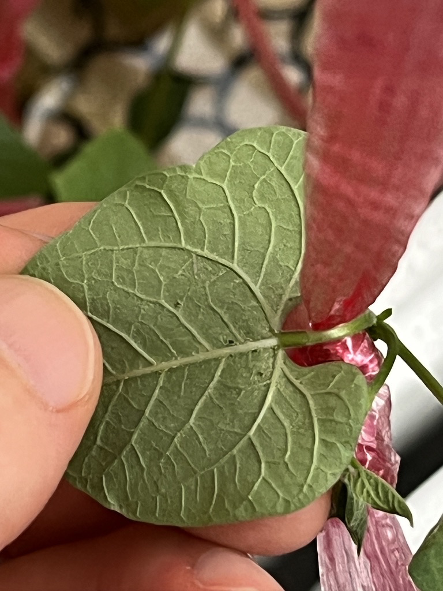
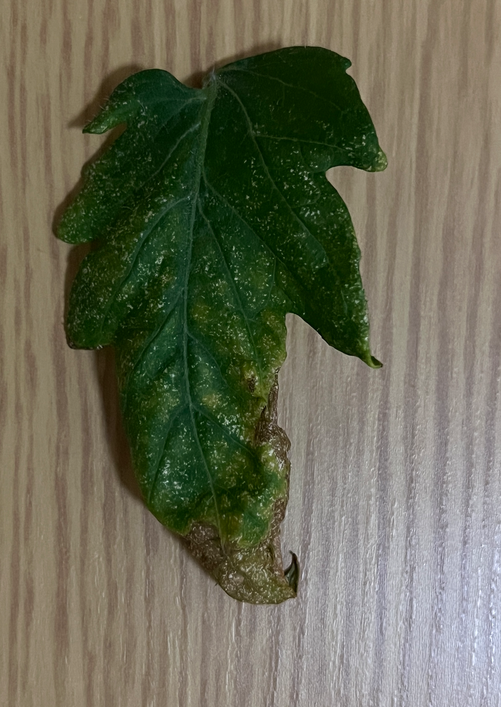
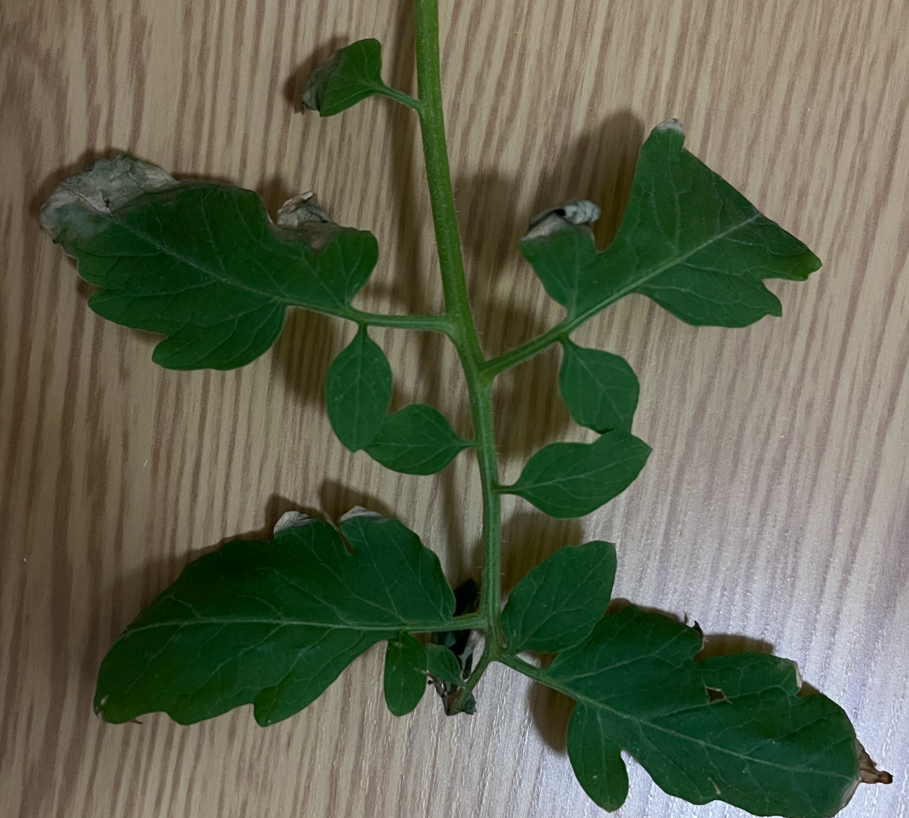

- 水滴石穿, 非一日之功.
<!-- more -->

## ハダ二類

## 半身萎凋病

## 灰色かび病

# 参考
- [トマトの病害虫](http://www.naranature.com/n.Origin-S1/n.Yasai-Gaityuu/21-01tomato-gai/21-0322tomato-gai.htm)
- [新たに発生した病害虫](http://www.agri.hro.or.jp/boujosho/sinhassei/index.htm)