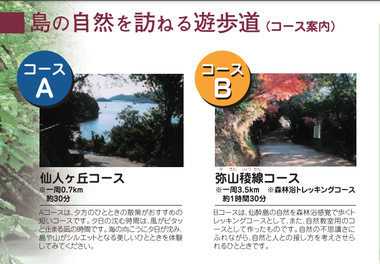

- 人は食うために生きるのではない。生きんがために食うのである
<!-- more -->

# 見方説明
|  符号   |          説明          |
| :-----: | :--------------------- |
| == (0h) ==> | フェリー、飛行機で移動、かかる時間   |
| =(0h)=> | 車で移動、かかる時間   |
| -(0h)-> | 歩いて、かかる時間     |
|  [...]  | やるかやらないかは自由 |

- h: 時間
- m: 分
- s: 秒

# 旅館
|  入居日程  | 旅館   | 住所   | 連絡先   |備考   |
|:--:|:--|:---|:---|:---|
|  31日  |  [宮島ホテルまこと](http://hotelmakoto.co.jp/)  |  広島県廿日市市宮島町７５５  | 0829-44-0070   | 朝食なし、,勧め[^1]、預かり可[^2]、送迎可[^3] |
|  01日  |  [景勝館 漣亭](https://www.keishokan.com/)  |  広島県福山市鞆町鞆４２１   |   0570-025-544  | 駐車可[^4] |
|   02日 | [塩田温泉 湯元 上山旅館](https://www.ueyama-ryokan.com/)  |  兵庫県姫路市夢前町塩田287番地  |  079-336-0020  | 駐車場あり[^5] |


# 事前準備
1. 宮島ホテルまことの送迎サービスを利用
    - 送迎については、事前にホテルへ連絡して確認する必要がある。

# 日程リスト
## 計画
### 12-31
- 集合
  - 時間: 10:30
  - 場所: ライオンズマンション駒川第２

- 日程
  ```
  大阪(11:00) =(6h)=> 宮島口旅客ターミナル駐車場(17:00) 
    駐車、チッケト買、乗船(17:10までに)
  宮島口(17:10) ==(10m)==> 宮島(17:20)
    降船など(17:25までに)
  宮島(17:25) -(15m)-> 宮島ホテルまこと(17:40)
    チェックイン、食事、散策など

  ```  

- ルート
  - 宮島口旅客ターミナル駐車場
    - [大阪 => 宮島口旅客ターミナル駐車場](https://maps.app.goo.gl/qVmu1jmpgrVWPfgU7)
    - [=> 宮島口旅客ターミナル駐車場](https://maps.app.goo.gl/eFpY9eeJudLNeatX7)

- 備考
  - [JR西日本宮島フェリーダイヤ](https://jr-miyajimaferry.co.jp/timetable/newyear/)
  .jpg)
  .jpg)
  - [翌日観光ガイド](http://hotelmakoto.co.jp/page3)


### 01-01
- 集合: 
  - 時間: 09:30
  - 場所: 宮島ホテルまことのロビー

- 日程
    ```
    宮島ホテルまこと(09:30) -(15m)-> 御笠浜、大鳥居、厳島神社[、大願寺、大聖院](09:45)
      散策など(11:30までに)
    どちら(11:30) -(20m)-> 宮島フェリー乗り場(11:50)
      荷物取、チッケト買、乗船(12:00までに)
    宮島(12:05) ==(10m)==> 宮島口(12:15)
      降船、車取など(12:30までに)
    宮島口旅客ターミナル駐車場(12:30) =(2h10m)=> 耕三寺博物館 無料駐車場(14:40)
      駐車、チッケト買、散策、車取(15:50までに)
    耕三寺博物館 無料駐車場(15:50) =(1h10m)=> 景勝館 漣亭(17:00) 
      駐車、チェックイン、食事、散策([常夜燈])など

    ```

- ルート
  - 厳島神社
    - [宮島ホテルまこと -> 厳島神社](https://maps.app.goo.gl/j1SoudgJdSTjRsdYA)
    - [-> 厳島神社](https://maps.app.goo.gl/j43VizGV9q3rdjTG6)
  - 宮島フェリー乗り場
    - [-> 宮島フェリー乗り場](https://maps.app.goo.gl/TDLK1vbwXjmRJ8bx8)
  - 耕三寺博物館 無料駐車場
    - [宮島口旅客ターミナル駐車場 => 耕三寺博物館 無料駐車場](https://maps.app.goo.gl/FXwfufF7hGe8Cvjv9)
    - [=> 耕三寺博物館 無料駐車場](https://maps.app.goo.gl/SXpoKGQrtpvKmN1f6)
  - 景勝館 漣亭
    - [耕三寺博物館 無料駐車場 => 景勝館 漣亭](https://maps.app.goo.gl/q9QXTyuTwHo5jyuW6)
    - [=> 景勝館 漣亭](https://maps.app.goo.gl/DcpCdxpiBU1uhUMw9)
  - 常夜燈
    - [景勝館 漣亭 -> 常夜燈](https://maps.app.goo.gl/bGjmeZfnkBv3gSsFA)
    - [-> 常夜燈](https://maps.app.goo.gl/moNz1TfgtAoP6KCE7)

- 備考
  - [当日観光ガイド](http://hotelmakoto.co.jp/page3)


### 01-0２
- 集合: 
  - 時間: 09:30
  - 場所: 景勝館 漣亭のロビー

- 日程
    ```
    景勝館 漣亭(09:20, 09:30) <-(1m)=> 鞆の浦 第一有料駐車場
      駐車
    景勝館 漣亭(09:30) -(15m)-> 福禅寺對潮楼[、入江保命酒]、県営旅客桟橋(09:45)
      チッケト買、散策、乗船など(10:30までに)
    県営旅客桟橋(10:30) ==(5m)==> 仙酔島(10:35)
      降船、散策、乗船など([11:55、]12:30までに)
    仙酔島([12:00、]12:30) ==(5m) ==> 県営旅客桟橋([12:05、]12:35)
      降船([12:10、]12:40までに)
    県営旅客桟橋([12:10、]12:40) -(10m)-> [御舟宿いろは、]太田家住宅、鞆の浦、いろは丸展示館([12:20、]12:50)
      [食事、]散策、お土産など(13:50までに)
    いろは丸展示館(13:50) -(10m)-> 鞆の浦 第一有料駐車場(14:00)
      車取(14:05までに)
    鞆の浦 第一有料駐車場(14:05) =(2h50m)=> 塩田温泉 湯元 上山旅館(16:55)
      駐車、チェックイン、食事、散策など

    ```

- ルート
  - 鞆の浦 第一有料駐車場
    - [景勝館 漣亭 => 鞆の浦 第一有料駐車場](https://maps.app.goo.gl/EgonNa6NFeMhs22T6)
  - 福禅寺對潮楼[、入江保命酒]、県営旅客桟橋
    - [景勝館 漣亭 -> 福禅寺對潮楼[、入江保命酒]、県営旅客桟橋](https://maps.app.goo.gl/xc29Gcp96Bb1pp2V8)
    - [-> 福禅寺對潮楼[、入江保命酒]、県営旅客桟橋](https://maps.app.goo.gl/TJhkuvRmufsvHuRo6)
  - 御舟宿いろは、太田家住宅、鞆の浦、いろは丸展示館
    - [県営旅客桟橋 -> 御舟宿いろは、太田家住宅、鞆の浦、いろは丸展示館](https://maps.app.goo.gl/bYn6AhmgDcMnuXEp9)
  - 鞆の浦、太田家住宅、いろは丸展示館
    - [県営旅客桟橋 -> 太田家住宅、鞆の浦、いろは丸展示館](https://maps.app.goo.gl/1X8vAhSUoVGzEj1n6)
  - 鞆の浦 第一有料駐車場
    - [いろは丸展示館 -> 鞆の浦 第一有料駐車場](https://maps.app.goo.gl/ndFyN8Hve9zu1VAP6)
    - [-> 鞆の浦 第一有料駐車場](https://maps.app.goo.gl/Qc7etL8xQTyVE8Fk9)
  - 塩田温泉 湯元 上山旅館
    - [鞆の浦 第一有料駐車場 => 塩田温泉 湯元 上山旅館](https://maps.app.goo.gl/7G18eUPBzY6nfwoGA)
    - [=> 塩田温泉 湯元 上山旅館](https://maps.app.goo.gl/EPGjCueo8PR1aDjS9)
  - 入江保命酒
    - [-> 入江保命酒](https://maps.app.goo.gl/ugxhW5s6iQWKuzEg6)
  - 御舟宿いろは
    - [-> 御舟宿いろは](https://maps.app.goo.gl/3dYJQgbn1R3KdaUo7)
  - 鞆城跡(鞆城山公園)
    - [-> 鞆城跡(鞆城山公園)](https://maps.app.goo.gl/sqtmXUH8sCNaEo7b9)
  - 医王寺
    - [-> 医王寺](https://maps.app.goo.gl/R8NNK5XSrJJeQmCfA)

- 備考
  - 鞆城跡(鞆城山公園)
  - 医王寺
  - [平成いろは丸フェリーダイヤ](https://www.hiroko-group.co.jp/kotsu/setken/sensuijima.pdf)
  
  - [仙酔島遊歩道コース](https://www.hiroko-group.co.jp/kotsu/setken/sensuijima.pdf)
  

### 01-03
- 集合: 
  - 時間: 09:30
  - 場所: 塩田温泉 湯元 上山旅館のロビー
- 日程
    ```
    塩田温泉 湯元 上山旅館(09:30) =(15m)=> 書寫山圓教寺(09:45)
      散策「、軽食」(12:00までに)
    書寫山圓教寺(12:10) =(20m)=> 太陽公園駐車場(12:30)
      太陽公園(14:30までに)
    太陽公園駐車場(14:35) =(25m)=> 姫路城 大手門駐車場(15:00)
      姫路城「、好古園」(16:00までに)
    姫路城 大手門駐車場(16:10) =(2h30m)=> ライオンズマンション駒川第２(18:40)
      食事、解散など

    ```

- ルート
    - 書寫山圓教寺
      - [塩田温泉 湯元 上山旅館 => 書寫山圓教寺](https://maps.app.goo.gl/N3tj7fGXKpEFrV6v8)
      - [=> 書寫山圓教寺](https://maps.app.goo.gl/ropFbYMEJqzPg1Ck7)
    - 太陽公園駐車場
      - [書寫山圓教寺 => 太陽公園駐車場](https://maps.app.goo.gl/xexWH5T3zN17FtfMA)
      - [=> 太陽公園駐車場](https://maps.app.goo.gl/9vJYjzvWejkPDKoM8)
    - 姫路城 大手門駐車場
      - [太陽公園駐車場 => 姫路城 大手門駐車場](https://maps.app.goo.gl/o9u4Lt9MRvKUaFs28)
      - [=> 姫路城 大手門駐車場](https://maps.app.goo.gl/QtNF71BYY3yGkGvAA)
    - ライオンズマンション駒川第２
      - [姫路城 大手門駐車場 => ライオンズマンション駒川第２](https://maps.app.goo.gl/c73QYafQWFANhAGX7)
      - [=> ライオンズマンション駒川第２](https://maps.app.goo.gl/WgW8xjaAU3tb1Q7V7)

- 備考
  - 姫路城・好古園（共通券）の入城料金: 1,050円
  
## 現実
### 12-31
- 集合
  - 時間: 10:30
  - 場所: ライオンズマンション駒川第２

- 日程
  ```
  大阪(10:55) =(5h20m)=> 宮島口旅客ターミナル駐車場(16:15) 
    駐車、チッケト買、乗船(16:40)
  宮島口(16:40) ==(10m)==> 宮島(16:50)
    降船など(16:55)
  宮島(16:55) -(5m)-> 宮島ホテルまこと(17:00)
    チェックイン、食事、散策など

  ```  

- ルート
  - 宮島口旅客ターミナル駐車場
    - [大阪 => 宮島口旅客ターミナル駐車場](https://maps.app.goo.gl/qVmu1jmpgrVWPfgU7)
    - [=> 宮島口旅客ターミナル駐車場](https://maps.app.goo.gl/eFpY9eeJudLNeatX7)

- 備考
  - [JR西日本宮島フェリーダイヤ](https://jr-miyajimaferry.co.jp/timetable/newyear/)
  .jpg)
  .jpg)
  - [翌日観光ガイド](http://hotelmakoto.co.jp/page3)


### 01-01
- 集合: 
  - 時間: 08:30
  - 場所: 宮島ホテルまことのロビー

- 日程
    ```
    宮島ホテルまこと(08:30) -(15m)-> 御笠浜、大鳥居、厳島神社[、大願寺、大聖院](08:45)
      散策など(11:30)
    どちら(09:10) -(20m)-> 宮島フェリー乗り場(09:30)
      荷物取、チッケト買、乗船(10:15)
    宮島(10:15) ==(10m)==> 宮島口(10:15)
      降船、お土産買、車取など(10:55)
    宮島口旅客ターミナル駐車場(10:55) =(2h05m)=> 耕三寺博物館 無料駐車場(c)
      駐車、チッケト買、散策、車取(13:55)
    耕三寺博物館 無料駐車場(13:55) =(1h10m)=> 景勝館 漣亭(15:00) 
      駐車、チェックイン(15:30)
    景勝館 漣亭(15:30) -(30m)-> 福禅寺對潮楼、入江保命酒、鞆の浦、太田家住宅(16:00)
      散策、お土産買など(16:40)
    太田家住宅(16:40) -(15m)-> 景勝館 漣亭(16:55)

    ```

- ルート
  - 厳島神社
    - [宮島ホテルまこと -> 厳島神社](https://maps.app.goo.gl/j1SoudgJdSTjRsdYA)
    - [-> 厳島神社](https://maps.app.goo.gl/j43VizGV9q3rdjTG6)
  - 宮島フェリー乗り場
    - [-> 宮島フェリー乗り場](https://maps.app.goo.gl/TDLK1vbwXjmRJ8bx8)
  - 耕三寺博物館 無料駐車場
    - [宮島口旅客ターミナル駐車場(12:30) => 耕三寺博物館 無料駐車場](https://maps.app.goo.gl/FXwfufF7hGe8Cvjv9)
    - [=> 耕三寺博物館 無料駐車場](https://maps.app.goo.gl/SXpoKGQrtpvKmN1f6)
  - 景勝館 漣亭
    - [耕三寺博物館 無料駐車場 => 景勝館 漣亭](https://maps.app.goo.gl/q9QXTyuTwHo5jyuW6)
    - [=> 景勝館 漣亭](https://maps.app.goo.gl/DcpCdxpiBU1uhUMw9)
  - 福禅寺對潮楼、入江保命酒、鞆の浦、太田家住宅
    - [景勝館 漣亭 -> 福禅寺對潮楼、入江保命酒、鞆の浦、太田家住宅](https://maps.app.goo.gl/PrxnP9sjeMh9dp4G7)
    - [-> 福禅寺對潮楼、入江保命酒、鞆の浦、太田家住宅](https://maps.app.goo.gl/rJ1fTyb2vvb6EXA59)


### 01-0２
- 集合: 
  - 時間: 09:10
  - 場所: 景勝館 漣亭のロビー

- 日程
    ```
    食事(08:00)
      チェックアウト(09:10)
    景勝館 漣亭(09:10) -(5m)-> 市営渡船のりば(09:15)
      チッケト買、乗船など(09:30)
    市営渡船のりば(09:30) ==(5m)==> 仙酔島(09:35)
      降船、散策(立入禁止のせいで)、乗船など(09:55)
    仙酔島(09:55) ==(5m) ==> 市営渡船のりば(10:00)
      降船(10:10)
    市営渡船のりば(10:10) -(10m)-> 太田家住宅、鞆の浦、いろは丸展示館(10:20)
      散策など(10:40)
    いろは丸展示館(10:40) -(10m)-> 景勝館 漣亭(10:50)
      車取、チェックアウト(11:10)
    景勝館 漣亭(11:10) =(2h40m)=> 書写山ロープウェイ駐車場(13:50) ==(15m)==> 山上駅(14:05) =(10m)=> 摩尼殿(14:25)
      散策など(15:20)
    摩尼殿(15:20) =(10m)=> 山上駅(15:30) ==(15m)==> 書写山ロープウェイ駐車場(15:55)
      車取(16:05)
    書写山ロープウェイ駐車場(16:05) =(15m)=> 塩田温泉 湯元 上山旅館(16:20)
      駐車、チェックイン、食事など

    ```

- ルート
  - 市営渡船のりば
    - [景勝館 漣亭 -> 市営渡船のりば](https://maps.app.goo.gl/HeUL2Zxf7BepMEdQ6)
    - [-> 市営渡船のりば](https://maps.app.goo.gl/27FMRRKX6RyiDYHK8)
  - 太田家住宅、鞆の浦、いろは丸展示館
    - [市営渡船のりば -> 太田家住宅、鞆の浦、いろは丸展示館](https://maps.app.goo.gl/n9aKY1CYXKZbLMcQ7)
  - 景勝館 漣亭
    - [いろは丸展示館 -> 景勝館 漣亭](https://maps.app.goo.gl/2S9sqNdLf2Ed9HfE6)
    - [-> 景勝館 漣亭](https://maps.app.goo.gl/ccbdhmjobjfwtDr68)
  - 書写山ロープウェイ駐車場
    - [景勝館 漣亭 => 書写山ロープウェイ駐車場](https://maps.app.goo.gl/3oDH994SApmRSwRJ9)
    - [=> 書写山ロープウェイ駐車場](https://maps.app.goo.gl/1mud3q1MK162r43T9)
  - 塩田温泉 湯元 上山旅館
    - [書写山ロープウェイ駐車場 => 塩田温泉 湯元 上山旅館](https://maps.app.goo.gl/awNF5Q2cjUf69nCk6)
    - [=> 塩田温泉 湯元 上山旅館](https://maps.app.goo.gl/EPGjCueo8PR1aDjS9)

### 01-03
- 集合: 
  - 時間: 09:55
  - 場所: 塩田温泉 湯元 上山旅館のロビー
- 日程
    ```
    食事(08:00)
      チェックアウト(09:55)
    塩田温泉 湯元 上山旅館(09:55) =(20m)=> 太陽公園駐車場(10:15)
      散策(12:30)
    太陽公園駐車場(12:30) =(35m)=> 姫路城 大手門駐車場(13:05)
      姫路城、散策(15:40)
    姫路城 大手門駐車場(15:40) =(2h40m)=> ライオンズマンション駒川第２(18:20)
      食事、解散など

    ```

- ルート
    - 太陽公園駐車場
      - [塩田温泉 湯元 上山旅館 => 太陽公園駐車場](https://maps.app.goo.gl/NnLYFRHJ6nwk9iRRA)
      - [=> 太陽公園駐車場](https://maps.app.goo.gl/9vJYjzvWejkPDKoM8)
    - 姫路城 大手門駐車場
      - [太陽公園駐車場 => 姫路城 大手門駐車場](https://maps.app.goo.gl/o9u4Lt9MRvKUaFs28)
      - [=> 姫路城 大手門駐車場](https://maps.app.goo.gl/QtNF71BYY3yGkGvAA)
    - ライオンズマンション駒川第２
      - [姫路城 大手門駐車場 => ライオンズマンション駒川第２](https://maps.app.goo.gl/c73QYafQWFANhAGX7)
      - [=> ライオンズマンション駒川第２](https://maps.app.goo.gl/WgW8xjaAU3tb1Q7V7)


# 他のこと

# 確認事項

# 引用
[^1]: [車でお越しのお客様](http://hotelmakoto.co.jp/access#42111)
    - ※お車ごと乗船して宮島に渡ることは可能ですが宮島は道が狭く車での観光も出来ません。またカーフェリーの往復航送料の方が高くつきますので宮島口桟橋周辺の市営または民間の有料駐車場に止めて来られることをお勧めします。
[^2]: [荷物のお預かり＆お届けサービス](http://hotelmakoto.co.jp/access#1284362)
    - 【チェックイン前のお荷物】
当日宮島口よりフェリー乗船時に発船時刻をご連絡下さいませ。そのお時間に合せて宮島桟橋にお迎えに参ります。先に観光に行かれる場合にはお荷物だけ桟橋でお預かり致します。
    - 【チェックアウト後のお荷物】
大きい荷物をロビーでお預かりします。観光が終わって宮島桟橋からお電話いただきましたらお預かりした荷物をお届けしますので宿に戻ってくる必要もなく身軽にゆっくり観光をお楽しみいただけます。
[^3]: [送迎のご案内](http://hotelmakoto.co.jp/access#226409)
    - 当日宮島口よりフェリー乗船時に発船時刻をご連絡下さいませ(お問合せ先：0829-44-0070)。
    - そのお時間に合せて宮島桟橋にお迎えに参ります。早めに到着されてそのまま観光に行かれる場合にはお荷物だけの受け取りも可能でございます。
[^4]: [車ご利用のお客様](https://www.keishokan.com/access.html)
    - ご宿泊者様用平面駐車場完備(宿泊時無料)
[^5]: [駐車場はありますか？](https://www.ueyama-ryokan.com/faq/)
    - 最大50台まで駐車する事が出来ます。